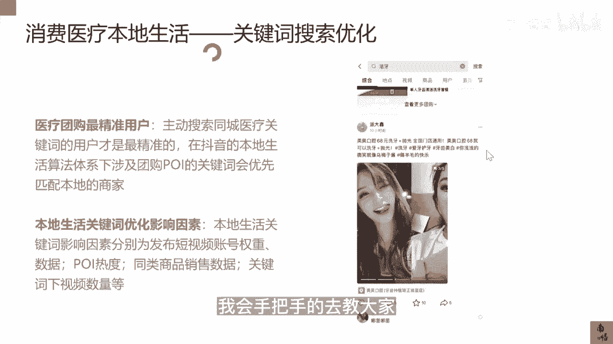

# 083 抖音同城生活-健康垂类0到1运营：入驻-暴力起号-规则篇-消费直播篇！ - P33：33-抖音医疗本地生活关键词搜索优化 - 早安睿睿 - BV1Fx4y1n7Ba

最后一部分的内容我来给大家讲一讲，就是关于消费医疗，本地生活的关键词的搜索优化，在我们这个赛道里面，其实主动去搜索某一个关键词，某一个疾病关键词一定是最精准的用户，我举个例子，比如说我们口腔。

当我去搜洁牙，当我去搜洗牙的时候，美牙的时候，那这些用户基本上是我的精准用户，那医美也同样，当我去搜m two two的时候，当我去搜超声炮的时候，他们就是最精准的用户，所以在这个过程中。

我们就要去做一些关键词的布局，因为如果在没有上POI之前，就是你不是做本地生活之前，你去布置些关键词，其实难度蛮大的，当然像我们这样的专业团队是能做的，原来在杭州很多双眼皮也好。

很多光电类的项目词都是我们布的，但是你上了本地生活以后，他的影响因素，就不仅仅是你关键词所代表的视频的数据，它还代表方方面面，我举个例子，当你去带了这个POI以后，你的这个影响因素大概会有几种。

一你发布短视频的账号的权重数据，第二个你的POI的热度，什么叫poi的热度，就是你这个地址下面在不在热门的商圈里面，以及你同类商品的销售数据，关键词下面的视频数量等等。

所以这个影响因素其实是比你不带POI，不做本地生活的时候要来得复杂得多的，当然有壁垒才是机会点，如果你把这几个关键词都去做了布局，不管是你面对什么样的竞争对手，一旦在你的搜索框里面，在你的城市里面。

你去搜索超声炮，如果匹配出来的就是你们家的，那你的流量一定是碾压你的对手的，所以这个关键词的搜索优化，我会在我的进阶课里面一点点去教大家，为什么我不在这个课程里面讲。

因为关键词的搜索优化单这个东西拎出来，要把你们教会，可能得花个半天的时间，所以我在这里只能告诉大家，这东西很重要，然后它的底层逻辑影响因素，我都我都已经放在这了，所以你们有能耐就把这每个项去做的。

比你们竞争对手好，你的关键词，自然而然的就会进入到前十或者是前五，如果你没有这个能力去做到这个体量的时候，那你可以后面去关注我的进阶的内容里面。

