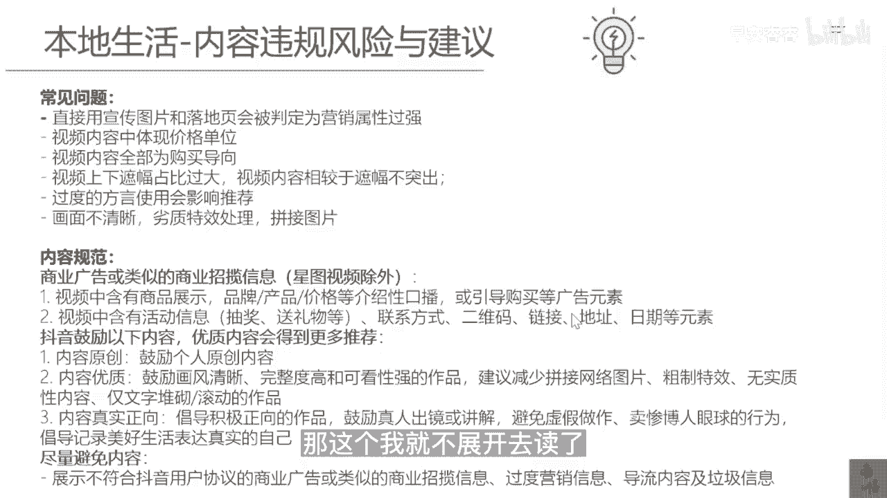

# 083 抖音同城生活-健康垂类0到1运营：入驻-暴力起号-规则篇-消费直播篇！ - P34：34-1.本地生活-消内容违规风险与建议 - 早安睿睿 - BV1Fx4y1n7Ba

好同学们，我们在前面的课程里面其实有讲到过一点，从2022年开始，抖音的本地生活的达人的流量，尤其到了12月份以后，他的达人的流量其实是在下降的，那为什么呢，这就是因为之前整个本地生活达人的。

这种内容的同质化太厉害了，而对于抖音这种依靠内容和推荐算法，作为他的核心护城河，它是不允许这种事情发生的，所以大概在去年的11月份开始，抖音就要求所有的达人，要求我们的店家进行自己做内容以及做直播。

所以大概根据我们的判断，2023年，抖音本地生活的直播，应该会成为抖音流量倾斜的最核心的一个环节，所以如何让我们自己的商家去做好直播，这个事情，可能比你如何去挑选服务商。

或者去挑选这些同城的达人来的更为重要，而对于直播这件事情，他其实是有一定的门槛的，如果把短视频和直播放在同一个维度上，我个人会认为，直播的重要性，以及直播的门槛和壁垒会比短视频更高。

而且高的不是一个维度，所以我们最后的一堂课，我们主要来讲讲抖音本地生活消费，医疗板块的直播到底应该怎么玩，在这堂课里面，我们会手把手的去教大家怎么去上手写脚本，怎么去规避直播间医疗的一些敏感的一些词。

怎么去培养主播等等等等。

都会在这节课里面去给大家讲明白，我们首先来聊一聊关于抖音本地生活消费，医疗直播间的一个审核规则，我相信这也是大家所比较关心的一个话题，我们要去做直播，且不说本地生活的直播类，他的审核规则。

应该是比一般的直播的规则会更严格，因为你是直接在卖本地医疗的一些相关的服务，我们做过直播的同学们可能都会有个感受，我只要在我的直播间里面去过多的提及，医疗或者医疗相关的这些敏感词。

就经常会在后台受到违规的一个提醒，甚至是直接把我的直播间断播，更有甚者就是我在开播的时候啥话都没有讲，就直接给我封掉，所以这一些原因，这些场景碰到的具体的根本，逻辑性的原因是什么。

我们今天来就对于这些医疗类的直播，它的底层逻辑的审核规则。

我们来做一下拆解，首先我们来看一下对于抖音的本地生活，他的内容违规的风险和建议，哎我们常见的问题其实会有很多种，这些问题我就不多提，然后大家可能需要去注意的，就是你的整个内容输出的规范程度。

因为我们刚才也讲过了，你的内容上的一些医疗相关的一些审核的规则，本地生活来讲，他又有一些他自己的内容审核规则，所以我们做抖音，其实更多的时间就是在跟规则去打交道，谁能把这些规则违规的风险规避好。

谁的流量，谁的直播间就能比竞争对手做的更好，那这个我就不展开去读了。

你们可以去截图。