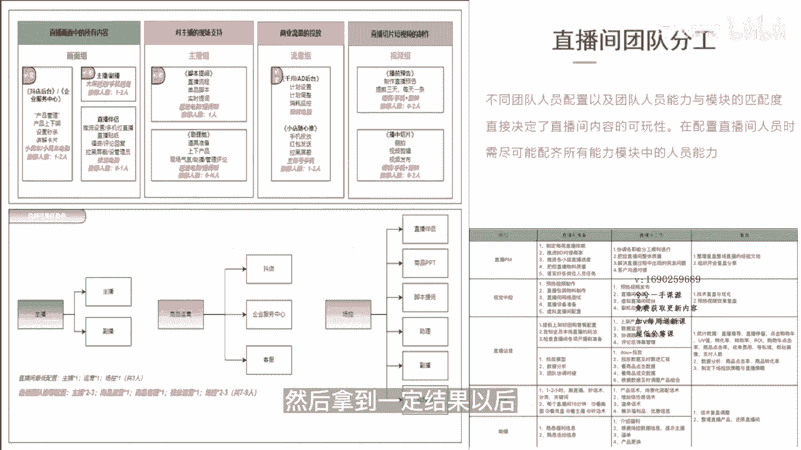

# 083 抖音同城生活-健康垂类0到1运营：入驻-暴力起号-规则篇-消费直播篇！ - P36：36-3.直播规划+直播团队配置 - 早安睿睿 - BV1Fx4y1n7Ba

对于我们大部分的医疗从业者，其实除了少部分的这些机构老板，可能做过看领号的直播，大部分的机构的老板或者是新媒体的运营，他其实是没有做过直播的，这个其实也没什么好稀奇古怪的，因为直播这个东西。

原来本来就是在电商的环节会做的比较多一点，那现在本地生活倒逼着你的团队要去做直播，所以你必须要清楚，你的整个本地生活的直播场景搭建规划，直播团队的配置应该是怎么样的。

这样才能快速的去上手，我们先来看一看抖音直播的规划，如果系统性的去做，它应该是什么样的，首先你要确认你的直播模式，你是分无账号无直播还是有账号无直播，然后再去确认你的账号的IP风格。

如果你是有账号无直播的，你可以去确认一下你的这个账号分析，然后去做一个直播的策划，然后确认直播的模式，直播模式总共有这样几种，一个是达人直播，达人直播，你可以邀请你觉得给你们家探店做得好的。

这个达人可以跟你来播，那这个时候如果完成这个邀约以后，首先你要去做以下的一些事情，一会我会一起讲到，那么第二个是你品牌自播，就是你店家自己在播对吧，第三个是服务商代播，有一些那个。

因为机构他自己并不想去管的那么宽，或者自己并不想花特别大的精力，那你可以找服务商的代步，那无论是哪一种直播的形式，你后面的几个步骤，每个步骤其实都是需要做到位的，第一个就需要去明确投放的预算。

投放的预算的时候，就是我们我们之前讲的这个巨量本地推，巨量本地推，你在做这个投放预算的时候，你要分这几步预算的拆解，然后单场预算的投放搭建计划，确认IOI目标，这几个步骤少一个都不行。

因为这是花钱的一个行为，你最终肯定要去花，我今天晚上花1000块钱，我能不能投出来五比一的IOI，或者是十比一的II，这个是要确定的，也以便于我们后面对生意进行一个复盘。

第二个就是我们组建自播的一个团队，各个工种去到位，明确分工，我一会会讲到，这里面的工种大概会包含哪一些的工种，然后去搭建硬件的场景，那这个就不用说了，因为本地生活还是比较吃，你整个直播间的场景的。

然后确立主播的人设，你的达人主播或者你自己主播的这个筛选，确立他的人设，然后做一部分的内容对吧，如果达人播的话，那就不需要你做内容，如果是你自己的主播，你可能要做几条内容，然后直播的一个测评。

我们的本地生活的直播测评其实还好，因为你总共也就那么几个屏，没什么好测的，只不过不同的时间节点去放可能会有点不一样，然后呢就是去组建你的直播脚本，我们的直播脚本，医疗类的直播间。

其实直播脚本还是比较重的，我们在后面的内容里面会重点的讲到，直播脚本的一个搭建好，那么我们在商家不同阶段的时候，他的团队构建和直播流程分别应该是什么样的，你在新手期的时候。

如果你这个商家是刚开始做本地生活的直播，那么你就是三个月内吧，三个月内你做抖音，三个月内这些商家你在这个过程中，你的团队是大概设置的简单就好了，就是很多时候一个人就可以去担任多个角色。

比如说你的编导可以兼职做个摄影，因为这个这种这种这种摄影还是比较简单的，那么你的场控可以同步做了，中控以及其他助理的一些活，当你在发展期的商家对吧，你播了三个月以上，你有一个固定的团队以及基础的粉丝。

那么这个时候你要逐步的进行一个完善，成熟期的商家，那就不用说了，那你的团队肯定是越来越专业的，每个工种都要拆分开来，这里的流程图大家可以去看一下，你已基本上已经把你们的这个整个组织架构。

以及直播的流程已经讲的非常清晰了，大家可以自己去看一下，那么直播间的一个团队的分工，不同的直播间人员配置以及团队人员的能力，模块的这个匹配度，直接决定了直播间的内容的可玩性，在配置直播间人员时。

需要尽可能的配齐所有能力模块中的人员，比如说你的这个直播的pm对吧，他需要前期干嘛，直播中需要干嘛，复盘需要干嘛，然后视觉中控直播运营主播助播，这是基本上你的一个比较整齐的一个人员配置。

所以在这个整个直播的环节中，其实每一个环节看你怎么给它去分类，比如说你给它分成了画面组，主播组，流量组和视频组，那每一个组他甚至只需要一个人，那你最少最少也是四个人，对不对。

那这四个人怎么去协调一个好的直播间，他一定不是说我单纯花钱就能解决的，他一定是一个团队配合，并且能产生一个明确IOI的一个目标，的一个直播间，而且每天的复盘，每场直播的复盘可以迭代出裂变出。

筛选出更好的团队，以及更好的一个结果导向的一个行为，所以去做直播，你一定要先想明白要不要做，想明白以后，那就要下决心去做，所以在这个过程中，无论碰到哪一个环节，你都要非常清楚，你做我操盘手。

或者你作为机构的老板，你要非常清楚我的问题出在哪里，而不是我是个甩手掌柜，如果你要当甩手掌柜，那你就是去找专业的团队，把这个直播的活给揽了，但是你在即便找外包外部供应商的时候，你也要自己懂这里面的配置。

你要非常清楚你的每一分钱花出去花在了哪里，我知道做医疗的老板其实不缺钱，但是你在花钱的时候有，尤其是在做直播投放的时候，直播人员的时候，你的钱花的不对，会让你错失机会成本。

所以这一点我觉得是还是要用正确的方法去做，这是我一直比较主张的一个打法，你先用正确的方法去做正确的事情，然后拿到一定结果以后再去做复制放大。

