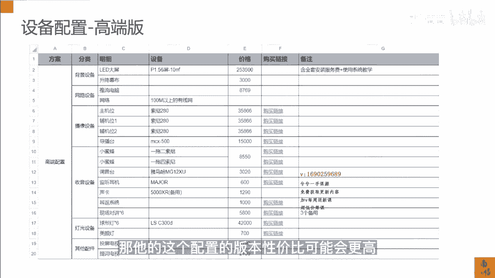

# 083 抖音同城生活-健康垂类0到1运营：入驻-暴力起号-规则篇-消费直播篇！ - P37：37-4.消费医疗商家直播设备清单 - 早安睿睿 - BV1Fx4y1n7Ba

因为很多机构的老板，医疗机构的老板原来没有做过直播，也没有太多的接触过直播，你们以为的直播，可能只是拿个手机或拿个相机在那边拍，其实直播我刚才说了，它是一个比较复杂的一个行为，专业有专业的做法。

但是最基本的入门的直播间，你应该怎么去搭建，并且你应该投多少的钱，其实这其实就是一个对我们来讲，必须要去了解的一个步骤。

我们首先来看一下直播的场地，我们建议的一般小一点的直播的场地，差不多就30~50方，你在你的医院里面，或在你的机构里面随便去找一个，我觉得30方左右就差不多这样的一个房间。

那么直播间的纵深和挑高需要稍微好一点，当然挑高也问题也不大，那主要还是一个打灯的时候的需要，那么直播间如果你的隔音有条件，还是要做的稍微好一点，当然找个安静的房间也可以对吧，然后你需要去在规划。

直播场景和坐播场景的时候，就是站播场景和坐播场景的时候，你是需要去做一些规划，就是占播有站播的好处，做播有做播的好处，就是你在卖什么样的品的时候，你就要去选择不同的这个直播的形式。

最终还是看你的流量哪一个好，那这里有几个推荐版的一些设备配置，那这一些都是虽然我们这个做了这个推荐，但这里其实用的配置都是比较高的，都已经达到了一个专业直播间的一个配置，你们可以去看一下。

分别是常规版的配置，然后升级版的配置和高端版的配置，一般的商家除非是你已经卖得特别好，用，不到后面的两种，你只要看第一种就可以了，因为我在前面做手机配件的时候，也推荐过一些设备，但是做直播的设备。

它其实是要高于做短视频的，因为短视频你拿手机拍就可以了，但是直播如果你拿手机一，它会发烫，二它的清晰度，画面质感还是会受一些影响，所以一个最低的配置的这个直播间，我觉得就是你用入门的相机。

加前面我说的这些灯光的配置。

