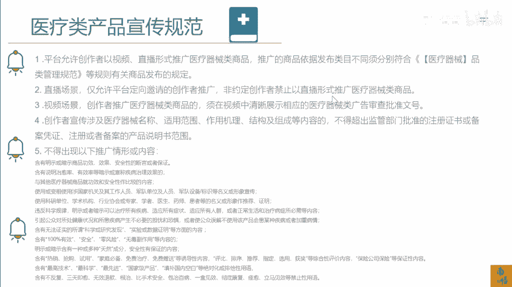

# 083 抖音同城生活-健康垂类0到1运营：入驻-暴力起号-规则篇-消费直播篇！ - P41：41-2.消费医疗直播违禁词 - 早安睿睿 - BV1Fx4y1n7Ba

第二个是本地生活消费，这个图是大家所比较关心的，一直会有朋友会问我来那个南武老师，其实对于本地生活来讲，对于抖音的直播来讲，他们通属于抖音的直播的管辖范围，所以在这里面他需要去遵循几个规则。

第一个是直播间内容的一个北京词，或者是一个审核的规则，第二个是抖音电商的一个审核规则，第三个是抖音本地生活对吧的一个审核规则，以及抖音直播时候一些医疗的一些敏感词，所以在这里面在你的直播间里面。

其实不仅仅是说去规避一个词，两个词的问题，它其实是一个系列的一个行为，比如说第一个，你如果去说一些有明显类目名次相关的关键词，你就会被隐性的提醒或者隐性的限流，比如说我这个抖音直播间是卖超声报。

最便宜的是卖超声报，卖的最好的，卖的第一的，卖的杭州第一的，那这种情况是不可以的，你可以去说天花板这样的词，但是你不可以说第一，然后第二个是全网最对吧，我是杭州最便宜的洁牙，我是杭州最便宜的视力检查。

这些都是不可以的，余下的我就不一一去提醒了，这个是直播间的一些违禁的一些词，那么关于我们医疗板块的一些用语，那这些是我们可能会涉及的比较多的，比如说我们可以去调节我们自己的内分泌。

增强自己的这个免疫力等等等等，这些是跟中医相关的，比如我们的跟我们医美相关的祛斑对吧，无斑治疗斑秃这些跟植发相关的这些东西，大家可以一点点去看，都是不被允许的，而且这是我们经常容易犯的一些。

比较大的一些错误，大家一定要好好去读一下，然后跟你们的小伙伴去同步一下信息，然后呢对于抖音这样的一个平台，他因为还有抖音的电商嘛，所以电商和抖音的本地生活，它其实现在很多的规则其实都是沿用的。

那么我们再来看一下抖音，医疗类产品的一个宣传规范，这里我也不一一去讲，你可以去大概去看一下，就是核心的，就是你如果要去推广，或者是去宣传你的相关的这些产品，你可以去参考医疗器械的一个品类的一个管理。

这个在百度上是能找得到的，所以尽可能再去宣传或涉及这些医疗器械，名称和适用范围，作用机理的时候，对于我们来，其实尽可能少去讲它的原理，尽可能去讲产品本身的价格，或者是因为我们上架的品。

都是比较热门的一些品，我们尽可能去表达我们的价格优势，我们的环境，我们的服务，我们的品牌，甚至我们这个专家的这个背书，这些都我觉得都没问题，你不要去讲它的原理对吧，所以抖音如果在直播间里面。

我们对我们自己报白过的这些产品，它的机理不需要你们去过多的去讲，如果非要讲，就让他们自个儿去搜，你在直播间里面核心是卖货，不是去讲他们厂家的这个原理，所以大家去明白这个医疗类的产品的宣传规范。

你不仅仅是对于本地生活的这个直播，你能把握的住，你可能有一天你去卖这些健康类的，这些电商类的产品，你也能卖得出去，你也不会被围观，因为他的底层审核逻辑是相通的，这也是为什么我说你要去做抖音的。

医疗类的直播或者是短视频。

