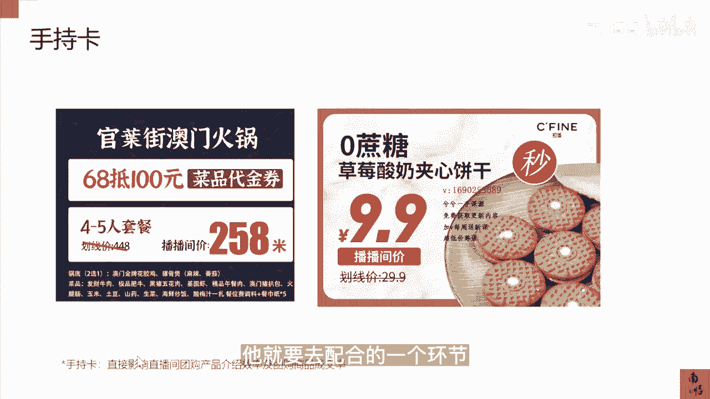

# 083 抖音同城生活-健康垂类0到1运营：入驻-暴力起号-规则篇-消费直播篇！ - P45：45-6.直播间视觉设计拆解 - 早安睿睿 - BV1Fx4y1n7Ba

然后对于我们本地生活的直播间来讲，它里面的视觉设计还是蛮重要的，但是呢对于我们医疗机构的老板，其实每个机构都会配用那个美工对吧，那么在配有美工的情况下，你们只要给他看以下的这一些。

我们必须要有这几个环节，这几个视觉的一个设计都是必须要有的，你可以去让你的美工去做参考就可以了，第一个是预热的海报，这个海报一般可以去发朋友圈，发群，发粉丝群都可以，基本上照搬照抄就可以。

那么第二个是你的聚合页，基本上也是就是这个样子。

然后就是唉这个很重要，就是直播间的天面，直播间的天面为什么说很重要，因为我们刷直播间的时候，其实一开始用户刷到直播间，并不是进入到你直播间，而是刷到了你直播间的一个曝光，那这个时候你的贴面做的好不好。

能不能一下把它吸引进去，这个就很重要，所以一个好的贴面就是你进到直播间以后，都不需要主播说话，就知道你你们家在干嘛，所以这是一个非常重要的一个因素，一个贴面的好坏，直接影响了直播间的曝光进入率。

以及他的停留时长，以及他的团品的转化的数据，所以直播间的贴面是非常重要的，这个是手持卡，手持卡的话它的重要性也还行，它主要是影响了团购产品的介绍的效率，以及团购商品的一个成交率。

所有的这一期直播间的视觉设计，我个人觉得就是让你们的视觉设计师或者美工，直接照搬照抄这样的，然后去平行的替换，只要符合你们自己的品牌，但是这一切环这些都必须要有，这是一个新的直播团队。

和你们老的一个美工的一个设计。

