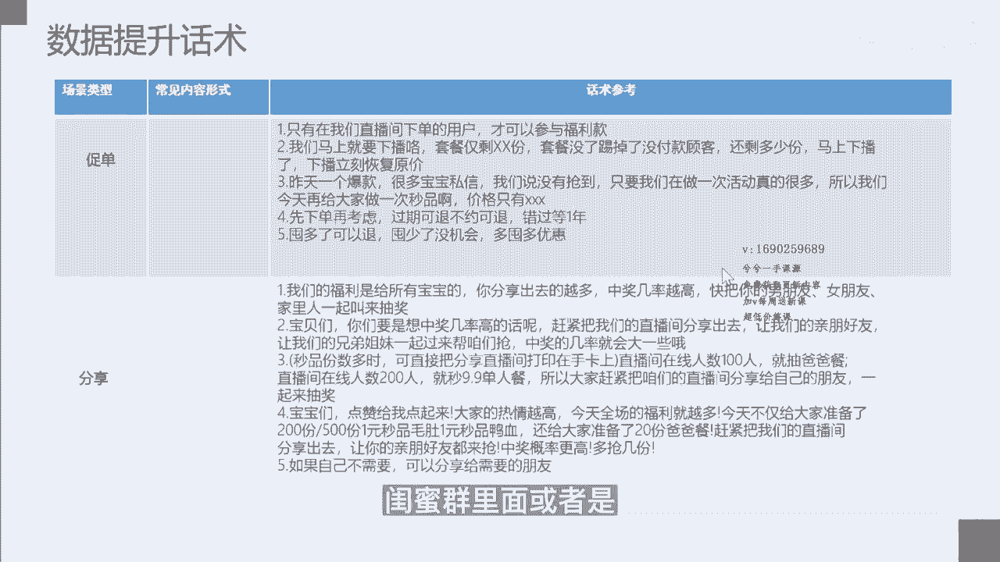
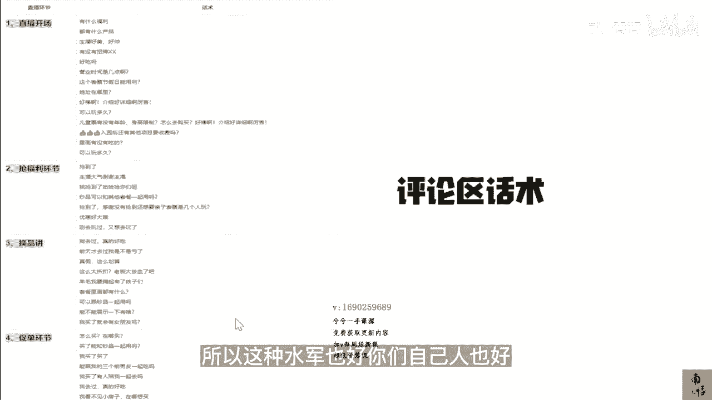

# 083 抖音同城生活-健康垂类0到1运营：入驻-暴力起号-规则篇-消费直播篇！ - P46：46-7.0基础上手消费医疗直播话术 - 早安睿睿 - BV1Fx4y1n7Ba

我们做完了所有直播的准备工作以后，对于我们医疗类的商家来讲，最头痛的一个问题就是怎么去做一场，我电波或者达播的一个直播间的话术脚本，因为对于一般的抖音探店的达人来讲，他们自个儿都不是特别会做直播。

更何况你让他去做一个跟医疗相关的一个直播，那更是难上加难，那对于我们自己的商家来讲，我们自己的电波，我的护士，我的咨询师有没有能力，在原来没有做过看脸号的基础上，在没有做过直播的基础上能去做一场直播。

那我的直播话术应该是什么样子的，他肯定不是拍个脑袋去上的，所有的大的直播间，大的直直播公司都会有一套，甚至有好几套关于某一个直播间的直播话术，所以接下来我们来讲一讲，我们零基础的机构老板怎么去上手。

消费医疗的一个直播话术。

首先我们会通过分直播场景的话术去讲，那直播的场景呢它会分为好几个，首先我们来讲一讲开场，开场的时候，我们常用的会有几个环节是需要去用到的，一就是我们的欢迎问好，当直播间有进来人的时候。

我们就要进行一个欢迎问好，尤其是我们直播间进人进的比较猛的时候，第二个就是主播的介绍，唉这个主播是做什么的对吧，第三个是内容的预告，第四个是福利的预告，第五个是那个情景的代入，第六个是人群的吸引。

那我在这个话术的参考里面，都已经给大家写的很明白，如果你们不会写，你们可以按照我的这个直播脚本大概去改一改，这可以让你快速的去上手，这样的直播的一个脚本，然后让你快速上手去播。

然后第二个板块是品牌的介绍，就是你的这个直播间或者你的这个品牌，你比如说你是个医美机构，你这个品牌有什么样的优势对吧，发展的历程，门店的规模，我有多少家店，当然对于用户来讲，你店越多，它的信任感就越好。

你今天要上架的这个团品的这个特色，你有经历过哪一些什么荣誉的奖项，比如说我是艾尔建的啥啥啥，指定的一个机构或门店对吧，这些都是你的荣誉的奖项，然后你的品质的保证，经营实力，网络热点等等。

这个都是需要在品牌介绍里面去融合的，比如说我在这边给大家写了一个，比如说你如果是一家医美机构，我以医美机构举例，直播间的宝宝们，对我们某某变美机构肯定不陌生，这里为什么不去用医美机构。

我们尽可能不要去挑战抖音直播的一个规则，虽然我说偶尔说个医美，其实问题也不大，但是我们尽可能去规避你，对我们的某某变美机构肯定不陌生，是不是我们某某变美机构是始于2013年，经过10年的沉淀和打磨。

门店的规模，我们现在有八家机构，可以说遍布杭州的各大商圈，我们的白大褂都是台湾韩国的专家，如果你这里说医生，那肯定不行，但你说你白大褂是韩国的，哎一下子你们的专家原来是国外的设备，都是原装正品。

支持扫码查询，我们肯定不是租用设备的那一套，我们的机构也是港台明星某某某，如果你有这个倍数的话，等抗衰保养的首选机构，这样的一个直播间的一个简单的介绍，品牌的简单的介绍，可以让那些小白也好。

或者是那些在选择哪个医美机构去做的时候，他会做一个非常好的一个信任背书，和给自己的一个选择理由，那么第三点就是我要去做一个团品的介绍，因为对于我们本地生活医疗类的产品，这个倒不是特别大的压力。

因为你总共拨来拨去就那么几个品，上来上去无非就是上的节点和价格，每场的价格可能有点区别，所以你的团品的内容，价格覆盖的门店平台对比以及核心卖点，都是需要去讲明白的，我举个例子。

今天我们给姐妹们带来很多福利，不仅有我们门店的这个新设备，还有我们热门的光电材料，五选二的套餐，只要199哎，这里的199，其实那当然我只是举个例子啊，其实就是对用户再往下看的一个，信任的一个基础。

以及我们有很多单品的优惠带给大家，另外还有123对吧，某某三款产品的限时的秒品活动，门店价价值4000多块对吧，套餐直接三位数开价，那这里的好处就在于让那一些一开场，或者是你在介绍这个团品的时候。

让他留着时间往下去，网下去的好处，就可以把我们的用户的停留去拉长，那么第四个就是秒品，哎，我的优惠力度，我的参与方式，我的倒计时，我的节奏感，那这个东西我就不给大家读了，大家可以去看一下。

这是我们的一个分直播的一个场景话术，第一个就是我们的过品，我们团品售罄了，返场预告怎么办，召唤互动情景转化，新品引入，这个都是有套路的，然后后面就是使用规则我就不去读了，你们自己好好去看一下。

懒一点的就直接可以照抄都没关系，实用规则里面需要去交代清楚我的购买方式，试用时间，核销方式，叠加问题，预约及退款限制条款，因为这个东西你只有交代清楚了，在某团的时候，他这个东西就是在页面里面放着的。

但是你在直播间的时候，你要跟人家讲的很明白，否则就会有很多人下单，但是当他不知道怎么用，当他不知道这些规则的时候，他就会去退单，抖音的退单是很方便的，所以这是为了去拉高我们自己的核销率。

然后第三点就是回应非议，但当你产不到，价格贵，拖时间，这肯定会有很多黑粉或者进对的公司来做，那你要去做相应的一个解释，那最后一个就是退场，还剩最后10分钟还剩半个小时的时候。

就你就要去大家去制造一个焦虑了，哎我们这个直播结束了，你该抢的赶紧去讲，所以这就是一个分直播场景的一个话，术的一个逻辑，我们做过直播的老板可能都清楚，直播间流量的一个底层逻辑。

就是你直播间数据的一个维度，那这里面可能会涉及到方方面面，那最核心的就是你的用户的停留，然后你的互动的这些数据，我们分别从直播间的几个数据的维护的角度来，讲一讲，我们作为消费医疗的老板。

我们应该怎么去做，我们本地生活医疗直播的一个数据的一个提升，首先我们要去拉我们的用户停留，拉用户的停留，它的核心还是在于福利的诱惑，无论你去看李佳琦还是罗永浩这些，包括小杨哥这些大的直播间。

他的用户停留都做的非常好，因为他有环环相扣的这个福利，去吸引到这些粉丝对吧，那第一个福利诱惑你可以怎么讲诶，直播间的宝宝们到12点整，我们就可以抽免单，那这个免单里面的产品，你可以去是设置这个优惠券。

或者是设置一个比如说霸王的消费免费消费，那你要去设置这些免费消费，就是那些成本比较低的，让大家去抽，那第二个就福利来了，在直播间的宝宝们把今天的直播间分享出去，把你的这个福利分享给你的闺蜜。

对吧啊等等等等，那我们就可以送你的这个医用面膜，因为这些医用面膜对于很多机构的老板，他其实有很便宜的会员，他的价值可能价值一两百，但是但是实际上你拿货的成本可能就10%，或20%的这个成本价对吧。

所以这些东西是可以去做设置的，那你的福利用户他一定是贪图便宜，贪图这个，以为他自己获得了这个实惠，那他就会愿意在你的直播间待下去，第二个就是价值的吸引，如果你是过了25岁的姐妹，需要了解抗衰。

现在点关注加粉丝团，你就可以知道12345对吧，那么或者是你已经知道了，昂贵的护肤品和生活美容，没有本质的去帮到你，那么你要去相信医学，相信审美12345，所以所有的这些逻辑。

就是你必须要去用你核心给他提供的一个价值，然后去让他跟你产生一个联系和链接，并且完成一个认知，或者是一个消费上的一个转化，那么第三点是画面的吸金，那这里面我们呃医美也好，或者消费医疗。

你的画面吸金其实很简单，比如说你你如果是做呃洁牙的，那你就可以告诉他，我有最新的什么设备，把这个设备打在这个，把设备的这个照片或者是这个技术，可以放在你的公屏上，放在你的直播间画面里面。

那YM道理也是一样的，一美道理也是一样的，你可以把你最新的这个设备，最流行的设备放在这个公屏上面，这个是允许的，然后呢你怎么去做你的互动，当然你是需要点赞的对吧，点赞也是直播间非常基础的一个数据。

你可以让大家去做点赞，然后也可以点赞，比方冲到多少以后，可以去说送一波福利，送一波福袋都是可以的，那么第二个环节就是答疑，如果姐妹们不清楚怎么用的，你可以打出来，这个可以增加我们整个弹幕的频率。

增加我们弹幕的这个数量，这对我们的直播间也也有非常大的一个好处，对吧，所以你可以去提问式的去做一些，跟用户之间的沟通，比如说在杭州的朋友扣个一，有没有想要的，想要把啊打在公屏上等等等等。

这些其实都是套路，比如说你对超声炮感兴趣的来打一波，要要让我看到我，我我可以先上超声炮的链接，所有这些行为，就是让用户跟你有一定的互动以后，那他才可能跟你去进行一个更多的链接。

也才有可能更长时间停留在你的直播间里面，那最重要一点，他可以去提高你弹幕的一个互动率对吧，这些都是对我们直播间的数据有，非常大的一个帮助的，数据提升话术的第二部分，就是还是你去做互动的时候。

你可以记得做气氛的一个刷屏，它的底层的核心还是在于你的福利，包括上福袋也好对吧，你想快速的让这些用户待在你的直播间里面，快速的去积累这个人气，你可以去上福袋对吧，新来的新来我直播间的飘一个。

我走一波福袋，或者我走一波那个某某牌的这个医美面膜，这个都是可以的，然后吸粉的这个环节呢，这个时候其实为什么要去做吸粉，这个是有讲究的，大家想如果你们的本地生活的账号，一直是让团购达人在探店的。

他们的这一些粉丝，他们的这些流量始终是在他们的公寓上，他在他们的账号上，你怎么样通过直播间，通过短视频让这些流量落在你自己的账号上，落在你自己的直播间或者粉丝群里面，这就要去做好转粉，转粉的话术。

我也放在这里的，核心还是通过一些优惠，通过一些福利让他们去关注你的账号，关注你的账号，点你的粉丝灯牌，进你的粉丝群，他们能拿到什么样的福利，什么叫做流量，什么叫做属于你们家的流量。

就是你想在什么时候能触达它们，你就可以触达，虽然触达有转化率，但是这至少是在你的这个自己的这个阵地上了，你花了那么多钱去找了主播，花了那么多钱找了这些达人，他们给你做一些直播，最终真正意义上的流量。

其实是落在你们自己私域里的流量，而在公寓里面，在直播间里面转粉，就是你获得私域流量的第一步，然后倒数第二点是促单，只有在我们直播间下单的用户，才可以参与福利款，这个是你们如果有好多家门店。

你们如果做了好多个直播间，可以用这样的套路去做，然后其他的你们可以看一下，那么还有一个就是让大家去囤券，比如说我们现在在春天，可以让他们去囤这个光电的项目，因为很多医美的项目其实一囤就是囤一年的。

一年之内他可能做三次，那你的直播间的单上的金额就会拔高，那分享这个就比较简单了，留一些钩子，让用户去把这一个直播间去，把这些福利信息去散发到他的这个私密群里面。

或者是朋友的这个群里面，这个就是比较简单的，对于一些做了一段时间以后的，需要更高阶的一些直播间，那么你们需要去做好一个气氛组的话术，你们在很多大主播的直播间，可能会听到这些小助理的话术。

然后在小助理去展示这些上链接以后，去展示这些福利品的这些话术，这些话术其实都是有模板的，大家可以按照我的这个模板去走，当然这个气氛的话术不建议你们一开始就去做，你们没有那么多的人的。

但是建议也你大概播个一到两个月以后，去上这个气氛组的话术，然后包括这个评论区的话术也一样的，当你有场控的时候，当你有这些助理的时候，你就可以去安排一帮你们自己人，去带动评论区的这个氛围。

那这时候哪怕这个评论区里面总共十条评论，有八条是你们家的，但是有真实的两条，他最终去下单了，这个也是对的，当然我举的只是一个简单的例子，你们可以去想一想这背后的逻辑多少。

大主播的这个评论区里面是有很多估计夸张的，30%都是水军吧，水军就是用来带节奏的，所以这种水军也好，你们自己人也好。

用的好。