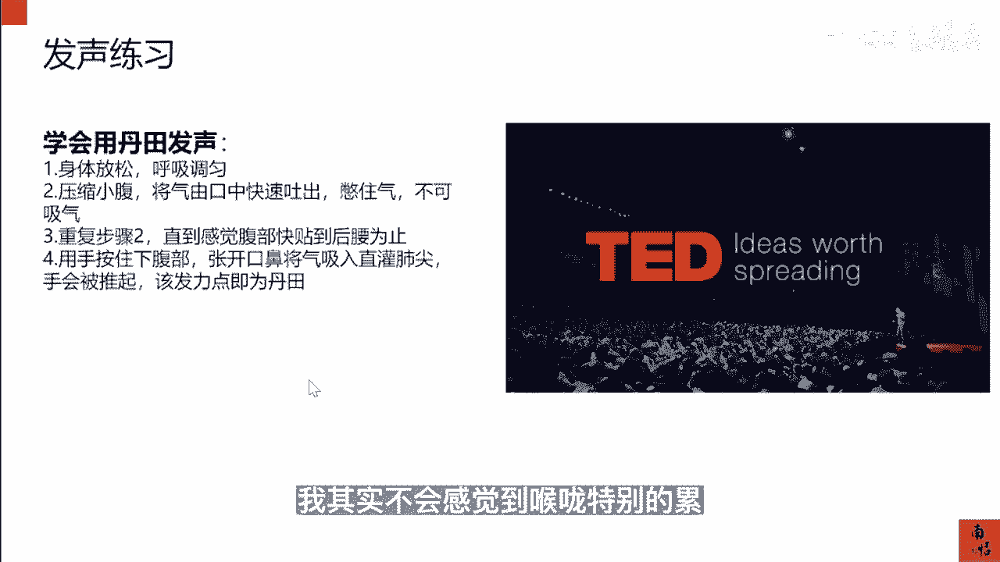

# 083 抖音同城生活-健康垂类0到1运营：入驻-暴力起号-规则篇-消费直播篇！ - P47：47-8.消费医疗0基础主播带货 - 早安睿睿 - BV1Fx4y1n7Ba

我们从事医疗的老板，可能如果去做这个直播以后会碰到一个问题，你起了这个直播盘以后会碰到一个问问题，就是你的咨询师，你的这个护士或者是你的非专业的这些员工，当然不会做主播的时候。

他也还还没有成为一个合格的主播以后，那你该怎么去培训他们，因为本地生活的直播和电商的直播，有一个最大的区别，你电商的直播你可以去聘请专业的主播，但是你本地生活，你是你可能需要每天播。

你可能需要一个礼拜播好多场，你不可能去养一个专业的主播，在那像在我们杭州，你去养一个主播，你的成本是特别高的，所以在这里就是如何把你的员工，合适的员工去培养成为一个主播，这个是非常重要的。

所以我们这一堂课来讲一讲，怎么把这些没有基础的这些主播去培养，成为一个成熟的一个做本地生活的主播。

首先一般的素人无论她长得漂亮或不漂亮，比如说在医美机构里面其实不缺漂亮的女孩子，但是很多医美机构的这些漂亮的，这些咨询师也好，为什么他做不好直播，就是因为他的镜头感不行，那什么叫镜头感。

镜头感其实有两个概念，一个是从表演者的视角，就是你你从这个主播的视角去出发，它是指你这个演员表演的这个生动自然，眼睛的余光感受镜头的位置，所有的表情，肢体的语言都能被镜头以最佳的角度去记录。

这就是从表演者的角度，你所谓的这个好的一个镜头感，而我们很多的这些咨询师，他可能长得很漂亮，但就是不习惯在镜头面前，你的眼神，你的微表情都躲躲闪闪，遮遮掩掩，他固然做不好一个直播。

那么第二个概念就是从拍摄者，镜头感是指摄影或摄像师，对于画面构图以及运动能力的一个把握，那么对于机位的运动的掌控能力，那也就是说在这里，如果你是没有专业的摄影师的，那我觉得你可以不用管这个点。

你们只要去管好你的表演者，你的这些员工，如何成为一个具备镜头感的一个主播。

那么到底怎么去提升这个镜头感，我们有三个方法，第一个就是镜子的练习法，通过照镜子，每天在镜子中去清楚的看见你自己的脸，然后去调整合适的表演的角度，练其举手投足间的这个自然度。

用最好的状态去呈现在画面里面，经常做这个照镜子的这个练习法，还可以提升这个主播的自信，那么当他面对镜头的时候，就会觉得自己在照镜子，其实这种方法是目前各大MCN公司，经常在用的一个方法。

那么第二个是家人视频法，这个我其实在其他课程里面有讲过，这个方法，就是你可以让他和同事，让他和家人之间去做一个视频的通话，然后正对镜头，不要让他看到自己的这个样子，镜正对镜头去跟家人去沟通。

然后并且询问我的眼神是否正确，然后第三个就是短视频训练法，这个可以和你们自己的短视频的内容，就是主页的短视频的内容去联合在一块儿，就是每天去拍三条短视频，重点去观测自己眼神的变化。

那做好了这个镜头侃以后，其实你这个主播，不仅仅是可以用来做带货类的主播，就是带团购产品类主播，还可以有条件，还可以做成一个专业的美学分析的一个主播，如果你是做医美的话，所以这些方法都是必须要去掌握的。

那么第三点发声练习，很很多的主播过不了新手期，最大的一个问题就是，他没有办法持续的去长时间的去做直播，可能讲个一个小时的这个稿子，或者做一个小时的直播，他的喉咙就吃不消了，这你还真的没有办法去逼他。

那这是因为他没有学会用丹田去发声，而是用喉咙在发声，喉咙在发声，你再好的喉咙差不多播个两三个小时，确实嗓子会哑，主播的嗓子哑了，就会直接导致你的直播间呃，因为直播间定向的直播间。

你频繁的换人其实是不好的，所以这里面你在筛选主播的时候，就一定让他们去学会用丹田发声，那怎么样去找到你的丹田，怎么样去学会用丹田的发声，第一步，身体放松，呼吸调匀，然后第二步压缩你的小腹。

将气从嘴巴里面快速地吐出，然后再憋住气，不要再去吸气了，第三步重复步骤二，直到你感觉你的腹部快贴到你的后腰为止，这个时候你再用你的手按住你的下腹部，张开口鼻，将气直接灌到你的肺里面，手就会被推起。

这个时候你的那个发力点就是丹田，用这个方法你反复的去做，找到那个气沉丹田的那个位置，后面再发声的时候，你就用丹田去代替你的喉咙，去发这个声音的这个核心点，那你去播一天，播一晚上你都没有关系。

就像我自己就是用这个方法，因为这个方法是这个中国传媒大学教他的，播音系的学生，去做丹田发声的一个标准的一个方法，我很多年前就是学了这个方法，然后我现在一天说十几个小时的话，我其实不会感觉到喉咙特别的累。

这就是用丹田发声的一个好处，有了主播的镜头感和发声的练习以后，那么我们就要去对我们的主播进行一个定位，因为当你的员工不是一个成熟的主播，他是一个新手的主播的时候。

我们就要去对这个员工这个主播进行一个定位，每个主播在他的直播间里面，最重要的是去贩卖他的情绪的张力，那这个时候每个人的个性他是不一样的，所以我们也就要根据这个主播，或者这个员工私下里，或者是在镜头前。

他愿意去，或者他能表现出的一个特色，去发挥他的一个专长，从而得出一个主播的一个定位，那么大概我们做了几个类别，你们可以去对号入座，基本上会分高冷，严肃成鼠稳重幽默搞怪，落落大方，活泼可爱。

那其他支线的会有哎你的颜值不错，你有气质，你有特点，你亲民，你生活，还有就是呃你的话很少就是你，你你很高冷对吧，京句频出，表情丰富，手舞足蹈滔滔不绝，用这一个360度的一个模型去套你的主播。

你看他符合哪几点，把最重要的哪几点给勾出来，那这就是这个主播的一个定位，随着你们的主播，他的直播场次越来越多，你们要用正确的方法去积累，帮助主播去积累这个经验，很多时候你们作为老板，其实怕主播跑调。

其实与其像我们这种本地生活的那种直播间，与其怕主播跑调，还不如掌握一套培养主播的方法论，因为员工永远会要离职的，你只要告诫自己，我员工在这里直播，他赚到了他要赚的钱，当他赚到钱的时候，公司肯定是赚钱。

机构肯定是赚钱的，这个时候除非是偶发的情况，这个主播做的特别大，他就有可能会去跟你掰扯，那这里你还可以签一签合同，当然太长期的合同，主播也不一定愿意签，就像卖身契一样，所以我们会认为按照我们的经验。

你自自己去培养主播的时候，你一定要帮助主播去积累这个直播的经验，并且把所有的这些方法，以及你在你自己门店，你自己机构的这个直播间里面这套方法论，把它编辑成飞书的文档，那下一个主播来。

或者是你平行要去起更多的直播号的时候，你就可以用这套方法论好，我们来看一看总共有哪一些正确的方法，第一个就是实践出真实，当你一开始再去播的时候，不要上手去拿你的大号去播，你要用一些新号去演练。

每天坚持去直播，这个其实就靠你的管理的能力，以及你绩效分配的这个能力，你一定会这个其实对于一个商家来讲，他前期肯定是要去做一定的投入的，但是这个投入和你找一个服务商，找一个代运营的代播的一个机构去比。

这个投入还是比较划算的，第二个就是做数据的复盘，每场直播结束以后，你需要找到你的问题，数据下面一个章节我会把数据复盘，需要复盘哪一些数据都会给你们罗列清楚，你们只要按照那个表格去做就可以了。

第三个就是总结问题，找到共性的问题，并且去复盘这些问题的根源，到底是主播的问题，还是说我品相的问题，还是说团队配合的问题，这些问题都是需要去进行复盘的，然后进行复盘和总结，那么第四点就是模仿对标。

提到去找到优质的这个直播间，然后汲取其亮点，这个我们在前面已经讲过了，最后一点就是每天调整好你的心态，主播的心态其实非常重要，主播只要每天是非常昂扬的，那你们的直播间不会差，你作为老板。

你一定要去调动主播的情绪，无论用物质还是精神还是等等等等，这些刺激的方法，需要让他保持一个每天都在进步的一个状态，这就是培养主播。

