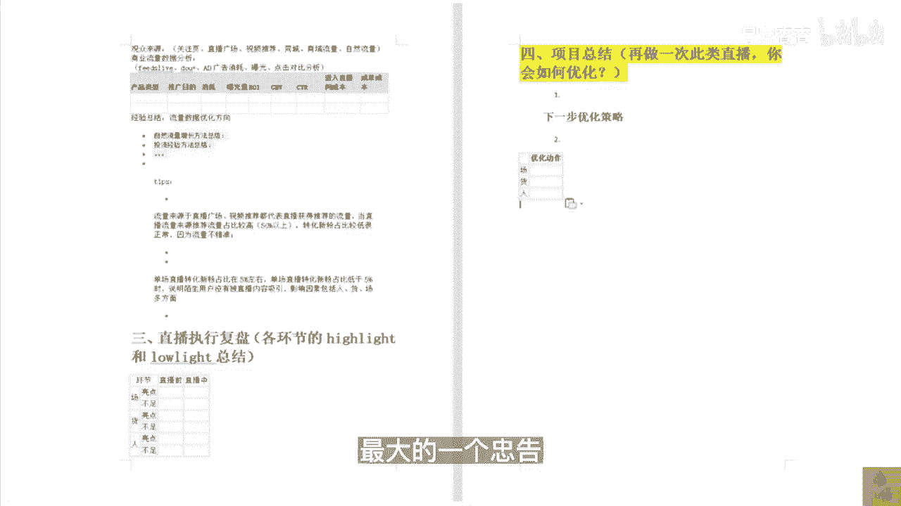

# 083 抖音同城生活-健康垂类0到1运营：入驻-暴力起号-规则篇-消费直播篇！ - P48：48-9.消费医疗如何做数据复盘 - 早安睿睿 - BV1Fx4y1n7Ba

最后一部分内容我们来讲一讲，我们做了那么长时间的直播以后，我们公司对于这些主播也好，对于这一些直播的这些场次，几乎每一场都会进行一个数据的复盘，无论从大公司还是小公司，你想去做好直播。

你的直播数据复盘是最最重要的，因为你只有做好直播数据的复盘，你才知道你们的问题在哪，定位问题是对于任何一家从事互联网公司来讲，是最核心的一个点的存在。

那么我们来看一下，我需要去定位这一些问题所在，我需要去做哪一些数据的复盘，第一个就是我们首先要去建立，我们一个直播信息的一个和一个目标，任何一场直播你都需要这两点对吧，我的客户名称。

当然这个客户名称是你们自己，我的开播账号，它方便你整个团队协作的管理哦，我们讲一个真正好的做抖音的公司，他到最后无论是员工离职，还是是他们内部的交流，就是几张表格，用飞书做的几张表格。

部门之间即便是用微信沟通的，真正核心的信息还是在于表格的同步，那么你就要去定你们的达成的一个目标，说是超预期达成就120%，大成还是符合预期，100%，还是不符合预期，这一些值这一些目标要设置的合理。

所以我们讲一个机构的老板，你可以自己不干活，为什么你自己要懂这些东西，只有你懂了以后，你才可以合理的去安排这些目标，那么第二个板块就是直播数据的回顾分析，那这些销售的复数，衡量不同的产品对用户的吸引力。

这对你主品去组你的这个具体的品相，以及它的价格，以及它的这个整体成交的链路，都是有非常重要的一个意义的，那下面这些我就不具体读了，这些你们反正到时候可以问我，去要那个word版的资料，我会发给你们。

你们只要按照这个，如果你们是新手，你们只要按照这个数据复盘的表格去填，一定是没有错的，所以整体做好直播，它其实不是说什么呃，遥不可及的一个事情，它就是团队协作，细心耐心以及每天去坚持的这么一个行为。

在你用正确的方法去做这一些正确的事情，即便碰到问题了，及时去复盘，然后去修正，那你在一定的周期内，就可以快速的拿到这个结果，当你能拿到医疗本地生活的，这个直播的结果的时候。

你的竞争对手想要再去赶超你一模一样的事情，他必须都得做一遍，所以这就是下先手，所以我觉得所有的老板，你们想去做好抖音的本地生活，光靠花钱是没有用的，一定要自己下场做抖音，只有自己下场了。

才能知道它背后存在的问题和呃，这中间存在的这个趋势和机会，这是我对于我自己认识那么多的，这些实体机构的这些老板和粉丝。

