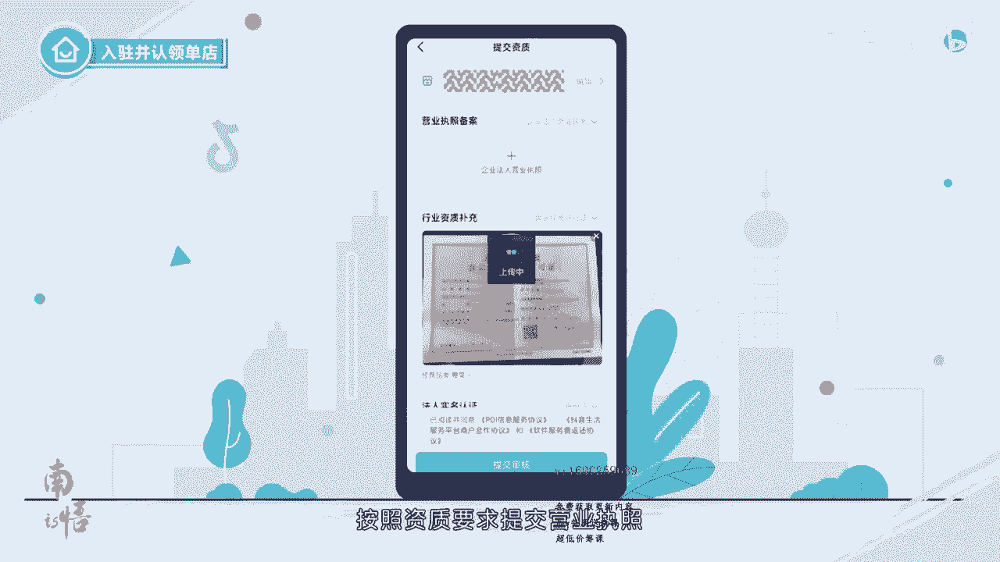

# 083 抖音同城生活-健康垂类0到1运营：入驻-暴力起号-规则篇-消费直播篇！ - P4：04-抖音来客入驻流程 - 早安睿睿 - BV1Fx4y1n7Ba

抖音来客是抖音生活服务商家专属的经营平台。

在本系列课程中，我们将为大家演示入住流程，基础设置，门店装修，抖音号装修，团购设置等基础操作流程，入驻并认领门店，目前可以入驻的行业有美食住宿游玩，休闲娱乐和丽人等行业。

详细的行业及类目可扫描右侧二维码，单店和连锁门店，在入住和认领门店的流程上存在着一定的差别，首先我们来看一下单店入住的流程，商家认领单店，选择抖音来客PC或app端均可点击进入，抖音来客未注册的手机号。

登录成功后将自动注册完成注册后进入首页，第一步点击入驻抖音门店，第二步选择认领单店，第三步搜索想要认领的门店，如搜索不到也可以点击创建门店，第四步搜索到具体门店，可以点击编辑查看门店的信息有无错误。

也可以补充相关信息，第五步，资质提交，按照资质要求提交营业执照。

法定代表人，经营人身份证，部分行业需要同时提交行业资质，补充经营人信息，按要求全部提交后。

点击提交审核，等待审核结果，在资质提交时有以下要求，审核提交后可以在抖音来客首页查看审核结果，一般1~3个工作日会反馈审核结果，审核进度也会通过短信形式进行通知，如审核不通过。

可以根据提示进行修改后再次提交上传，审核通过后，入住并认领门店的动作就全部完成了，接下来我们来看一下如何认领连锁店，连锁店认领同单店认领不同模式，商家只能通过抖音来客PC端完成入驻动作。

第一步提交品牌资质，按照要求提交企业法人营业执照，品牌商标注册证照，法人实名信息和运营人信息，提交完成后，等待系统审核审核通过即可完成品牌入驻，第二步认领门店，点击店铺管理门店管理，认领门店。

下载门店认证模板，填写认领的门店信息后上传，第三步上传资质，点击店铺管理门店管理去上传资质，可以选择批量上传资质，也可以选择为门店配置子账号，由此账号管理员补充门店资质，批量认领门店。

按照批量上传资质的要求，上传资质后，等待审核结果，审核通过后，入住就完成了，子账号管理员补充资质，由门店子账号管理员登录抖音来客app或PC网页，选择对应门店提交资质，设置子账号的步骤。

可以参照抖音来客电脑版产品功能，用户使用手册，以上就是本节课程的全部内容，在下节课程中，我们将为大家带来系列课程的第二节。

