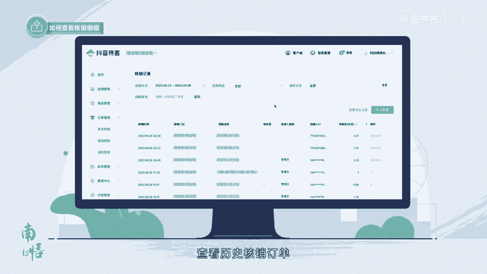

# 083 抖音同城生活-健康垂类0到1运营：入驻-暴力起号-规则篇-消费直播篇！ - P5：05-抖音来客基础设置 - 早安睿睿 - BV1Fx4y1n7Ba

本节课程我们将为大家演示如何绑定收款账户。

以及核销退款，提现开票，一设置绑定收款账户，收款账户的用途。

只有在配置收款公司的收款账户，才能去做上架商品的操作。

收款账户设置要求结算，支持绑定公司收款账户和门店收款账户，设置门店收款账户后，可核销结算至分门店账户，收款账户如何设置收款账户，公司和门店均支持绑定收款账户，选择抖音来客pc app端均可。

首先我们来看一下app端如何操作，第一步打开抖音来客app登录，进入抖音来客首页，第二步首页点击门店经营，点击收款账户，进入收款账户列表，输入银行卡号。

选择开户银行。

第三步选择是否与平台签订开团协议，如果选择是分门店结算后，可以门店主体开具发票。

如果选择否，只能以总公司主体开票。

第四步阅读并勾选协议提交审核。

审核规则，后台会向银行卡号上面打一分钱，用于验证这个卡号是否通顺，审核结果就会通过短信或者系统消息来通知。

接下来我们看一下PC端如何操作，第一步打开抖音来客PC端，登录抖音来客，第二步，点击收款账户，进入收款账户列表，输入银行卡号，选择开户银行，第三步阅读并勾选协议。

提交审核，二如何查看核销明细，查看核销明细，选择抖音来客，pc app端均可，首先我们来看一下app端如何操作。

点击门店经营更多核销明细，查看历史核销订单，也可以通过上方的核销时间，核销状态，商品选择等来筛选，查看订单，订单核销操作流程一操作验券进入app首页，上方可选择扫码验券或数码验券，扫码验券。

相机扫码数码验券，输入12~16位纯数字券码，一选择核销信息，选择适用门店和核销张数，二撤销核销核销后一小时内可撤销，温馨提示，app端暂无下载明细功能。

需到电脑端操作，打开抖音来客，PC端登录抖音来客，点击订单管理核销明细，查看历史核销订单。

三如何进行退款管理，电击门店经营更多退款管理会看到待处理，已处理仲裁中的退款订单。

四如何查看提现记录，查看提现记录，选择抖音来客pc app端均可，首先我们来看一下app端如何操作管理提现记录。

一首页点击门店经营财务管理，点击提现记录二搜索框支持按照提现时间。

账户选择状态筛选，三。

支持查看单条提现详情和分账详情，四。

如收款账户信息有误造成提现失败，支持修改信息后手动点击重试提现。

接下来我们看一下PC端如何操作管理提现记录。

一，首页点击财务管理，点击提现记录二搜索框支持按照提现时间。

账户选择状态筛选，五申请开票。

谁可以申请开票，开什么发票，仅支持开通团购的主体申请开通发票。

支持开票类型，增值税普票，增值税电子普票。

增值税专票，如何开具发票，申请开票资质，第一步，首页点击门店经营，点击自助开票，首次进入需申请开票资质，第二步，选择发票类型并填写相关信息，第三步，修改完毕后，点击提交资质，第四步返回自主开票页面。

勾选要开票的记录，点击申请开票。

确认信息无误后，点击提交申请，以上就是本节课程的全部内容，在下节课程中，我们将为大家带来系列课程的第三节。

