# 083 抖音同城生活-健康垂类0到1运营：入驻-暴力起号-规则篇-消费直播篇！ - P6：06-店铺装修和商品租组品 - 早安睿睿 - BV1Fx4y1n7Ba

商家朋友们经常会说，为什么需要做店铺装修，还需要给不同的商品做套餐组合呀，不是把商品挂到抖音就可以了吗。

为什么要做这么复杂呢，其实在抖音生活服务上做生意。

和线下开店是一样的，大家可以想想我们为什么要装修实体门店。

给店里布置不同的装潢风格，为什么要设置不同价位的商品。

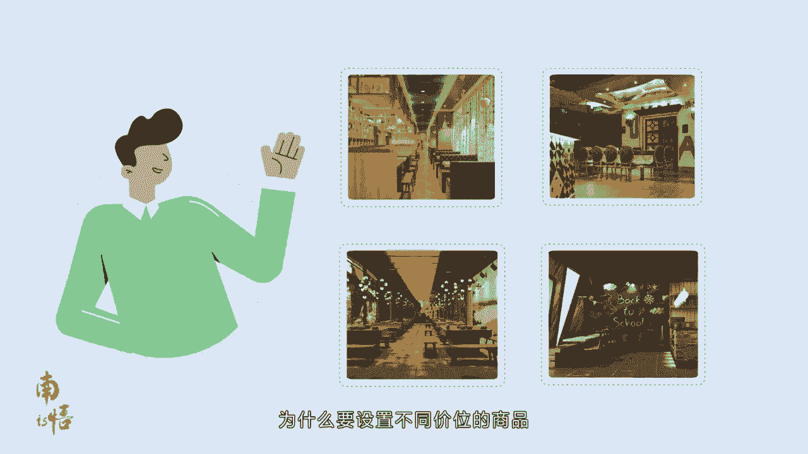

还会时常安排实惠的套餐，不就是为了让客户进入门店后。

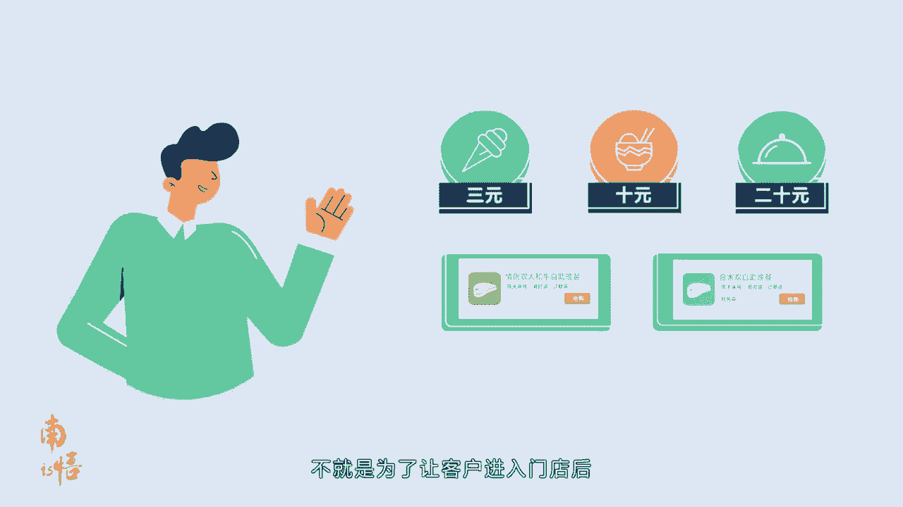

能通过我们的装修快速建立信任，喜欢用餐环境。

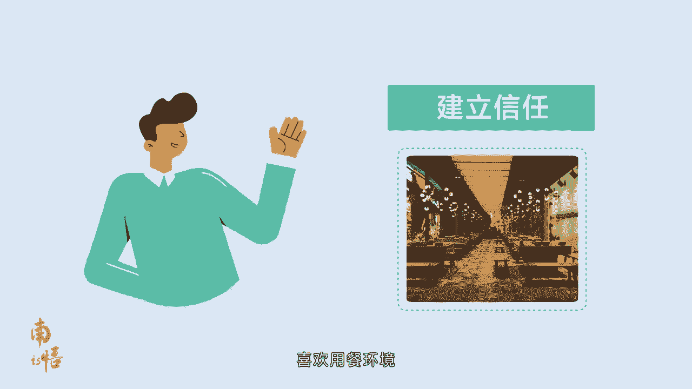

看到店里的菜单和招牌爆品，看到不同商品的组合后，比单品更优惠的价格吸引客户下单吗。

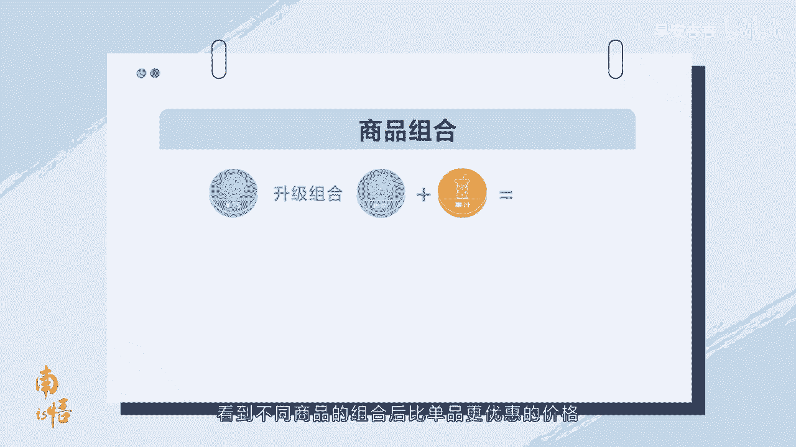

现在我们来跟随抖音用户的脚步。

看看用户在每一个阶段的心理变化，您就更能理解了。

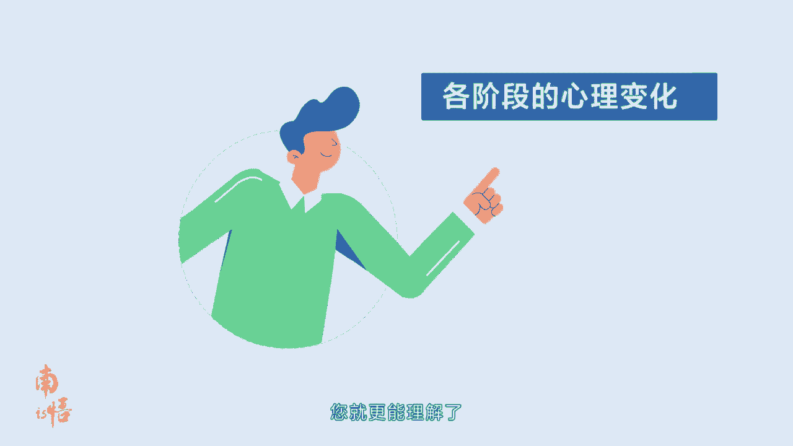

比如用户被一条短视频吸引，关注到我们的店铺，很喜欢视频中的店铺风格，通过点击端视频上的POI进入我们的店铺。

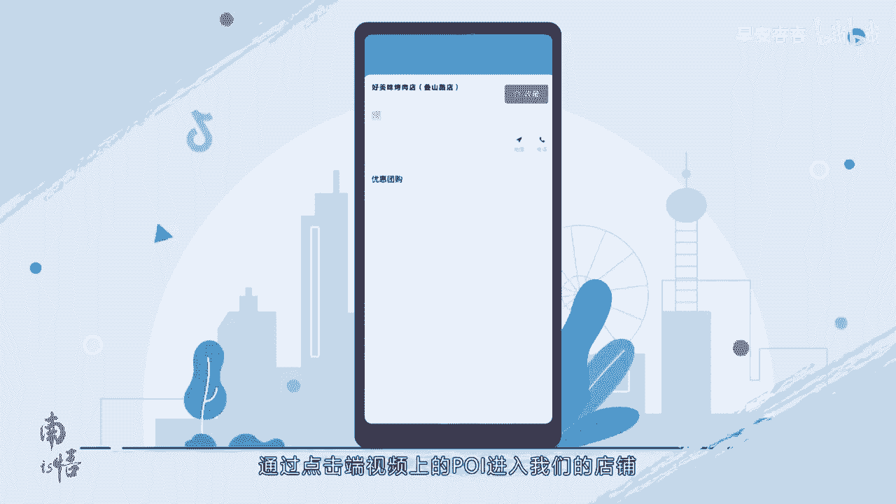

却没看到什么内容，这时的用户心里会是这是虚假宣传吗，怎么店铺连一张介绍图片都没有，也没有说能不能停车，我晚上09：30去会不会关门啊。

算了还是看看别家吧。

所以如果没做好店铺信息的完善和装修，我们辛辛苦苦吸引过来，想要下单的用户就很容易因不信任而流失，可见商家朋友们在店铺装修环节一定要重视，按照我们的操作指引来建设内容。

用丰满的店铺页面与用户建立信任。

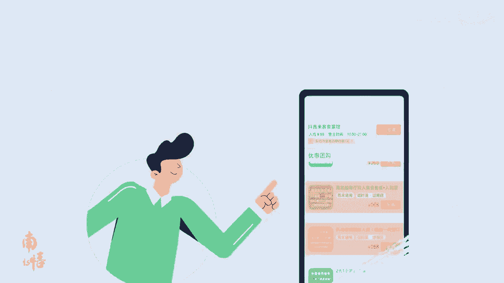

然后用户才会开始查看，有哪些商品是他感兴趣的，这时如果他只看到一个商品链接，可能会直接因为怕踩雷而选择放弃，所以店铺装修是第一步，做好商品的组合，上线满足更多人需求的团品是更重要的一步。

让不同的商品发挥不同的作用。

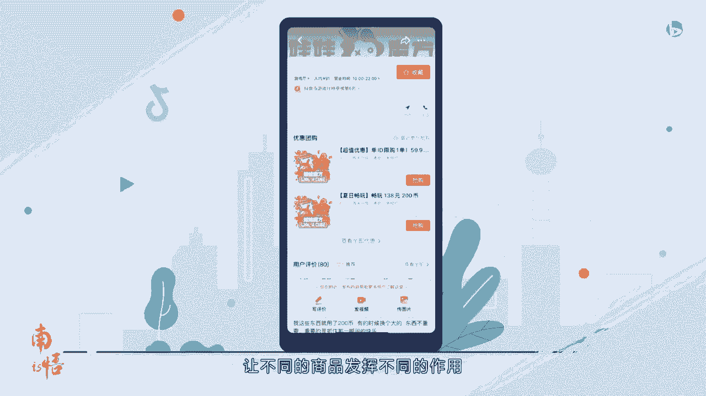

才能更好地吸引用户下单，店铺装修和商品组货是开启经营必完成的两步。

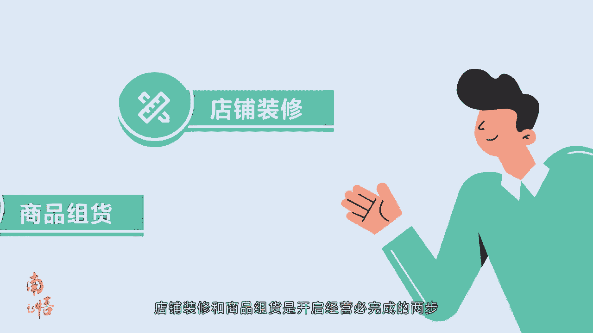

其实操作并不难，首先来回答大家一个问题。

门店装修有什么用，通过门店装修可以配置门店主图，官方相册发布公告，以提升用户对于门店的好感度。

有利于促进团购订单成交，选择抖音来客手机端登录进入抖音来客首页。

第一步，点击门店装修，进入装修页，第二步，填写基础信息，选择服务设施服务，免费开放，景区讲解，导游服务，无需取票，可带宠物设施，免费停车，可停车，行李寄存，吸烟区，无障碍设施，轮椅租赁等。

根据商户情况选择，第三步，基础装修店铺入口图可上传六张单张图片，大小不超过五兆的图片作为店面门面。

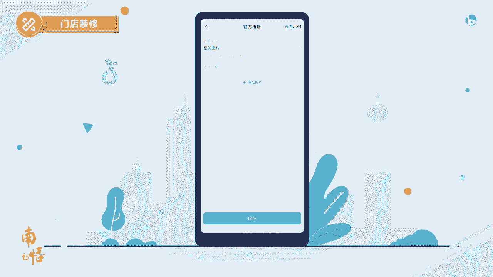

官方相册上传相关图片，根据图片选择相册名称。

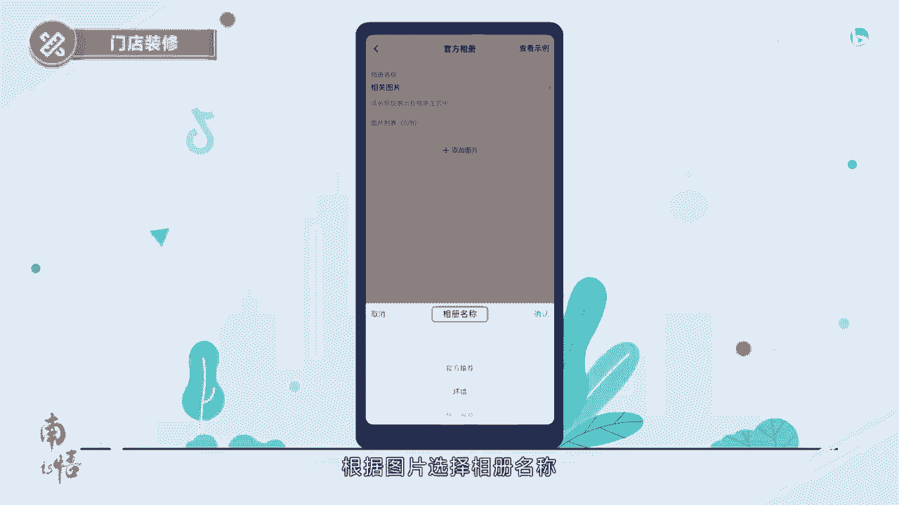

上传的照片会显示到主页上的地点，相册中外景小图片。

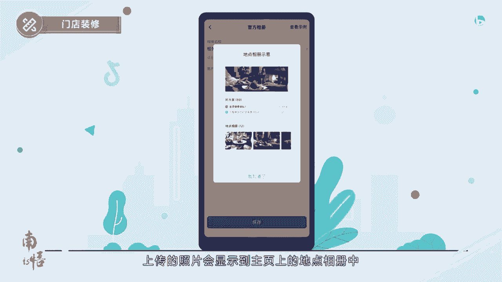

建议上传尺寸1000×750大小的图片，将显示在地点的外景小图，第四步，公告管理，可以选择打开公告内容，然后配置公告，上传一张不超过五兆比例，在16比九的公告照片，选择公告类型。

并且写上公告标题以及公告详情，注意字数的限制，最后选择有效期时间。

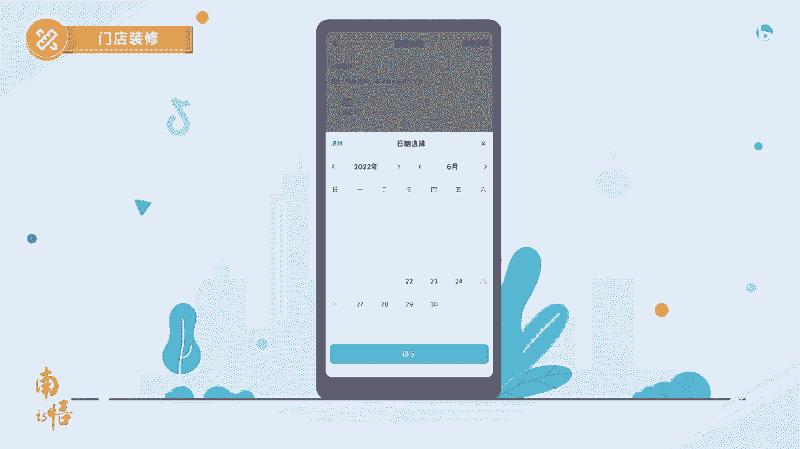

第五步提交审核，审核提交后可以在抖音来客首页查看审核结果，一般一至两个工作日会反馈审核结果，如果审核不通过，可以根据提示进行修改后再次提交上传。

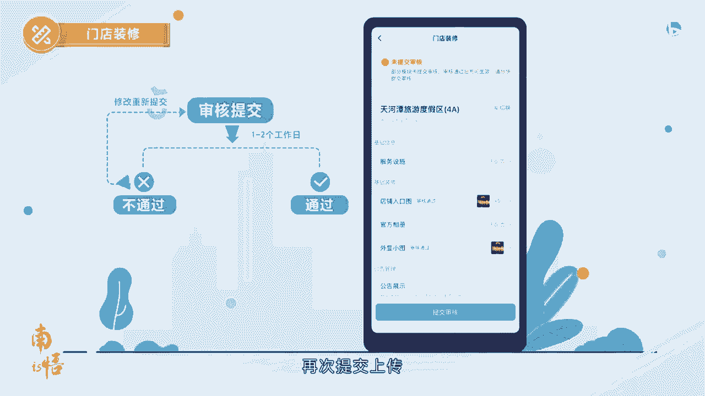

