# 083 抖音同城生活-健康垂类0到1运营：入驻-暴力起号-规则篇-消费直播篇！ - P9：09-抖音来客财务对账操作流程 - 早安睿睿 - BV1Fx4y1n7Ba

在本节课程中，我们将集中讲解财务对账相关的内容，包括对账的规则逻辑。

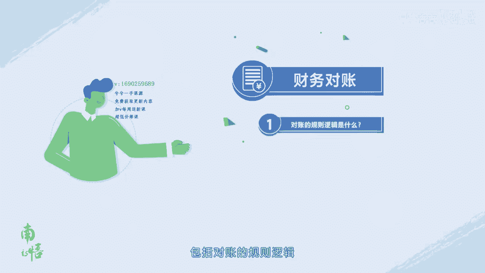

核销明细和分账明细字段讲解，首先对账的规则逻辑是什么。

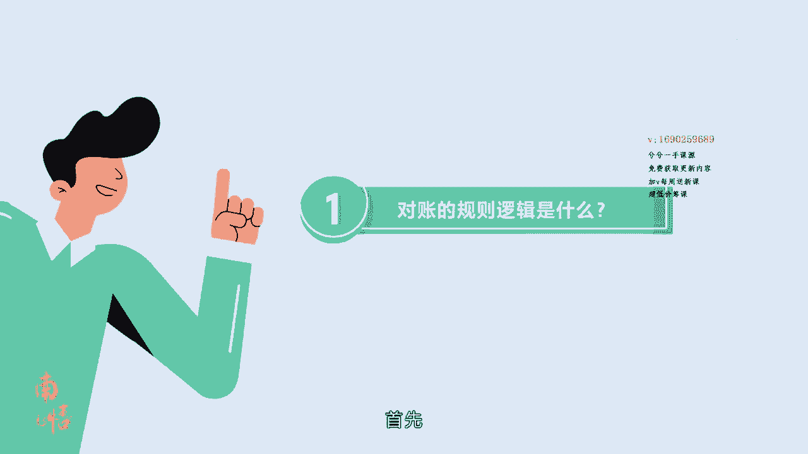

每张券的核销包含收入和支出两大部分，订单实收等于券售卖金额减，商家优惠等于用户实付加抖音支付优惠，加平台补贴金额，各种佣金费用都是以订单实收为基数，乘以各种费率得出的支出，汇总等于软件服务费加达人佣金。

加服务商佣金加撮合经济抽佣加保险费用，每笔订单券支出的部分包含软件服务费，达人佣金，服务商佣金，撮合经济抽佣和保险，其中软件服务费包含两部分，支付服务费0。6%加剩余部分，比如美食品类2。

5%的软件服务费，等于1。9%的剩余部分，加0。6%的支付服务费，具体详见2022年，生活服务软件服务费标准说明注，每一笔支出的系统计算规则是四舍五入，保留两位小数，最终每笔订单券提现的金额。

等于订单实收减支出，汇总每笔订单券核销后，根据账期时间，会在核销日期加账期日系统自动发起提现，比如一个商户的账期是T加五，也就是五天，8月2日核销的券会，在8月7日系统自动发起提现。

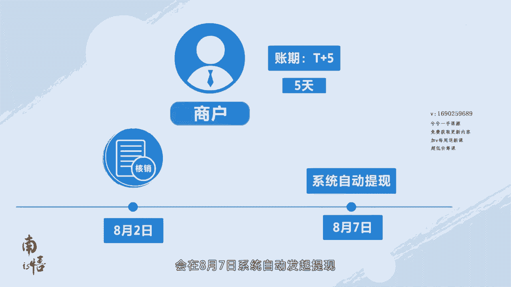

第二核销明细和分账明细怎么看。

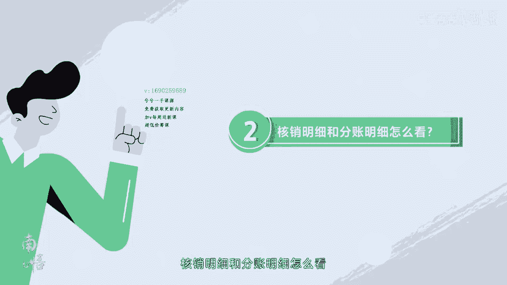

第一步账期查看，登录抖音来客电脑端，点开财务管理提现记录或者财务管理收款账户，在页面最上方会有账期信息，点击财务管理收款账户账户详情，在账户详情中也有收款账期信息，如果收款账期是T加五及核销后。

第五天自动打款至收款账户。

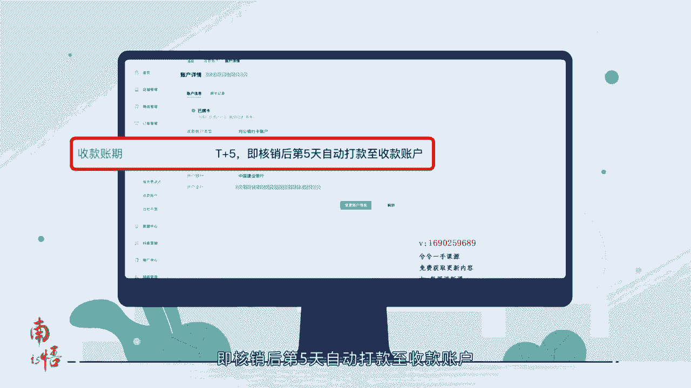

第二步核销和分账信息查询。

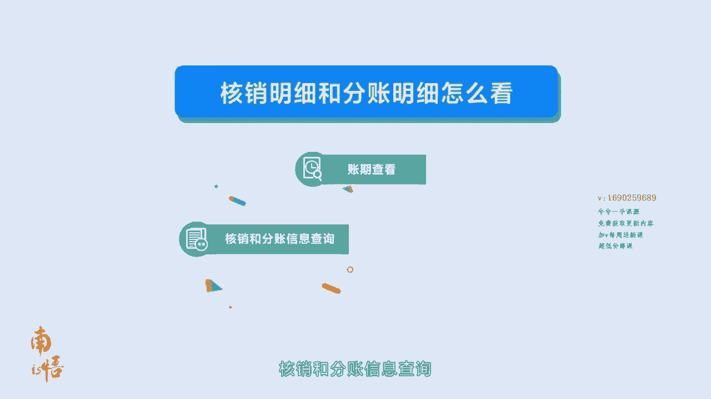

登录抖音来客电脑端，点击订单管理核销明细，进入核销记录页，可以查看筛选日期下的核销明细，还可以在核销记录页点击导出数据，下载并查看筛选日期下的核销明细数据，点击财务管理提现记录，进入提现记录页。

可以查看每一个收款账户的提现数据，和提现分账明细，还可以在提现记录页，点击导出提现记录和导出分账明细。

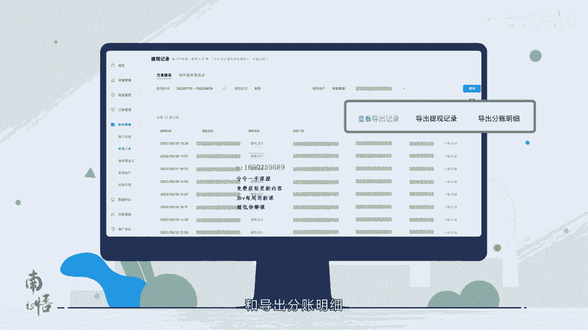

下载并查看提现和分账的明细数据，根据第一步查到的账期，如果是T加五，要核对8月1日到8月15日的核销和提现，核销明细，需要下载8月1日到15日的明细分账明细，需要下载8月6日到20日的明细。

第三步核对核销和提现订单券的数量是否正确，明细下载完成后。

在核销明细中筛选已核销且提现成功，查看对应核销记录的条数，在分账明细中筛选，提现成功查看对应提现记录的条数。

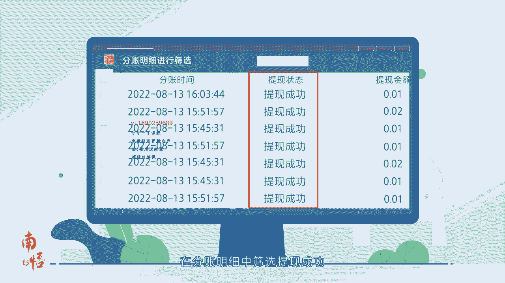

如果两个明细数据条数一致。

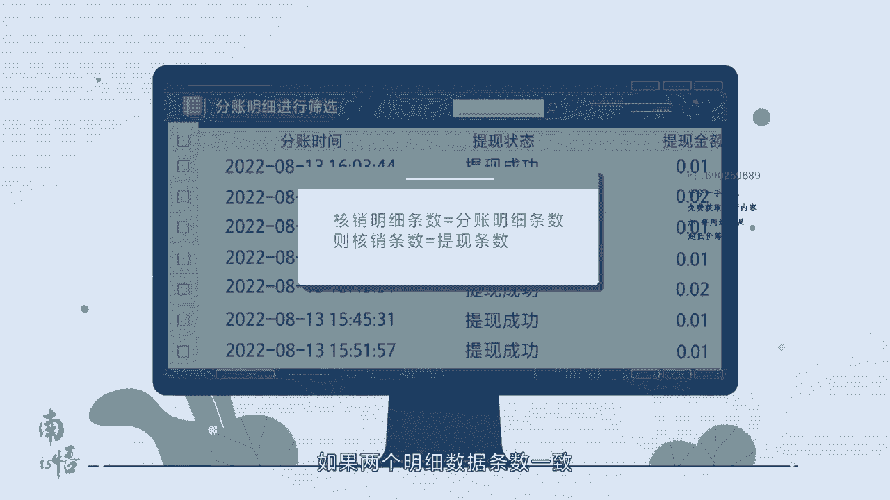

则核销和提现的数量是一致的，第四步，核对核销和提现订单券的提现金额是否正确。

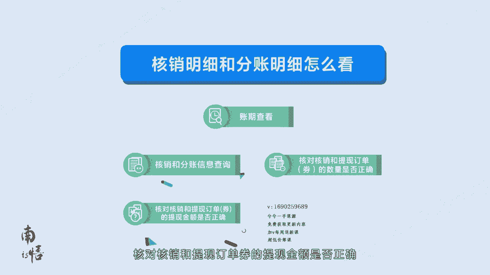

订单券数量对上之后。

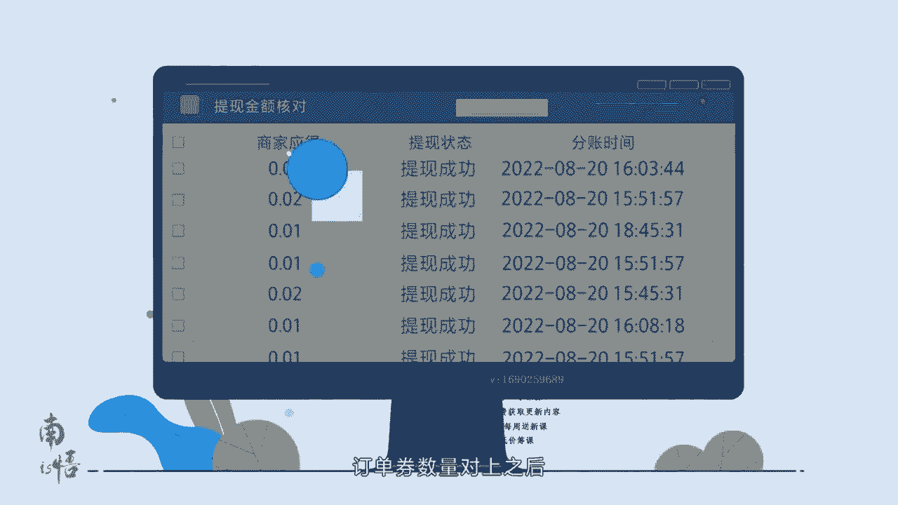

接下来我们对提现金额进行核对，按照第三步的筛选结果，直接汇总，核销明细中的商家应得提现金额，和分账明细中的提现金额，三个数据应该是一致的，在核销明细中，系统已经自动计算出商家应得。

如果提现状态是提现成功，提现金额等于商家应得。

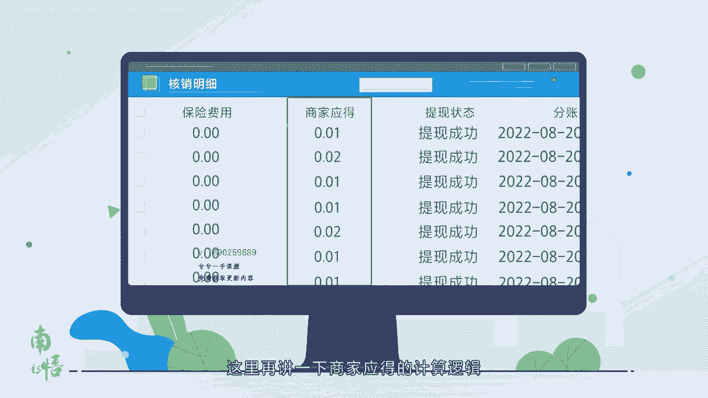

这里再讲一下商家应得的计算逻辑，商家应得等于订单时收减支出，汇总每一笔佣金支出，的系统计算规则是四舍五入。

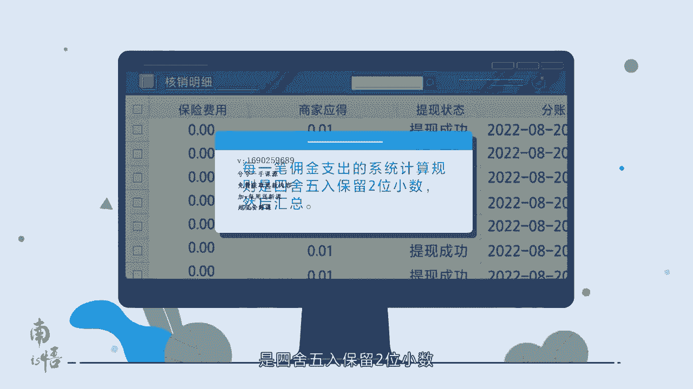

保留两位小数，然后汇总第五步对账。

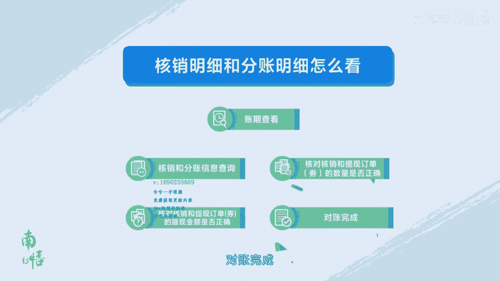

完成核销和提现，订单券的数量以及金额都没有问题。

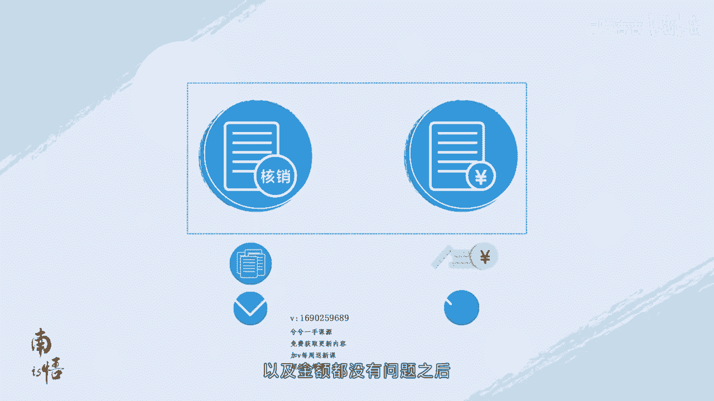

之后对账部分就全部操作完成了，如果对对账中发现了问题。

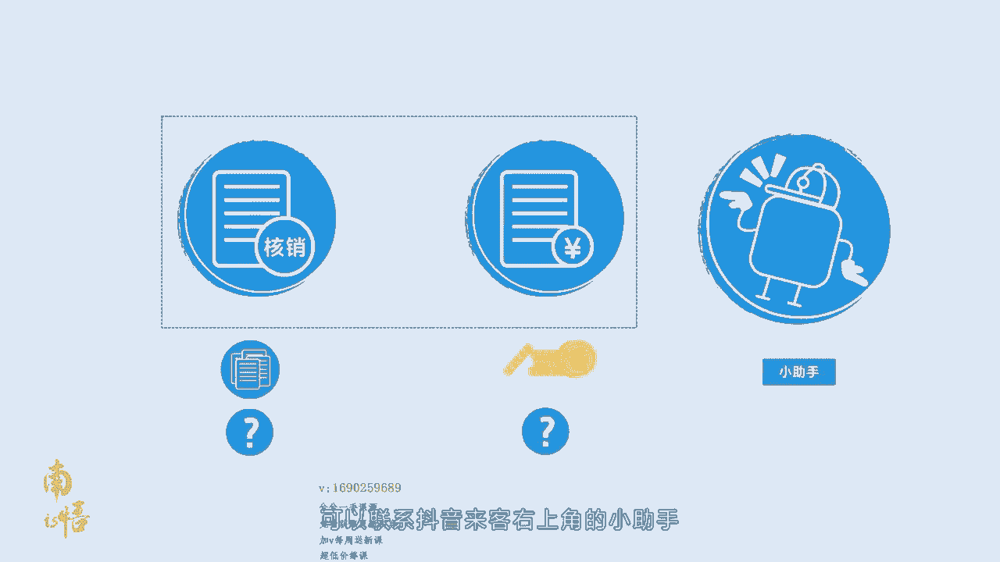

可以联系抖音来客右上角的小助手发起咨询，以上就是本节课程的全部内容。

