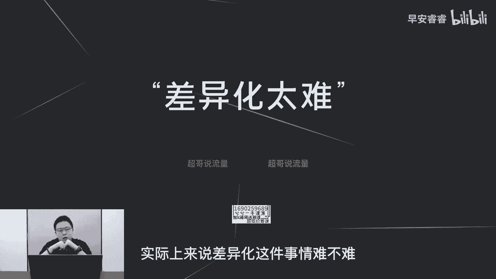

# 085 2023短视频起号·差异化定位课：0~1做懂抖音（定位+内容+投流+运营） - P10：第10节10 为什么要做差异化 - 早安睿睿 - BV1Am421T7br

今天我们去讲一下五维差异法，五维差异法呢是我自己做了两三年的抖音之后，然后提炼出来怎么样去做抖音，实际上它是有一些套路可循的，那目前我已经提炼出来这五个套路啊，可以适用于你们的各种赛道的旗号。

那今天呢主要先去讲一下人设的差异怎么做，那首先我们来说一下为什么要去做差异化。

在今年都已经2022年，抖音都已经运行了五到6年的时间了，那目前各个垂类赛道，它的内容创作者和内容的形式都已经趋于饱和，而且越来越卷，所以如果你不做一些创新，不做一些新的方式。

无论是在账号的定位还是在你的内容上面，如果给不到用户眼前一亮的感觉，那你在这个账号里面基本上做不出来，这是第一个原因。

因为赛道已经趋于饱和，所以我们要做一些与众不同的东西，那第二呢就是抖音这个平台内容的核心。

就是要去满足用户的猎奇心，那在抖音上面，所有爆火的内容，他一定都是因为认知差，就是你满足了用户在某一方面的认知的缺失，然后让他觉得你讲的东西或者你的画面，或者你的内容输出的方式，让他觉得很新奇。

那这是你的内容能够基于火的根本，所以这是第二点，就是各个赛道的用户，他已经对这个赛道的内容形式，有一些基础的基本的认知，常规的认知，所以我们一定要去做一些新的方式，在这个赛道里面让用户能够眼前一亮。

能够满足他的一部分的猎奇心，这样我们起航才能更快啊。

那基于这两点的话，我们再去看一下，为什么很多新手要拒绝去做差异化这件事情。

那我们先可以听到两种声音，第一种声音的话就是很多人会去说。

这种内容已经太多了，我们在做很多达人孵化或者IP孵化的时候，我们线下会遇到这种情况，很多人先天就会觉得你所说的这种形式，或者这种内容，他觉得在这个赛道，或者说他自己刷到已经太多了，他觉得做不出来。

他觉得没有新意。

但是我们每个人在抖音上面只能代表我们自己，但是抖音毕竟是一个日活8亿的平台，就连小杨哥目前也才8000万左右的粉丝，但是抖音现在没有前8亿的平台，对他来说，目前他都还有一定的吸粉空间。

所以说更何况是还没有起号的，你你见到的很多的内容，可能只是你觉得已经看腻了，但是对于其他人来说，因为你和其他人的用户画像的标签是不一样的，你的喜好跟其他人是不一样的，所以说对于你身边其他的大部分人来说。

他没有见过这种形式，那对于其他人来说，这就已经打开了他的新的认知，对他来说能够满足猎奇，那对他来说，这就是差异化的账号，所以我们不要去主观的带入，去给自己设置障碍，然后在起号的第一步。

因为想的太多，所以不敢做，会觉得差异化这件事情很难，实际上来说差异化这件事情难不难。

肯定有难度，但这个难度还是基于认知差，就是一定是因为你们平时刷抖音，刷的时间少，以及你们做的号太少，不像我们我们基本上每个月都会在一起，4~10个号这样的一个体量，所以因为我们做的号很多。

以及我们团队看的号很多，所以我们很清楚，哪些内容形式可能是一个新的点，以及我们会突破自己的想象力，觉得哪些赛道去做一些新的尝试，那可能就可以做得出来，所以说新手做差异化觉得太难。

第一方面是因为你看得少，第二方面是因为你没有总结出来套路，那我今天想讲的这个五维差异，实际上就是五个起号差异化的套路，你在这些套路上面一定会找到一些新的方向，那你在后面去起号的时候。

你拿这五个套路里面一到两个套路去做组合，那你的起号一定会做的更快，因为你的差异化已经出来了，那接着我们来讲一下。

五维差异化到底是哪五个维度，首先第一部分呢就是人设的差异，就是你这个账号这个人设，它给用户带来了一些新的体验呃，然后第二部分呢是场景的差异，场景的差异在我短视频有说过，就不再赘述。

然后第三部分呢叫做内容点的差异，内容点的差异我举例去说一下，比如说我们都是做美食，那你可能做的是家常菜，他会做的更细分，他可能做的是冷饮，他可能做的是气泡冷饮，那它的内容点和大部分的美食。

赛道的其他博主会有不一样。

所以这叫做内容点的差异，第四部分呢叫做表现手法的差异，表现手法差异来说的话，对新手来说最难，因为它需要一些呃，在剪辑或者在拍摄手法上面的一些创新，比如说卡点或者一些特效，所以在我后面的课程里面。

关于表现手法的差异，我不会去过多的赘述啊，然后第五个呢就是内容标签的组合，比如说你如果是在美食赛道，那你不光是做美食这一个内容标签，你可能是美食加数码或者美食加盲盒，或者美食加挑战。

这个我之前有一部分的视频也说过，那我在后续的课程里面，根据这五个维度。

