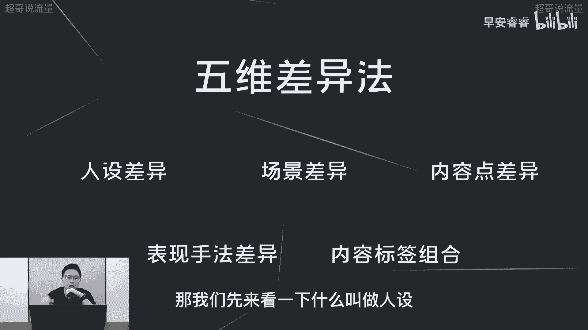
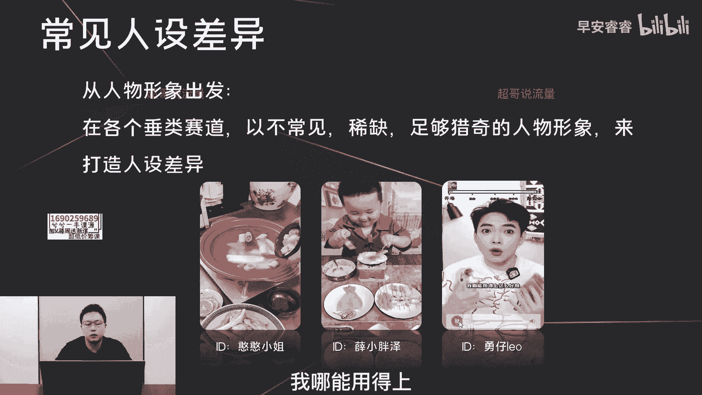
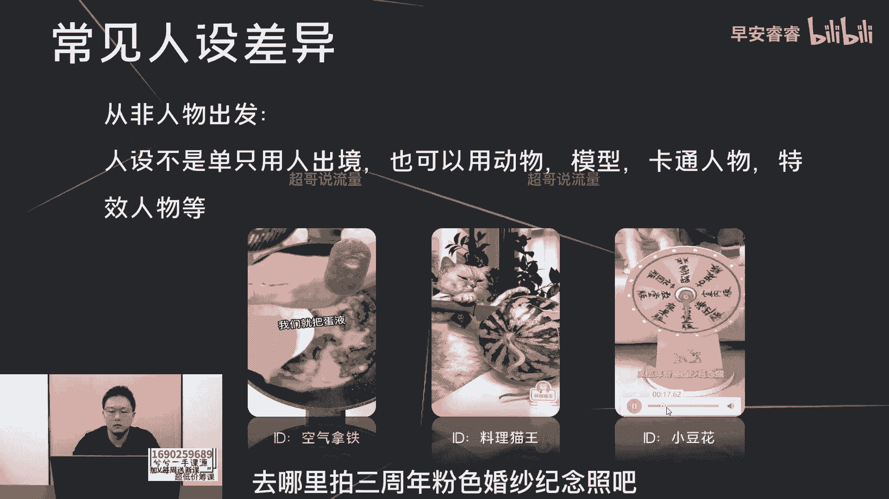
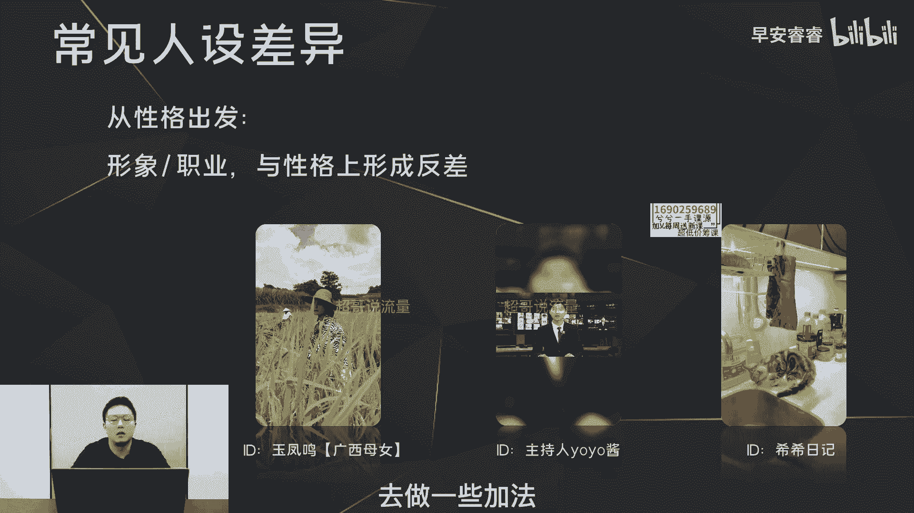
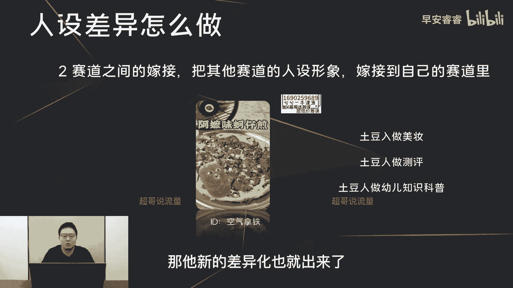
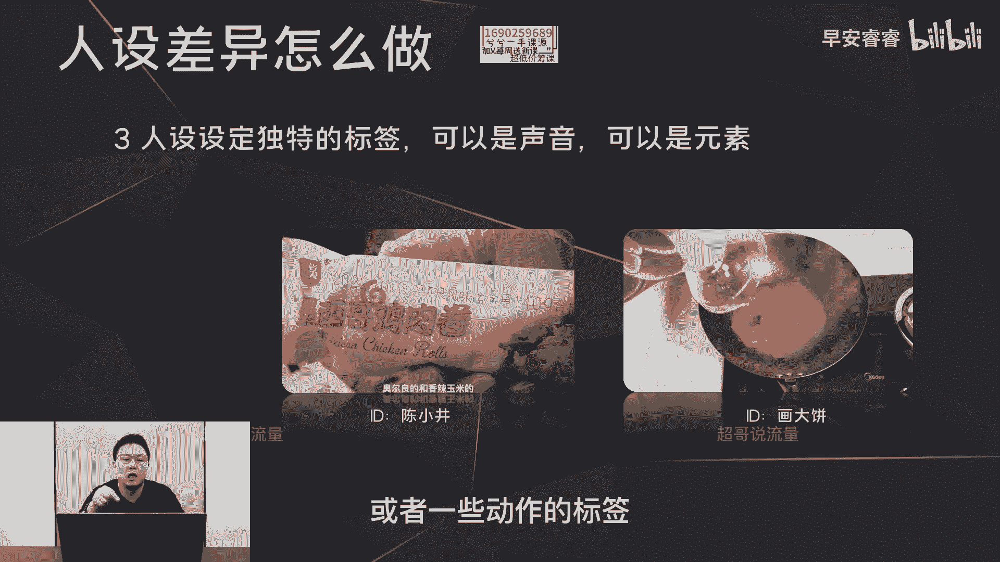
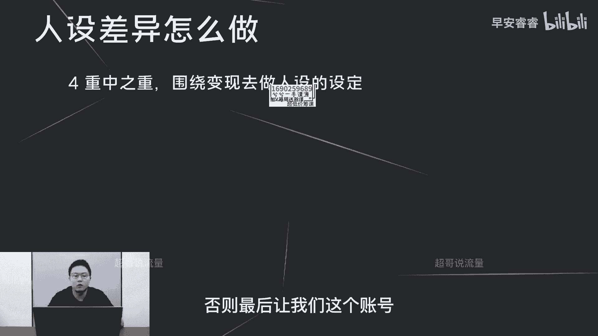
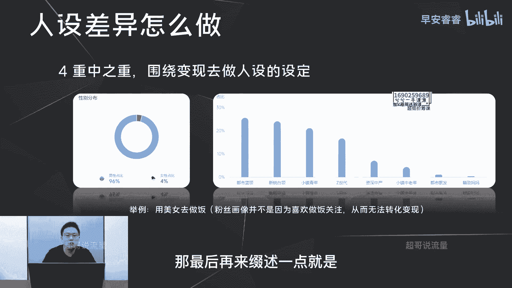
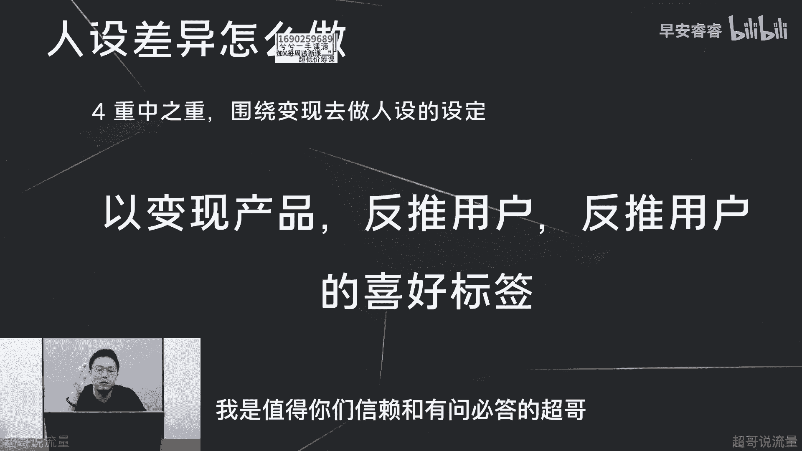

# 085 2023短视频起号·差异化定位课：0~1做懂抖音（定位+内容+投流+运营） - P11：第11节11 五维差异法（人设差异） - 早安睿睿 - BV1Am421T7br

那今天这条视频呢，主要我们先去讲一下人设差异怎么样去做，那我们先来看一下什么叫做人设。

那人设呢顾名思义就是通过你的账号，用户能够直观地了解到你的职业，你的专业，你的背景，你的特长，包括你的性格，你的喜好等等等等，那人设呢一定是需要去前置设计的，就是你在起号之前。

一定要先构思好你到底是什么样一个人设，你这个人设到底什么样的性格，什么样的喜好，什么样的说话方式，然后什么样的专业，什么样的特长，什么样的背景背书，那这些人设的前置设计，不光体现在你的简介里面。

它实际上需要在你日常跟粉丝的互动，各方面都要去踩着这个人设的标签去走，举个例子，如果你的人设是一个相对来说比较挑剔，比较脾气暴躁，比较严苛的一个人，那你在后期的网友的互动，比如说回复评论啊。

各方面就可能不会走得太温和，这样的话会让你的人设形象不会那么的明确，就是用户看完你的视频，看完你的互动以后，也不知道到底你是什么样一个性格的人，所以人设一定需要前置的设计。

而且需要体现在你的日常的方方面面，那第三点呢就是人设形象一定不是我认为，而是用户以为就是人设形象，我们是需要前置设计，但是最终这个设计的成不成功，或者设计的有没有偏差，需不需要在后期修正过来。

那一定是需要用户呢给你的反馈，用户通过你的每条视频或者你的互动，他判断你是什么样一个性格的人，你是什么样一个职业背景的人，或者你的擅长点到底是在哪个方向，那一定是用户以为，而不是我们以为。

那接下来我们来说一下，常见的人设差异有哪几个方面，那第一个方面呢就是从人物的形象出发，这个就是说啊在每个垂类赛道，用一些不常见和稀缺，足够猎奇的人物形象来打造这个人设的差异，你听这句话来说的话。

你肯定会觉得这件事情还是很难，那接下来我们来看几条案例，实际上你就很清楚，人设差异其实在每个赛道随处可见，比如说这个账号，它是美食赛道的一个账号，她叫做憨憨小姐，上火严重，嗓子还在发炎，挺难受的。

冒泡汽水和你都是夏天，感觉像我们一般认知美食赛道里面，做家常菜的博主啊，要不然就是贤妻良母的形象，要不然呢就是一些好吃嘴，很少会见到这种比较妖娆多姿的美女的形象，所以说这个账号她的人设差异呢。

就是一个美女的形象去做家常菜，我们接着再来看第二个号，妈妈我饿了好嘞，妈去给你把饭做，那第二个账号呢也是美食三道，他是以小孩的这种身份去做饭用的，全都是迷你厨房的这一套道具。

所以也是打破了用户的一个传统认知，它的差异化就出来了，第三个案例呢是在美妆赛道，我们平时看到美妆赛道做美妆测评，或者美妆种草，美妆技术分享的，这一部分的博主基本上都是美女的身份。

那这个账号呢就是一个男生的身份，去讲美妆的技巧，所以它的差异化就是因为男生去讲美妆天，我哪能用得上这么好用。

就这么便宜的彩妆啊，定得住双柔焦一绝的亲肤散粉，粉质在线新手友好的私服，第四个案例呢是穿搭赛道的账号，我们一般传统认知的穿搭赛道的账号，博主形象呢都是一些美女为主，那这个账号他就是以母亲和小孩。

做这种亲子穿搭，然后他的形象差异也出来了，所以说人物形象做人设的差异是最好去做的，因为你只需要去梳理这个锤炼赛道啊，哪些博主形象是常见的，然后你去打破这个常规的认知，去天马行空的去想一些新的人物形象。

放到这个赛道里面来，实际上你的人设差异就出来了，那第二种常见的人设差异啊，是以非人物的形象出发，就是这个人设不是说只是人出境，他也可能是动物去做人的事情，或者说模型，或者说卡通人物或者特效人物等等。

那这里来看三个案例啊，首先空气拿铁美食赛道的一个账号，好想要这转角遇到爱的娃娃，JEN平时吼都是妈妈在做了，这是我，我真的是有翻面障碍，就怎么翻都翻不过来，然后他就是理所当然的变成了这个样子，没关系啦。

我们就把蛋液，我们刚说过美食赛道做饭的博主，要不然就是贤妻良母的形象，要不然就是一些好吃嘴，你很难看到这样一个特效人物，就是一个土豆人的形象，然后再配上他这种比较猎奇的声音。

嗯那接着他的这个人设差异也就出来了，就我们可能按照原来的逻辑，根本想不到会用一个不是人的东西去来做美食，赛道，那第二个账号也是如此，他是用猫去做饭，这个案例已经看过很多次。

我们就不再去放了料理猫王这个账号，那第三个账号我们先来看一下他的视频，辣条在亲热呢，看这是什么，这是给你们的三周年婚纱纪念礼服呃，是粉色的婚纱，太好了嗯，辣条穿上一定很漂亮，我都迫不及待想看了。

那我们就通过转盘的方式，自由的选择去哪里拍三周年粉色婚纱纪念照吧。

开始咯，辣条你喜欢我给你准备的三周年惊喜吗，嗯这个号呢小豆花，它是宠物赛道，但是其实我们也可以反过来去想，它的内容是什么，它的内容是以两只猫去做这种情感剧情的输出，他的每一条视频都是讲。

这两个猫的一些感情生活，实际上你反过来去说的话，它也可以算为是情感赛道，那情感赛道一般来说的话，很多博主的形象就是男男女女，但是他用猫去做，实际上也是我们所谓的非人物的人设差异。

所以说我们想去做人设差异的第二个方式呢，就是去考虑一些非人物的这种形象，就是比如说一些动漫人物啦，或者一些特效人物啊，或者一些卡通人物等等的，甚至你用一个手办模型都可以，那这样你的人设差异也出来了。

第三种人设差异啊，就是从性格出发，就是很多形象或者职业，我们有一些传统认知，认为他的职业之下，他这个人物的形象性格应该是什么样的，但是你反过来做，你的反差出来了，你的差异化就出来了，我们来看三个账号。

那第一个呢就是玉凤鸣，是一个三农的巨型账号，世上有四种袋，麻袋布袋塑料袋，还有本小姐的无可替代，这世上有五种花，鲜花有钱花随便花，浪花，还有本小姐的貌美如花，电器上有五种垃圾可回收垃圾，有害垃圾。

其他垃圾，厨衣垃圾，还有你们两个的宠物垃圾，哈哈哈啊，就到这里这里可以看出来哈，呃玉凤鸣这个号呢，都是呃母亲和女儿互怼的这种过程，实际上他母亲的人设差异在哪里，就是他说的很多网络段子。

是不符合他这个身份的，我们认知的很多，比如说潘姥姥或者蜀中桃子姐这种三能的账号，这些人物的形象，他的传递出来的话术是相对来说比较质朴，接地气的，但是这个母亲的形象，反而在她的性格和。

她在她的话术上面形成了一定的反差，他说了很多网络的段子，所以他的人设差异也就出来了，我们看第二个账号是最近大火的这个主持人，YU酱是请四只羊粉丝送的闪光牙套，我寻思玩一哈，结果刚刚好我的牙套取下来。

我准备，观众朋友们晚上好，今天是202，我们传统认知上的主持人的形象都是比较严肃，比较正经的，但是这个主持人呢，他在抖音的形象反而是比较活泼，俏皮可爱的，他的反差也就出来了，那他的人设差异也就出来了。

我们再来看第三个账号，第三个账号呢是宠物赛道，他是猫啊，猫，我们一般在这个宠物赛道看到的很多猫的账号，相对来说可能是比较温顺可爱，或者有一点古灵精怪，但是你看一下这个猫的形象。

就他们家的猫呢是跟其他猫都不太一样啊，就是很嘴馋，而且很刁蛮的嘴馋，就是可能会直接上来抢主人吃的这种形象，所以他的性格和其他的猫会有一定的不同，那它的差异化就出来，所以第三种的人设差异呢就是从性格出发。

就是你去梳理你这个赛道，或者你这个职业，比如说你是一个律师，那你起好，那你可能穿的更嘻哈一点，说话的方式更潮流一点，那你的差异化肯定就出来了，因为传统认知还有包括抖音上面。

其他做律师账号的人都是比较刻板形象的，所以说我们在做第三种人设差异的时候，要多去考虑，第一是破坏一些传统的认知，在在你的职业上面，在，第二是在你这个形象对应的性格上面，去做一些加法。

那你的人设差异也就出来了。

那人设差异怎么样去做，我这里赘述四点，首先第一点啊，就是你去梳理，每个赛道常见的一些人设形象是什么，然后去反向梳理可能性，比如说如果你要去做美妆赛道，我们常见的就是女生化妆，那不常见的男生化妆。

小孩化妆，老人化妆，甚至让宠物化妆，有没有可能也不是没有可能啊，比如说猫来给你化妆对吧，你用剪辑手法去把它实现，那你的差异化也就出来了，那比如说再者你去做美食赛道，那常见的就是这种贤妻良母的形象去做饭。

那不常见的这种妖娆多姿的美女或者小孩，或者让一个渣男来做饭，她的形象差异也就出来了，所以说这第一种方法就是你先去梳理，你这个赛道常见的人设形象有哪些，然后你去反向梳理有没有一些新的可能性。

那第二种方法呢就是去做赛道之间的嫁接，就是我们一般会刷抖音，会有那么几个喜好的内容标签，几个喜好的赛道，你在这个赛道里面看到的一些人设形象，可能在你想做这个赛道里面没有出现过。

那你直接把它嫁接过来就好了，那它的差异化也就出来了，比如说还是拿空气拿铁去举例，土豆人做饭，那对不对，那有没有可能让土豆人去做美妆，土豆人去做测评，或者土豆人去做幼儿知识的科普，那它的差异化也都出来。

因为虽然空气拿铁这个土豆人形象，现在目前在美食赛道很多，但是这个形象目前在其他赛道都还不常见，所以说我们要去把这些形象嫁接到其他的赛道，那他新的差异化也就出来了。

那第三种人设差异怎么做呢，就是去给你的人设设定一些独特的标签，这个标签可以是声音，也可以是一些画面元素，那你的差异化也就出来了，我们来看两个案例，第一个案例呢是美食赛道的陈小景，爱吃肉的注意了。

肌肉卷的活动来咯，让我整整囤了一冰箱，三袋六袋十袋一袋不到肯爷1/4，一共有两种味道，奥尔良的陈交警，这个美食赛道呢全程做饭没有露过脸，但是它的标签呢就是它这个夹子音，男生的夹子音啊。

在抖音上面很难听得到，所以说声音符号就是它独特的差异化，那再看看第二个案例，也是美式赛道画大饼，这里可以看到美食，赛道呢很少会有人带着一个大花臂去做饭，那这就是它的符号标签，也是他的人设差异。

就是他的人设是什么呢，就是一个有花臂的一个爱做饭的男生，花臂和做饭本来就是有反差，所以这个形象差异也就出来了，所以说第三种方式怎么样去做人设的差异，就是给到你这个普普通通的人设啊。

给到一些新的画面符号的标签，或者一些声音的标签，或者一些动作的标签。

那你这个人设的唯一性差异化也就出来了，第四步呢，重中之重就是我们所做的一切的差异，都要去围绕我们的变现产品，否则最后让我们这个账号啊。

达不到一个变现的一个诉求，这个账号也就白费了，那我们这边来看一个负面案例啊，举例这是一个用美女去做饭的账号，他的内容里面过多的会出现一些擦边的元素，比如说黑丝等等，所以说他吸引的粉丝画像第一男性为主。

而且96%的男性，第二呢他的人群包啊，你可以看到，第一是消费能力相对来说会比较有限，蓝领小镇青年九五后为主，第二部分啊就是美食赛道的用户啊，大部分会集中在妈妈这个人群标签，但这个妈妈的这个人群包啊。

在她这个账号里面是最末位的，也就意味着他这个美食账号，他吸引的用户是给他带不来美食产品的变现的，所以这个账号做到最后呢，就只有二三十万的粉丝，而且没办法变现，因为他的粉丝画像偏了。

跟他想去变现的产品是格格不入的，因为美食赛道的用户画像，基本上会以女性会占到六成以上，而且妈妈和啊Z时代会占到一定比例，包括一些小镇青年或者小镇中老年为主，所以说这个账号的用户画像的偏离啊。

导致它的产品没办法去变现，这个账号做到最后呢，就相当于浪费了大家的时间和精力，那最后再来赘述一点。

就是我们怎么样去围绕我们的变现产品，去做我们人设差异的设定，那这里呢我会理一个逻辑，就是首先你要先梳理出来你的变现产品是什么，这个B线产品，要不然就是你的课程知识付费。

那第二部分的话就是你的一些线下的产品，第三部分你可能是带货卖别人的产品，那根据这些产品去反推他的消费用户是谁，然后根据这一部分的消费用户，再去梳理这一部分用户到底喜欢什么样的内容，喜欢什么样的呃垂类。

然后你去做内容上面的组合，你的账号的这个人设差异就出来了，我们还是举个例子，比如说现在是钓鱼赛道，你要去做这样一个钓鱼账号，那钓鱼账号你要去变现的产品呢，就是去卖你的钓具以及卖一部分的户外用品。

那我们来想钓具和户外用品，它的消费人群是什么，基本上会围绕着35岁左右上下的男性为主，那这一部分呢35岁上下的男性，他的喜好在哪里，包括了美女，包括了时政新闻，包括了金融，然后包括了酒和茶等等。

那我们根据这一部分用户的喜好，你怎么样去做你的人设差异呢，那首先想到的是你可以用女生去做钓鱼对吧，因为我们刚说过这一部分的用户，他喜欢美女这个兴趣标签，所以说你可以用女生去做钓鱼的这件事情。

那在抖音上面，现在目前钓鱼这个赛道的头部，有这样一个账号对吧，那第二种我们去想一下，这部分用户刚说过，他的喜好会集中在酒和茶，对不对，那可能我们这个账号的人设标签呢，他就是一个懂茶的钓鱼的用户的形象。

就是你每一期的视频啊，就是边钓鱼，然后边去品茶，然后再去说一些品茶过程中，对于茶的一些认知和经验的沉淀，这样的话你的用户才能反哺过来，去购买你的产品，从而达到你账号能够精准变现的这样一个目的。

所以说我们做抖音，不管你是做账号的定位还是做内容输出，一切根本都要去围绕我们的变现去做，否则做到最后就是一场空，我是值得你们信赖和有问必答的超哥。

