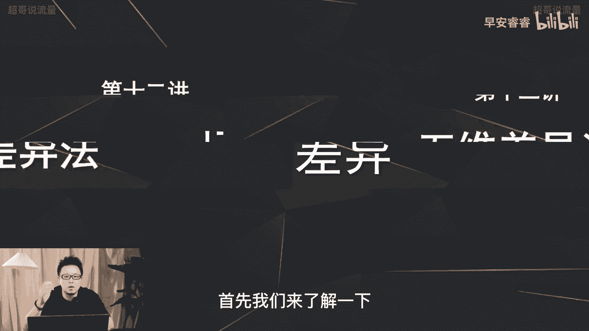
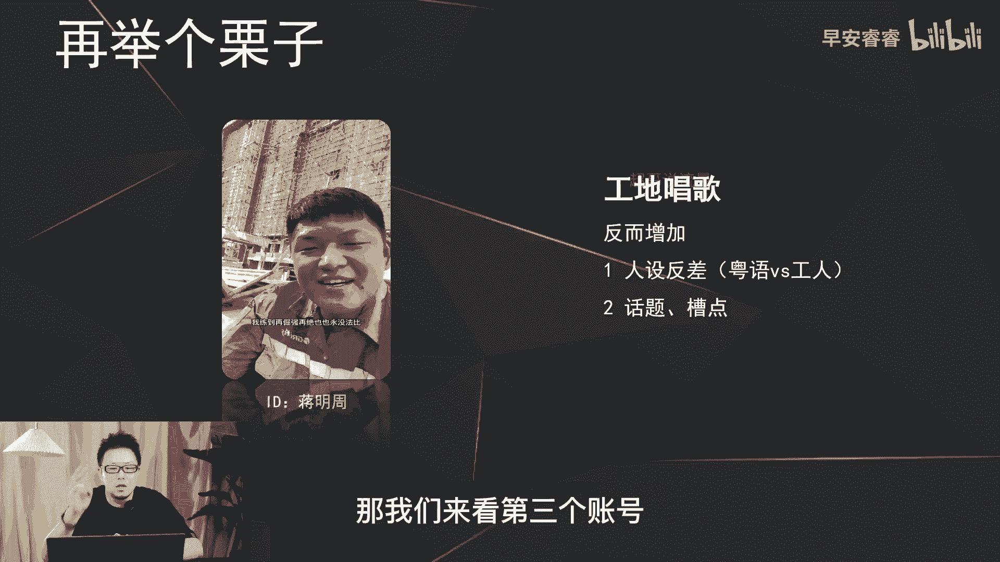
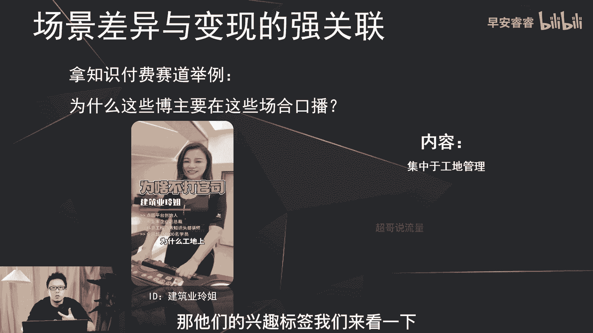

# 085 2023短视频起号·差异化定位课：0~1做懂抖音（定位+内容+投流+运营） - P12：第12节12 五维差异法（场景差异） - 早安睿睿 - BV1Am421T7br

啊今天我们来讲一下五维差异法里面的，场景差异怎么样去做，首先我们来了解一下什么叫做场景差异。

场景差异呢就是在每个赛道里面，我们以一些不常见的场景去作为载体，去做我们内容的输出，比如说在美食赛道，我们平时在家里面去做饭，那你跳脱出家庭厨房的这个环境之外，比如说在迪厅里面去做饭。

或者在教室里面去做饭，那你这个场景的差异化就构建出来了，那场景的差异，不仅让我们的账号会形成一个差异化，同时在这个场景之上，也会增加我们一些特定的人设的认知，包括一些内容的认知，比如说我刚才说了。

那你在教室里面去做饭，那你的人设，那难免就会塑造出教师的这样一个，人设的一个认知，那我们接下来看一下场景差异的一些案例。

首先呢我们先来看这个美食赛道的账号，培根日记，那这个账号呢他就是在车里面吃饭啊，他不是在家里面或者在餐厅里面去吃饭，那反而在车里的这个环境呢，第一增加了一些话题和槽点，很多用户会去吐槽或者会带来疑问。

他为什么会在车里面去吃饭，第二呢就是增加了沉浸式的体验啊，第三呢通过沉浸式的这种吃饭的这种形式，增加了一些治愈系的体验，所以说就是我刚才说的。

通过场景化的差异，同时还可以增加一些特定的人设。

或者是一些内容方面的认知，那我们接下来看第二个案例，那这个案例呢我之前在短视频里面有去分析过，他是在唱歌，赛道无天斗，再倔强再倔也也并没法比，那这个账号呢他是在工地里面去做唱歌。

他唱歌的这个环境也做了一些场景的一些处理，就一般我们看到的一些音乐达人，他要不然就是高大上的背景里面去唱歌，要不然就是在家里面去唱歌，那他走出来在工地里面去做唱歌，反而这个反差啊增加了这个账号的差异化。

那首先呢他在工地里面唱歌呢，增加了他这个人设的反差啊，就是在工地里面唱歌的这样一个人设的形象，但他反而唱的是粤语歌曲，就相对来说难度系数各方面还比较高，那这个人设的形象一下就拉出来了。

那反而呢增加了很多的话题和槽点，所以说这个账号呢，就是通过这个场景的差异化之后，让这个账号能够在这个音乐赛道里面突围而出，那我们来看第三个账号。

第三个案例呢是成都的一个账号啊，是一个美妆赛道的一个账号，乖乖那天我刷了个视频，才发现好多牌子都是欧莱雅旗下的哈，既然你平时抢不开，气，不出专柜盛装系列，支欧莱雅冲哈喽，也有美啥的小技巧吗，技巧的话。

你这个穿不像她看你变了手指，伤口也是不是交流，你的妆容怎么那么像啊，老师你鞋带散了，睫毛膏夹了刷这个账号是在美妆赛道，但是跟我们平时看到的，美妆赛道里面的场景都不一样。

美妆赛道的达人很多都是在家里面去呃，做化妆，甚至有一些可能会在办公室，那她呢是在每个化妆品的专柜去做蹭妆，然后专柜的这个导购现场去给他化妆，来突出这个产品的好坏，那它场景的差异呢。

就是体现在了化妆品的专柜去做化妆，那反而增加了话题和槽点，就很多用户会对这种场景啊会有一些疑问，会有一些嗯互动会去咨询他这个产品的好坏，那第二方面呢就是产品的实测。

就是他是在人家的专柜上面去实测这个化妆品，那反而呢会增加用户的猎奇心，会去以测评的这种心态去看这个产品。

到底的质量和效果到底怎么样，那刚才三个案例都是在场景上面去做了加法，去打造一些不同的场景，然后让这个账号能够突围而出，那你以为的场景差异化就是这么简单吗，就是我们可以天马行空的随便去想。

比如说我之前发的作品里面也有人会去说，那我能不能在厕所里面去吃饭，或者在操场上面去吃饭，是这样的话，场景是带来了一定的差异，更猎奇，但是我们的场景差异呢，要跟我们的变现去做强关联。

因为我们所做的所有的差异化，不管你是内容的差异还是场景的差异，最终都离不开我们想去变现的这个目的，所以说在这里要去赘述一点，就是我们不能为了差异化而差异化而做的，所有的差异化最终都要去反哺到我这个账号。

能够吸引到更精准的粉丝，通过更精准的粉丝模型给账号打上标签以后啊，从而能够让我的产品，或者能够让我的广告更加的精准的转化，产生变现，那我们来看一下场景差异怎么样去个变现，去做强关联。

这里拿一个知识付费的赛道去做啊，举例啊，我们来看一下这个口播博主，为什么要在这个场景去做口播内容的输出。

这个账号呢是建筑业玲姐，它的内容主要是讲啊工地管理，还有一些人情世故方面的内容，玲姐为什么工地上一旦发生拖欠工程款，很多包工头都不愿去打官司呢，几个原因，第一很多包工头老板不喜欢签合同干活。

那刚才说过这个账号呢，他是内容全部集中在工地管理，还有包括一些人情世故，那对于工程管理，工地管理，它的用户是哪些呢，主要是男性为主，而且都是一些，要不然就是一些包工头小老板。

要不然就是一些啊打工的这样一部分的，搬砖的工人，那他们的兴趣标签我们来看一下集中在哪里呢。

我们之前说过啊，第五节课时候说过，在巨量算数，你可以查找到每一个内容标签之下，用户的兴趣标签的分布，那这里可以看到呃，这一部分对工程感兴趣的用户，他们的兴趣标签集中到了这边啊，汽车，然后包括运动。

包括金融等等，就TGI就是渗透率都会比较高，那所以说那用户对于运动这个内容，相对来说兴趣浓度会比较高，那这个账号呢，它就是以运动的这种形式去做口播内容的输出，那所以说场景差异和变现的强关联体现在哪里。

就是你要考虑到你的消费人群是谁，然后这些人群还喜欢哪些内容，那你在这些内容之上，你怎么样去做场景差异化的植入，那我们接下来再去看一下另外一个案例。

来说一下到底怎么样去做，假设我们现在去起一个号，这个号呢是在母婴赛道，那这个账号的内容呢，主要是以口播的形式去做育儿知识的科普，那我们来考虑一下啊，目前育儿科普的这一部分的内容。

主要的啊这些博主的场景在哪里，有些博主呢是在教室里面去做育儿知识的科普，那有些博主呢是在家里面或者在办公室里面，一个纯色背景的形式去做育儿知识的科普，那目前我们先梳理就是常见的场景有哪些。

那差异化就是不要去做这些场景，那可以去做哪些场景呢，我们接着再来梳理第二部分，我们来梳理一下育儿科普类的内容，他的需求用户是谁，宝妈为主对吧，那我们接着再来第三步的梳理，那宝妈感兴趣的内容还有哪些。

那在抖音上面，宝妈喜欢看一些影视解说，那宝妈喜欢看一些美食教程啊，包括一些怎么变美穿搭，还有包括一些旅游风景等等，那根据这些宝妈感兴趣的内容，我们怎么样去做场景的差异化的植入呢。

那比如说我们在美食这个场景上面去做加法，那这个账号的场景差异化，就体现了，他可以在厨房里面边做饭，边口播的形式来带出来家庭教育，来带出来育儿科普类的内容，那整个梳理完以后。

你就更清楚你这个账号围绕你这个变现的需求，用户的兴趣标签，怎么样去做场景的差异化，这样的话你的账号才能做到精准的定位，就是你的粉丝会更加的精准，从而让你的账号能够做到高效的变现，这节课就到这里。

我是你们值得信赖，有问必答的超哥。