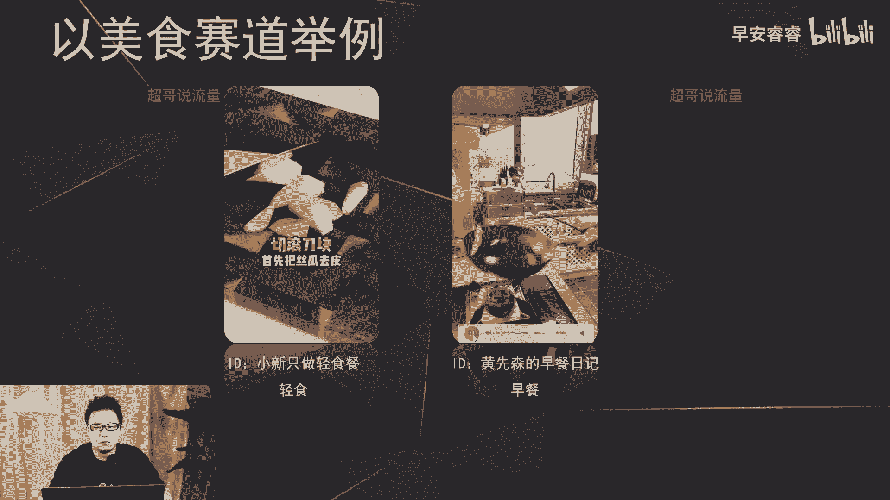

# 085 2023短视频起号·差异化定位课：0~1做懂抖音（定位+内容+投流+运营） - P13：第13节13 五维差异法（内容点差异） - 早安睿睿 - BV1Am421T7br

今天继续去讲五维差异法，我们今天去讲一下内容点怎么去做差异。

这首先我来解释一下什么叫做内容点的差异，内容点的话实际上很好理解，简单来说呢就是你做的东西不一样，那比如说在美食赛道，大部分的博主呢是在做家常菜的教程科普，那你可以去做什么。

比如说你可以去做冷饮或者去做一些减脂餐，那这样你做的东西不一样，那内容点的差异就出来了，那简单来说就是做的东西不一样，那复杂一点来说呢，就是展开来说的话，实际上就是在每个赛道里面，我们去做更细分的内容。

我们首先来举例。

你就更好理解，我们拿美食赛道来做六个案例的讲解，首先这个号小馋的料理，这个账号的所有视频内容呢，就是在讲甜品的教程啊。

就是在分享一些甜品，那再看第二个号，还在发入眼眸。

宝妈每天吹来在咿呀咿呀轻晃着，那第2号洪斌，他全部都是讲了调酒，那第三个号呢，他是泰国路边摊超级火的招牌饮品，蓝宝石泰奶，首先选渣男出品呢，他全部都是在分享一些创意音频。

那这三个号你就可以看到都是在美食赛道之下，但他们做的会更细分，他们分享的美食跟别人全都不一样，我们接下来来看第四个账号，好喝还能掉秤的低卡丝瓜鸡蛋汤。

正好适合这个季节，首先把丝瓜去皮切滚刀块放在那。

这个账号呢就是只分享减脂餐轻食，那这个账号呢就是只分享早餐在我的怀里。

最后一个账号呢他就是只分享创意菜，龙帅食堂，你们应该很多人刷到过节厨艺炫技，第二弹，广式五香脆皮烤五花，上一个视频上了全国大，所以这六个账号整体来看呢，就是他们都是在美食赛道，但是有些人做早餐。

有些人做轻食，有些人做冷饮，有些人做调酒，有些人做甜品，有些人做创意菜，就他们做的都不一样，所以就是说内容点的差异，就体现在了赛道之内的细分，就是你做的这个内容要在这个赛道之内更细分。

那为什么做到内容的细分，你就能够吸引到更多的粉丝呢，因为内容的细分代表了需求的细分，比如说有些人他这一段时间啊想去减肥，那可能他会聚焦在啊减脂的轻食上面，那有些人可能想去学习。

怎么样去做出来更多花样的早餐，那就会对号入座来关注你，那所以说内容的区分就是因为需求的细分，需求的细分的话啊，用户就会对号入座，找到适应匹配的账号去关注，那所以说你的粉丝就会更加的精准，更加的锤。

那我们接着来看一下其他账号的，他们的内容细分是怎么做的，比如说这个在游戏赛道的账号啊。

骨灰玩家陈二狗结婚4年，一共玩了31分钟，其中有20分钟在门口不敢进精神病院，别看我游玩了五小时，其实我五个小时都在汽车旁边犹豫要不要进去。

摄像机一开，我连看屏幕的勇气都没有了，游戏8分钟下线一辈子，这是一款无数玩家买了之后都不敢打开的游戏。

就算打开了，大多数人也只敢那陈二狗这个账号呢，他是在游戏赛道，但他不是做游戏解说，也不是去做大众游戏的一些试玩的体验，它主要是去分享一些steam的小众游戏，就是steam上面一些很高评分。

但是知名度很低的这一部分的小众游戏，他去做这一部分的小众游戏的种草，所以他是在游戏赛道里面做的更细分，他是走了一条很多人不会去走的这条路，能够让这个账号能够脱颖而出。

那接着来看第二个账号，他是在穿搭赛道，Hello，宝贝儿们，好久不见，今天想给大家分享一期夏末秋初的穿搭，第一件是一个咖色小衫，都会更浓郁一些，袖口有刺绣，它是那种特别软糯亲肤的料。

追上通过这个账号的名字，其实已经知道他是做这种梨形身材的穿搭种草，那所以说在穿搭里面，他没有去和那种身材很好的那些美女，去直面的竞争，她反而走了另外一条路啊，去走了呃。

这种梨形身材的这条细分的这个内容点。

然后去做差异化，那我们接着来看一下第三个账号阿武，我在我的首页作品里面也分享过，体会我的天真，我的愚，We can take our time time come of closer。

那阿武呢是在测评赛道，但是他主要是去测平价女装，就是50块钱到200块钱左右的这种女装，那所以说这三个账号呢，都是在一个大赛道里面去做的更细分，那他的这个账号才能够脱颖而出，因为我刚说过，他做的更细分。

就会有更细分的精准用户过来对号入座，能够支撑这个账号能够脱颖而出，能够支撑这个账号能够做出圈，那接着我们来看一下内容点差异，有什么前置条件，内容点差异呢实际上不是每个人都能够去做的。

因为刚才无论去说的阿武还是梨形身材，还是刚才说的那种骨灰玩家陈二狗，他们都需要一部分的经验沉淀，就是你在这一个细分赛道，你要有足够的经验沉淀，能够支撑你去做这件事情，因为如果比如说你不懂小众游戏。

你怎么去分享呢，比如说你不懂女装的面料或者材质，你怎么去做这个女装的评价测评呢，所以说内容点差异的前置条件，一定是你在某一个细分领域有足够的经验沉淀，你才能够去做这件事情，那接着我们来举例去说一下。

每个赛道他的细分点到底应该怎么样去做，怎么样去做差异，比如说在美妆赛道，你可以只去做口红的测评或者粉饼的测评，或者护肤品的种草，就是你只做这一类啊，你不会跟其他博主一样，什么都强，你只做这一类。

那比如说宠物赛道呢，你可以只做爬虫或者羊驼对吧，穿搭赛道呢，比如说你可以只去做JK的种草，或者说啊学生大牌平替的服装的种草啊，眼镜的种草，那再者在母婴赛道，你可以做玩具的种草。

或者说各个年龄段童装的测评和种草，梳理完之后，我们还是回到那句话，就是做了所有的差异，依旧不要忘了变现的这个目的，那内容呢我们是可以做的，细分做得更垂，但是依旧要去考虑。

你做这个细分点能不能够去最终的变现，那这地方要去考虑两个维度去判断这个账号，你做这个细分点能不能变现。

首先呢要去看它的内容空间大不大，那这里可以看到蓝色这根线的话，是减脂餐的内容的空间，那绿色这根线呢是西餐，那这里对比就可以看到，比如说如果在美食赛道，我既可以做西餐，我也可以做减脂餐的细分对吧。

但是这样对比出来，你就可以看到减脂餐无论在内容传播上面，还是在用户的搜索的需求上面，减脂餐都会比西餐大很多，总体来说那就是如果我要去做啊，这两个赛道的细分，那我一定会去做减脂餐，而不去做西餐。

因为西餐在这个平台上面，用户的需求和传播的能力都是相对有限的，那接着我们再来看用户的消费需求。

还是拿阿物去举例哦，有没有去考虑过阿吾为什么不去做男装的测评，对吧，他是一个男生，他为什么不去做男装的测评啊，还是回到那个点，女装和男装在抖音上面哪个品类会比较好卖，那肯定是前者女装。

那所以说你做的所有的细分内容的输出啊，一定不要忘了用户是谁，然后用户在这个平台上，有没有这种高频消费的这种体现，那总结下来，首先第一方面你所做的这个细分的内容点，他在抖音上面的声量如何啊。

传播好不好传播，然后用户的需求，搜索的需求够不够大，第二方面你所做的这个细分在抖音上面，目前的变现，就这个产品现在目前好不好卖啊，卖的多不多，如果不多，你去做目前来说的话，可能就是你是做出差异化了。

但是选择的时间点不对，那你的账号依旧没办法变现，所以说我们做的所有的差异，还是要围绕我们这个变现的目的。

那最后呢我们再去说一个案例，来看一下内容的差异点怎么样，通过调性的统一去给你这个账号去做加分。

那这里的话去举一个账号的案例，芳芳一人15个，我妈做的多了。

他没有人，我肯定会比人家做，你高考多。

那这里再来反推的看一下，那他做的是广东的煲汤对吧，那广东人喜欢听什么粤剧，那所以他这个视频，刚才我们听到背景音乐用的就是越剧，那接着再看这个封面的调性啊，就走的是最早的那种港片的那种冷色调啊。

以及这个视频也是冷色调，以及它的整个的呃语言都用的是粤语，所以说我们做了内容点的差异哈，也要结合我们用户的喜好，然后以及这个内容点本身，然后去做这个账号整体调性的统一啊。

比如说我们也会看到一些甜品类的账号，这个女生的声音呢就会比较的甜美，然后整个的滤镜啊也会做的比较的VLOG，偏甜美一点，然后他的所有的字体也会用的比较的卡哇伊，那做这些的目的的。

都是为了让这个账号的整个的形象更加的统一，能够吸引到的用户呢也会更加的精准，那所以说内容差一点啊，是很好去做调性统一的，你通过调性统一之后，你吸引的粉丝啊也会更加的精准，那这期就到这里。

我是你们有问必答，值得信赖的超哥。