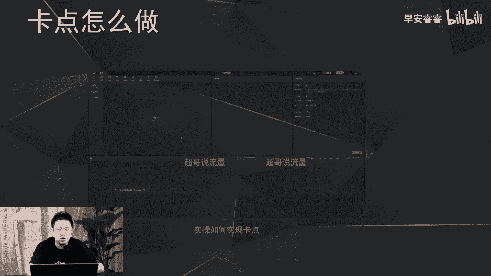
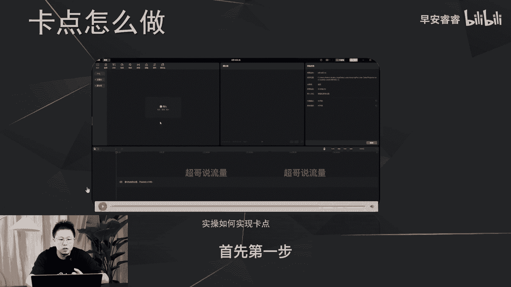
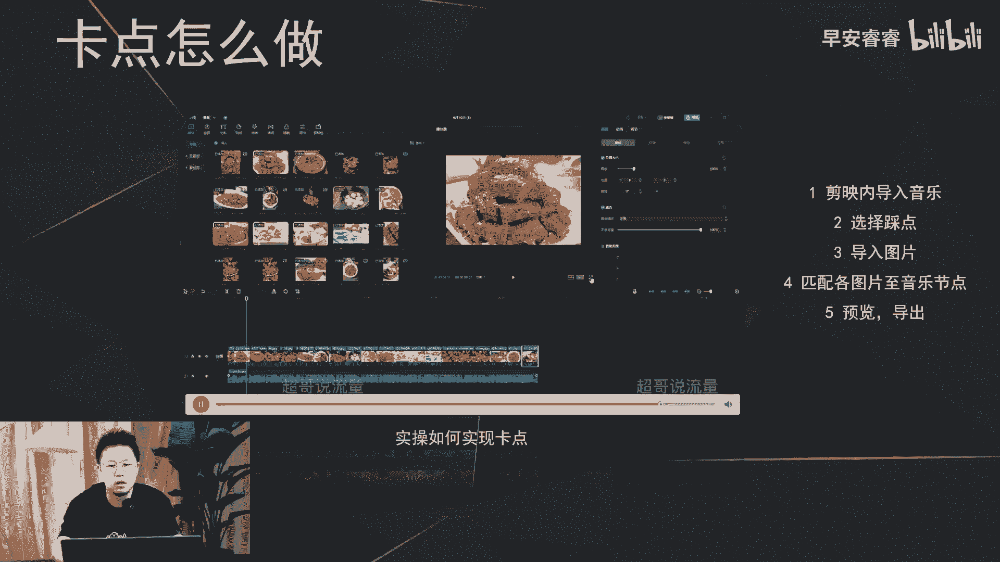
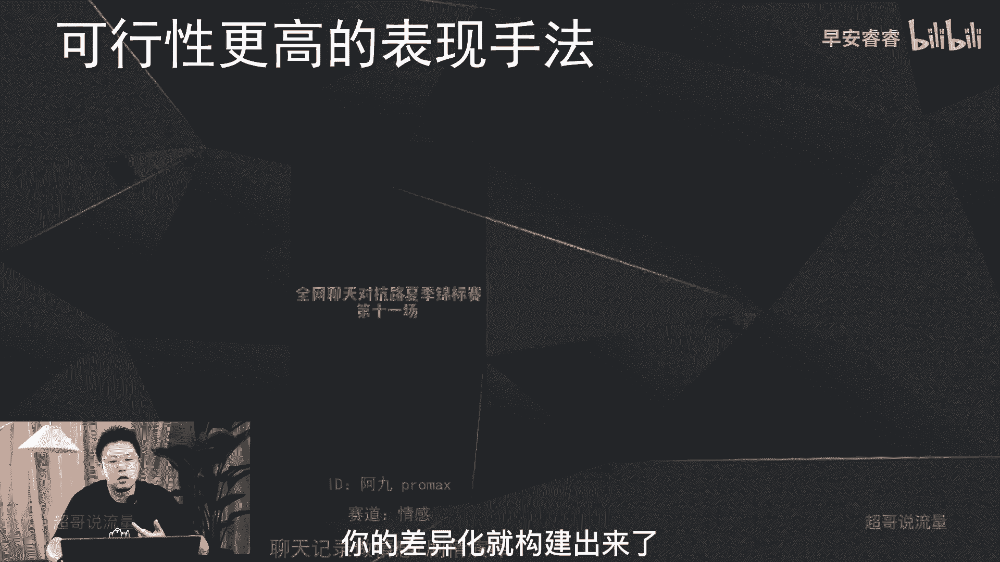

# 085 2023短视频起号·差异化定位课：0~1做懂抖音（定位+内容+投流+运营） - P14：第14节14 五维差异法（表现手法差异） - 早安睿睿 - BV1Am421T7br

今天我们继续讲五维差异法，在前面我们已经讲过了人设差异，场景差异，内容点的差异，那我们今天来到第四个差异，叫做表现手法的差异，那表现手法的差异呢，实际上相对来说有一定的技术含量。

所以我们这节课可以稍微的放松一下，我们主要是以一些案例的体验为主，首先我们来讲一下什么叫做表现手法的差异，那表现手法差异呢就是在你的视频过程中啊，无论你是以特效还是以音乐卡点。

还是一些不常见的其他的形式，然后去丰富观众，看你这条视频的一些感官的体验，那最常见的呢主要一处是一些绿幕啊，一些抠图，还有包括更高级一些会涉及到建模等等，那目前我们来看一下抖音上面剪辑。

现在目前做的最卷的两个号叫做男友朱铁雄。

女友柳叶希，我们先来看朱铁雄，谁都不许动，我这辈子就这点念想，好东西别糟践了，扔掉吧，老物件放那吃灰，看着糟心，我家房子里面像爷爷自己的造物一样，爷爷我来晚了，我爱我的我也深，就让水月成。

那我们再来看一下柳叶希，柳叶希，这是他第一条视频，应该很多人看过，Ok，可以睁眼了看，把你吓的哦，怎么什么都没有呢，现在我能看到的怪哎呀，你像这两个号呢都是以啊部分的绿幕，然后动画建模的这种形式去呈现。

整个的剪辑手法，呃，在目前抖音来说的话，相对来说做的比较的高精尖，后续的话我们在各个赛道都可以看到一些，更卷的呈现方法，这个目的啊，就是因为想在这个赛道里面脱颖而出啊，用一些表现手法的差异。

那我们看一些比较常见的这种呃特效的案例，像这个账号呢就是以new mode这种形式石大侠，然后他是美食赛道的账号哈，我的爱啊，救我救救我救啊，那其实这个账号呢，它主要就是以绿幕的这种形式去呈现。

整个手法的一个差异，那我们看一下，就是用户相对来说比较好做的。

这种表现手法的差异，那就是在音乐卡点上面，那我们先来看两个案例。

第一个账号是一个才艺赛道的一个账号，是以画画为主，Everything sucks，Just kidding，Everything is great，那看第二个账号。

这是目前最近这个月才出来的一个账号，阿文今天吃什么。

不关不关不关通关水关通关，想要抓住你的心，必须先抓住你，其实这两个账号的话，都是以这种卡点的方式去做整个的剪辑手法，那卡点这种方式来说的话相对会比较的接地气，新手上手来说的话会比较快。

那接下来我们来实操一下，像卡点的这种剪辑怎么样去做啊。

我们这边实操，然后录了个屏，我这边正好去讲解一下，首先啊，第一步就是你在剪映里面去导入一个音乐。

放到你的轨道里面，第二步的话就是在这里选择踩点啊，在这里刚才在这里选择踩点，选择踩点之后，其实你就可以看到这个黄色的点啊，就是他这个音乐的每个节点。

就已经自动读取出来了，就这个黄色的点，第三步就是导入你想放的图片，比如说美食的这些图对吧，然后一一的去匹配黄色的小节点，匹配完了以后预览，然后导出就实现了。

我刚说的这个音乐卡点的行为，咚咚咚这种方式呢相对来说比较简单哈。

在各个赛道都适用，所以这个的话相对来说，大家可以去实操去实践一下，那我们接着再来看哈，呃有没有一些其他可行性更高的表现手法，就是不常见。

但是还比较的更落地，更简单的，那我们来看一下之前我账号分析过这个号，R9pro max前往聊天日常路夏季锦标赛第11场，现在开始宝问你个问题，如果你有2万，你愿意都给我吗，好比赛开始，女方飞身一问。

2万豪图索将男方牢牢禁锢在原地，寸步难解，我当然愿意，南方政府开，索性直接将其手机，那这个账号呢它实际上是以聊天方式截图，再加上解说的这种形式去呈现情感，赛道的一个剧情演绎，就是我们平时做剧情。

很多都是以真人演绎去去做拍摄和剪辑嘛，但这个账号他是以聊天记录的这种方式，所以他这种形式呢相对来说也比较新颖，也很少见，后期的话在各个巨型赛道，实际上都可以去实践一下这种形式。

那接着的话这个账号其实就不用再看了。

冷知识的这种形式，他就是以简笔画的这种小人去做素材，然后去做知识科普，那所以说我们今天说了那么多哈，就剪辑手法或者说叫表现形式的差异。

就体现在了你的整个的视频给人的观感，跟别的账号会有一定的不同，那你的差异化就构建出来了。

无论你是做一些高难度的特效，还是我刚才说的比较好实现的卡点的特效，还有包括这种卡片小人，加上聊天记录的这种方式，实际上都可以去丰富你的整个的账号的，一个观感，那今天这节课呢就到这里。

我是你们值得信赖，有问必答的超哥。