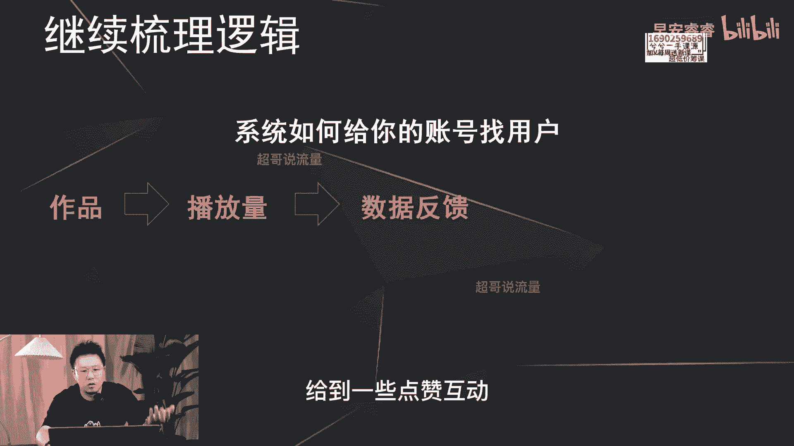
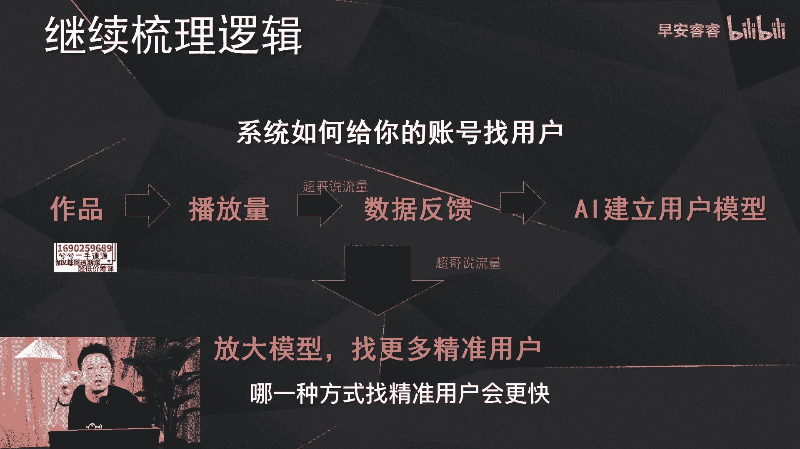
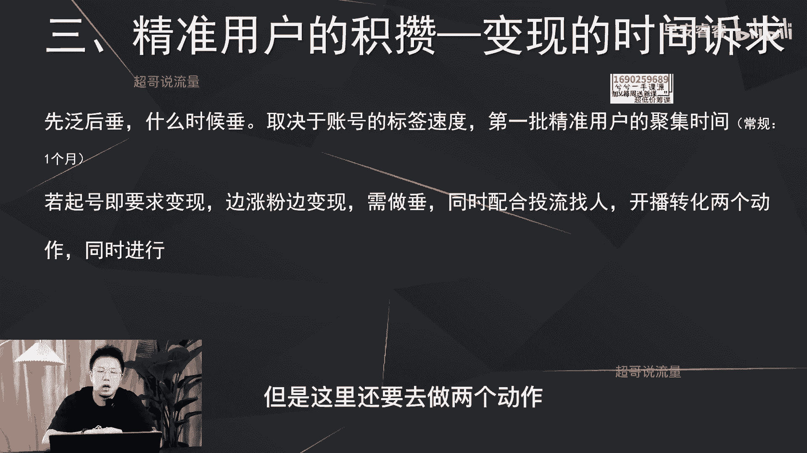
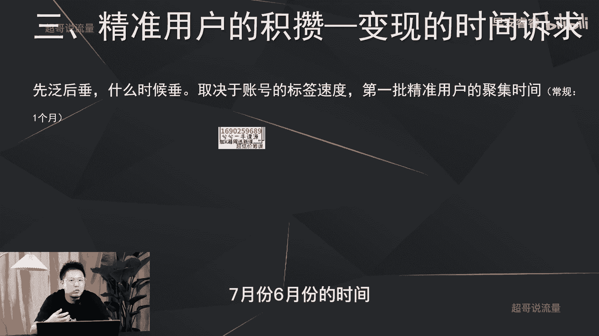

# 085 2023短视频起号·差异化定位课：0~1做懂抖音（定位+内容+投流+运营） - P16：第16节16 新手起号，做泛还是垂？ - 早安睿睿 - BV1Am421T7br

那我们前面的15节课主要是在讲抖音的逻辑，然后算法的逻辑怎么样去突破流量池，然后从哪些数据指标去看你这个账号，去判断这个账号流量池到底能做大还是做小，以及前面的六节课，我们去讲清楚了为什么要去做差异化。

以及怎么样去做差异化五种方式的演绎，那今天的话我们来进入到起号的阶段，首先来讲一个大众认知中都很在乎的一个点，就是我这个账号一开始的时候，到底是做饭还是做锤。

那我们先来看一下做饭和做锤的对比，我们再来判断到底应该怎么样去做。

那首先呢以流量逻辑我们去看一下。

就是你在这个赛道之内，你做饭一点的内容还是锤一点的内容，你能获取到更大的流量。

那这个的话显而易见，你做饭一点流量肯定会更大，你做垂一点流量肯定会更小，那第二个逻辑呢是占到用户的逻辑，就是你积累粉丝，积累用户的这个程度，去看到底应该是做饭还是做锤，那做饭呢用户肯定覆盖的就会更多。

那做锤呢相对来说覆盖的就会更少。

但是这里还会有一个问题，你做饭覆盖的诗更多，但是你面临到的竞争也就会更多。

因为做饭的账号肯定会更多嘛对吧，那我们再看第三个维度，就是从用户的质量去出发。

那这里去看啊，你做饭你吸引的粉丝相对来说肯定不精准。

那你做锤的话，你吸引的粉丝他的精准的匹配度肯定会更高。

那从这个逻辑上来说的话，是不是意味着做锤更好，但是我们作为新手起号。

我们要明白我们到底前期要的是什么，作为一个新手喜好。

你前期到底要的是高质量的用户，精准的用户，还是要的是让你的账号快速打上标签。

建立了用户的模型以后，从而让系统给你放大这个模型。

找到更多更精准的用户，这是两个逻辑。

那这两个呢它的终端都是要的是精准用户，高质量的用户。

但是它的通路逻辑是不一样的，第一种方式就是我上来就要精准用户。

可能我可以用头流去解决对吧，可能是特别好的内容去解决，第二种方式呢就是养号，我让我的账号先打上标签，然后建立了用户模型以后影响系统推流。

从而给我找到更多精准高效匹配的用户，那第一个逻辑直接找用户肯定会更快。

第二个先养号打标签，然后再去推流，再去找用户，肯定会相对慢一点。

但是我们的目标都是为了去做高质量。

用户的吸附，就是找精准的粉丝，那我们再来梳理一下到底是做饭还是做锤。

到底哪种方式能够让我们找到更多精准的用户。

刚才我说过这两种方式，乍一看来说话肯定是直接找用户。

QQ更快，对不对，那我们来梳理一下，再来看，首先我们来明白系统是怎么样给我们的账号。

去找用户的啊，他无非就是通过你发作品，然后产生了播放量。

吸引到了用户，给你这条作品给到一些点赞互动。

包括评论转发以及关注，然后有了这些数据反馈以后。

系统知道到底什么样的用户喜欢看你的作品，从而呢建立了这个用户的模型。

然后把这个模型放大在更大的流量池里面。

去大海捞针，去给你找更多这种匹配的用户，所以说整个的逻辑。

我在我的视频里面已经在反复的在说，就是这个逻辑，那我们按照这个逻辑再去梳理一下。

到底做饭和做锤哪一种方式找精准用户会更快。

首先我们来梳理一下，刚才已经说了哈，第一步你的作品要先有播放量。

那做饭的话肯定播放量会更大，做锤的话播放量相对会更小。

那播放量大就决定了什么，决定了你的互动数据就是点赞评论。

刚才那些我刚说的就肯定会更多。

那系统采集到的这种数据样本也就会更多，他才能够更快速的给你的账号建立，我刚才说的粉丝模型，用户画像模型，那做锤呢，因为播放量比较小，那他采取到的样本就评论。

转发互动以及关注这些肯定也会相对会更少，那所以说直接影响到的就是模型。

它建立的快和慢，就影响了你的账号标签的快和慢。

所以说建立标签快，那就意味着你激励精准用户就会更快，那建立标签慢，那就意味着你积累精准用户。

相对来说就会比较慢，所以啊那新手起号还是要去做饭。

然后去起号，我再举个例去说一下，那假设我先要起个律师的账号对吧。

那我内容到底是去讲律师怎么样去打官司，或者说你在呃入职过程中遇到了一些问题，怎么样去规避法律的风险。

我需要去讲这么锤，还是说换一个思路，我在这个律师赛道里面去选一些大的话题去讲。

比如说去讲离婚，去讲婚变，去讲这些用户感兴趣八卦的这些泛内容的点。

去支撑我这个账号的专业输出。

所以说我刚才说的这些就是这个意思，就是我一旦律师这个账号，我说的逻辑说的内容更泛，我的流量肯定会更大，采集到的用户数据就会更多，那账号的模型就会建立的更快，标签也会更快，那积累到的粉丝也就会更快。

但是如果我一开始会讲的很细分，讲的很专业，那讲的很小众的情况下，那我吸引的粉丝是比较的精准，但是我的量小的情况下，我的速度，我的吸粉速度，和我的账号的标签的速度会比较慢。

所以我这句话再重复一遍，新手起号一定要做饭，那还有三点不要忽视。

就是你可以做锤，但是建立在三个维度之下，首先第一点就是你可以用头流去积累粉丝。

就我刚才说的第一种方式就是你起号直接做锤。

然后去投流，然后去积累用户，但这种方式会有一个问题。

你有那么多成本去投流吗，因为目前来说，如果你没有好的作品的情况下。

而且你又是新手旗号的情况下，你投出来可能会达到三块钱，四块钱甚至十几块钱一个粉丝。

这样起号有必要吗，第二种方式可以做锤，就是你一定要有好的作品。

就目前各个赛道内容啊都已经被大家讲烂了啊，用户都已经没有新鲜感了。

有没有眼前一亮的那种观点啊，除非你是某一个领域的专家高手。

你持续的会有一些独特新颖的观点，但这里还有一个问题，你能够保持一直有比较高的这种独特观点。

输出的能力吗。

啊你能保持这个创造力吗，第二个到底什么观点叫新颖，什么观点叫独特啊。

这个东西没有评判标准，也只有你发了以后，通过数据才能反馈出来。

那所以说你看到很多的商业好，比如说张琪，他可以一上来就锤。

为什么，因为他的团队，博商这个MCN的这个团队的专业能力，在后面支撑。

所以说能够支撑这个账号一开始就去做锤，那第三种呢就是你账号一开始就想去变现。

或者说有个一两百粉丝。

就要开始去变现的情况下，那你可以一开始就去做锤，但是这里还要去做两个动作。

第一你配合投流去给你找更多的用户模型。

第二你要赶紧开直播，然后去进行转化，所以这第三种方式会用在哪里。

第三种方式会很常见的，在一些DP的一些一些直播账号，一些商家的直播账号，就是他在没有粉丝量的情况下直接开播啊，直接开始边卖东西，边找用户，边积累模型，边给系统建立标签，所以说刚才这所有三种啊。

都是针对于就是如果你想做锤的这个逻辑。

但我们再反过来去想一下，你们去看一下我这个账号，我在第一个月所有的作品都是以范逻辑。

我是以这种看一些其他案例，看八卦的这种形式。

然后去输出干货，但是从8月份这个月开始，你就会发现我的账号慢慢的干货多起来了，原因就是因为我在啊7月份6月份的时间。

就是先做饭的选题，然后建立到更大的粉丝的模型之后。

然后让系统给我匹配到更多的精准用户，但是现在目前有了那么多精准用户之后，我可以慢慢的把我的深度展开，说的更干更精准啊，这样的话我的用户的粉丝粘性才会更高，才会产生有效的转化，那具体怎么样。

新手起号的时候做到先犯后锤呢。

我后面两节课会具体的展开啊，那这节课我们就到这里。

我是你们有问必答，值得信赖的超哥。