# 085 2023短视频起号·差异化定位课：0~1做懂抖音（定位+内容+投流+运营） - P17：第17节17 内容选题，如何先泛后垂 - 早安睿睿 - BV1Am421T7br

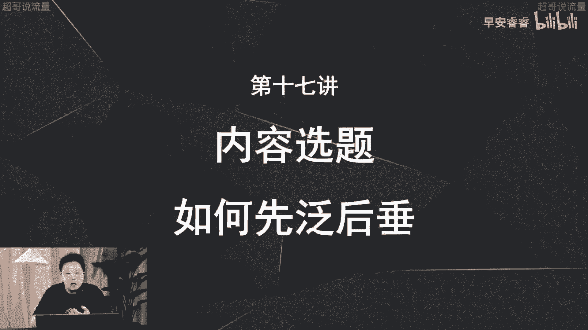

那上节课我们已经讲清楚了，新手起号啊，一定要先犯后吹，那这节课呢我们就来讲一下具体怎么样去做，那这其实还是有两个逻辑，首先第一个逻辑呢，就是在你的视频的呃铺排上面，比如说你会发十条作品。

那这十条作品里面你到底哪些做饭，哪些做锤比重到底是怎么样的，然后到底先怎么犯，再怎么锤这个东西，这是第一个逻辑，就是你的内容的整体的铺排上面，第二个呢就是你的每条视频结构里面，就一分钟的视频啊。

你的视频结构里面比如说前十秒怎么样，后十秒怎么样，就是这个视频结构上面怎么样先犯后锤，那首先这节课我们来先讲一下内容选题上面，怎么样做到先犯后吹。

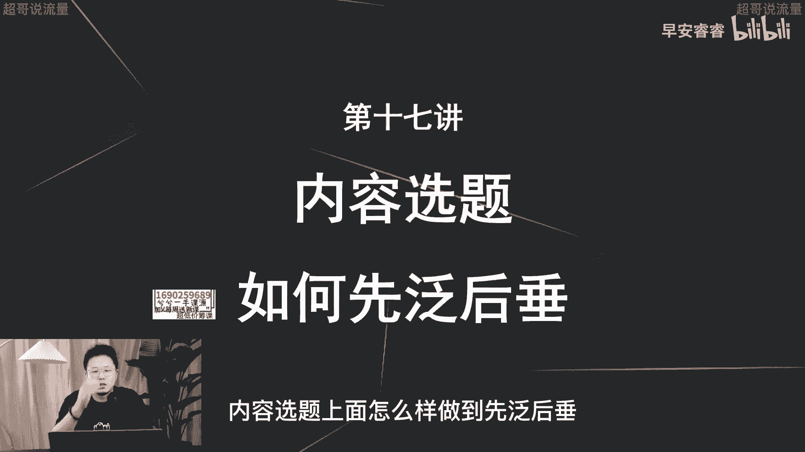

那首先我们要明确一个东西，就是我们做抖音啊，一定要深知有两个钩子，就是在你的每个视频和，以及在你的视频的内容选题上面，一定要做到两个钩子，两个钩子是什么意思呢，我们拿内容选题这一个逻辑先去说啊。

后面就是视频结构上面，我们放到下一节课再说，就是内容选题上面怎么样去设置两个钩子，就是我刚说的，比如说你的视频的前十条，怎么样去设置两个钩子，第一个钩子呢就是泛逻辑的钩子，就是吸引泛用户的钩子。

就是你这个视频啊，能够让大众，不管是男女老少都愿意把这条视频看完，这是泛的钩子，那锤的钩子是什么呢，锤的钩子啊，就是让你的精准用户能够把这条视频深度理解，看完甚至转粉。

那find的这个钩子呢刚就已经说过了，他实际上是为了做流量，就是你铺排十条作品，那你这个饭的视频他的目的就是为什么，他的目的就是为了支撑你这个账号，在起号阶段能够有爆款，能够突破5万，10万。

30万甚至100万的这样的流量池，能够快速给你这账号打上标签，积累第一波的精准用户，那锤的钩子是干嘛，吸引用户，就是做深度吸引用户，那简单来说我再重复一遍哈，就是比如说你这个账号前期会有十个作品。

那你可能里面要有7~8个作品，会去做得泛一点，这个目的就是为了让这八个作品去支撑流量，让你的账号能够快速的跑起来，那另外两条作品呢去做深度，深度的目的，就是为了让你这个账号能够有唯一性。

让人家觉得你这个人很牛逼，无论是做饭牛逼还是化妆牛逼，还是在某一个专业领域的见解，口播牛逼对吧，所以他才能够关注你，成为你的粉丝啊，那这两个钩子怎么样去设置呢。

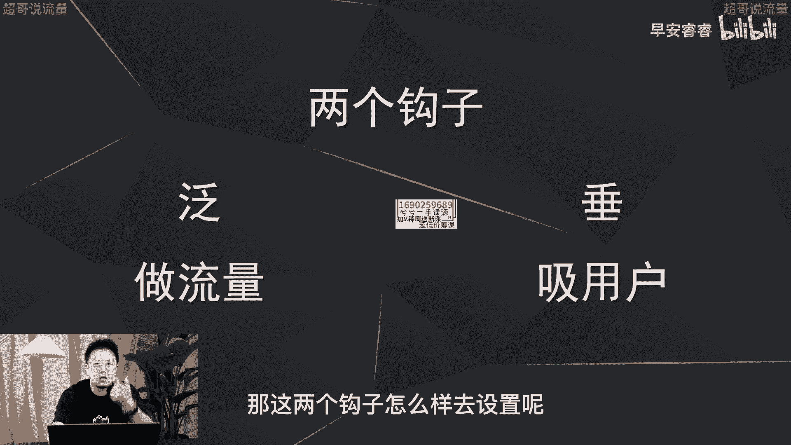

我们来看一个案例，那这个账号呢一本正经，你从他的简介里面其实就可以get到这个账号啊，它主要是去做呃审美或者讲动力，它实际上确切来说的话，他应该是在医美整形这个赛道，他就是通过这个账号去讲很多审美。

去讲一些变美的技巧，然后吸引很多爱美的呃女生，然后去呃导到私域里面，然后最终去做转化，所以它的内容整体都是围绕审美两个字，或者叫变美两个字，那我们看一下他的视频铺排，又是怎么样去做饭的。

这个钩子和锤的这个钩子。

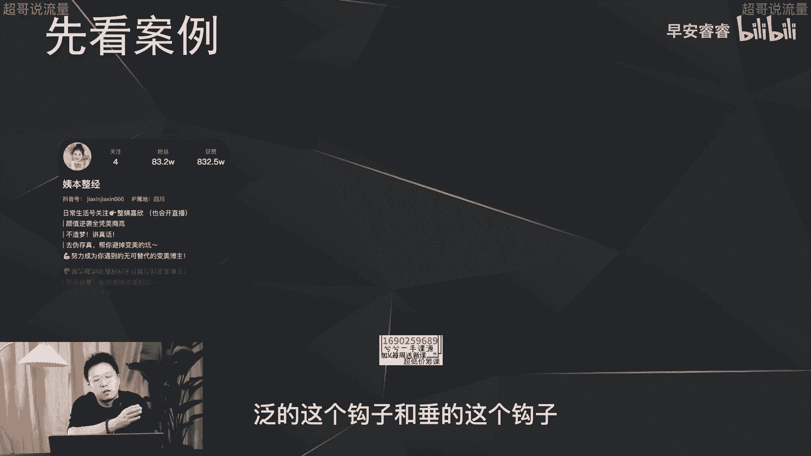

我们先来看一下犯的这条视频，为什么咱们的在韩务工女爱豆们，在国内未必出挑，但是在韩国却能大放异彩，其实核心原因就是造星方式这一块，中韩确实有巨大的差异，最直观并且典型的一点就是。

中韩对淡颜的审美力就完全不同，韩国对淡颜系的美女就是有种审美执念，他们喜欢鹅蛋一般的流畅小脸，喜欢那种面部未必立体，但是三庭比例抗打的亲和力，对水光肌呢都有着变态般的追求。

对于内双和塌鼻梁却有绝对的包容度，所以说为啥中村一叶一去韩国就风生水起，秀智允儿常年位居南韩颜值榜首。

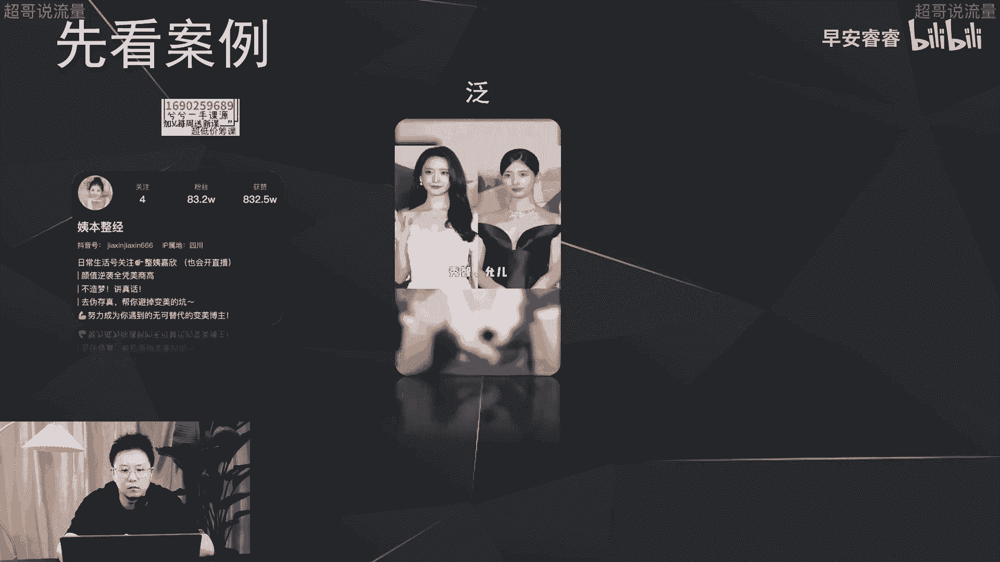

包括韩娱，你看从演员到歌手跟啊就到这里，我们看到这条视频哈，其实他的上来他不是去讲怎么样去动脸啊，怎么样去让你的脸更好看更精致，那他实际上先切的这个点呢，是为什么国内的部分的女明星在国内不吃香。

在韩国就很出彩，他通过这个选题想去抛出一个观念是什么呢，就是中韩的审美的差异，那就是回到了我刚才说的审美的那个观点上面，就是审美的那个内容的选题框架里面，那这条内容呢播放量就是200万。

那他选题的方向我刚已经说过，就是国内外的这种审美的对比，那它的受众呢你就可以考虑一下啊，就是第一就是想变美的女生对吧，她会好奇为什么哎这些女生在韩国很受欢迎，在国内就不行，他到底脸长成什么样了。

第二部分呢，像我这种吃瓜群众，因为他第一句话出来，就是为什么国内的女明星在韩国都很出挑，在国内不受，为什么咱们的在韩务工女爱豆呢，在国内未必出挑，但是在韩国却能对吧，就这句话，前面的十秒钟的这句话。

就吸引到了我这种吃瓜群众，我会以一个好奇八卦的这种心态去了解，到底是为什么，从而能够让我把这条视频看完，那他犯就是这样做，那我们再来看一下它锤的钩子的内容。

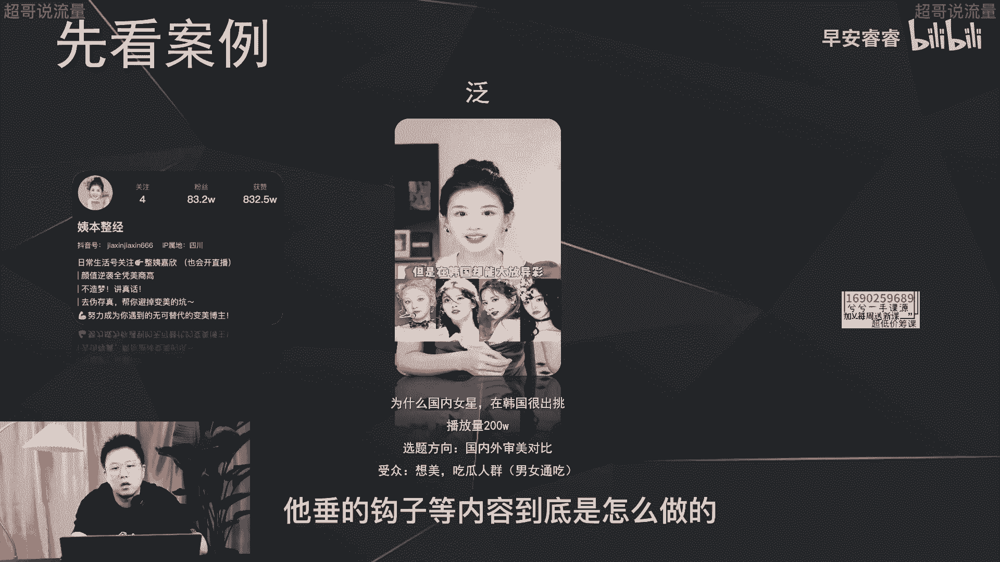

到底是怎么做的，普通女生想走拽姐酷GI路线的，都是学UN这套拽裤值拉满的宅女风，从甜妹到拽拽姐，于文文狠狠拿捏住了这波反差感，尤其是浪姐三里的妆，造一整个心动野性有风格，其实啊都是因为拿捏住了。

这按照首先从穿搭上想要拽裤一定的力量感受，你看这条视频，他的话题是什么，他的话题是说怎么像于文文一样拥有拽酷感啊，而且是说的女生，那这条播放量呢只有20万，为什么，因为他选题做的更垂了。

他的选题上来就是讲怎么样变拽酷，就是怎么样变美，因为她的受众就会很有限，第一方面啊，就是这种酷细的女生，就这种想变酷的这种女生去想变得更酷，更拽对吧，但他就看这条视频跟语文去学习嘛，你像我这种吃瓜群众。

这两个视频放到我面前，或者放在你面前，你肯定第一个视频他第一句话吸引你，你会好奇，然后想把这条视频看完，那第二条视频我不是女生，我也不想变转裤对吧，那我就直接划走了，所以说这个账号。

哪怕现在已经83万的粉丝了哦，做了两年多时间了，但是它的内容选题上面还是有范有锤，刚我说了泛的这个视频呢，为的就是目的去大流量去突破播放量，让锤的这个呢实际上就是为了去吸粉，让粉丝去因为觉得你够专业。

从而去关注你，然后去咨询你去转化。

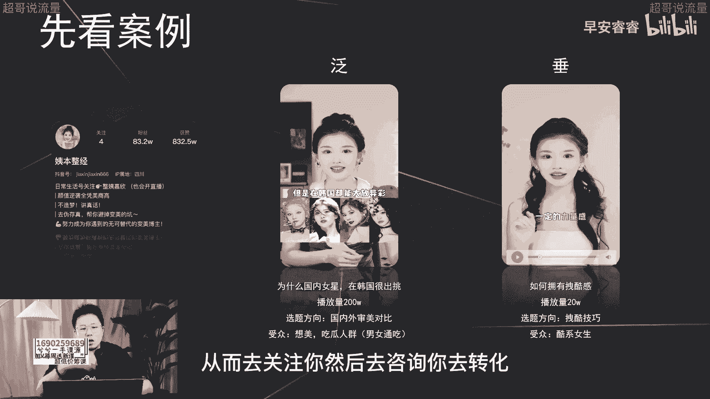

那我们再来举例看一下怎么样选题去做的饭，选题去做的锤，我们拿几个领域去举例去展开说一下，就会更明晰了啊，比如说我先要起一个号，要想去讲幼儿教育，那从泛的逻辑上，我的选题应该怎么样去做呢。

啊我上来就可以讲，为什么小孩都那么皮啊，因为这个话题，就是每家每户可能都会遇到的一个痛点啊，他会很泛，所以说我去做这样的内容选题，在我前期喜好来说的话，覆盖的流量一定会更广，那如果做锤会怎么做呢。

那我肯定就会讲很专业的去讲，如何培养小孩的自律，那这个的话如果我小孩很乖，或者我小孩儿只有两岁的，这个年龄跟我可能就不相关嘛对吧，那我这条视频就会划走，如果我现在要去做一个汽修的好啊。

就我们现在在合作的一个客户对吧，那如果从泛这个逻辑我会怎么讲，那从这个泛的选题我会去想，为什么宝马老是容易喜欢出事故，为什么理想这种车子为什么老是喜欢出事故，那如果从锤的逻辑上我会怎么想。

那就是小鹏怎么去做日常保养，那饭和锤其实你现在已经对比出来，饭相对来说会更广一点啊，他的逻辑会更广一点，锤呢更专业一点，更细分一点，更精确一点，那如果是美双赛道呢，我如果做饭的话。

我的选题应该怎么样去做，比如说我会去讲为什么这些网红红的这么快，然后在这个观点之下，我再去讲他们的美妆技巧是怎么样，那如果锤的话，我会去怎么讲，就直接上来讲讲如何美妆，所以这地方我举了三个例子以后。

你就可以直接的看得出来做饭应该怎么样去做，做锤怎么样去做。

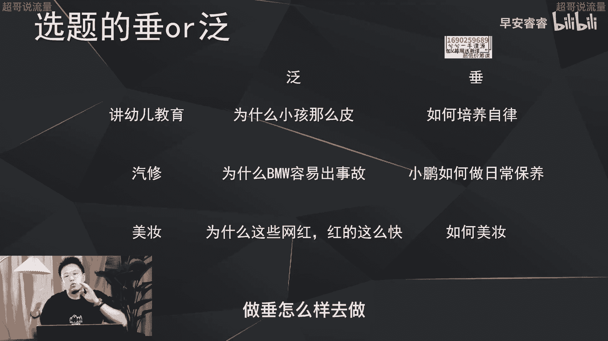

那我这里要提炼三点再去看一下哈，那如果想去做饭的话，第一点多说共性问题，就是每个赛道用户最关注的点，或者一些比较共性的痛点去展开说，那像刚才第一个案例就是这样的，就是我刚已经说过啊。

两岁的小孩不会遇到这种什么自律的问题啊，培养定性的问题啊，但是每家每户的小孩可能都会很调皮，所以这是一个共性问题，那第二个逻辑是什么，多说热点啊，因为热点就是流量啊，所以我刚说的。

比如说为什么宝马喜欢出车祸啊，然后理想容易出事故，都是因为在所有的车系里面，宝马热度肯定会高于小鹏对吧，那电动车逻辑来说的话，理想最近上了L9，它本身就是热点，它本身自带流量。

那所以说我去以这个热点去切入的话。

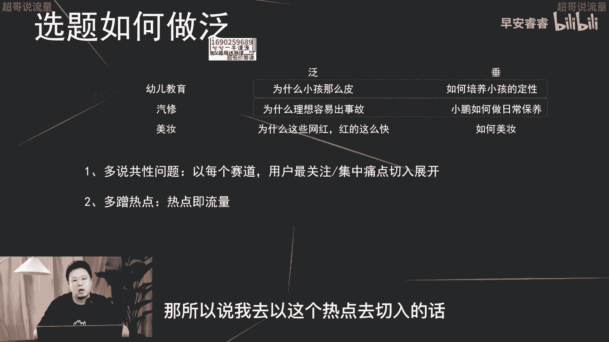

我的流量更容易做起来，第三个方法是什么，就是多说为什么少说怎么做，就刚刚那个一本正经，那个还有包括我刚这个美妆，这个你都可以看得出来，就是你要去满足用户的八卦猎奇的心理。

然后让他们以吃瓜的这种八卦的心态，去把你这条视频看完，然后在这个过程中再去输出技术的干货，而不是上来就跟你说怎么样去变拽裤，怎么样去做美妆，那到底什么时候做饭。

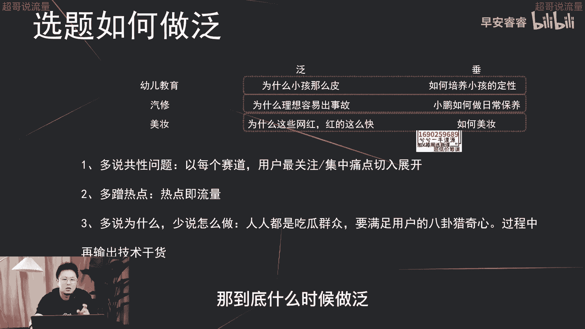

什么时候做锤呢，其实啊这个没有一个明确的，一定要在某一个时间，百分百做饭或者百分百做吹，而是它是根据你的时间周期的变化，去调整权重分配的啊，举个例子，比如说你在起号的前5~10条作品。

那应该来说你这一块的诉求主要是什么，主要是我前面已经说过，突破流量池，有更多的流量，有更多的数据反馈，从而让系统给你建立画像模型，然后让你系统获得更精准的推流，然后再吸引第一波的粉丝。

那这个阶段前5~10条作品的目的为什么，目的就是为了突破流量池，所以你就是去做饭，那你的分配上面可以80%的选题，在F的上面，20%的选题，在锤子上面去突出你的专业，和你这个账号的唯一性。

那在你的账号开始建立标签，就是你发了那么多作品，系统知道你是谁，慢慢再给你拉中这个兴趣标签的比例之后，你这一块儿可以60%做饭，40%做锤，然后当你有了第一波的用户，你的账号建立上标签以后。

你就可以把这个比例进一步的做调整，就是泛50锤50，那像刚才说过，那乙本正经，他现在基本上是四的饭啊，60的锤啊，就是这样一个比例啊，那这节课整体就是在讲你在内容选题上面，尤其在你喜好阶段。

内容选题上面到底怎么样去做饭，怎么样去做锤，以及这个比例怎样去分配啊，这样的话你就很清楚在新手起号阶段，你到底应该做什么样的事情是正确的好，那这节课就到这里。

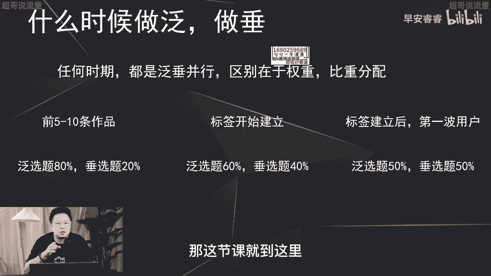

我是你们值得信赖，有问必答的超哥。