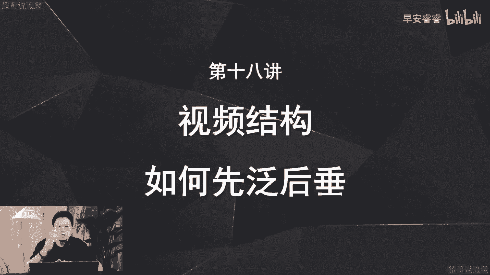
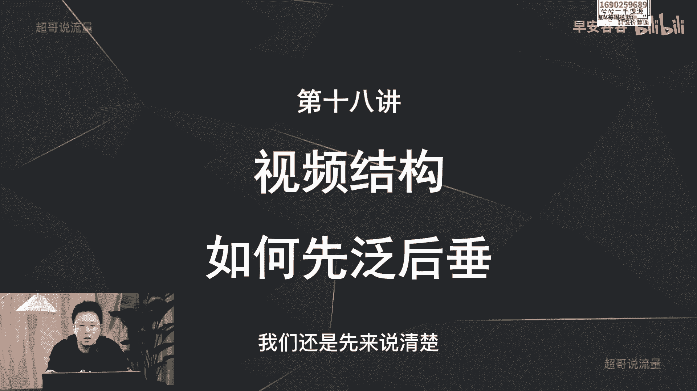
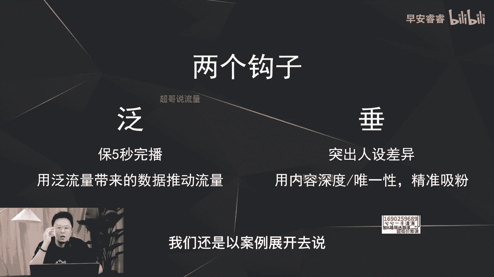
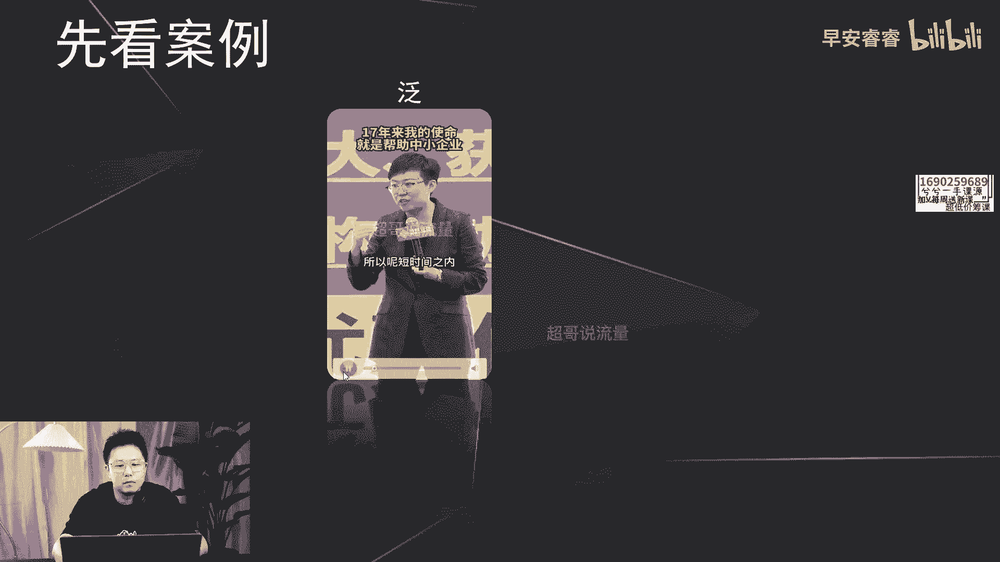
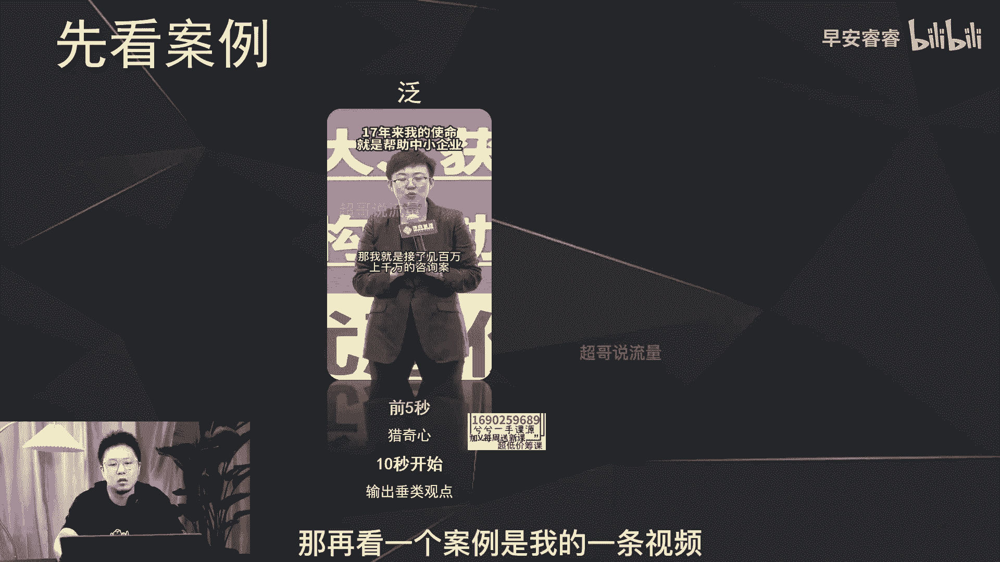
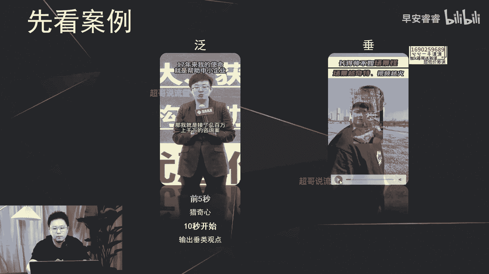
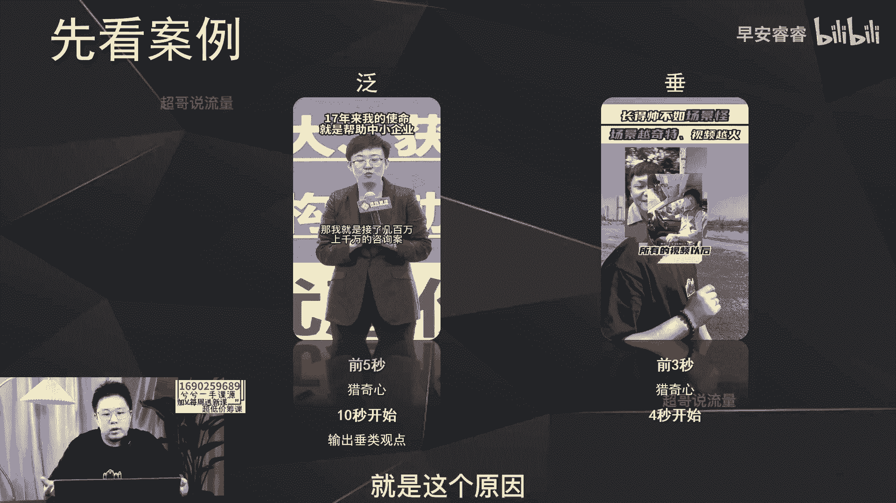
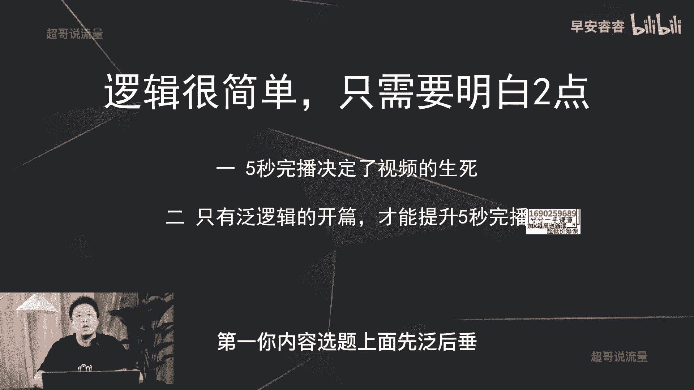
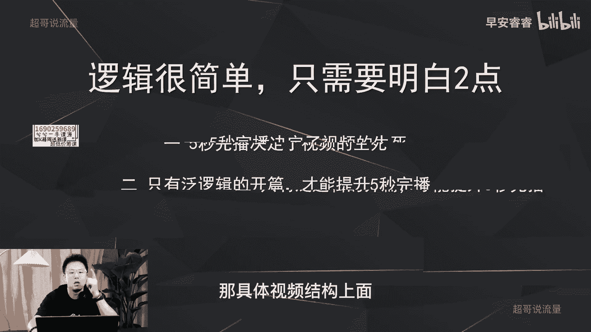
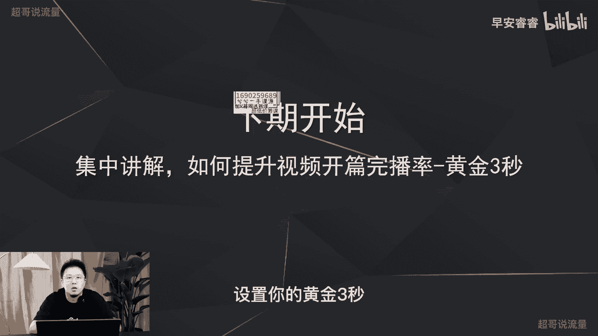

# 085 2023短视频起号·差异化定位课：0~1做懂抖音（定位+内容+投流+运营） - P18：第18节18 视频结构，如何先泛后垂 - 早安睿睿 - BV1Am421T7br

上节课我们已经讲清楚，在你的选题上面怎么做到先犯后垂，我上次说了，还有第二个逻辑，就是你每条视频结构上面，比如说60秒的视频，你怎么样能够做到先犯后锤，这个可能有点难懂哈，我们还是先来说清楚。

在视频结构上面怎么样去设置两个钩子，那第一个钩子呢还是泛的这个钩子，那第二个钩子就是锤的这个钩子啊，那先来看泛，那犯了这个钩子呢，首先目的是什么，就是保你前五秒的完播，我举例还是说一下吧。

就是比如说你这条视频60秒，你想去说一个锤的观点，比如说怎么样啊，提升你的气色对吧，那你的前五秒你不能上来就输出干货，说一怎么怎么样，二怎么怎么样，你要说一个大众的痛点去切入，或者一个反差的逻辑去切入。

然后能够吸引更多的人把你的前五秒看完，哪怕他没有这个提气色的这个需求，但是目的是为了什么，目的是为了让你的前五秒做的泛一点，然后去过五秒的完播，通过这个数据的提升之后，从而给你推动更大的流量池。

所以这个fat这个钩子在视频的结构上面来说，它的目的就是为了去过前五秒的完播，然后通过更大用户给你的五秒完播提起来之后，然后产生更多的互动数据，从而让你的视频推到更大的流量池。

让这个视频能够慢慢的起到更高的流量层级，那视频结构上面锤的逻辑，锤的作用是什么呢，跟之前说过的一样，它实际上的目的就只有一个，就是突出你的人设差异，打造唯一性之后去精准的吸粉啊，这地方我整体刷完以后。

我们还是以案例展开去说，你们更好理解。

那来看两个案例，第一个案例张琪的这个案例，前段时间有几个老板说要包养我，说几个人凑个几千万，先给我账户上打了，把我包了，感谢你们的信任，但是呢我有我的梦想，我的梦想就是期望能够帮到更多的人。

所以呢短时间之内。

张老师不会做客单价太高的服务，那我就那这条视频呢总共将近100秒，我们只需要看他前十秒钟啊，你就可以看到，那他前五秒说的是说的是很多大佬想去包养他，这个呢就满足了很多用户的猎奇心，无论是男女老少。

都会以吃瓜的这种心态把他前五秒看完，把他的五秒完播率给提起来，从而让他这个小视频能够有更大的流量推动，那他从第十秒开始再去说，锤的逻辑就是他想去帮助更多的中小企业成长，这就是我刚才说的两个钩子。

就你视频的结构上面，前十秒，前五秒就是以更泛的逻辑去吸引更多的用户，能够把你的前五秒看掉，把你的五秒完播拉起来，然后在你后半段，在你视频的第十秒开始再去说专业的输出，吸引更精准的粉丝。

因为我们每个人刷短视频都是一样，我之前说过很多次，我们刷短视频啊，前两秒不会划走，那这条视频大概率会把它刷完，会把它看完对吧，所以五秒重中之重，那再看一个案例，是我的一条视频。

都是唱歌的，为什么小鲜肉还比不过一个糙汉子，这个博主蒋明周，这一个月涨粉170万，我看到所有的视频以后啊。

到这里结束，你可以看到我视频的前三秒说的是什么，说的是一个小鲜肉，还比不过一个糙汉子，他有反差的逻辑，同时也满足了毕业期心，就很多用户会很好奇，他可能不知道我是一个知识博主，讲抖音干货的。

但是他会因为这个点吸引到他，然后产生他的练习心，然后从而把这条视频能够坚持看完，但是我是从第四秒开始才去说专业输出的东西，说他涨粉有多牛逼，场景差异化做的怎么好，会讲的比较的锤更细分一点，但是无所谓。

大家已经把我五秒完播给我拉上去了，那这条视频自然它的播放量就还好啊，这条视频现在目前跑了十几万的播放量，就是这个原因。

刚才举的这两个案例，其实你就很清楚了啊，就是为什么要先做饭后做锤，实际上就是两个逻辑，第一个逻辑五秒完播决定了一个视频的生死，那我们做这些的目的就是为了什么，就是用泛逻辑的开篇去提升五秒的完播率。

因为你上来就说细分，上来就说蒋明周差异化做的怎么怎么好，没有人听的，但是我用泛的逻辑去支撑视频的前五秒，提升五秒完播以后我才会有更大的流量，这是根本，所以说新手起号先做饭后做锤。

就体现了我这两节课说的两点，第一你内容选题上面先犯后锤。

以及你的视频结构上面先犯后锤，那具体视频结构上面怎么样去做到先犯后吹。

提高五秒完播率呢，我们从下节课啊，会集中的去讲解怎么样去设置你的黄金三秒啊。

那这节课就到这里，我是你们有问必答，值得信赖的超哥。