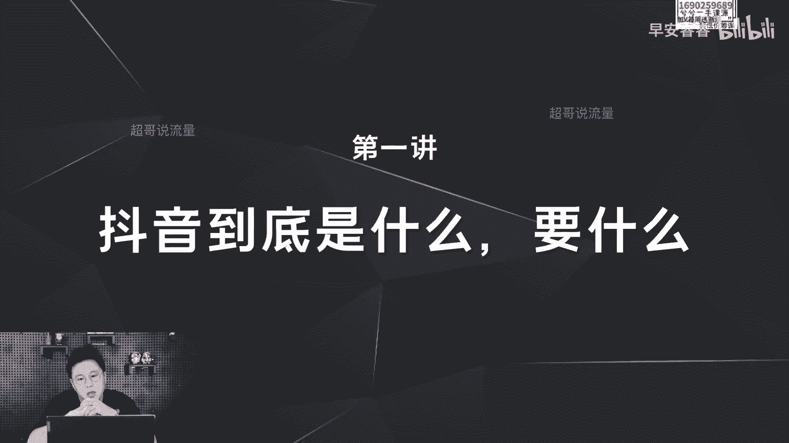
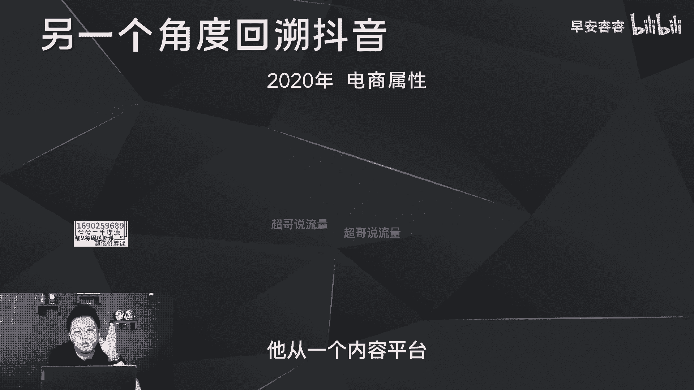

# 085 2023短视频起号·差异化定位课：0~1做懂抖音（定位+内容+投流+运营） - P1：第01节1 抖音到底是什么 - 早安睿睿 - BV1Am421T7br

大家好，我是超哥，欢迎大家来到我的课程分享，那在第一节课开始之前，我想先去跟大家聊一下，抖音到底是什么样一个平台，因为只有弄清楚抖音到底是什么，以及他想要什么，我们才可能把这件事情做得更加的良好。

那在开始之前，我们先来看一下，大众认知中的抖音到底是什么样一个平台，很多人知道他是一个短视频平台，然后也有很多人知道，他差不多现在有8亿的用户呃，除此之外，我们每天打开抖音无非就是两点。

第一方面觉得上面有很多好看好玩的内容，第二方面呢，我们在上面也会有一些垂类知识的获知，同时男生想到抖音会觉得上面有很多美女，女生想到抖音会觉得上面有很多美食，但是我身边也有很多朋友。

觉得这个平台相对比较的恶趣味一点啊，会把这个平台卸载掉，但是对我来说呢，我觉得这个平台反而是一个消磨时间的利器，像我平时在吃饭的时候就会打开抖音，一方面呢消磨时间，一方面呢也去看看这个平台上面。

有没有一些新的好玩的内容。

那你以为的抖音真的就是这样吗，那我们在了解抖音之前，我们首先要去回顾它的整个的发展史，只有搞清楚抖音的整个进化历程之后，我们才能更清楚这个平台到底是什么样，一个平台，那回到16年到17年。

抖音刚上线的时候，它实际上是一个偏娱乐属性的平台，为什么这样说呢，因为在16年一七年抖音上面比较火的内容啊，都是这样的内容，比如说左边这种跳舞的视频，再比如说像右边这种卡点特效的视频，那在16年一七年。

抖音实际上做娱乐平台，他要的东西就是一个就是用户至上，就是在刚上线以后，他需要去积攒第一波的用户，无论是创作者还是使用者，那积攒用户最快的方式，那就是偏娱乐的属性，我们平时在这些平台会有看颜值。

主播或者游戏直播的这样内容，那在16年一七年，这样内容在抖音上面也可以看见，那到了18年一九年呢，抖音又构建了它内容的广度，成为了一个内容平台啊，为什么会说是一个内容的平台，因为在18年之前。

抖音在我们心目中的形象，可能还是一个娱乐平台，上面只有娱乐这一个类别的内容，所以在18年开始，抖音去扶持了各个垂类内容的流量啊，也是在这个时间段，各个垂类的天花板都是在这个时间起的号。

比如说左边的噗噗唧唧美食赛道天花板，以及右边的美妆达人啊，也是之前的直播一哥，他们的第一条作品都是从18年11月开始的，也是我们现在目前看到各个垂类赛道的天花板，他们的起号时间都是在18年的下半年。

所以说在18年一九年，如果你去做各个垂类内容的话，实际上起号是很好起的，因为给到你了很大的流量扶持，因为在当时抖音要的是什么，抖音要的是内容至上，他又要的是细分赛道。

他要的是各个细分赛道垂类内容的补充啊，因为在当时来说的话，他希望我们去养成第二个习惯，就是我们平时在这些平台上面，有去看一些美食教程也好，或者说数码测评也好，那在1819年，其实这些内容的话。

在抖音上面也开始不断的呈现，所以说在18年一九年。

抖音是一个内容向上的一个原则，嗯那积累了第一波用户之后，那到了2020年抖音他需要的是什么，他需要的是把第一波用户接近4亿用户转化，那转化的最快方式是什么，就是电商，无论是做直播还是卖货。

所以说到了2020年，它从一个内容平台。

又变成了一个电商属性的平台，在2020年一季度开始，无论是罗永浩还是薇娅，都开始在这个平台上面去做直播，卖货的这个动作，那因为在当时来说的话，这个平台要的是什么，平台要的是变现，平台要的是卖货。

所以当时这个平台让我们养成了第三个习惯，第三个习惯就是很多达人会在某猫，某宝上面去做直播带货的这个行为，那在20年他们开始在抖音上面去做，因为抖音会有更大的用户基础。

那包括我们平时会在这些平台会去买东西，那到了2020年，也可以在抖音这个平台上面去购买东西，满足了我们这一块的消费需求，所以说16年到20年，它不光是第一波用户的积攒，同时也实现了娱乐平台到内容平台。

再到电商平台的这样一个转化，那到了去年，那抖音要的是什么，抖音去年他实际上做了很多的动作，很多的战略部署其实目的只有一个。

就是增加用户的停留时长，那用户时长从哪里来，这展开来说，像我平时每天在手机上面的时间会有七个小时，其中四个小时可能是在抖音，另外三个小时呢可能就是在这些app，那在去年抖音做了一系列的战略部署。

实际上就是为了去稀释我们在其他app上面的，停留时间，比如说本地生活，它实际上就是为了让我们去养成，在这个平台上面，去满足本地消费目的地查找的这样一个需求，那新农人计划呢就是和某手去竞争用户，一方面呢。

让很多的创作者可以到抖音上面来发，三农的内容，你会获得更大的流量，更大的用户基数，粉丝基数，第二方面呢，很多的观看者，不仅可以在某手上面看到这些内容，那在抖音上面也可以看到这些内容。

所以说新农人计划的目的，就是为了去对标这个平台，包括去年上半年推出的中视频伙伴计划啊，他扶持的就是口播类的知识博主，各个垂类的知识博主，在抖音上面以横屏的视频为载体，然后发布一分钟以上的视频。

根据播放量都会有一定的奖金收益，那它对标的就是模糊，所以说抖音在去年包括去年的下半年到现在，实际上他做的这一切的事情。

都是为了去跟各个的app去抢我们的停留时长。

比如说短剧计划对标的是爱优腾，然后图文计划对标的是某书啊，搜索对标的是某度。

以及上个月抖音拿下了今年世界杯的转播权，他希望去稀释我们在电视这一块的停留市场。

那整个打总完之后呢，其实我们明白了抖音现在要的东西是什么，抖音首先在用户这一块他已经没有突破空间了，所以说增长用户一定不是它最主要的核心诉求，那他要的诉求是什么，一方面呢，突破用户的停留时长。

就是让我们平时刷一个小时的抖音的习惯，变成了刷四个小时，那增加了这三个小时在哪里来，就是你平时在其他app可以满足的一些内容需求，消费需求，在抖音上面也能满足，所以得出来结论就是。

今年谁的内容让用户的贡献时长更久，那自然你的流量也就会更好，这个多说一点，简单来说，我如果发出来的一条视频，它的播放时长会比较久，它的完播也会比较高，那自然他的流量也会更好，那第二个逻辑是什么。

第二个逻辑呢你不要忽视它的互动值，尤其是转粉转主页，访问转分享转收藏，这些数值也会影响你的流量，为什么，因为这些数值，它的背后核心也是增加了停留市场，那刚说完第一方面以后，我们再来看第二方面是什么。

第二方面就是变现，今年谁的变现模式，谁的变现手段更丰富，让平台赚到更多的钱，那自然你的账号的扶持也就会更大。

所以我们今年要做抖音的话，要注意的是什么，实际上也是这两点，就是要做出来好的内容，以及要做出来丰富高效的变现模式。

变现手段好，今天这节课到里。