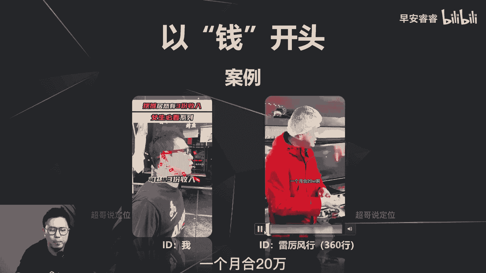
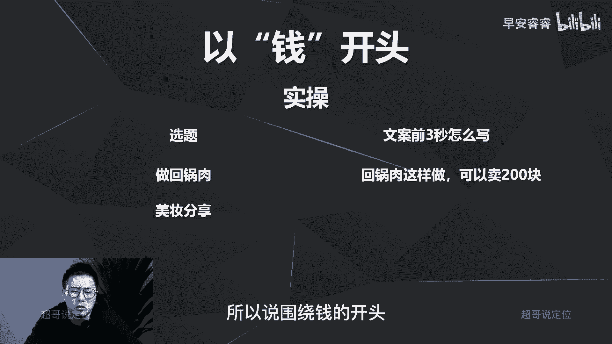

# 085 2023短视频起号·差异化定位课：0~1做懂抖音（定位+内容+投流+运营） - P20：第20节20 黄金三秒如何设计（1） - 早安睿睿 - BV1Am421T7br

那今天这节课我们进入正题，来讲一下怎么样去优化你视频脚本的前三秒。

那首先第一个方式是哪种呢，第一个方式就是你的视频前三秒，去切人性的底层欲望啊，人性的底层欲望有哪些呢。

首先我们先来看一下啊，人性的底层欲望，最基础的贪，就是，每个人都希望用最小的成本去获得更大的利益，对吧，这是第一个贪，那第二个呢就是色，每个人都是好色之徒对吧，第三个呢懒就每个人都不想动嗯，就希望躺平。

然后也能赚大钱，第四个呢钱就是跟钱相关的，也就意味着这四点，你放到视频开头的第一句话去，然后就能够激发他的底层欲望，从而让他能够把这条视频带着猎奇心去看完，那接下来这四点我们分别怎么样去做。

以及怎么样去实操案例分析。

我们来接着一个一个的去讲一下，那首先第一个贪，那以贪开头呢，就是让这个观看者让用户觉得呀，可以很简单就把这件事情完成了。

然后可以获得高于预期的收获，那我们先来看一下。

以贪开头的案例究竟是怎么样的，那第一个案例呢是黄霄的这个视频，我们每个视频就只看前五秒啊，如何成为一个国际超模。

今天要拍的是bef st laura。

好，第二个案例再看一下，如何能够快速提升你的跑步速度，增强你的耐力，今天分享一个吉普小哥也在使用的。

经典跑步训练法，所以你看这两个案例，第一个是说如何成为国际超模，那对于很多女生来说的话，成为明星，成为超模都是他们的一个梦想啊，相对来说是一个可能，相对有一点不着边际的梦想。

那第二个呢就是怎么样提升你的跑步效率，那这两个视频的开篇呢，都是给到你一个较大的期待，然后去引导你，接着把他视频看完，去讲，第一步，第二步，第三步怎么样去做，能够满足这个梦想的实现。

那接着我们来看一下，以贪开头到底要怎么样去做，第一个呢就是梳理你这个选题的目标对象，他的痛点是什么，需求是什么，这句话什么意思呢，比如说你先要去做一个美妆的分享，那你去梳理一下。

你要去呃分享了这个美白的护肤品，它的用户就是他的女生，他的痛点可能是比较啊易黑体质嘛，那需求点就是希望变白嘛，你把这个点先梳理出来，梳理出来以后把这个美白包装成是相对简单，可以随手可做。

而且就可以实现的，那这样的话才能够激发他，把你的视频整条去看完，那我们来实操一下，以贪开头怎么样去做，那还是三个案例，第一个案例呢就是做回锅肉这个逻辑啊，做回锅肉相对的看上去平平无奇。

那我前三秒怎么样去写，能够让宝妈能够把这条视频看完呢，我可以写成什么呢，就是简单一招就能够让回锅肉肥而不腻啊。

刚才说过怎么样去做梳理过哈，那回锅肉的痛点是什么，那回锅肉这个菜的话，很多人痛点是觉得太腻了对吧，所以我一定要去说，就是肥而不腻，第二呢就是刚才说的简单随手可做。

所以我会写出来，就是简单一招就能够让回锅肉肥而不腻，那看第二个案例呢，如果是一个美妆分享，刚才已经分享过和美白对吧，那一样的，轻轻松松就可以告别这个黑头的烦恼，那也是痛点，就是啊黑头。

那我一定要表现出来，就是我可以很轻松的教你一个方法，就可以把这个问题给解决掉啊，满足你贪的这个欲望，第三个案例呢，如果我们要去做一个汽车的种草，那我可以写不到20万，就可以享受劳斯莱斯的驾驶体验。

那也可以让很多意向买车的用户觉得唉，我可以花到那么小的成本的情况下，就可以获得一个啊，这么好的一个豪车的一个驾驶体验，我从而把整个视频看完，所以说刚才说了，贪的逻辑，就是你要去简单地表述出。

他可以把他的这个痛点或者需求点给解决掉。

那我们来看第二个底层欲望，那第二个底层虚化呢就是色。

就是你的画面呀要，或者说你的文案让人能够有YY的空间。

那我们接着还来先看一下案例啊，先来看两个案例，第一个案例呢就是大家很常见的这种啊。

变装跳舞的案例，It's all about your money。

都有jingle，Jingle，It b like to see you，那第二个案例呢就是一个口播案例，你想知道高段位的渣男都是怎么撩妹的吗，这是我想看吧，第一个它会通过画面的元素让我有YY的空间。

那第二个他是用文案的这种技巧，然后让我去想把这条视频听完。

怎么样去撩妹对吧，所以说怎么做啊。

以色开头怎么样去做呢，第一就是你的开篇啊，文案要去突出，怎么样去俘获芳心，怎么样去搞定一个妹子，怎么去搞定帅哥，第二呢就是画面的前三秒，去植入一些相关的元素，比如说美腿啦，丝袜啦，肌肉啦等等等等等等。

那我们接着还是用刚才的回锅肉的分享，然后美妆的分享以及汽车车型的分享，三个案例去看一下，以色开头怎么样去写这个文案，回顾了这个文案呢，我就会写通过这个回锅肉的做法，我让我的女神终于答应了我。

那就会吸引很多的啊，爷们儿就会想去学啊，到底是你做的这道菜到底是怎么样好吃，能够让你的女神终于能够啊答应你对吧，那第二个美妆的分享啊，我就可以写七夕把这个口红送给小姐姐，没有一个小姐姐能拒绝啊。

也是一样的，那这对于一个男生，尤其在七夕前后，情人节前后来说的话，我可能就会把这条视频看完，我想去看一下，我可能正头疼礼物，不知道怎么样去选，怎么样去搞定我心仪的妹子，那看到这条视频。

从而会让我把整条视频看完，那车呢也是一样，这款五菱宏光小姐姐的最爱，那就会影响我去看啊，到底为什么小姐姐会喜欢这辆车子，我怎么样可以去送给我小姐姐去俘获她的芳心，所以以色字开头其实相对比较简单。

要不然你在文案的前三秒去写，怎么样搞定一个妹子，怎么样去去去搞定一个帅哥，怎么怎么样，要不然就是在画面的元素里面，去植入一些跟这些擦边相关的元素和画面。

那我们接着来看第三个底层欲望，那就是懒懒呢，实际上就是要去表达他不需要去费力气啊，也可以把这个目标给实现，那我们还是一样。

先来看案例，那看一下这个口播案例，在家就葛优躺，零食饮料停不下来，疯狂刷帅哥，能坐着绝不站着，能躺着绝不坐着。

就这样还能保持身材，那你可以看他前十秒他说的是什么，再加葛优躺，还可以保持身材的方法，那对于很多女生来说。

她就会想把这条视频看完，因为戳到她痛点，她们确实很懒，不想动，但是又不想吃胖对吧。

那这个怎么做呢，就是你在你的视频的前十秒区写出来，就是小付出K大收获啊，小付出K大收获，那还是用那三个案例，我们来举例，看一下这个以懒开头案例要怎么样去写，那还是回锅肉，那回锅肉我就可以写成什么。

就是简单不复杂的回锅肉，五星级饭店的回锅肉的教程分享啊，那宝妈一听就简单不复杂，或者我可以再细化一点，比如说只需2分钟就可以学会啊，只需三步就可以完成，就你让人家感觉啊这件事好简单好简单，不用怎么动手。

不用怎么动脑子，都可以去完成这件事情，那美霜呢也是一样，就是每天一分钟可以实现轻松换脸啊，就是你的容貌可以升级啊，每天一分钟对吧，小姐姐化个妆再卸个妆，每天至少就是啊四五十分钟过去了。

那一分钟对他来说的话，这个时间成本他就会觉得很轻松，轻而易举，那车子这个呢就可以写，不需要奋斗，也可以闭眼入的几款车型推荐啊，那我一听对吧，我就是不需要奋斗，我我就躺平就可以。

我也可以买车，那我就会想把这条视频看完，所以以懒的开头，刚才说过，就是你在你的视频开篇啊，要去让他有意向啊，就是小付出很大的收入啊。

这个目标很轻松就可以去完成啊，甚至连身子都不用动。

那我们再来看第四个欲望，第四个欲望就是跟钱相关，那实际上就是很简单，构建一个美好的愿景，就是可以跟着我一块搞大钱，或者我教你一个搞钱的方法。

那我们还是一样，先来看案例，那左边这个案例呢是我之前的一条视频。

你去摆摊卖小吃吗，可以搞三份收入对吧，我这条实际上是想说什么，是想说拍美食摆摊啊，也是一个很好的起号思路，我的核心思想是这个，但是我是为了去做前三秒的设计，去戳人性的底层欲望，关于钱的。

所以我去说的就是搞三倍收入，那很多人就会觉得摆摊只能赚一份钱对吧，我想说赚三份钱，他就会觉得这件事情很有期待，所以这条视频最后能跑到，将近40多万的播放量啊，就是因为前三秒的设计。

那接着再来看一个案例，一年200多万，一个月合20万啊，干啥挣钱。

第二种案例呢相对也比较常见，就是在前面直接说钱啊，说钱，而且这个钱的数字呢，相对来说会比较容易引起猎奇心或者说反差。

那怎么做呢，怎么做，就是在你的视频的前几秒先直入主题，就说怎么样可以搞到钱啊，怎么样可以搞到钱，第二呢突出反差就搞到钱，这件事情一定是就是多少多少的成本，然后带来多少多少的收益。

就是一定要去表现这件事情，还是相对来说会比较简单，然后才能够让用户把这条视频从而给看完对吧，还要还要反映出来，就是居然还可以搞这么多的钱，让他有所期待，那还是刚刚那三个案例，我们来实操一下。

第一个案例呢回购肉这个案例我可以去写，就是回锅肉这样做可以卖200块啊，正常的餐厅回锅肉卖多少钱，20块钱顶天了吧对吧，所以我要去分享这道菜的时候，我可以就说我回锅肉这样做了以后。

就可以卖到200块钱啊，那就会让宝妈会有所期待啊，你回锅肉到底做成什么样子，能那么值钱对吧，那美妆这个呢也是一样，就是我可以走反差逻辑，就是我可以拿出一个很漂亮的口红，据说他居然这么便宜。

就会让宝妈有所期待，就这个口红啊到底为什么这么便宜，会从而把这条视频看完，那包括这个车型的种草啊，我也可以去写，就是首付不到3万，闭眼入的几款车啊，那你会觉得就是啊居然不用花什么钱啊。

你就省钱也是赚钱的一个逻辑嘛，就是我我省了那么多钱，然后也可以闭眼入这几款车，所以说围绕钱的开头啊。

就是你在开头去说啊，做这件事可以搞多少钱，或者可以省多少钱，而且最好有一些数字的反差，就是花了极小的成本，获得了极大的收益。

让他对这个钱有所期待，那今天我们讲了四个底层欲望啊，关于贪，关于色，关于懒，关于钱，那这四个呢其实都是在开篇，能够戳到他用户最基本的生理需求，从而让他能够坚持把这条视频看完，给你带来更大的播放量。

那戳人性的底层欲望，这种做法相对来说很简单啊，而且适用于每一个赛道，每一个脚本逻辑啊，新手可以去尝试一下啊，屡试不爽啊，那这节课就到这里，我们下节课去分享第二种方法，去提升你的前三秒的完播。

我是你们值得信赖。

有问必答的超哥。