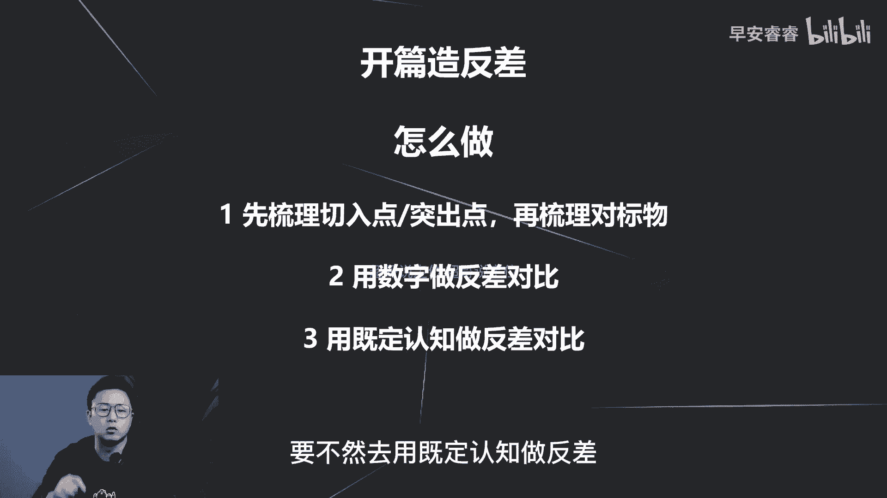
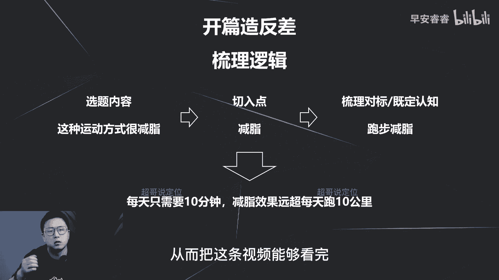

# 085 2023短视频起号·差异化定位课：0~1做懂抖音（定位+内容+投流+运营） - P21：第21节21 黄金三秒如何设计（2） - 早安睿睿 - BV1Am421T7br

大家好，我是超哥，那我们这节课继续讲第二种方法，去提升你前三秒的完播率啊。

那第二种方法呢其实相对来说也比较常见，就是造反差，那造反差实际上就是你开篇啊用这种对比，而且最好是有一些数字或者场景这些去做对比。

去激发用户的猎奇心。

那我们还是先来看两个案例，先来看两个案例，那第一个案例呢还是我之前的一条作品，都是唱歌的，为什么小鲜肉还比不过一个糙汉子，那看到这里的反差是什么了吗，那这里的反差就是小鲜肉和糙汉子，他两个是形象。

自身是具备反差的，但是呢我要去表达的是，糙汉子的吸粉能力很强，那小鲜肉呢反而干不过糙汉子，那这这个反差逻辑就出来，所以能够支撑这条视频将近，也是走了差不多40万的播放量。

那你再看第二个案例，粉丝竟然让我30元吃一天大餐。

那第二个案例呢就是说30块钱吃一天，那你像我刚才那个案例呢，是用形象或者说用场景去做这种反差，那第二种呢就更简单了，用数字去做反差，30块钱常理来说很难去满足一个人的日常的，在吃饭上面的开销啊。

一天来说对吧，所以说他去用这样的开头，也是去激发用户的猎奇心。

把这条视频能够看完，提供高的完播率。

那怎么做呢，那第一步呢就是先梳理出来，你这条视频选题的切入点，突出点是什么，然后再去梳理这个对标物，什么意思，就拿我刚刚那条视频来说啊，我要去突出的是什么，我要去突出的是那个糙汉子，吸粉能力很强。

那去想一下那唱歌的吸粉能力强的人是谁，一般都是形象比较好看的人，所以我就对标物就梳理出来，就是小鲜肉，那就拿糙汉子和小鲜肉去对标，去做这个反差逻辑的建立，那接着我们再来想一下第二个案例。

他是说30块钱去吃一天，他要突出是什么，他要突出的是他今天想做的这个选题，里面的视频内容，他吃这些东西能够让我撑一天，能够很省，那去想一下对标物在哪里，就是怎么样吃饭不省，吃五星级饭店。

或者说吃大餐或者吃自助餐等等等等，那你的文案脚本其实也可以去写，就是怎么样去用30块钱去白嫖一顿，五星级饭店的餐，一样的反差逻辑就构建出来，那他呢是用一天这个对标物。

因为按理来说一天吃饭花的成本也蛮高啊，至少60块钱左右，所以他这样去写，他的反差逻辑也构建出来，那第一步，实际上就是先梳理你这条选题的突出的点，到底是什么，然后围绕这个突出点去找对标物。

然后去建立这个反差，第二呢最好去输出一些数字反差，因为数字反差更容易让人够脑袋里面有画面，因为像我刚才去说小鲜肉和糙汉子，我还要去放图片，去引导你能够在脑袋里面有画面，数字的话用户一听都懂对吧。

所以用数字的话相对来说会比较简单，那第三种呢就是用既定的认知去做反差的对比，像刚才第二个案例，就是一般来说一天吃饭我刚说了嘛，差不多五六十块钱，那既定认知就是一天的开销得在五六十块钱。

他是说20块钱或者30块钱，那就打破了这个传统认知，这个反差逻辑就出来了，所以说怎么做啊，其实就三步，第一步就先梳理这个突出点是什么，然后去找对标物，然后把这个对标物找出来以后，你要不然去用数字做反差。

要不然去用既定认知做反差。

那接着的话我们来梳理一下，这个造反差的这个逻辑，梳理一遍以后你就更清晰了，比如说我们这条选题是说这种运动方式很减脂，NO还是一样，我要突出的是恒减脂，对不对，我们先来想一下对标物。

什么运动会比较容易减脂，大众认知中的对吧跑步，所以说我梳理出来这几点以后，我先梳理出来切入点，突出点是其减脂，那再去梳理对标物，跑步容易减脂，那我这条选题的前三秒的文案就已经出来，是什么。

就是每天只需要10分钟，减脂效果远超每天跑10km，就我要去表达我这种运动方式很减脂，甚至比你跑10km都还要坚持，而且每天只需要10分钟，所以说这种数字的对比和既定认知，这是双重对比。

反差一出来以后就勾起他的习性，从而把这条视频能够看完。

那怎么做呢，我们还是拿上次的那三个案例，再去梳理一下逻辑来看一下啊，我举例再来说一下，比如说还是第一个回锅肉对吧，回锅肉，那我要切入的点是什么，切肉是好吃，那我可以怎么写呢。

我可以去写说八块钱的食材做出来的五花肉，秒杀五星大厨，那还是一样，我要突出的是好吃，那五星大厨炒出来的回锅肉好不好吃，肯定相对比较好吃，对不对，那我去对标物就是五星大厨的回锅肉。

那五星大厨做回锅肉很贵嘛，所以我要去突出这个数字的反差，就是我的食材很便宜，也可以达到他的口味，那这个反差逻辑是不是就出来了对吧，那么第二个美妆我要去突出的是美，那我K文案怎么写，就是今天这个妆容。

让冷战一个月的她终于理我了啊，就是之前她和我吵冷战啊，嫌我嫌我这嫌我那不理我，但是我今天换了个妆容以后，一下让她春心荡漾，然后就开始主动联系我了，所以说也是通过这个美，然后去梳理对标物。

去建立这个反差逻辑，那第三个呢车型种草，我要去突出的这个车子性价比很高，我可以去怎么写，就是这辆不到10万的SUV销量居然远超BBA，那我要去突出的是性价比，那性价比去想一下啊，一般销量比较好的车子。

是不是性价比都比较高啊，那我就去说嘛，就是我这辆车子10万块钱都不到，但是我的销量还比BBA还高，所以反差就出来，所以说反差这个逻辑啊，相对来说在前三秒是相对会比较好用，而且屡试不爽。

你可以看下我之前的视频，我的很多条视频都是用的反差逻辑，而且数据效果都还不错啊，那反差的话可以也是一样，用在每一个赛道，用在每一个脚本逻辑都可以也是屡试不爽的，那今天这个讲的反差，这个逻辑就到此结束了。

我们下节课再去讲第三种，黄金三秒怎么样去设计啊。

我是你们值得信赖，有问必答的超哥。