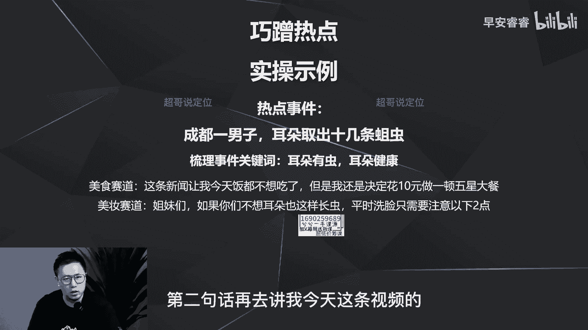

# 085 2023短视频起号·差异化定位课：0~1做懂抖音（定位+内容+投流+运营） - P22：第22节22 黄金三秒如何设计（3） - 早安睿睿 - BV1Am421T7br

那好进入我们黄金三秒的第三种方式啊，今天来讲一下第三种方式呢。

就是去蹭热点，而且是巧蹭热点，为什么说是巧蹭热点呢。

第一就是热点的切入啊，要把握度啊，别去蹭一些不该蹭的热点，就是一些苦情的啦，正能量的或者一些时政要闻，比如说前一段时间的重庆山火，你去蹭不是不能蹭，但你如果有粉丝的情况下，你极有可能蹭了你的视频。

火了你也会翻车，所以说巧蹭热点，第一步就是你要去把握这个度啊。

要去把握这个度，那第二步呢就是不要自我束缚啊，就是各个赛道都可以去蹭，有一些热点你觉得不是你这个赛道的，就觉得不想蹭，觉得会很尬，不要纠结哈，因为测热点实际上只是去解决，你前五秒的完播率。

你五秒完播率高了，你这条视频的播放量也会很高，所以说在这个选择之下，你肯定要五秒完播率更高啊，那你就不要去纠结这个热点该不该蹭啊，但是一定要去巧蹭，那热点包括哪些呢，热点不光包括我们所谓的一些热点话题。

那也包括一些热点呢视频和素材，那我后面会去举例。

那首先呢我们先来看一下怎么样去巧蹭热点，那这个热点是什么呢，就是前一段时间呢，就成都一个男子耳朵里面取出来十几条蛆虫啊，那我可以怎么样去蹭呢，我每个赛道都可以去蹭，当然有一些赛道不是那么容易蹭好的。

我这边所以现在梳理的是美妆和美食两个赛道，那我们接下来先来梳理，这个事件里面的关键词有哪些啊，就是耳朵有虫，耳朵的这个健康，那我们接下来可以怎么蹭呢，比如说美食赛道，就我第一句话就可以写。

今天这条新闻让我饭都不想吃了啊，但是我忍了一下，还是决定花十块钱给大家做一顿五星级的大餐，所以这玩意你可以看到没有，就第一句话就是蹭热点啊，第一句话就是放这个视频的文字，放这个视频的图片。

因为你蹭热点一定要把热点的素材给突出出来，所以你视频的前几秒如果是蹭热点，你就把他的这种截图啊，一些一些排行榜的截图，或者一些视频的片段放出来啊，放出来以后，用这个热点自身的流量。

去把你的前五秒的完播率先给过了啊，接着第二句话才去讲，你今天这个正题，那美妆赛道呢啊，姐妹们如果不想耳朵这样长虫，那平时洗脸需要注意以下两点也是一样，就前面第一句话我说的时候啊。

也是要放这个案例的一些图片或者视频素材，让这个热点先植入进来，第二句话再去讲，我今天这条视频呢啊核心的选题。

所以说总结下来就是什么，总结下来就是你前五秒要借势，就借热点切入，那后续呢要承接一个新的钩子，为什么要去承接一个新的钩子，如果你后面这一句话不承接一个新的钩子，会让用户期待的是这个热点的问题。

而不是今天你要做的这个选题，拿第一条举例来说，如果第二句话不去放一个反差逻辑，不去放一个十块钱做五星级大餐的这个钩子，就是反差的一个钩子，那用户会想听的是，你为什么今天不想吃饭。

这个热点到底是什么样一个情况，那第二句话建立了这样一个钩子之后，用户的好奇点就转移了，他就全部都聚焦到哎怎么样去做一顿大餐啊，那第二个案例实际上也是一样，所以说不要去纠结这个热点会不会蹭的很尬。

或者怎么样，就任何热点都可以去蹭啊，当然不包括我刚说正能量那些哈耀文那之类的，那蹭这些热点呢，就是你你可能第一句话会有点尴尬啊，是有点尴尬，那你第二句话去放一个，真正的核心的一个钩子啊。

真正今天核心的选题的一个钩子去引导用户的，叫做什么呢，叫做关注点的，或者叫做猎奇点的聚焦的转移啊，转移到今天真正的这个选题上面，而不是这个热点上面，就像我之前有条视频首页的第二条作品。

让你的视频能够更快的过审，当时有一个正好有一个热点是啊，直播一哥出事了啊，我若没有这个事儿，我可能会去讲怎么样去啊，让你三步过审，或者怎么样让你轻轻松松就能够，每条视频都过审，而且破完流量对吧。

用这样的逻辑去建立钩子，但是当时正好有直播一哥出事，所以我的钩子就变成了我前面的第一句话，就是直播一哥最近出事了，我发现抖音的审核越来越严了，很多的人会因为前五秒我说这句话，他以为我会去分析这件事情。

因为当时来说他的原因就是还不太清楚，就说他到底出了什么事情，以及他要禁播禁多久啊，6月6月初的时候还不太清楚，所以我当时用了这个钩子以后，很多人以为我要去讲这件事情，反而我后面试讲的时候。

我后面接着会去说，我们公司最近在做的很多账号啊，视频都会过不了审，那原因是什么，我又是用了痛点的这个钩子去讲怎么样去过审，所以我刚举的这两个案例，其实你就很清楚了，就是每个赛道啊，这些热点都可以去蹭。

但是一定要巧蹭，那巧巧在哪里，就第一句话就是切热点，而且一定要去放素材，放他视频素材或者图片素材，那第二句话呢，就是建立一个本条选题的一个新的钩子，让用户的视角能够转移，聚焦能够转移到这条钩子上面。

到这个选题上面不去纠结那个热点对吧，所以你这条视频的自然的播放量就不会太差。

那接着我们再来看一下刚才说的热点，不包括热点话题，热点事件，还包括什么热点素材，热点视频，对不对，那我们来看一个案例。

其实大家都很常见啊，在很多测评啊种草的账号经常会看到。

那这个案例你可以看一下，先看视频，他是以俯冲而闻名世界的另类美食。

几百年来喜欢他的人如获珍宝，抗拒他的人，你看这个账号做的什么选题。

他就是用这个奶酪的这个视频的前五秒，作为自己视频开篇的前五秒，为什么就是你看这条视频啊，他有4。7万的赞啊，评论的分享这些都很高，也就意味着什么，意味着这条视频就这个素材本身啊，是被印证过的。

前五秒是没有问题的，所以我巧用他的前五秒作为我视频的前五秒，那我是不是就不用担心我视频前五秒的，这个钩子的问题了，我的五秒完播率不会低对吧，所以说就是我刚才说的热点，第一个就是用别人的视频或者素材。

第二个就是用话题或者热点事件嘛，那刚刚这个就是用别人的视频和素材啊。

这地方简单来看一下，那哪些热点最好蹭呢，啊一定是能够满足用户求知欲和八卦欲的，尤其是一些娱乐的热点啦，或者一些呃时政社会的一些热点等等等等，就像刚才那个耳朵里面进虫，这是等等等等。

这些热点呢相对来说会比较好蹭，因为用户会很关心呃，很有求知欲，想知道这件事情背后的原因到底是什么，所以说明星的八卦啦，娱乐的八卦或者一些呃社会行为的八卦，这些会很好蹭啊，很好蹭，而且一定要巧蹭善称。

那最后呢再去说一下啊，蹭热点一定要注意这几个方面啊，第一个方面就是要去实时监控热点。

就是每天去看看啊，抖音的啊，排行榜，包括微博的热搜榜，去看一下有哪些热点，每天要去看啊，每天要去看，然后去看这些热点哪些能蹭啊，怎么样去蹭，那第二呢就是时效性一定要快，那你上午如果看到这个热点。

最好中午赶快拍，拍了以后马上剪，剪了以后赶快发啊，下午之前就赶快发，发了以后你才能抢上这个热点啊，才能抢上这个热点的热度。

那第三呢就是你发这个热点的时候啊，去抖音的这里面去申请一下关联热点啊，就把你的热点关键词，比如说男子耳朵有有虫对吧，去搜一下，然后去绑定，那你这条视频就绑到这个热点的这个，流量里面了。

那你的流量就会跟着这个热点的热度一块去走，那第四点是什么呢，第四点就是新手起号啊，最快的方式蹭热点啊，蹭了热点再去有一些专业的，独到的一些观点输出啊，流量也上来了，粉丝也上来了。

我们一般给一个账号在做的时候，一个星期必蹭热点啊，尬蹭也行，没有问题，只要蹭了播放量上来，一切都没有问题，所以说每个星期每天都要去看这个热搜，和这个抖音的排行榜，去把握热点，去及时蹭，而且要去炒蹭。

那今天这个蹭热点讲完了，那我们接下来下一期呢就会继续讲，第四个黄金三秒的开场方式，我是你们值得信赖，有问必答的超哥。

