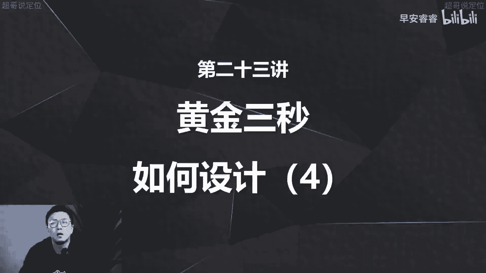
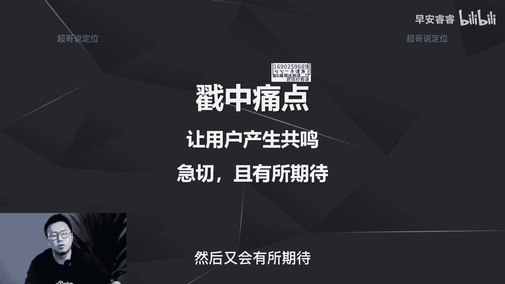
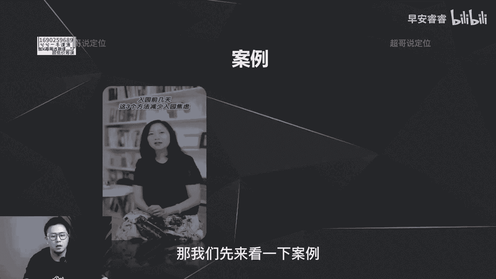
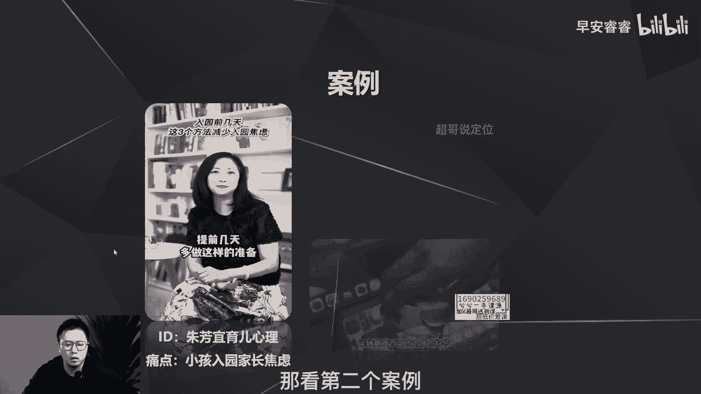
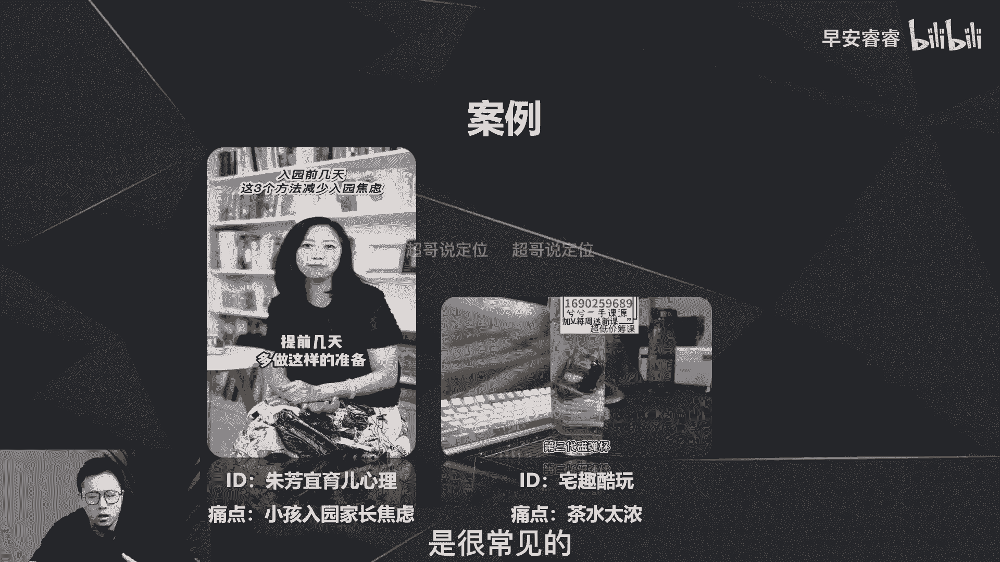
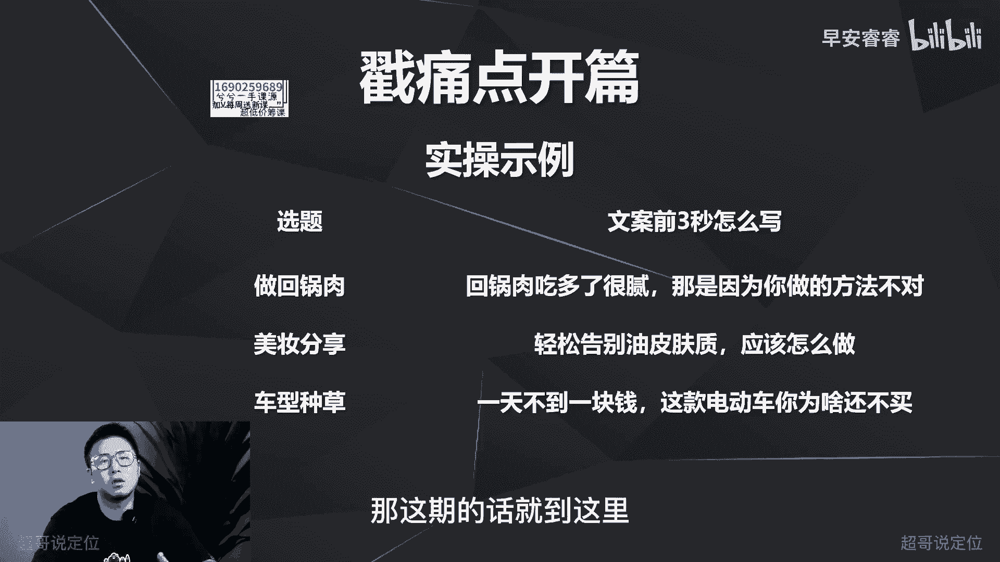

# 085 2023短视频起号·差异化定位课：0~1做懂抖音（定位+内容+投流+运营） - P23：第23节23 黄金三秒如何设计（4） - 早安睿睿 - BV1Am421T7br

那今天来到了我们黄金三秒的第四种方式，第四种方式是什么呢，就是戳痛点，那戳痛点在好物种草类的视频会比较常见啊，就卖货的一些短视频上面，其实他就是两个逻辑，第一呢就是让用户先产生共鸣啊，让用户产生共鸣。

就是你的前几秒先说这件事，然后让用户觉得这件事他遇到过这个问题，他遇到过有共鸣，他因为有共鸣，所以他想把这个问题解决掉，解决掉，他就会很急切，他就会心很焦，然后又会有所期待。

接着后面把你的视频给看完，那我们先来看一下案例啊。

我们先来看一下案例，像这个号呢，它是一个讲这种亲子教育呢，入园那天呀，羽西害怕宝宝哭，把宝宝扔给老师就跑，还不如说呀提前几天多做这样的准，你看吧，他的选题是什么，他的选题是说嗯。

孩子入园之前要做的一些准备啊，三个方法减少入园焦虑，那宝妈的痛点是什么，宝妈的痛点就是小孩入园之前啊，啊家长都会有这种焦虑，比如说一些安全啦，或者各方面的一些适应的一些问题的焦虑，那都在这些。

所以说宝妈的痛点就是焦虑啊，就是焦虑小孩入院前的焦虑，所以她第一句话就是去想，如果你害怕这个问题，那你可以做这三点怎么样去提升，那看第二个案例。

种草类的账号能随意调节茶水浓度的杯子，你见过吗，第三代他第一句话是什么，能随意调节茶水浓度的杯子哦，我们喝茶的人都会遇到一个问题，就是茶有时候会特别浓，或者有时候又特别寡淡，那这个杯子呢就蛮牛逼的。

就是它可以调节这个浓度，那就戳到了我的痛点，从而让我这个对这个产品有所期待，然后甚至下单转化，所以我刚说痛点在好物，种草类的账号是很常见的啊。

那接着再来看啊这个口播的这个视频，哈喽今天分享一下怎么搞定这个法令纹，请来的是我的头啊，那你看到痛点是什么，法令纹对吧，法令纹，那所以说陈世安第一句话就是说，怎么样去解决这个法令纹。

所以痛点呢相对来说也比较简单，就是你的前十秒啊，第一句话就先去说怎么去做，那怎么去弄呢，就是你先梳理你这个选题用户的痛点是什么，每个选题用户都有一个细分的需求点，或者细分的痛点啊，需求点实际上也是痛点。

所以说每个选题都有，不管你是做任何账号的，比如说你现在做一个女性情感类的账号，那女性情感她就会有痛点什么，比如说男生不理他，打游戏不理他，那你视频开篇就可以去写啊，如果你的男生打游戏不理你。

那你可以看一下这三点，就是每一个选题都可以去用痛点去切，都可以去用痛点去切啊，那接着呢视频的后半部分就是去表述，怎么样去解决这个问题，不管是一个步骤还是两个步骤，还是三个方法啊，就这样去表述。

所以说还是用之前那三个案例去来说一下，怎么做，那回锅肉回锅肉的痛点是什么，就是很腻，之前说过了嘛，很腻嘛，所以我就去说啊，你吃了很腻，是因为你做的方法不对，这样做就不腻了啊，那接着美妆那痛点是吗。

比如说很多人会油性的皮肤啊，油性的肤质，那就是我如果要去做这个种草，我要去做这个呃洗面奶的，或者这个呃护肤水的这个产品的种草，那我第一句话就可以去写，就是怎么样轻松告别这个油性的肤质，那车子呢。

那现在油价涨的很夸张对吧，那所以我们的痛点是什么，就是加不起油嘛，油加油要花很多钱，所以这个电动车我可以怎么去写，就是一天不到一块钱啊，这个电动车你为什么还不买，就戳了什么痛点，就是加油油费的这个痛点。

这块处理完以后，你就会发现第一很常见，很多种草卖货类的视频都会出现，第二你会发现梳理完以后，你就会发现这件事其实也很简单，所以这种方法也是适用于任何赛道，任何选题，我们已经梳理了四种方法。

其实这四种方法你只要熟练掌握两种，你的视频，前五秒的完播率会有一个质的飞跃，那我们接下来还会有两期，还会有两个方法啊，那我们下一期再去讲另外一个逻辑啊，那这期的话就到这里哦。

我是你们值得信赖，有问必答的超哥啊。