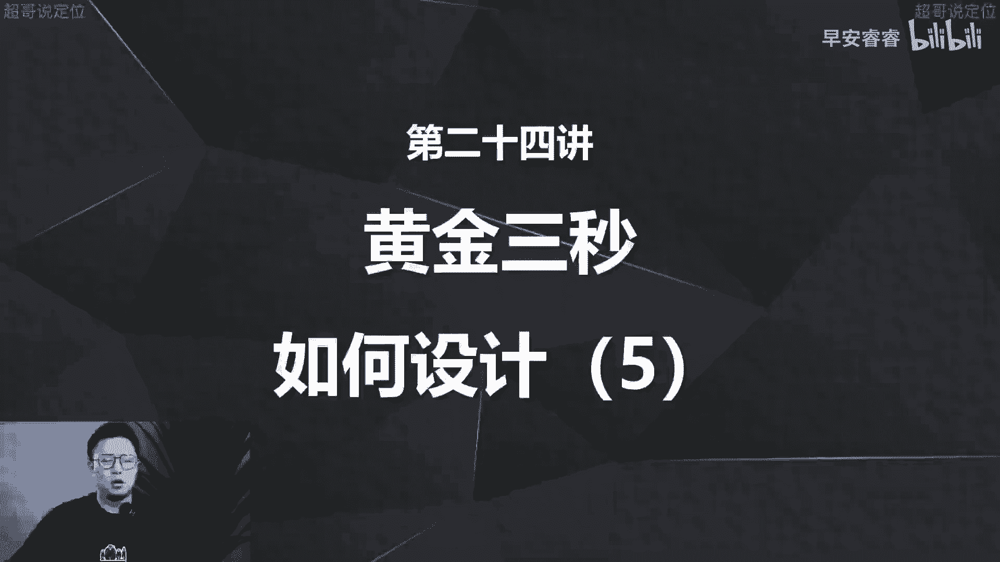
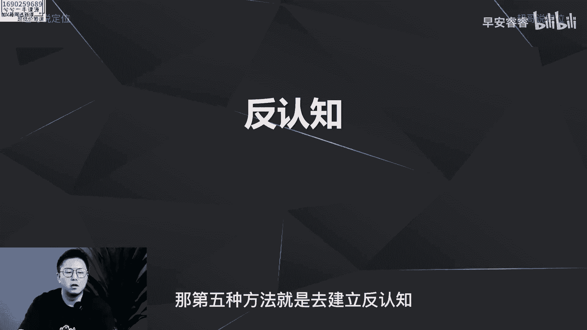
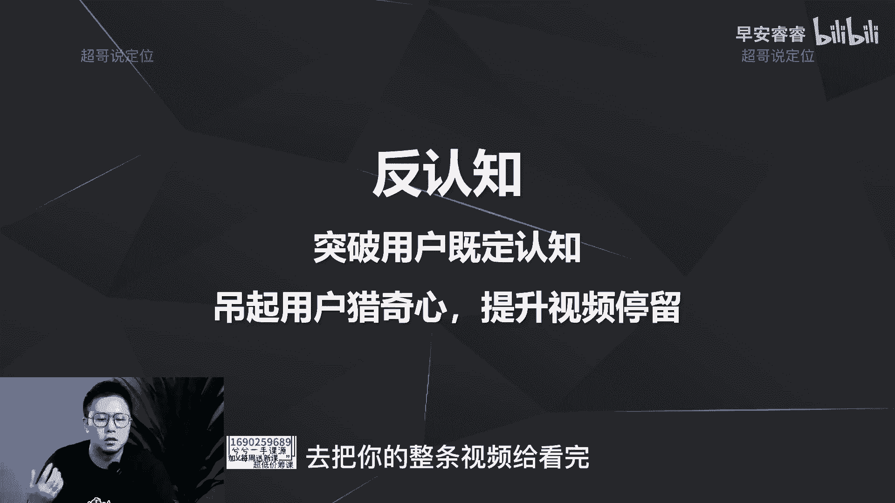
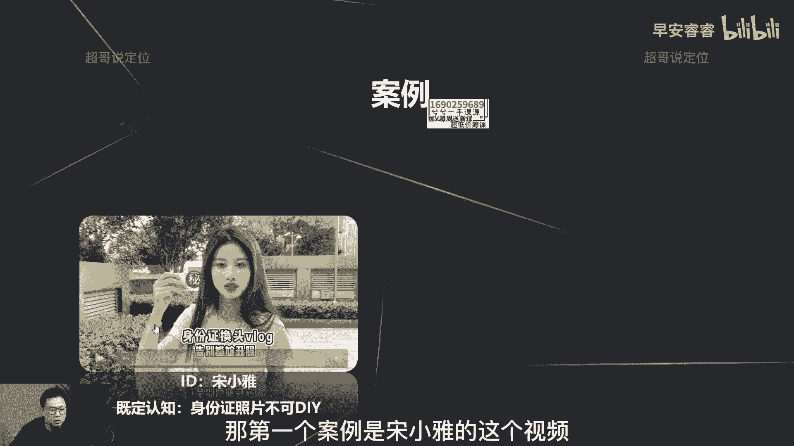
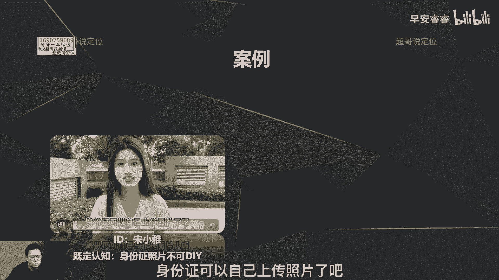
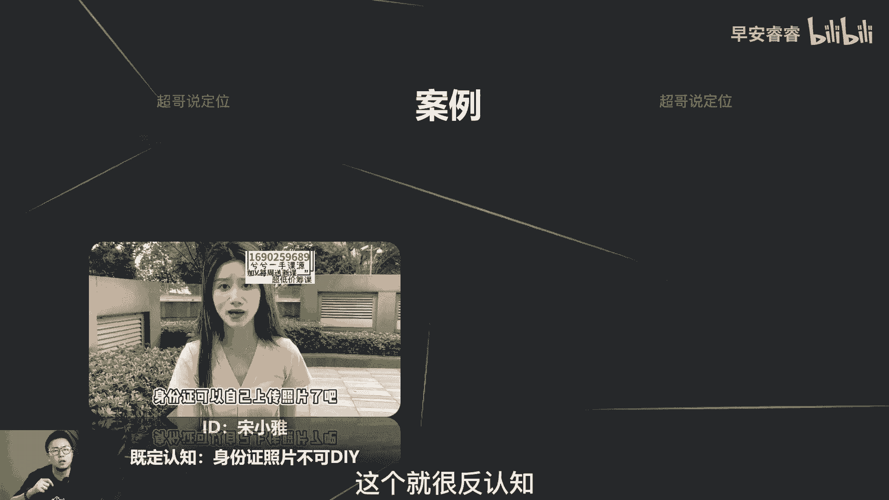
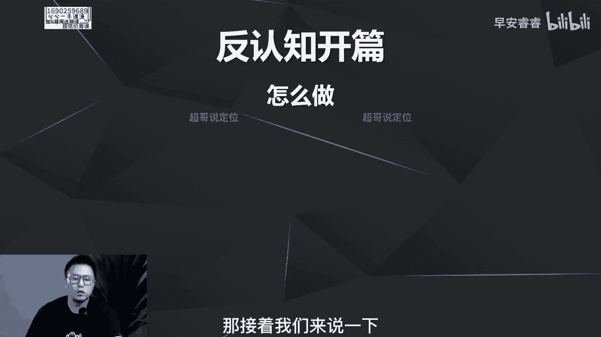
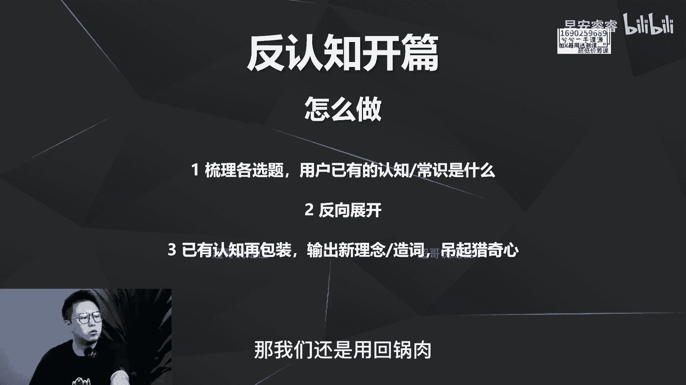
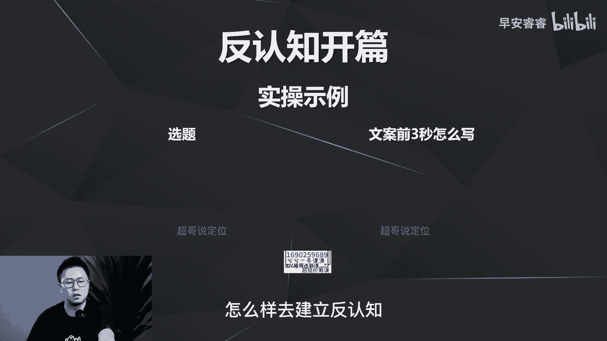
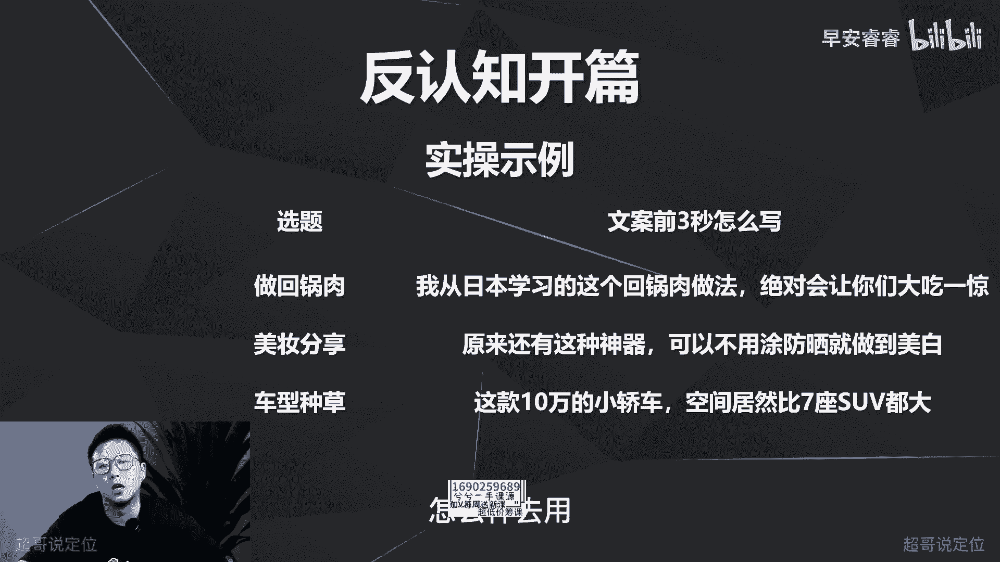

# 085 2023短视频起号·差异化定位课：0~1做懂抖音（定位+内容+投流+运营） - P24：第24节24 黄金三秒如何设计（5） - 早安睿睿 - BV1Am421T7br

好今天这一期我们来讲第五种方法。

怎么样去优化你的黄金三秒，怎么样去优化你的视频开头，那第五种方法就是去建立反认知啊。

我们先来看一下什么叫做建立反认知，反认知呢就是去突破用户的既定认知。

就叫反认知，这个很好理解吗，因为要去突破用户的既定认知，才能够去吊起他们的猎奇心，从而让他以好奇的这种心理，去把你的整条视频给看完啊。

那我们先来看一下案例，我们先来看三个案例，那第一个案例呢是宋小雅的这个视频。

不会吧不会吧，不会到现在还有人不知道，身份证可以自己上传照片了吧。

我们常规的认知是什么，我们的照片是不能随意指定，也不能DIY的嘛，那他就是想去说的，就是这条视频就是想去分享一个技能，就是怎么样去自己随意的上传，你的身份证的照片，这个就很反认知。

那我好奇心就上来了，我就从而把这条视频给看完，那看第二个案例图图不认输，也是最近很火的一个照，我把她睡觉的炕砸了，你看我第一句话就是反神直，就是你把你奶奶的炕给砸了，她还能开心啊，这个就很反人知。

就就猎奇嘛，接着就能把整条视频给看完，这是一个类装修类的账号，接着来看一个财经类的账号，为什么拼多多越亏越有钱，因为他看到没有，就是越亏越有钱，就也反了我们既定的认知，因为既定认知告诉我们。

从小学就知道，就是你亏肯定是不赚钱的嘛，但是他说拼多多为什么越亏越有钱，所以就能够吸引用户的猎奇心，那接着我们来说一下反认知开篇怎么样去做。

第一呢就是去梳理你今天这条选题，用户已有的认知和常识是什么，你梳理出来以后去反向展开，就是走反向思维去梳理一下，怎么样去建立这个反认知，那第三步呢就是已有的认知，你还可以再包装啊，就是有一些叫做什么呢。

就是有一些认知用户已有思维而已有认知，但是呢你反向做做不出来，而你反向做做不出来，那你可以包装一个新词啊，新的一个概念，比如说我这个赛道很多人都在说，前五秒钩子理论就是前五秒要设置好钩子。

从而勾起用户的欲望，把这条视频给看完，但是你看反认知，我不能去说前五秒不要有钩子啊，这个逻辑走不通，但是我可以去造次造一些新的理念，然后让你能够眼前一亮，突破你的既定认知，从而让你把视频看完。

我可以去说什么呢，就是前五秒一定要设置钉子对吧，这个说法就变了嘛，就不是钩子，是钉子，你一听哎，钉子这个词好像没听过啊，那五秒完播率比较低，我我是不是没用钉子，那我看看呗，所以第三个逻辑就是有些认知啊。

你如果走反向思维，走不通用户的认知，或者说既有的常识是正确的啊，也不可能突破的，那你就去包装一些新的词汇，这是营销的逻辑了，然后去把用户的猎奇心给吊起来，那我们还是用回锅肉。

美妆和车子这三个案例去看一下，怎么样去建立反认知。

那回锅肉呢我从日本学习的这个回锅肉的做法，绝对让你们大吃一惊，你看啊这个认知在哪里，就是回锅肉，一般大家都会觉得中国菜嘛，就是川菜嘛，四川做的比较好对吧，就是全中国做的比较好。

还不至于到外国去学习做回锅肉吗，那这个反认知就出来，就是我是从日本学的啊，那你可能就会因为这个在日本学的，这个好奇心就出来了，就是日本学的回锅肉到底好吃在哪里，用料到底有什么不同，从而把这条视频给看完。

那第二个案例美妆就是原来还有这种神器，可以不用涂防晒就做到美白，就既定认知是出门一定要涂防晒，那就突破反认知，就是还有一个东西可以让你不用涂防晒，就可以去美白啊，那第三个呢车子就是既定认知是什么。

既定认知就是小轿车的空间啊，都比不上大型的SUV，七座的SUV，所以这就说的就是这个小轿车啊，10万啊，空间比大的这种SUV还大啊，就突破了认知，所以说这一节课也是说到这里。

你也就会发现反认知逻辑也比较简单啊，也比较好用，只是说没有人去总结，那我这里总结了这五个方法，你就会发现，其实每个赛道每个选题都可以去用对吧，那下节课呢还有最后一个逻辑了，就是怎么样去造悬念。

那我们下节课再去具体的去说最后一个方法，怎么样去展开，怎么样去用啊。

我是你们值得信赖，有问必答。