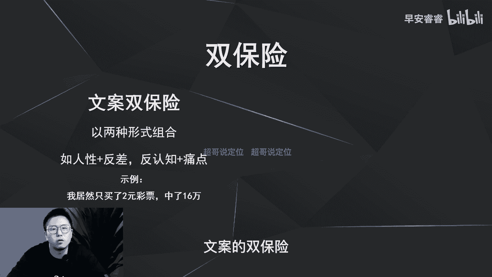
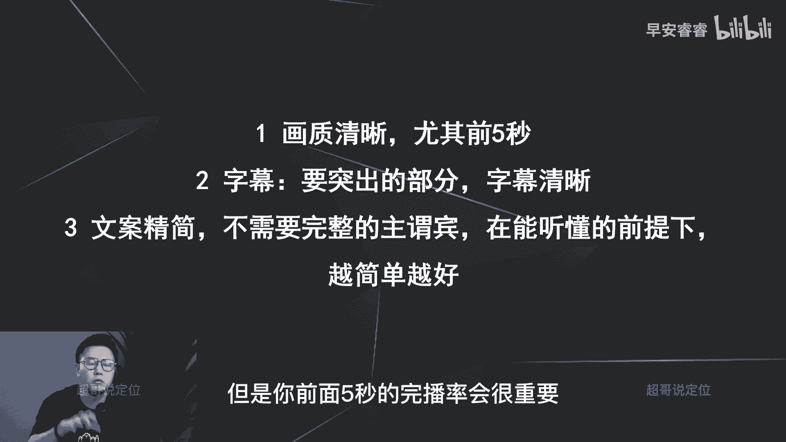

# 085 2023短视频起号·差异化定位课：0~1做懂抖音（定位+内容+投流+运营） - P26：第26节26 黄金三秒进阶四大要素 - 早安睿睿 - BV1Am421T7br

大家好，我是超哥，那之前六节课呢我们已经讲过了六个方式，怎么样去提升你视频前五秒的完播率。

那接着呢这节课我们去讲一下，有四大要素不要忽视。

因为只有做好这四点，你才能够去进一步的优化，你视频的前五秒和完播率。

那我们首先来回顾一下，我们之前六节课讲过的六个方式。

分别是哪六个方式，那第一呢就是去戳人性的底层欲望。

第二呢就是戳痛点，第三造反差，第四反认知，第五蹭热点。

然后第六造悬念对吧，那这六点梳理完以后，我们先来说第一个逻辑。

第一个逻辑要注意什么，第一个逻辑就是不要过度营销，把握好度。

因为我之前讲过所有的文案结构，所有的文案技巧都会迭代。

因为用户的心智在迭代，放到去年，大家可能觉得这句话还比较的犹抱。

愿意听下去，放到今年呢，大家可能都听烦了啊，你如果过度营销上来。

就是那种今天分享一个，99%的人都不知道的问题啊。

可能大部分的人都会刷走，我在我的号上面也实验过一期。

15%的五秒完播，所以就第一点就是要把控好这个度，不要过度营销。

尤其在你起号的时候，在你没有多少粉丝量的情况下，用户还没有和你有那么高粘性的情况下。

不要轻易去尝试太过度的这种营销方式。

那第二点呢就是做黄金三秒啊，其实就是在做用户的心理营销啊。

就是在做心理营销，就是你开头就是做了一个诱饵，去吸引他的停留好。

从而把你整条视频给看完，为什么这样说呢，我们把六个方案再拿出来再梳理一遍以后。

你就会发现你每一个钩子的设计，实际上都是在和用户的心理做斗争啊。

都是在切他的心理啊，比如说第一种方式。

人性的底层欲望，观众的心理诱导是什么，就是他的诱饵是什么。

就是要不然对财对赚钱感兴趣，要不然对色感兴趣，要不然对自己的呃贪吃感兴趣啊。

就是都是切到他这些的心理的变化。

或者叫心理的欲望，那第二个呢造反差，造反差，就你把这个数字反差或者这种形象。

这种现象反差做出来以后，实际上是激发了用户的哪一个心理的诱饵呢。

就是好奇心，就是好奇心，就是你做好这件事情以后，就会用好奇作为诱饵。

去把他整个的心里的这个钩子给勾起来。

给吸引起来，那第三点就蹭热点，蹭热点就是八卦和获知玉。

就用户对于所有的热点都有一个求知欲，希望知道这个热点事情到底是怎么样了。

怎么样解决的，以及它背后的原因到底是什么啊，所以说这第三点就是激起了用户的八卦与。

第四点就是激到了用户之前说过的，就是焦虑急切，所有的痛点都会让用户产生焦虑感啊，急切的想把这个事情给解决掉，那第五个反认知呢其实也是好奇。

那第六个造悬念呢实际上也是好奇和八卦。

所以就这六种方式，实际上都是在跟用户在做什么，在做心理的斗争。

都是营销心理学啊，都是营销心理学，所以做好这六点其实就够了。

你的视频的前五秒，包括你那么多的选题，这六个去套用到每一个选题上。

真的就够了啊，真的就够了，那接着呢再说第三点，第三点就是怎么样去优化你的视频。

前五秒去做双保险，这个可能没人说过。

做双保险，做双保险呢有两种方法，第一种方法叫做文案双保险。

文案双保险是什么意思，就是用两种钩子形式去组合。

比如说人性加反之哈，或者说反认知加痛点。

比如说人性加反差的话，就是我居然买了两块钱的彩票，中了16万。

这个呢第一个就是接了人性的底层欲望。

贪就我想多赚钱，我贪的这个欲望，第二数字反差两块钱和16万数字反差。

所以双保险呢就是文案的双保险。

就是钩子用两种啊，用两种，就我刚之前讲过六种嘛。

你每一个选题可以去各用一种，但实际上你两个钩子一块用效果会更好。

效果会更好，那第二个案例呢就是反震支架痛点啊，这个案例就是想减肥的姐妹们，今天分享一个含糖的减脂饮料啊，痛点是什么，痛点是想减肥啊，想减肥，那反认知是什么，就是所有含糖的饮料都不会减脂啊，都不会减脂。

所以这两个一组合以后，用户猎奇心就双倍了。

就double了，所以刚才说的这第一个叫做文案的双保险，就是你用两个钩子去作为你视频的开头。

效果一定会更好，那第二个双保险是什么。

第二个方双保险的话，就叫做用文案加画面去做双保险，其实我上一期有讲过。

就是在你的画面里面去加入一些其他的元素。

去拉停留，比如说之前说过，如果你像是有口播，后面放一个电视机里面放点电视剧。

或者放一个美腿，或者放着吵架的画面，这就是用文案加画面去做双保险。

比如说之前也分享过那个账号，叫做什么画大饼啊，他是一个炒菜的嘛，但是他是漏了一个花臂，那个花臂就很扯眼球，这也是画面元素加他说的第一句话，就作为双保险去提升五秒完播率啊。

这第三点的话也就讲完了，第四点境界就是画面的处理，就是你画面前五秒一定要做好这个画面。

包括哪些，第一你的画质啊，你的画质一定要清晰。

那第二呢字幕啊，就是你该突出的部分字幕一定要清晰，不是说一定要大，而是要清晰，清晰是什么意思，如果你现在这个背景，你的人，比如说我穿的黑颜色的衣服，我的字幕前五秒放个黑色字，谁看得清啊。

那我可能就放个撞色，比如说白色或者蓝色，能够让我的字幕能够清晰可见。

能够让我前五秒能够用字幕去吸引人停留，那第三呢就是文案要尽可能的精简。

就是前五秒的文案，你不需要所谓完整的主谓宾或者主系表啊。

能听懂的情况下，越简单越好，我举个例子，比如说我要去分享一个菜谱啊，就是今天这道菜不用放盐，然后也可以让它很好吃，我赘述嘛。

大概就是这个逻辑就是长的，这个文案就这么长，但是我说了，不影响能听懂的前提下。

越简单越好，那我可以简单到哪种程度，就是这道菜不放盐也好吃，就九个字，九个字最多就两秒钟，所以我就说了，前五秒的文案一定要精简，你后面邋遢，那就后面的东西再说，但是你前面五秒的完播率会很重要。

那今天这一期呢我们就是去讲一下，怎么样去优化你视频的前五秒，除了那六个方案以外，打了四个方向啊，第一呢就是不要去过度的营销，第二呢，做视频的前五秒就是和用户的心理去做斗争啊，你只有搞清楚这个之后。

你才能够让你的前五秒写得更加的切实有用，那第三点呢就是怎么样去做双保险，第四点前五秒的画面怎么样去处理啊，这边都已经整体讲完了。

那整个的视频的前面的三秒钟，前五秒的这个完播率怎么样去提升。

怎么样去优化你的脚本结构，怎么样去优化你的文案结构。

这边都已经全部讲完了哦，那我们这期就到这里结束了，我是你们值得信赖啊。

有问必答的超哥。