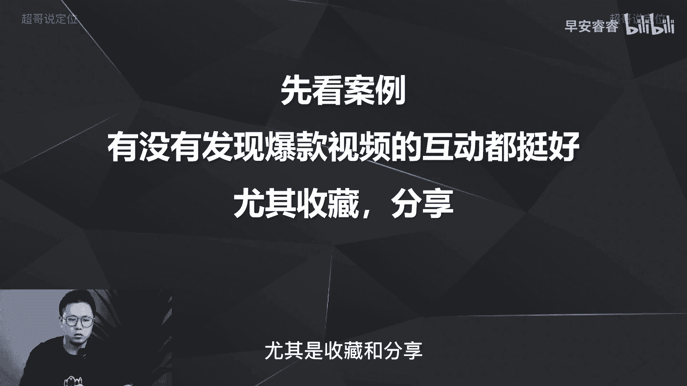
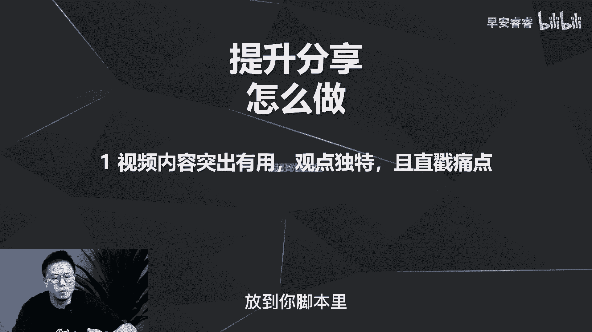
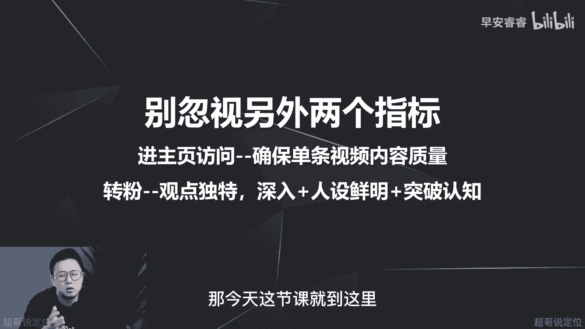

# 085 2023短视频起号·差异化定位课：0~1做懂抖音（定位+内容+投流+运营） - P27：第27节27 如何通过脚本设计提高互动率 - 早安睿睿 - BV1Am421T7br

啊大家好，我是超哥，那今天这节课呢，我们来讲一下，如何通过你脚本的设计，去提高你的视频的互动值，这个逻辑可能有点绕。

我们还是先来举例来说，你们每个人在发作品的时候，或者你们每个人在刷抖音的时候。

有没有发现一个很有意思的现象，就是所有爆款视频互动数据都极好啊，尤其是什么，尤其是收藏和分享。

我这随机截了三个作品，你们就可以看到哈，比如说这个作品2。1万的赞啊。

然后收藏和分享加起来将近1万多啊。

1万2左右，那第二个账号呢啊52万的赞，然后这个加起来也将近30万的收藏和分享，那这个账号呢啊1。6万的赞，然后这两个加起来也就将近2000，我就是想说一个，先说一个引子。

就是今年你的视频要想有大的播放量，至少比如说5万10万甚至更高的播放量，你一定要去注重打造你视频的互动值，尤其是分享数据和收藏数据啊，尤其是这两个数据，如果这一块你们还没听懂呢。

你们可以先去复盘一下自己的作品，能够跑到两三千流量或者1万多流量，甚至2万流量吃的，你们去看一下分享和收藏，是不是都还是相对比较低，只是赞和评论比较高，在这个逻辑上面，其实我之前的第八节课就已经讲过。

所有的互动指标要达到什么样一个转化率，你的视频才会有更高的一个流量池啊，我在第八节课的时候就已经讲过，那这节课呢我们就来讲一下，直接进干货，就来讲一下怎么样去提高你的互动指标，那互动指标有哪些呢。

那互动指标第一点赞，第二评论。

第三分享，第四收藏啊，转发就是分享嘛，那接下来我们一个一个来说啊。

首先第一个怎么样提高点赞，那点赞的诱因是什么，就是你在什么情况下会去给别人的作品点赞，你们每个人先去回顾一下你平时刷抖音的时候，看到别人的作品，点个赞的目的或者说动向动机是什么啊，无非就两点。

第一呢有用，就你觉得这条视频很有用啊，一个叫菜的，一个教美食的，或者说一个打游戏解说的，或者说一个影视解说的，我会觉得有用，我后期可能想再翻出来看一下啊，这是有用，第二呢有趣，比如说一些搞笑赛道。

我看了以后会比较好玩啊，或者说还有一些正能量的，就是在情绪价值上面打动我的，我都会去给一个点赞。

那怎么样去提高点赞呢，那说了吗，有用吗，那你就去输出一些有用的观点，去提供实用的价值，第二呢就是让你的视频变得有趣，去提供情绪价值啊，我这里地方有两个，一个是实用价值，一个是情绪价值。

我之前直播有说过这两个的区别啊，有不清楚的可以再问我啊，所以说你的视频要想有高赞，实际上做到这两点就可以了。

而且相对比较容易啊，相对比较容易，那我们接着来看第二个就是，怎么样去提升你账号的视频的评论呢，我们先来想一下评论的诱因有哪些，你平时看到博主的作品，你为什么会去给一个评论啊，其实第一个方面是什么。

第一个方面就是吐槽啊，很多人都有这个欲望啊，就是生活中的过得郁郁不得志，然后到键盘上面来发泄好，就来骂骂人对吧，我们很多新起的账号都会遇到这个问题，而且我发现啊，就是抖音真的是为粉丝量为为为尊呃。

你只要有个两三千甚至上万的播放量，就没人敢骂你了啊，你在刚起号的时候，你不管说什么观点都有人来骂你啊，所以说第一个就是吐槽，那第二个就是产生共鸣，就别人看完你这个视频以后，觉得打动了他。

或者踩到了他心里面某一个点，他会因此产生共鸣，过来跟你评论，第三点咨询就是你发完这个视频以后，分享了一个呃一个怎么做一个idea之后，他会告诉你啊，有没有什么呃问题，有没有什么办法能够解决他的问题。

就第三个方面是咨询，第四个呢就是有一些话题点，比如说你视频里面放一些比较好玩的，一些画面元素，或者做了一些很扯淡的一些事情，或者你的某一个观点可能略显站不住脚，他就会来跟你沟通啊，这种不叫吐槽。

会过来跟你一些正向的沟通。

就话题点，那怎么样去让你的视频的评论数能够起来呢。

第一就是确定完你的选题以后，去梳理你对标视频的评论区啊，简单说比如说我今天要去分享做回锅肉，我去看一下全网其他人做回锅肉的视频，看底下评论，有些人可能评论是说好香，有些人评论可能是问步骤。

就是盐要放多少啊，这些杂七杂八，有些人可能是去吐槽你对吧啊，有些人可能去吐槽他们家的锅碗瓢盆，各方面都烂了或者怎么样，那实际上你就把这些点全部都梳理出来，梳理出来以后干嘛植入到你的脚本里面。

比如说别人说他的回味很香，那你去做你的回锅肉，尽可能去突出香啊，你的口播文案上面以及你字幕上面，尽可能去说你这回锅肉很好吃很好吃，以及你的表情各方面都要做出来，第二啊，有些人可能会去问你啊。

步骤就是要放多少盐，要放多少醋啊，要放这这怎么怎么，然后那你在你的脚本里面，就去把这些东西尽可能模糊掉啊，模糊掉的意思就是，你可能忘了一个关键步骤去说，然后让别人来咨询啊，让别人来咨询。

比如说呃回锅肉嘛，就是一般来说放郫县豆瓣酱嘛对吧，那放几勺呢，你可以故意不说，或者说说模棱两可，然后评论区等人来问啊，评论区的人来问，第三种呢就是一些槽点，用一些烂的一些锅碗瓢盆啊，怎么怎么样的。

就是你去梳理完别人的评论区里面，出现的这些点啊，你拿小本本记下来，然后放到你的脚本里面去放大去展现，甚至你可以发出来制作品以后，你让你自己的小号或者让一个马甲，把这些点带的评论区先带一下啊。

先带一下产生互动，然后用户就会跟着那个人有互动，然后去来评论你，所以刚才就已经说过。

就是你把别人的评论区看完以后，然后去把这些东西梳理出来，在脚本里面去放大。

那接着来说怎么样去提升你的分享量呢，啊第三和第四一个分享一个收藏。

重中之重一定要仔细听，那我们先来还是先来梳理一下分享的诱因，有哪些，就是什么样的原因，动机会让你去分享这个视频，其实就几个方面，第一方面是这条视频对你某一个朋友有用，所以你会在评论区里面直接艾特他。

然后让他来看一看，第二就这件事你可能自己没办法完成，需要你朋友来完成，你就艾特一个帮手啊，第三呢就是八卦啊，就是八卦这个视频特别扯淡，这个视频特别有意思，这个人特别无厘头。

我去艾特我朋友，让他也来看看热闹啊，让他也来看看热闹。

那怎么样去植入呢，就是用这三个逻辑放到你的脚本里面，放到你小本里面。

第一就是突出啊，你这个视频是有用的，而且观点是独特的，而且戳痛点，说出痛点的目的，才会让这个人看到以后，能解决他朋友一个痛点啊，一个需求去艾特他朋友过来看，那第二呢就是你在你这个脚本里面去突出。

这个事情是需要去分享的，没办法一个人去完成的啊，我后面去举例去说，你就懂了，那第三呢就植入一些槽点和话题点，然后让他来八卦，让他艾特他朋友一起来看哦，这个人做个饭怎么手套烂成这个样子哦。

这个人做饭好有意思啊，啊这个人做饭的口音好搞笑啊，让他艾特他朋友来看，实际上有了这些脚本的支柱以后，你的分享这个数据慢慢就起来了啊。

慢慢就起来了，那第四个就是收藏啊，我们先来想一下收藏的诱因是哪些。

就什么动机会让你去点一个收藏，第一切实有用，一定是有用才会有收藏，如果这个事情跟你不相关，你干嘛要去点个收藏呢，你甚至连赞都不会点，第二嘛就是你这个视频啊，信息特别大。

我似懂非懂，看着挺累的啊，没听懂，但是又觉得你挺牛逼的。

我会点个收藏，收藏起来干嘛，回来再看，就是过一段时间，等我有用这个需求的时候。

我再去翻出来这条视频再看，所以说要想做到提升收藏呀。

其实第一就是你的观点要一定独特啊，一定要独特，就别人没说过，或者大部分人没说过，第二呢就是分论点，分步骤去把这个细化掉，第一步怎么做，第二步怎么做，第三步怎么做，但是这个细化的步骤呢要详实还不拖沓。

详实就是把这个每一步要说的很饱满，很全面，但是呢又不要拖沓，影响你的完播率，影响你的视频篇幅，详实了就会让人怎么就是因为你说的很全，他就会一定记不住，记不住了以后就会模棱两可，就有点似懂非懂。

他就会点个收藏回来以后再看，就比如说回锅肉对吧，你把步骤说的很复杂，第一步，第二步，第三步，第四步啊，甚至比如说一些大财三不沾对吧，很难做，大部分人都会点个收藏，因为等他哪一天想尝试的时候。

他去收藏列表里面去找，因为点赞的每个人，点赞列表里面很多都是娱乐相关的，一些搞笑的一些视频，他在里面再去大海捞针会很慢，所以很多人点收藏的目的，就是为了将来在某一天还会用到它。

然后点个收藏再回来翻，那说完这四点以后。

我们来实操，我们来实操，用一个选题去把这四个逻辑全部都带出来，你就懂了，怎么样去提升这四个指标，那这个选题是什么，还是做美食哈，虎皮青椒，做这个菜，做这个虎皮青椒这道菜，那如果想去提升点赞。

那就是切实游泳，就是一定要输出你这个视频，让别人让想做菜的人一看就能学会，那如果要想评论呢，那比如说你要不然买个青椒就特别小，一个特别小，一个特别大，自建这种话题点，第二呢就是你可以戴个破手套去做饭啊。

哪有人做饭戴手套啊，还带个破手套对吧，止住一些槽点就提前设计，一定要提前设计这些互动点，那分享呢你可以写一句话，就在你的脚本里面，或者在你口播，或者在你做菜的时候，可以去说一个，就这道菜很好吃。

而且不辣，就可以艾特你不爱吃辣的小伙伴也尝一尝，那就会有人看到这条视频以后，就会艾特某一个人，你不能吃辣，哪天我艾特你尝一尝啊，就是这个逻辑，你来踩踩雷嗯，就这个意思对吧，然后第三步呢收藏。

就我刚刚说的，就是你的步骤一定要详实，而且要不拖沓，就是你步骤一定要快，但是每一步啊，每一个用料要要到多少醋，然后到底要搞几分钟，这些杂七杂八的东西，皮到底要煎到什么样的程度，这些东西一定要说的很详实。

但是一定要快啊，快的目的是为了什么，让别人记不住，记不住了以后他就会反过来再去点开看啊，反过来再去点开看，这地方正好去赘述一个东西，很多新手写脚本的时候会遇到一个问题，我一定要把这个事情说的很清楚。

因为我害怕他看不懂，或者说一定要把这个文字尽可能多放几秒，为了让他能看全啊，这些都是想多了啊，等到数据跑完以后，你拿到这个跳出率，每一秒跳出率或者你的完播率以后，你就会发现是你想多了，用户没有耐心啊。

与其让他能够看得完，看得懂，你不如让他快速过。

然后他说真想看，自己再回过来看，或者点个收藏，那最后再说两点啊。

第一点就是提升到多少数值合适，就提到多少，转化率，就是一条视频500的播放量，到底要有多少赞，到底要有多少评论。

到底要有多少收藏，到底要多少分享，那这个呢在之前的第八节课已经有说过。

包括这地方已经梳理过占3%，评论差不多2‰，收藏分享都是6‰，那进主页的8‰，传粉的3‰，这个都已经梳理过，在第八节课啊，有兴趣的或者忘了的同学，可以再返回去再看一下。

包括我建议你们把这个指标拿个东西记下来，放到自己电脑旁边啊，或者怎么样，每一条视频去看你有没有达到这样指标，没有这样的指标，你永远突破不了大的流量池，上5万上10万，你永远达不到，你一定这些指标做得好。

你才有可能突破更高的流量值。

甚至突破百万，那第二个是什么。

就不要忽视另外两个指标，一个是进主页访问，进主页访问，其实就一点就保证你每条视频的内容质量，那才会有更多的进驻，业保呢，第二呢就是粉丝的话一定什么一定要去解决，你的观点够独特，观点要深入。

而且你的人设要鲜明，就让别人一下就能get到，你这个人到底是什么样一个学历，什么样一个性格，然后在某一个方面到底是哪一个，某一个领域比较比较厉害，然后牛逼在哪个程度啊，要想有吸引更多的粉丝。

一定要建立这一，但是有一个核心点就是一定要输出，怎么做啊，不要口嗨，只是为了满足我的表达欲，我很牛逼，怎么怎么样，但是一定要去说怎么做，一定要去说怎么做，说了怎么做以后才会让他关注你啊，后面就有需求。

他才会慢慢的去看你更多的作品，去解决他的需求，如果只是表达你自己有多厉害，那口嗨他会觉得你跟他太远了，没有多大的关系，跟他不相干，他干嘛要关注你啊，所以说转粉就是第一要建立需求，要解决怎么做。

第二就是你观点一定要深入而且独特，第三就是你的人设啊一定要鲜明，那这节课整体就讲完了，怎么样去提高你互重指标，那我最后再赘述一点哈，就是做抖音，一定不要过于去纠结某一个互动指标，因为你没办法。

每一条视频都做到六个指标都很好，你把其中三四个指标做好已经很不错了，而且一定要经常去看看别的视频的评论区，去找一下灵感，去找一下槽点，话题点，然后及时的植入到你的脚本里面，这样才能做到什么。

才能做到事半功倍啊，花更小的功夫去获得更大的流量突破，我是你们值得信赖，有问必答的超哥，那今天这节课就到这里。

