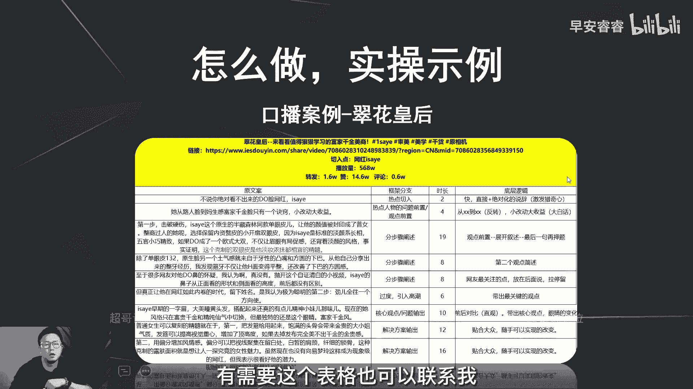
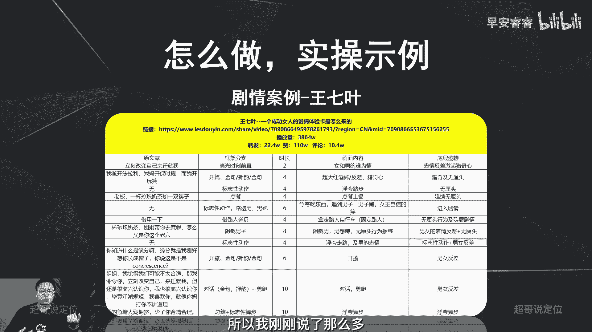

# 085 2023短视频起号·差异化定位课：0~1做懂抖音（定位+内容+投流+运营） - P28：第28节28 如何参考对标账号输出脚本 - 早安睿睿 - BV1Am421T7br

嗯大家好，我是超哥，那今天这节课呢就进入到我们怎么样去写脚本，怎么样去做选题了，那这节课呢我们首先来讲一下，怎么样去参考对标账号去输出自己的脚本，那我们为什么要去参考别人的脚本，来写自己的脚本。

因为我们首先要建立一个基本认知，就是抖音是一个基于算法的平台，就是我们按照自己的说话方式去写脚本，就五秒完播率啊，整体完播率各方面都不会好，但是有一些成熟的账号，他们的火的一些视频的脚本。

你去参考了以后，你就很清楚五秒完播率到底怎么样，应该去破，然后怎么样有更高的互动值，以及你这条视频有更高的完播率，更高的播放量，所以第一个呢就是新手写脚本的时候，你难免会遇到一些问题。

就你连脚本是什么都不知道，你更别说要怎么样去运用镜头，怎么样去写文案的逻辑，怎么样去配乐，怎么样去敲字幕啊，字幕应该用什么样的字体，什么样的颜色，什么样的花字，那这些东西都是建立在你的主观认知。

你按照自己的逻辑去写，难免出来的东西就会很难看，因为每个人的审美标准是有参差的嘛，那你一定要去参考你的对标账号，如果它的质感，他的字幕是这样大小，它的字幕是这样的排放，以及他字幕用的是这个字体。

那你也要去参考，因为他走过的路已经验证过是没有问题的，所以你去按照他的路走的话，一定会走的更快啊，少一些试错成本，那第二呢就是我刚说过的，就是抖音是一个算法平台，一定要调整自己的说话方式。

调整自己的说话方式，满足抖音的说话方式，这样的话你的五秒完播率，然后你的播放数据才可能会更好，那第三呢就是你对标了别人的脚本以后，你自己的账号才能有更高的完播率啊。

才能有突破流量池，那接下来之前说过这个逻辑，我再赘述一遍，就是选择对标达人，一定要去参考完播率，因为什么，因为如果你选择这个对标达人，他的完播率只有200%分之三，你把他的脚本参考了有什么意义呢。

你能做到400%分之五吗，啊不可能，因为他已经走过这条路，就像我刚才已经说过了，好的账号，好的视频内容已经被验证过了，那你去抄你去你去参考是没有问题的，那一些不好的账号，就是他的视频完播率本身就很低。

他可能是投抖加投出来的数据，你觉得很漂亮，那你去参考它，你去参考到最后面就是完播率就1%，2%，甚至这个账号最后就作废了，所以怎么样去判断他的视频内容到底好不好，两个逻辑，第一找我啊。

我来帮你们在后台去看它的完播率到底好不好，之前在第七节课，第八节课好，第五节课，第六节课怎么样去看数据里面讲到了，用巨量星图这个平台可以看到这些数据，你们没有权限可以联系我，我来帮你们查。

这是第一种方法，那第二种方法上节课已经讲过了，所有的爆款视频，他们之所以能火，其实还有很多的原因，是在于分享和收藏这两个指标，所以你们要去对标一些账号，对标一些视频的时候。

你去看一下他们的分享量和收藏量怎么样，如果也还不错的情况下，就满足我之前给那个转化率，如果还能满足那个情况啊，那你去对标他的脚本没有问题，如果出现那种两三千的赞，然后收藏和分享加起来才不过50个啊。

那懂的人都自然都懂，因为投过斗家的人都知道，赞是最好投出来的数据，但是分享和收藏是极难投出来的，就是花钱解决不了的问题，那花钱解决不了的问题怎么样去解决，就是内容一定要好啊，如果他这些视频。

就是他的分享和收藏确实还比较高，那就是它的内容好，内容好，你再去参考他的脚本，那这个逻辑绝对没有问题啊，那接下来我们就来看一下，怎么样去选定对标达人以及对标视频，刚才已经说过。

第一个就你选出来十个对标达人啊，选了以后给我，我来给你把这十个对标达人，他们的完播率以及哪些该不该对标，我把这个建议给到你啊，第三你去选他们对标达人里面的这些视频，火的视频，然后你去看他们的脚本逻辑。

那第四步呢就是把这条视频选出来以后，你用青斗啊这些工具把这个文案提取出来，提取出来以后你就去看他的文案结构，第一段啊是讲了什么逻辑，第二段讲分论点又讲了什么逻辑，第三段又讲什么逻辑啊。

如果语文水平比较好的情况下，其实你总结几个脚本出来以后，你自己的文案结构自己也就生成了啊，哦我举个简单的例子，比如说我的账号，我的账号通用的就一个脚本逻辑，就是第一段先去说一个案例啊，一个账号。

第二段去说他为什么就为什么牛逼啊，第三段说怎么做，所以我刚说的就是，你把一些其他的账号梳理出来以后，你就梳理个567，你就自然清楚了，它每一个脚本实际上都是这个核心框架啊，都是这个主线框架，那你去套用。

然后控制好时长，然后植入一些互动点，你的视频自然就会爆，那选定了对标视频，然后把他的文案提取出来，我们接着要怎么样去做呢，我们接着要去get几个方面，第一方面就是看他脚本逻辑，他先干嘛后干嘛。

以及为什么他先说啥后说啥，以及为什么啊，要带着思考去看，因为你看的不多了，真不多了，你看个五条爆款，看完以后同一个账号啊，就一个账号，因为每个账号他是脚本能器还是会略有不同，就比如说我和其他知识博主。

我们的脚本框架是完全不一样的，但是你看我的看武器，你就自然知道就是我刚说的那三部，那你去套用我那三部，然后控制好市场，你的视频一样能火，那你去套用别人的第一段说什么，第二段说什么。

以及为什么就背后的原因，你自己想一想，站在用户的角度去想一想啊，如果还是想不通，去评论区里面找，然后你自然就很清楚这个脚本应该怎么样去写，然后第二部分我刚说了，控制好市场，你知道他的逻辑，第一段是讲总。

第二段是讲分论点，第三段又是讲分论点啊，你知道是这个总分分的框架结构，但是你时常控制不好，那难免他的视频70秒，你的视频2分钟，然后他的视频完播率极高，你的视频完播率极差啊，就是这个问题，那第三部分呢。

就是去参考一下他们视频里面的字幕啊，BGM的风格啊，去参考一下，去参考一下，然后第四呢就是剪辑手法啊，剪辑手法这可能会有点高深，新手来说的话可能会略难，那你就一步一步来嘛。

先从最基础的看一下他们字幕BGM怎么用，然后接着再看一下他们的转场图片怎么放的，然后图片动画是用哪一种，慢慢去修正，慢慢去调整，慢慢去进阶好，那第五呢就是去看下他们的选题方向，你梳理完五个脚本以后。

你就大概明白他的选题到底是切的一些，哪些的细分需求，或者说他到底是做的大逻辑还是小逻辑啊，你一定要去做这个工作，做这个工作，就是为了让自己的选题也能够做的更好啊，那接着具体怎么样去扒别人的脚本啊。

我们举两个账号的案例，第一个账号呢是一个口播案例，这个账号叫做翠花皇后，我们先来看一下他的视频，噗那你觉得看不出来的重点网红。

第三眼，他从路人脸到妈生感，富家千金脸，只有一个诀窍，小奶到大收益。

第一击破硬伤，一代原生眼，这个半藏森林同款的单眼皮，让她的颜值被封印成了好了，这个是一个讲嗯变美的这样一个口播账号，他是切了一个网红excel，然后去说怎么样去动脸啊，怎么样去动脸，他的口播的选题。

这一期的选题就是这三步，教会你怎么样去让自己更好看。

那我把他的整个的脚本哈整个提取出来，我们去分段分段看，别嫌这个事复杂，真的你八个567，你自己慢慢就找到感觉，找到感觉你就不用再去做这个工作了啊，找除非你要去进阶你的脚本，去调整你的脚本去迭代。

你需要去做这个工作，但基本上一个脚本的逻辑你可以用个啊，用个一两个月，三四个月都没有问题，那我们先来看一下啊，我把它脚本整个的文案提取出来以后，他第一句话说的是不说，你绝对看不出来度联网红excel。

那这个句话是什么，这句话就是做的热点切入啊，就是我一刚刚说过，你一定要去想它背后的原因，就为什么，为什么就是他去切热点啊，他不是上来先说大逻辑，就是一定要用这三招去让你的脸更美，他不是去说这个大逻辑。

他用热点去切，因为我之前分析了六个呃，切前三秒的逻辑里面已经说过了，热点是一个新手起号最快的方式啊，第一个就是切热点，那第二个他这句话就是路人脸到妈生富豪，千金里只有一个诀窍，小改动大受益。

那这句话的背后的底层逻辑是什么，就是观点前置，观点前置就是什么，就是小改动大收益，而且他还用到了这种反转逻辑，反差逻辑就是从什么到什么，所以说你把这个理出来以后，你也知道怎么样去写脚本了。

比如说你现在要去讲一个理财的一个手段啊，就是不说，你绝对不知道一种理财手段怎么怎么样，然后第二句话你也可以用这种逻辑啊，就是从一个贫民窟的小孩到现在我住上大别墅，我只用了一个诀窍。

就是怎么怎么样怎么怎么样，就是你扒人家脚本，实际上就是为了让自己的脚本更清楚，应该怎么样去写，而且我这地方还备注了时长，你扒完脚本以后，你的文案时长啊，你的口播时长不要去超过这个时间段，然后接着三段。

他就是分段分论点去说啊，分步骤去说，第一步怎么样，第二步怎么样，第三步怎么样，但是你就会发现，这地方还是有可以学习或者可以提炼的点，就是他讲的这三点呢，关于excel，网上很多评论就说他动了鼻子。

那网友最关心的点他反而放到最后一步去说，其实这也是一个小技巧，什么意思，就我如果告诉你怎么样能够搞钱啊，第一步一定要啊创业，第二步怎么怎么样，就是没有人愿意听你讲废话，或者讲过一些既定认知的事实。

所以一定是希望有更多的新鲜点，满足我的猎奇心，所以第一步第二步就是我如果要去分观点，第一步，第二步，第三步的时候，我的前两个一定是相对满足我的认知空白的，能够让我觉得诶眼前一亮，没听过。

那最后我我最好奇那个点，或者我最八卦那个点，或者我已有认知那个点，放到最后一步去说，所以你们扒脚本扒多了以后，慢慢的多想一想，为什么辞职让自己的脚本逻辑慢慢就总结出来，那这个口播案例我们就到这里啊。

如果有兴趣的可以再停，再按个暂停，再去整体看一下啊，有需要这个表格也可以联系我。

可以把这个表格给你们，然后再看一个剧情类的账号，那王企业对吧，从5月份开始大火的王七叶，那我们看一下他这条视频，立刻改变自己来称重我，我拨开法拉利，我妈开保时捷，而我开玩笑，老板喝一杯珍珠奶茶。

加一双筷子哈。

好，这里面我就把他整个的脚本全部都提取出来啊，那你就可以看到他第一步是什么高光时刻，高光时刻就是你们很多人在拍探店或者剧情，好搞笑好，里面有一个某一个时时间点，就是蛮觉得蛮好笑的。

你就放到视频的前开头嘛，那你可以参考王琦，那你就不要超过两秒钟啊，就不要超过两秒钟，因为他两秒钟已经验证过是OK的，那你就不要超过两秒钟啊，那第二呢他就是放京剧，而且是带反转，我爸开法拉利。

我妈开保时捷，而我开玩笑，这一下就一个反转，也就意味着他第六秒的时候就开始给反转，所以做剧情号其实最难的是反转啊，到底要控制多少时长去反转这个东西啊，新手是完全没有概念的，那你多扒几个句型号。

你看看小杨哥，小杨哥一般是第12秒，第三秒反转，然后你再去看一下其他，比如派小圈对吧，最近很火的那个派小圈，他们基本上是五六秒就开始反转啊，你只有扒完以后，你才知道你到底做句型号怎么样去反转。

怎么样去控制这个时长，怎么样能够把使用户的，使这个猎奇心时刻给吊起来，所以我刚刚说了那么多啊。

就是八脚本去参考别人的脚本，实际上就是为了让我们干嘛，让我们参考成功的案例去输出，我们自己的脚本制作啊，让我们少走弯路，而让我们不要主观啊，那今天这节课实际上就讲了一个方法。

怎么样去参考对标账号去写脚本，那从下一期开始的话，我们会去讲怎么样去做选题，因为选题决定了你的视频，到底能不能有好的播放量，以及到底能不能吸粉啊，所以我们下一期开始会去讲一下，怎么样去做选题啊。

那我是你们值得信赖啊。

有问必答的超哥。