# 085 2023短视频起号·差异化定位课：0~1做懂抖音（定位+内容+投流+运营） - P29：第29节29 情绪价值，还是实用价值 - 早安睿睿 - BV1Am421T7br

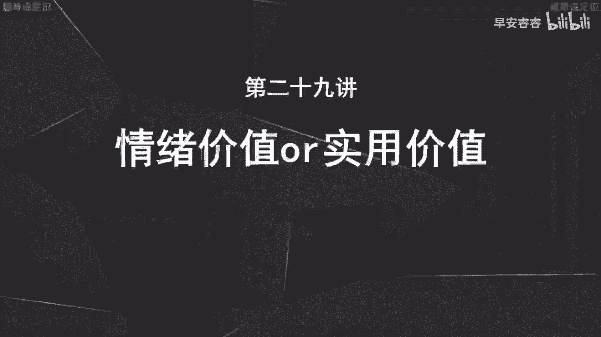

那这节课开始，我们去讲一下怎么样去做我们的选题，那在讲选题之前。

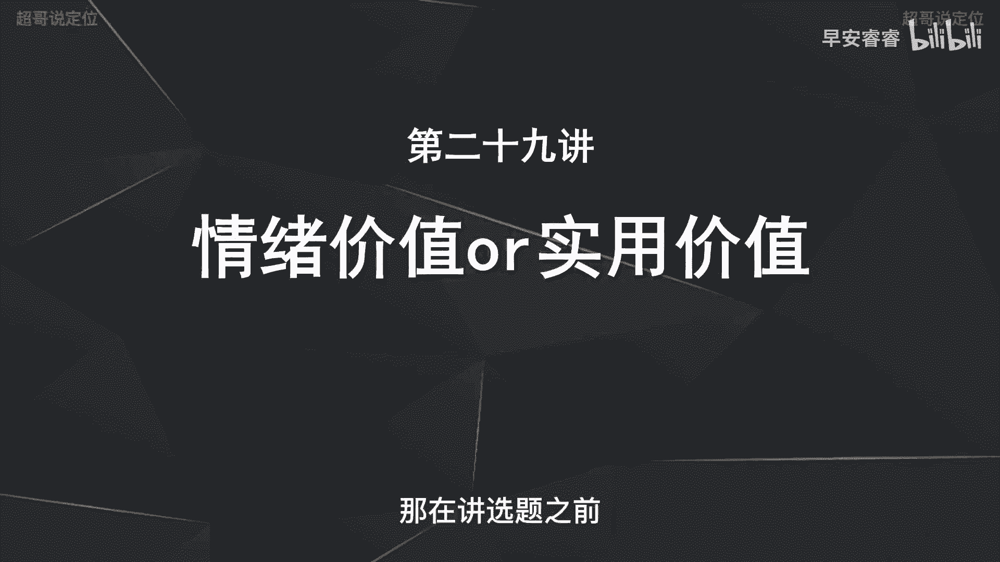

我们先来建立一个逻辑，就是到底你做的选题，要提供给用户的是情绪价值还是实用价值。

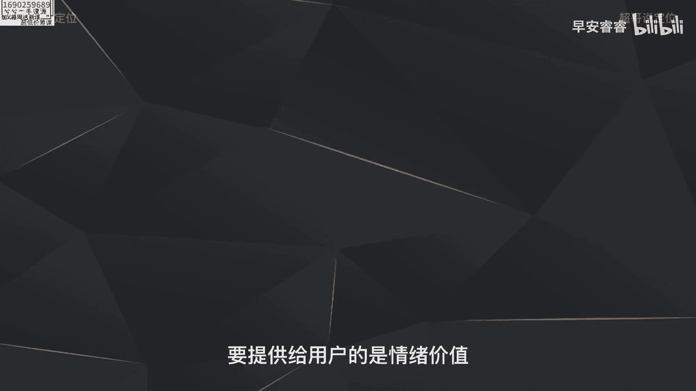

那首先我们先来梳理一个东西，叫做利他性。

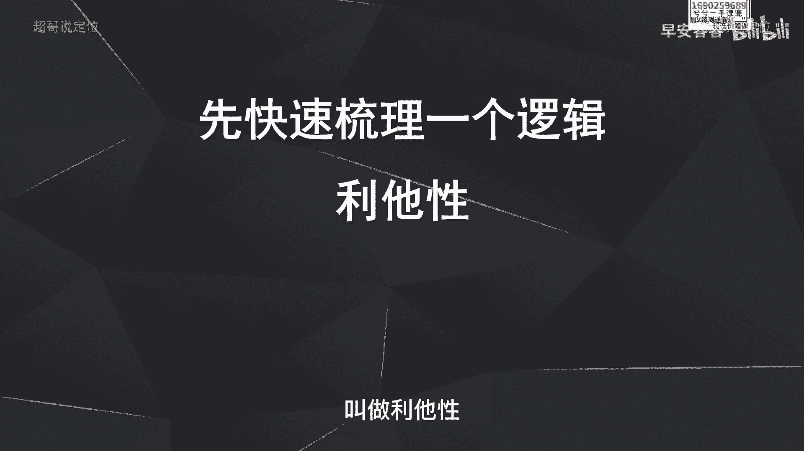

利他性呢什么意思，利他性就是让别人能够获得一些愉悦。

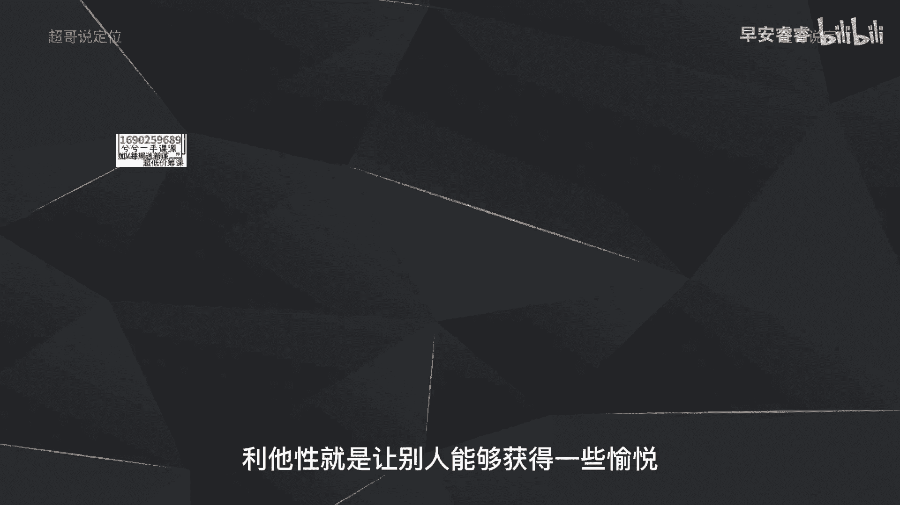

或者让别人能够获得一些收获，因为呢每个人在抖音这个平台，都是一个陌生人啊，这句话什么意思，就平时我们在朋友圈去发一个东西，我们身边的人，还有包括亲戚朋友，都会过来给我们点赞或者评论互动。

原因是因为他们认识我们，对我们有一定的认知，所以会过来他们给我们给一个面子，但是在抖音这个平台，我们每一个人对平台来说都是陌生人，没有人认识我们，没有人了解我们，所以说我们要满足的只有一点。

就是去取悦对方啊，只有让我们的用户，让刷到我们视频的人，能够觉得我这条内容对他来说有意思或者有用，他才能会过来点个赞，或者来关注我好。

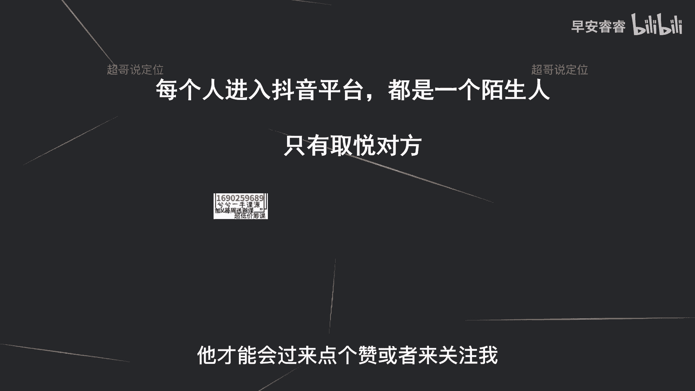

那所以说在抖音要做到第一件事情就是利他性。

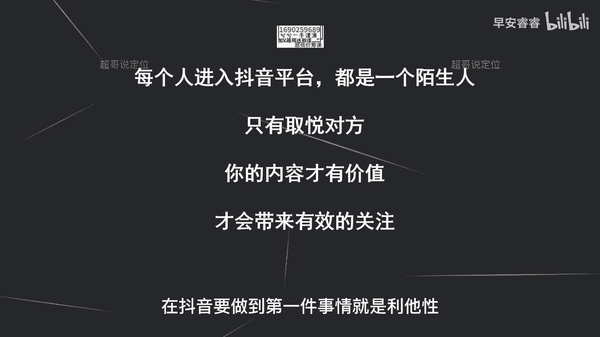

就是你发的所有的内容，一定要给别人能够带来帮助啊，带来一些帮助。

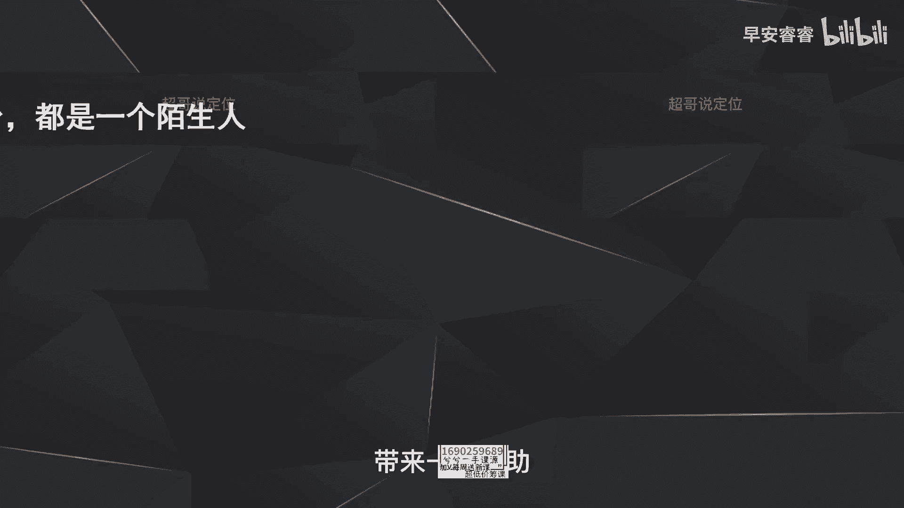

那利他怎么样去做呢，有两个层面，第一个层面是做到有趣。

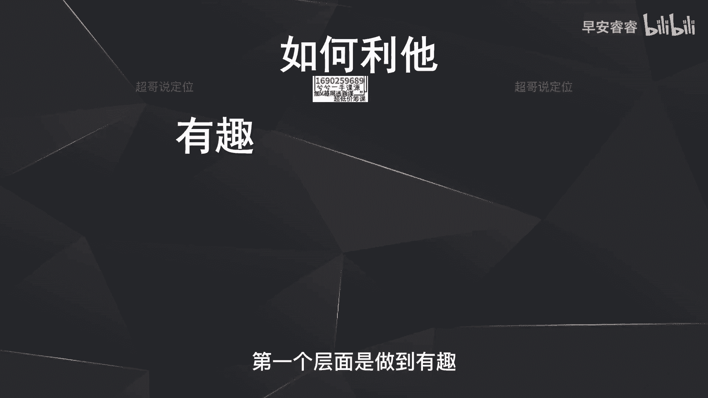

就是你的视频能够给别人提供一些情绪价值，在精神层面能够获得一些满足，比如说你的视频他看完以后会觉得很治愈，或者说看完以后他会觉得很开心呃，很满足，或者会产生共鸣等等等等。

这些都是在情绪上面能够让对方得到满足，那第二点呢就叫做有用。

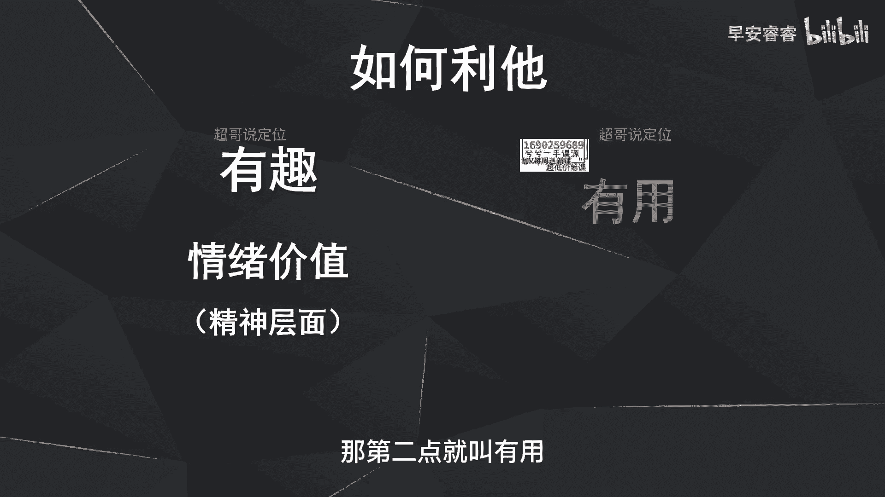

有用的话实际上就是实用价值，就是能够在物质层面让对方觉得切实有用，比如说你做的菜，他跟你学完以后，他觉得唉这道菜他能做的更好，或者说一些美妆技巧，或者说怎么样去装修，怎么样去买车，怎么样去买房等等。

就你提供了一系列的观点，或者说提供了一系列的帮助，给到对方，接着让对方能够获得一些质的改变，这叫做提供的是有用。

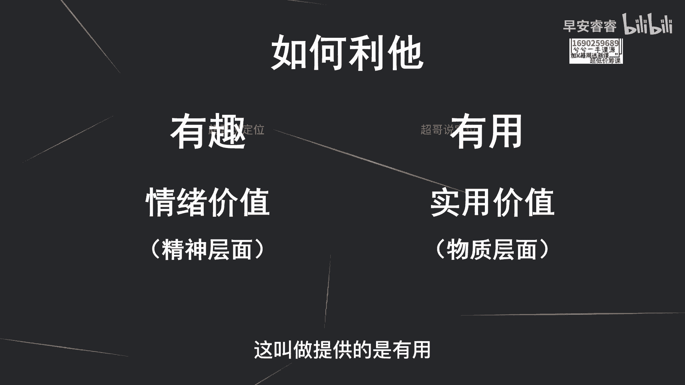

提供的是实用价值，那怎么样能做到有趣呢，实际上就是在精神层面，能够让对方获得一些情绪方面的满足，这个情绪不局限于让他欢笑啊，让他能够产生共鸣，让他能够产生愉悦，那有趣的赛道。

接下来你们就会看到集中在这些赛道，第一是巨型号啊，你看完以后会有一些正能量或者有些共鸣，那第二的话就是搞笑的一些段子，你会觉得很很开心，那第三的话就是音乐啊，你听完以后会觉得身心得到了愉悦。

或者得到了治愈，那第四的就是一些影视解说号啊，你看完这一部分的视频以后，也是一样会觉得很满足啊，或者会有一些共情，那最后一个呢就是舞蹈哦，包括一些颜值达人等等，其实这些都是让你看了以后能够觉得哎。

在精神层面，在情绪上面得到了一些啊满足，所以说做到这些啊，就能够做到第一点的利。

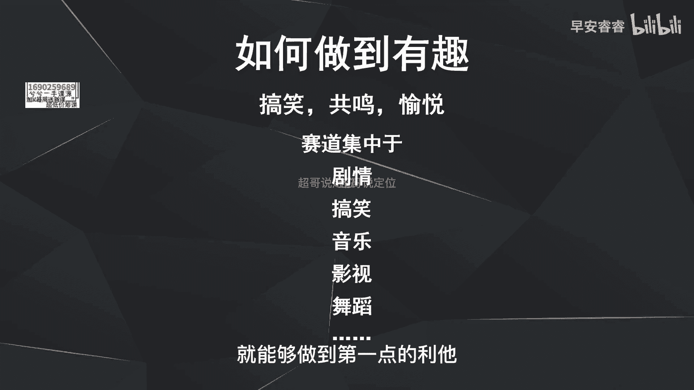

他就是做到了有趣，但是提供情绪价值是很难变现的。

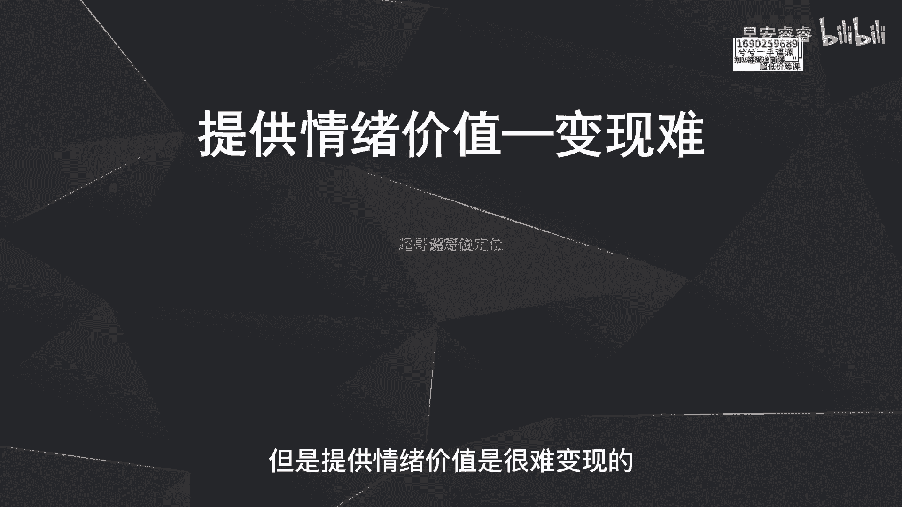

因为啊用户关注你，是因为你让他的情绪得到了满足。

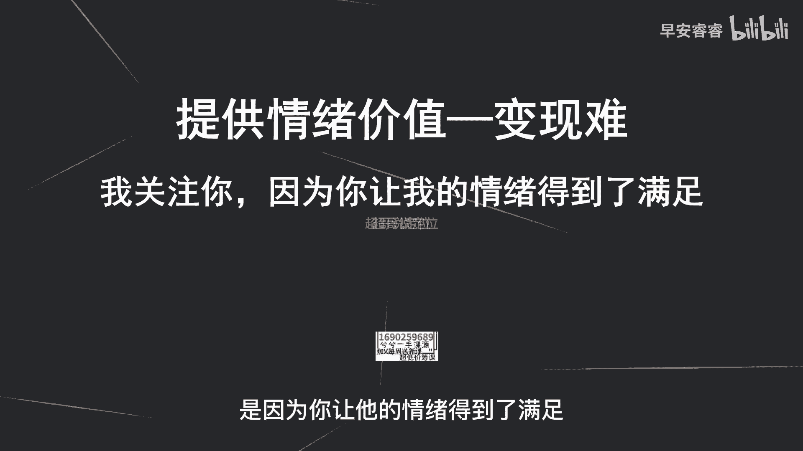

但是呢情绪这个东西是没办法去售卖的啊，比如说你让他开心了，你怎么样去变现呢，啊你让他得到了满足，让他得到了共鸣，让他得到了一些治愈等等，这些东西你怎么样去售卖，而是没有一个载体的。

所以说为什么像搞笑剧情号呃，音乐达人号啊，跳舞的达人号，颜值达人这些等等都没办法做到很好的变现，原因就是因为你提供的是情绪价值，那什么价值会去好变现呢，那就是提供实用价值啊。

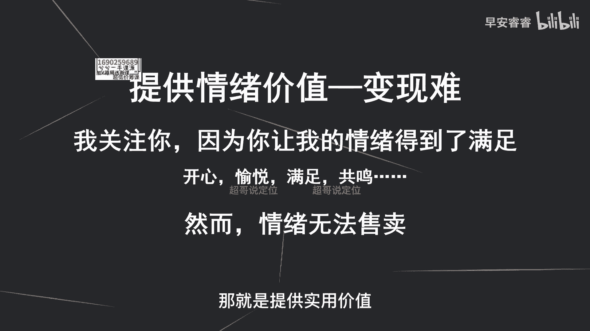

那接着我们来看一下实用价值，那做到有用，就是提供的是实用价值。

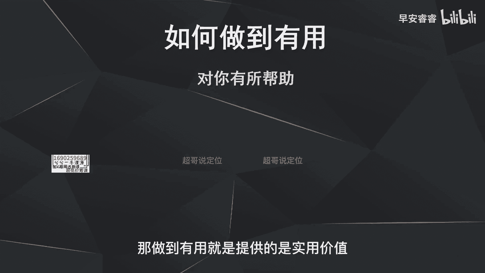

那做到有用，怎么样去做呢，就是你的视频要让他觉得有所帮助。

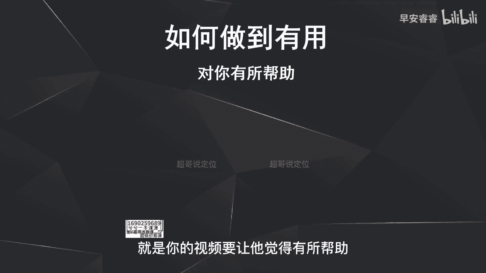

那这些内容啊都集中在一些很锤的赛道，比如说美食赛道，美妆赛道，种草测评以及亲子赛道，包括汽车买房等等，财经你看完这些博主的内容以后，对你在生活中的这些方面有一些实际的帮助。

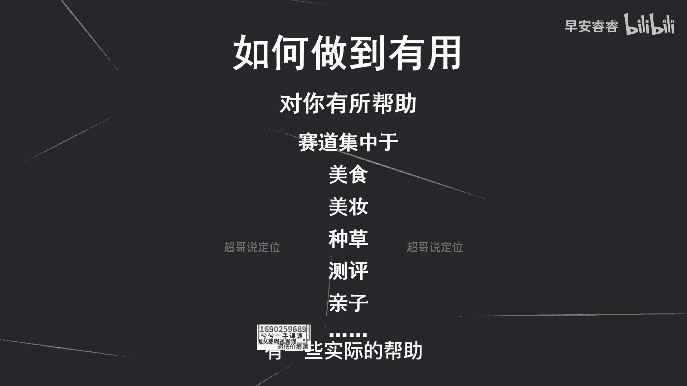

而有一些实用价值，那实用价值呢就会相对来说更好变现。

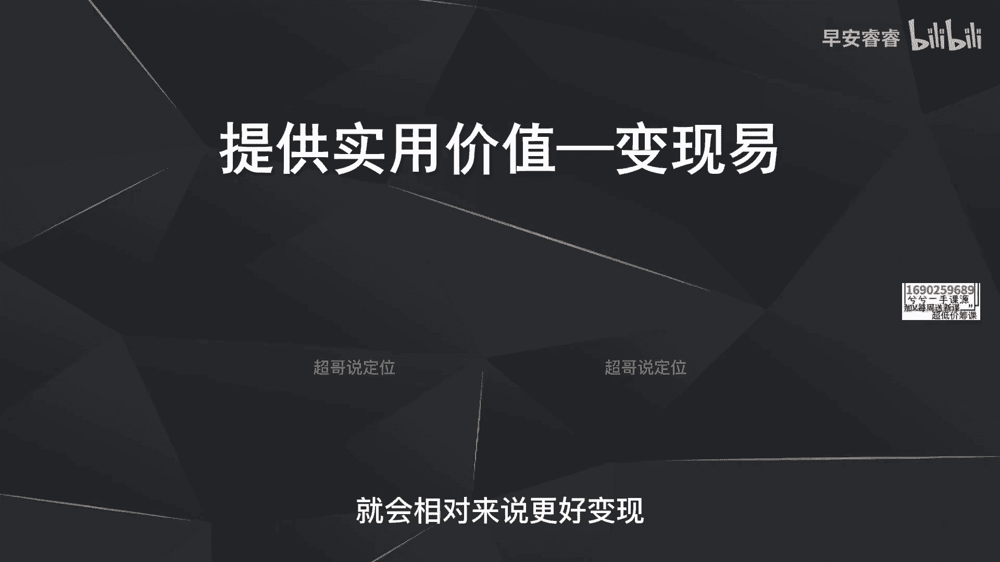

比如说你是一个美食赛道的，那我关注你，是因为你能让我在做饭这件事情上，获得一些技能提升或者学习一些新菜，那美妆呢也是一样，那汽车博主我关注你，是因为你让我在买车这件事情上，能够少走弯路避坑。

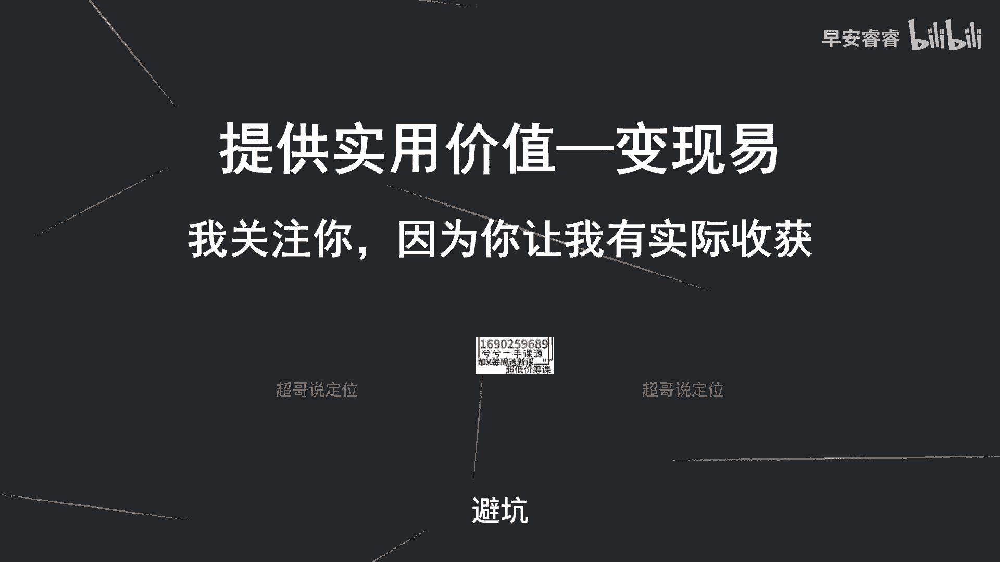

所以说你提供了实用价值，你离变现就更近了一步啊。

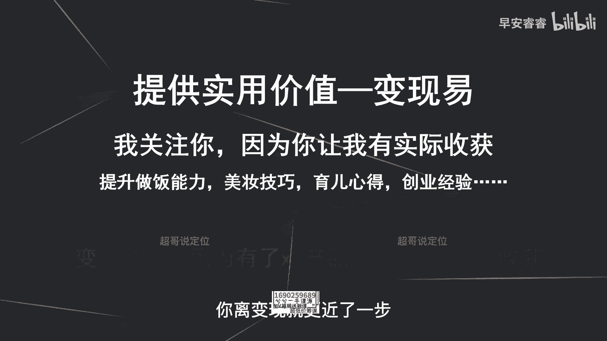

因为变现的逻辑就是我关注你，然后因为你让我能够有一些实际的收获啊，那你的内容里面植入到了有这些产品，就会让我觉得我在这些方面会有所提升，比如说美食赛道，那我植入一些调味品，用户就会觉得有了这些调味品。

我的做饭技巧啊，做饭的能力就会有所提升，那这个产品接着就可以带出去转化掉，那美妆也是一样，包括汽车买房，财经家装等等等等，那这些垂类的赛道，因为它提供给用户的是实用价值，所以说他会离变现会更加的近一点。

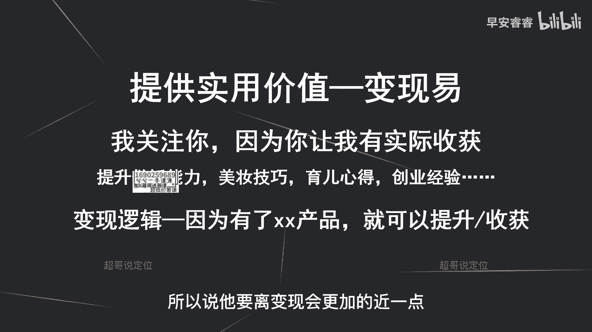

那从变现的角度出发的话，我们一定要去做的选题是什么。

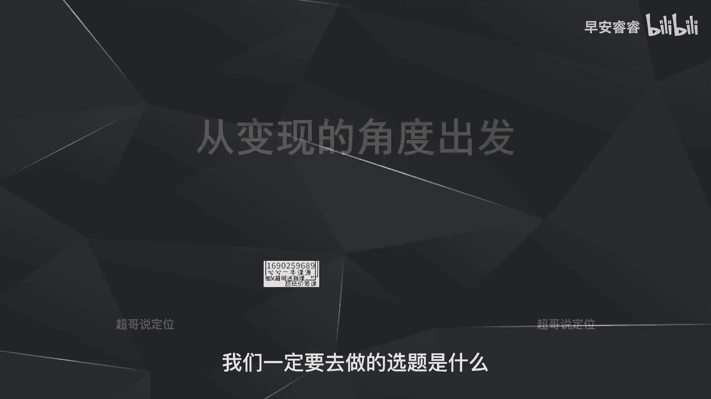

我们一定要去做的选题，是给用户提供的是实用价值，而不是啊情绪价值，因为我们刚才一直在说情绪价值，实际上他没有一个变现的载体，所以说它很难变现，那从变现的角度出发，因为我们每一个新手。

做好都不是为了啊打发时间，或者去找自己的存在感，而是去获得最直接的变现，所以说我们要去做的事情，就是要去提供实用价值，那今天这节课我们理清楚，到底要去做实用价值还是情绪价值之后。

那接着我们再来说怎么样去做选题，大家就会更清楚了，因为刚才一直在说，一定要去做的事情是什么，一定要去做的事情是利他啊，愉悦对方，让对方觉得有用，那让对方有用的情况下，两个一个是有趣，一个是有用。

那有趣提供情绪有用，提供的是实用价值，那接着就很清楚了，我们要做的选题，第一要去利他啊，让对方觉得有用，第二让对方去觉得切实有用，就是去输入一些啊实用价值，那选题怎么样去做，我们从下节课开始来说。

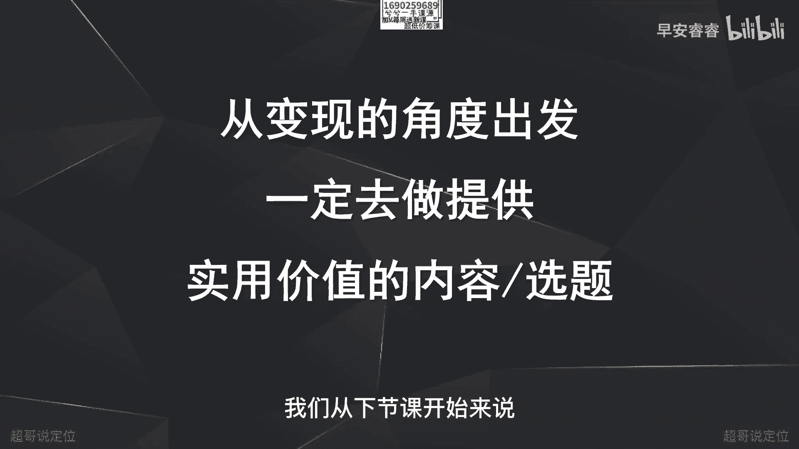

我是你们值得信赖，有问必答的超哥。