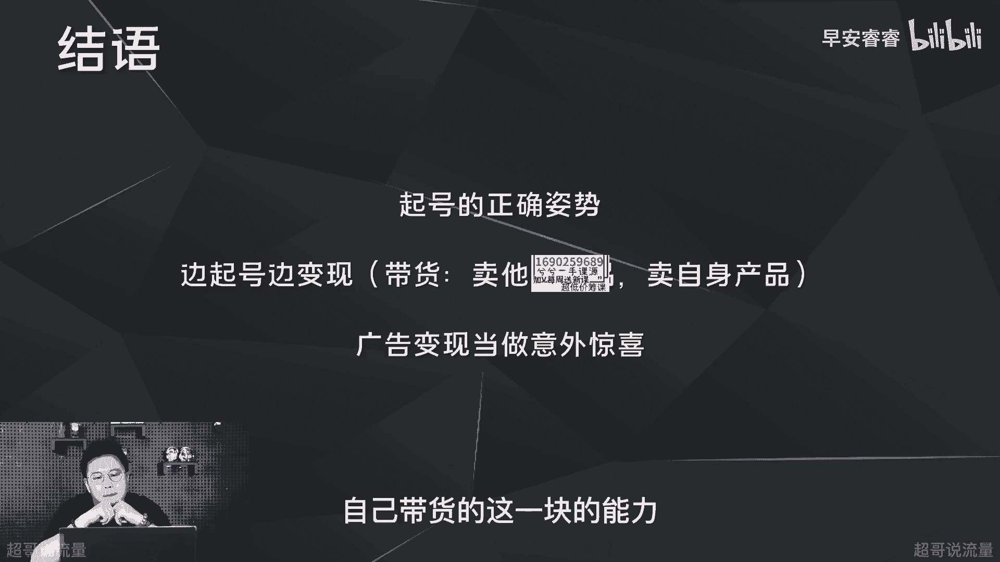

# 085 2023短视频起号·差异化定位课：0~1做懂抖音（定位+内容+投流+运营） - P2：第02节2 做对号的第一步，选对赛道 - 早安睿睿 - BV1Am421T7br

好今天开始我们的第二节课，就是去聊一聊怎么样去选赛道，那选赛道其实背后的核心目的只有一个，就是去做出来一个持续稳定变现的账号，那做出来这样的一个账号的第一步又是什么，第一步就是去选对赛道啊。

我们会看到很多百万千万的粉丝的博主，包括剧情号，游戏解说号，影视解说号，唱歌跳舞的号，颜值达人号，这些账号为什么没办法去做到持续稳定的变现，严格来说有两个方面的原因，第一方面的原因呢就是他们选错了赛道。

本身这个赛道没有好的变现模式，没有好的变现产品，第二方面呢，有些赛道它能变现，但是他对于粉丝量的要求的门槛太高，比如说在搞笑剧情，这个赛道100万粉丝才会有一个基础的变现，你要想要一个持续稳定的变现。

你至少要上两三百万才有可能，所以说很多账号没办法变现，第一步就是因为赛道选错，第二步呢是因为账号定位的问题，账号定位呢那就是你的画像不够精准，画像不能够支撑你变现，以及你的粘性可能不足。

以及后续的内容经营的问题，包括投流，后续我们再说，那我们今天主要先去聊赛道这件事情，那在选赛道这件事情上，一定是选择大于努力的啊，还是那句话，比如说唱歌这个赛道。

音乐这个赛道没办法去做到一个很有效的变现，那你唱的再好听，你唱的再多，别人每天发两条作品，你发十条作品，发20条作品一样没办法去变现，那是因为这个赛道本身没有好的变现模型，没有可复制的变现方式。

那第二方面呢，选对赛道的话，实际上你距离变现成功已经近了30%，赛道是账号定位的第一步，那账号定位是变现的最核心的关键，所以选择赛道一定是最重要的一件事情，那刚才说了那么多，赛道和变线之间的关系。

那这一期我们首先先去聊一聊抖音上面。

目前主流的变现方式有哪些，那第一种的变现方式呢就是星图广告，顾名思义就是接广告，那新出广告呢目前来说的话，报价啊1000到100万不等，根据粉丝量级来，比如说如果我现在满足10万的粉丝。

那我可能报价就是1000，因为我先要满足有广告，然后慢慢我的广告报价再往上面提升，那他对于我们的门槛要求是什么，就是要求必须要满足10万粉丝量的积累啊，没有10万的粉丝量，你连这个权限都开通不了。

而且目前星图广告的广告主范围相对比较有限，集中在啊这些范围，美食家电啊为主，那他的展现方式呢一方面是软性植入，比如说左边这个视频，早上艰难爬起来，把冰化水磨粉搅拌，糯糯的香芋泥呢淡淡的清香味道很好闻。

差不多20分钟偏向于在生活场景之下，然后以好物种草的这种形式去输出，这个品牌的产品的一些卖点，第二类呢就是硬性广告，比如说这种不论蓝牙音箱的性价比，真的还得看博爱，这是博爱电竞蓝牙。

很多测评博主或者说数码赛道的种草博主，会以这种形式去接广告，那星图广告呢相对来说门槛比较高，但是它后续的收益实际上是比较稳固。

而且比较可观的，第二种变现方式呢就是视频带货的方式，那它的收益就是以销售额去提佣，这个佣金呢差不多在10%到40%，甚至有一些商家跟这个达人合作，比较好的情况下，会给到比较高的定向佣金。

甚至50%都是有可能的，那它的开通门槛就是粉丝量的要求，必须要满足1000的粉丝量啊，蓝威除外，蓝威是直接可以开通橱窗，那这一块要提两点，第一方面呢就是视频带货的好坏，取决于这个产品本身的性价比。

所以你在抖音上面现在看到卖的比较好的，反而是一些九块九这种比较低价的产品，同时呢它跟产品的卖点也会做强关联，就是有一些产品它具备唯一性，比如说我们去年合作过的啊，左点的一个睡眠仪。

那在这个平台上面只有他在卖，那所以说它的产品的转化相对来说就会比较好，第二方面呢就是你挂了小黄车以后，你的视频推流机制会发生变化，我们目前一条视频的流量好坏，取决于我们的播放数据，比如说你的五秒完播率。

你的整体的播放时长以及互动数据，那一旦你的视频挂了小黄车之后，那你这条视频的推流就取决于，每100个流量进来以后，你能转化多少单，所以说目前来说，视频带货这种方式慢慢的被大家给抛弃了。

那第三种的变现方式呢就是直播卖货，直播卖货它的收益两方面，像头部的主播，他可以收坑位费，那对于我们新手旗号来说的话，他是佣金，这个佣金呢跟刚才橱窗带货也差不多，10%到50%销售额去集佣。

它的门槛呢也是一样，就是你要去开通橱窗或者抖店，那像橱窗的话也一样，也需要有1000的粉丝量，那直播卖货这里还是要提三点，那第一点呢就是它跟IP自身的销售力和感染力，强关联，就是这个IP本身能卖货。

而且销售感染力很好，那他一定卖得会更好，第二方面呢就是粉丝的粘性，第三方面呢供应链啊，供应链什么意思，像我在成都，成都，如果我要是去卖一些杭州的产品，我会卖的很痛苦，因为杭州的带货。

一定会在价格上面比我做的更有优势，那第四种呢就是星图任务，星图任务的收益呢就是按次计费啊，不管是根据播放量，下载量还是安装量，就是你的视频里面植入了这些品牌的产品，根据你的播放量。

或者你这张播放量带来的下载来，安装量去进行结算，那这一块的话其实对于百万的粉丝，而且他们跟粉丝的粘性还比较高的情况下，可能会比较适用啊，简单来说什么意思，就比如说你只有10万的粉丝，你去发这样一条视频。

播放量一两千，我跟你说一两千的播放量的情况下，你的这个收益可能也就几块钱，完全没有意义，但是如果你上了百万的粉丝体量，而且你跟粉丝粘性又比较好，那你的每一条视频的播放量，至少都是几10万甚至上百万。

那你的收益也会比较好，而且粉丝可能也不会觉得，你天天发广告会有什么问题。

第五种呢就是直播打赏，那直播打赏的收益呢就是音浪的50%，简单来说就是你的礼物可能会有1000音浪，那这个1000音浪，你实际上你只能提出来50%，另外一半的话在抖音，而且这个音浪和呃。

人民币之间的兑换是十比一哈，这个要注意一下，那这一块还是要去强调一下，目前这种形式还是在娱乐和颜值主播为主啊，而且跟主播自身的能力，还有粉丝粘性会做强关联。

那最后达总来说哈，正确的起号姿势是什么，正确的起号姿势啊，一定是边起号边变线，就是在起号的过程中，你就要开始尝试去卖货，这个卖货呢一方面可能是卖别人的产品，去拿佣金，一方面呢可能是卖自己的产品。

那卖自己的产品又分两类，第一种你可能是一个商家企业，那就去卖自己的产品，第二种呢就是卖自己的课程，卖自己的经验沉淀，卖自己的服务啊，比如说现在抖音实际上不管是教插花，家庭教育，然后感情课啊，教PPT。

然后包括交财税啊，交各个方面，只要你在这个垂类有一定的经验沉淀，而且这个经验沉淀别人觉得你是OK的，那你这个产品一定在抖音上面能卖出去，所以为什么说一定要去做自己的IP，要去做知识付费啊。

它相对来说对你的变现的要求就会比较低，而且比较的稳固，那还有一种变现方式，广告对吧，新手起号你不要寄望于广告，因为广告会对你有一个很大的要求，就是10万的粉丝量，前年做号的时候也一样啊。

第一个号我们当时也是希望去做广告变现，但做了两三个月以后啊，还是只有两三万的粉丝，很难，最后整个团队各方面的积极性都受到了影响，所以新手起号的时候，不要把广告当成你的主要变现方式。

因为这一块这个10万的粉丝量，对于一个新手小白，对于任何一个赛道来说，至少都需要差不多两到三个月的时间，所以说我们在做旗号的时候，一定要考虑边旗号边变现，在这个变现的过程中，然后尝试去卖一些东西。

然后去检验一下自己的粉丝粘性，然后也去磨合一下自己带货这一块儿的能力。

整体就是这样。