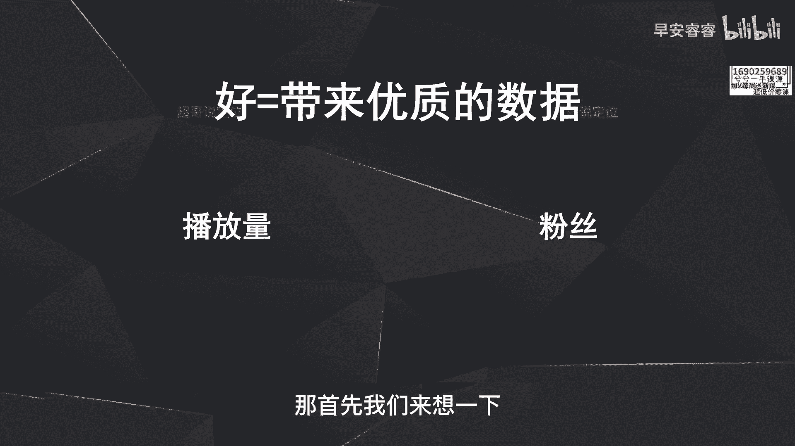

# 085 2023短视频起号·差异化定位课：0~1做懂抖音（定位+内容+投流+运营） - P30：第30节30 如何做出好的选题（1） - 早安睿睿 - BV1Am421T7br

好今天我们来讲一下怎么样去做出来好的选题，因为新手在做短视频的时候，会遇到一个最常见的问题是什么，就是不知道该拍什么啊，或者说不知道拍什么样的内容，才能够去获得更大的播放量，那我们今天就来梳理一下。

怎么样去做出来好的选题。

那首先我们先来明确一个概念，到底什么叫做好的选题。

就好的标准到底是什么，那最早我们在分析数据这一块有说过。

在抖音这个平台上好，意味着你的作品数据好啊，那这个就很好理解，就是好的选题，好的作品一定就是你本身这条视频，无论是五秒完播，整体完播播放量，还有包括互动吸粉啊，这些都还比较不错，那才能叫做好的作品。

而不是我主观意义上认为的，这个作品的选题比较好，那建立了这个认知以后，那什么样的数据叫做好的数据呢，实际上就是两个方面，第一就是你的播放量，可以就是你这条视频发出去以后啊，不管是2000的播放量。

甚至10万的播放量，还是上百万的播放量，就播放量啊，收看的人比较多，那第二个呢就是能够给你带来粉丝，因为我们新手在起号的实际上就两个目的，第一个突破播放量，第二个就是能够获得更多的粉丝。

那在这两个逻辑之下，我们接着来梳理一下，什么样的选题能给我们带来更多的播放量，以及什么样的选题能给我们带来更多的粉丝，那首先我们来想一下。

什么样的选题能给我们带来更多的播放量呢，那第一个方向就是用热点去做切入啊。

因为热点的话题本身就自带流量，所以你用热点话题去切入以后。

它本身的播放量就不会太差，那热点包括哪些呢，第一就是热点的事件，那每天不管是在抖音上面还是在微博上面，都会有一些热点事件的排行啊，需要去看怎么样去蹭，那第二呢就是一些热点的话题啊，什么叫做热点话题。

就是这件事情可能今天不是热点，但它依旧是一个啊比较热门的话题，比如说每到夏天都会遇到驱蚊这件事情，那它就是一个每个夏天的一个热点话题，那第三类呢就是热点人物，热点人物就是大众的印象中。

认知度很高的人物啊，不管这些是一些虚拟人物还是一些啊历史人物，还是一些现实人物啊，比如说啊许仙啊，这些都算是热点人物，那这些热点人物你去做呢，第一是你不需要再去教育客户，客户知道他是谁啊，他也会很厉。

你到底要怎么样去把它做出来，怎么样去结合，第二呢就是热点人物，他本身是自带话题或者自带流量的啊，那你这样去做结合的话，你的视频的播放量啊也会蛮高，而第四种呢就是热点的元素。

那我们接下来举例去说一下，怎么样选题去做热点的切入啊，我举两个方向的案例，第一个方向呢就是口播类的一些案例啊，口播类就是一些知识科普类的一些账号，怎么样去做热点切入那口播账号呢，实际上就是就事论事啊。

你用这个热点切入之后，说清楚为什么EG怎么办啊，而且一定要说怎么办的，原因就是我一直在强调，就是利他，就你这条稿子说出去以后，能够让别人获得什么样的收获啊，就是怎么办，一定要多说，那第一个例子呢。

就是如果现在做一个家庭教育啊，我要去切的话，我可以用孟母三迁这个事件去切啊，就是他本来是一个热门事件，一个热点事件，大家都有认知，所以说我就可以用这个事件去做切入，去做我这个观点的输出，那第二个案例呢。

就是我可以去结合一些明星的婚恋史啊，去分析啊情感，那情感再到这样去做的话，你本身的流量也会蛮高啊，因为你是用这种自带流量的，明星的婚恋史去做切入，然后用户都很八卦，都很好奇啊，然后你去做切入。

然后接着去分析，那你的流量就会蛮高，那第三个案例呢，就是如果你是做一个餐饮创业类的账号，你可以用喜茶或者南火锅啊，或者说呃星巴克这样的品牌去做切入，原因就是因为这些热门品牌也是在大众认知中。

他们是知道这个品牌的，以及也会好奇这些品牌到底是怎样走到今天的，那你用这些案例去切入你的视频，也是自带流量，那这是口播类的账号，怎么样去做热点的切入，那接着来讲一下非口播的账号，怎么样去做热点的切入。

那非口播有哪些呢，那比如说生活的VLOG，比如说美食的记录，比如说亲子教育啊等等等等，那非口播的账号怎么样去做热点切入呢，就实际上很简单，就是用热门的元素或者人物去做切入。

那比如说美食赛道，你可以看到很多人都在做的一种形式是什么，就是中华小当家里面的这些美食的菜谱的复原，实际上它就是去结合这种热门元素，去做美食教程的输出，那第二种呢美妆，那美妆赛道呢。

很多的博主都会去做这种热门影视人物的，妆容的复刻，也是去蹭热门影视这个点去做切入，那第三个案例呢就是如果你要去做数码测评，那比如说IPHONE14出来，你可以去做测评啊，然后下一个新品出来。

你可以去做测评。

这些都是去用热点去做切入，你要记住用热点去做切入。

实际上就是一点热点本身是自带流量的，而且呢观众已经有认知了啊，观众对于这件事，对于这个人物他已经有认知，不需要你再去教育哦，不需要你再去解释，你直接用这个热点直接去做切入，然后输出你自己的观点就行了。

对于这一部分的热点，要不然都会有一些共鸣啊，要不然都会有一些好奇心，比如说刚刚提到案例啊，喜茶大家第一对这个品牌本身是有共鸣，第二也会很好奇这个品牌是怎么起来的啊。

还以及刚才举过的其他案例，比如说孟母三迁也是一样。

大家第一会共鸣，第二也会好奇你会怎么样去说对吧，所以说热点本身不需要再去教育。

而且用户他本身在自己的内心是有共鸣，而且有好奇心的，那今天这节课讲的就是选题的第一个方向，用热点啊去做切入啊，那这节课比较简单，那我们下节课去说第二个选题方向啊。

我是你们值得信赖，有问必答，超哥啊。