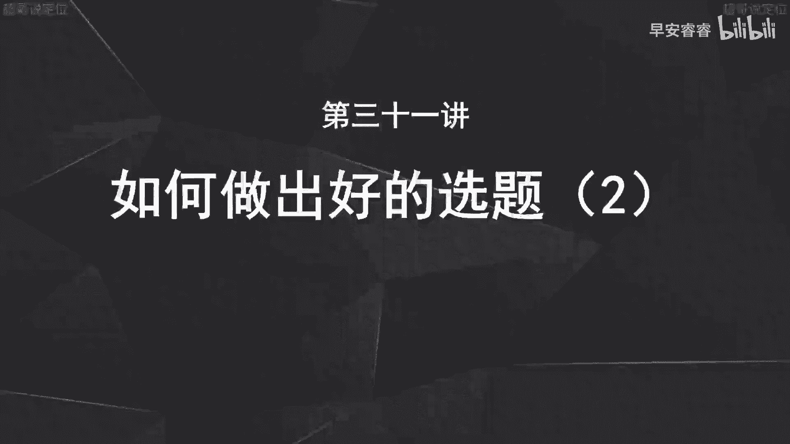
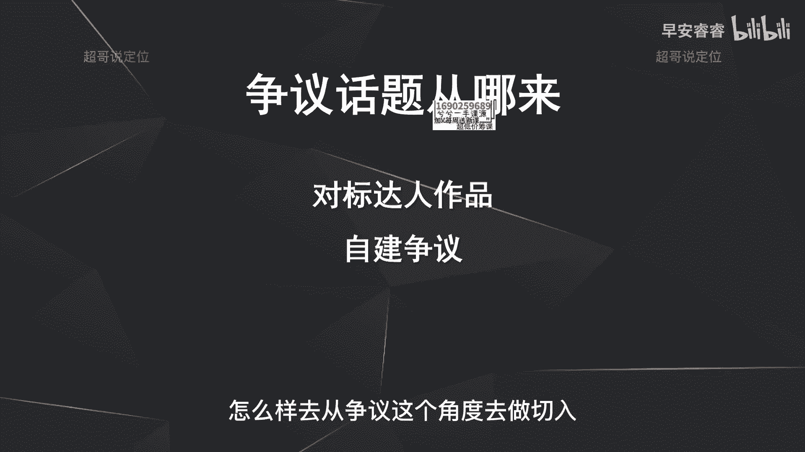
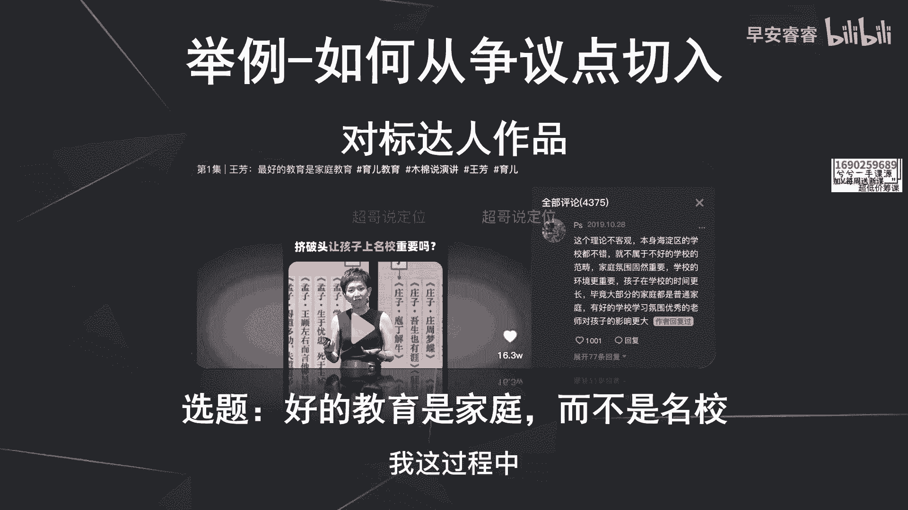
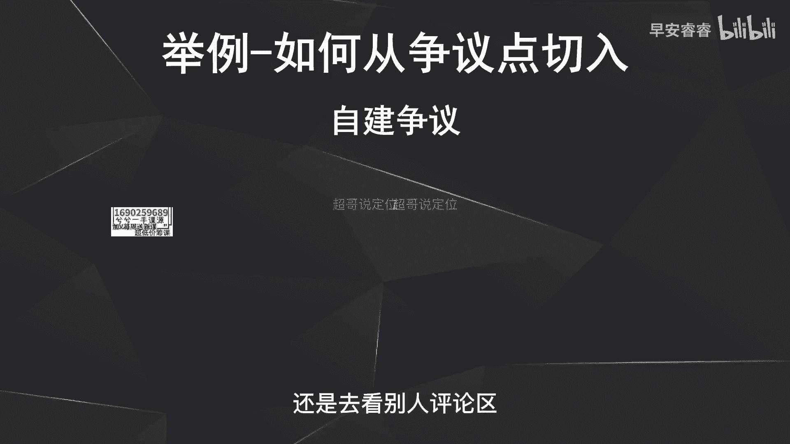
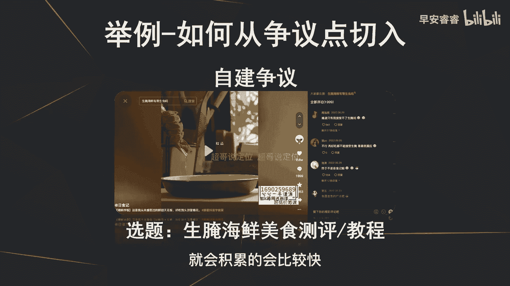
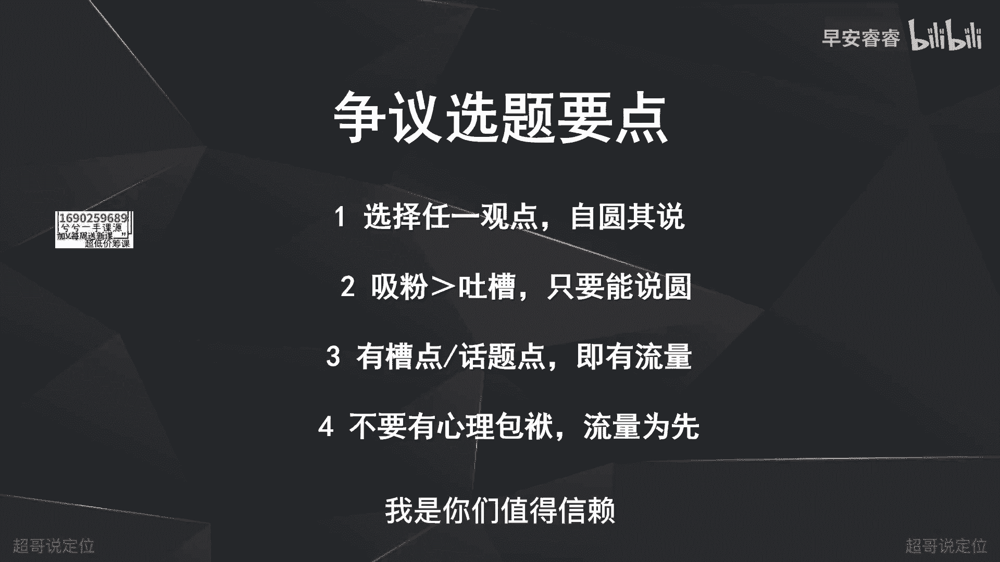

# 085 2023短视频起号·差异化定位课：0~1做懂抖音（定位+内容+投流+运营） - P31：第31节31 30 如何做出好的选题（2） - 早安睿睿 - BV1Am421T7br

那今天我们来讲第二个选题方向啊，第二个选题方向呢是什么，就是用争议去做切入，因为本身争议的这些话题也是自带流量的，那争议话题从哪些地方来呢，啊，实际上第一部分就是去找一些对标达人的作品。

去看他们的作品里面有哪些话题，是评论区里面啊，互动比较高的，而且是有一些争议的啊，第二方面呢就是自己去建立一些争议，接着我们来举例说一下选题，怎么样去从争议这个角度去做切入。

那第一个方法呢就是去看别人的作品啊，里面的评论，刚才有说过，比如说这个作品他讲的是让孩子上名校重要吗，那这里可以看到这条视频底下的这条评论啊，有70条回复，还有啊1000多个赞啊，就是很多人会对于小孩。

到底是家庭教育会更重要，还是名校的教育会更重要，就可以看到出现了争议，那这个争议呢实际上就是我刚说的，就是你要去看别人的评论区，看哪些额选题，看哪些视频底下评论比较热闹啊。

而且会有那种正反的这种啊激烈的争辩，那这个争议点就存在，那这个争议点存在以后，实际上你就可以拿去做选题啊，比如说我要去做家庭教育，那我看完这个评论区了以后，那我就可以做出来这样一个选题啊，而且这个选题。

因为他是正反两个观念的这种pk嘛，那所以说你在做选题的时候，一定要啊选择一个方向，能够站得住脚，而且能够自圆其说，就是你不能两个都去说，就是你不能说到底是好的家庭教育，到底是家庭带来的还是名校带来的。

你不能在这中间摇摆，你一定要笃定的给出一个结论，就像那我去做这个选题的话，可以去做就是好的教育一定是家庭带来的，而不是学校带来的，那我的视潮视频底下一样会有很多的争议啊，但是这个无所谓。

因为有了争议自然就会有流量，但是有了流量之后，我这过程中一定会吸引一些精准的粉丝啊。

粘性比较高的粉丝，那第二个呢就是我刚说的自建争议，那自荐争议首先也是第一点，就是你要去看别人评论区，还是去看别人评论区。

你就会发现啊，就是比如说美食赛道这个账号，日食记，他的评论区呢，就会有很多人在吐槽生腌这件事情啊，那我如果要去做一个美食赛道的账号，那我在起号的时候，我就去做这种生腌海鲜的这种美食教程。

就是因为我刚说了，争议本身带话题，带流量，那有流量这个过程中，实际上，你的第一波的粉丝就会积累的会比较快啊。

那做争议这个点的切入呢，那你的选题要注意几个方向，第一个方向就是我刚说的这争议的点，他一定是正反两个方向都在pk的啊，他这种观点是有冲突的，那你不能两个都去说，你只要把一个点说透，而且自圆其说就行。

刚才举的那个例子，到底是家庭教育好还是名校教育好，你只需要去站住一个方向，家庭教育好，那你只要去把这个点讲清楚就可以，而且自圆其说能够圆得住啊，那就没有问题呃，那第二呢就是很多人会担心就是争议。

很多人就会来骂啊，没有关系，因为你只要做了以后，你就会发现什么，你就会发现只要你能自圆其说，那你这条视频挺你的人一定会大于骂你的人啊，那这个过程中一定关注你的人大于骂你的人，那你的目的就达到了。

第一就是你流量也有，第二你的粉丝也积累出来，那在这两个前提之下，那实际上那你去做这个选题，你就不需要去考虑太多了，因为我们本来说了嘛，我们做选题的目的就是为了去做出好的选题，好的选题怎么样去界定呢。

就是第一播放量要高，第二就是能有高效的吸粉的能力，那这两点都满足，那我这个选题更要去做，那第三点呢就是只要有槽点，有话题点，他就自带流量，那第四呢就是刚才说过哈，就是不要有些心理负担。

别人会来骂你或者怎么怎么样，或者会不专业，怎么怎么样啊，这些都没有任何的影响啊，只要你能够自圆其说，让别人觉得哦，你在某一个逻辑上能够啊说得准，能够说得圆，是专业的，那你的粉丝量一定会大于你的吐槽量啊。

就是我刚说的第二点，所以说做争议的选题就不要考虑太多啊，就去梳理评论区里面这些呃话题点啊或者槽点，然后就把梳理出来，然后自己在起号的这个阶段梳理出来，那么20多条，30多条，然后逐个逐个去做。

那你的流量一定能够突破的会比较快，那这节课的话我们讲的是第二个选题方向，就是用争议点去做切入啊，那下节课我们去讲第三个方向，我是你们值得信赖。

有问必答。