# 085 2023短视频起号·差异化定位课：0~1做懂抖音（定位+内容+投流+运营） - P32：第32节32 如何做出好的选题（3） - 早安睿睿 - BV1Am421T7br

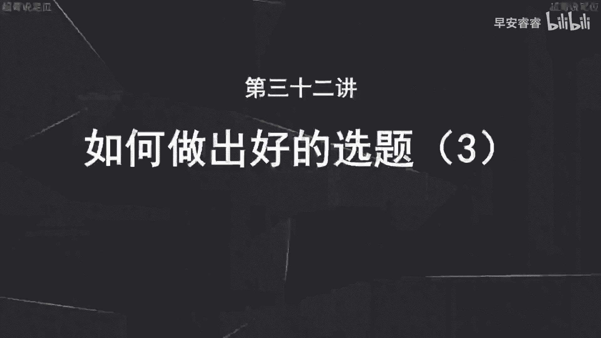

那今天我们进入到第三个选题方向，第三个选题方向就是去用需求点去做切入。

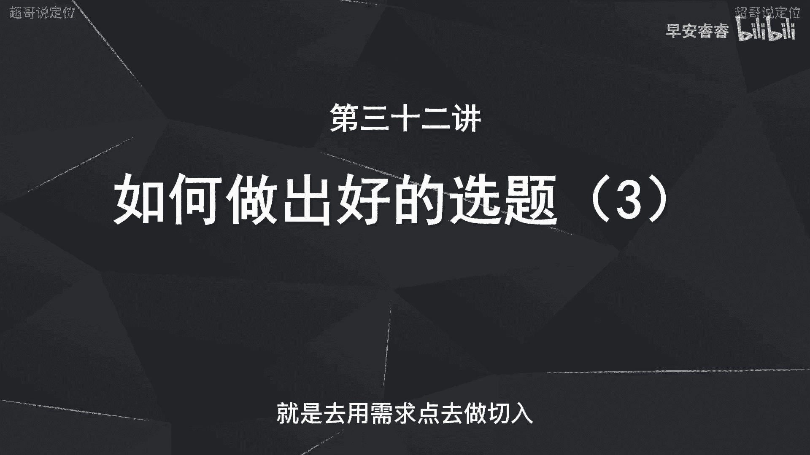

因为需求点本身它就自带流量，而且会带来很多的关注，因为所有的需求都是用户没有去解决的啊，都是一部分或者一群人没有去解决的一个痛点，那你去把这个痛点给他解决了，讲清楚了，让他觉得切实有用了。

第一你的互动数据啊，赞分享收藏这些本身不会差，你的流量就不会差，第二呢，就是他会觉得你会给他带来实际的啊帮助。

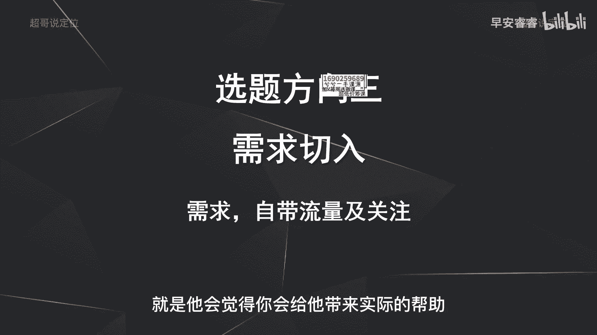

那他就会给你带来什么，他就会给你点个关注，就会有更多的粉丝，那我们首先先来看一下需求从哪里去找需求，实际上要去找的话，我们总结出来就三个方向啊，第一个方向呢就是你的生活，你的工作的日常啊，举个例子。

比如说你是一个做美食教程的博主，那你去看一下啊，比如说你在平时吃饭的过程中吃到什么啊，特别好吃的私房菜啊，特别猎奇的一些地方菜，那你去把这个教程学会，然后最后给输出出来。

那如果比如说你是做一个呃创业指导的，那你在平时跟客户，或者跟自己的同事接触过程中，发现大家有哪些点啊是比较痛苦的，没有解决的，或者说问的人咨询的比较多的，那你就随时拿你的手机把它记录下来。

然后接着去做深入的选题，所以第一个方向就是从你的日常来，第二呢就是从你的网友和粉丝的互动中来啊，就是很多网友会来咨询你这个问题，或者一些用户粉丝会再来咨询你这个问题，那咨询的人多了。

那就意味着这是一个聚焦需求点啊，那你去把这个聚焦的需求点，这个话题给他解开啊，解开说清楚啊，那就会带来新一波的粉丝，那第三个方向呢，就是还是那句话叫做看别人的评论区。

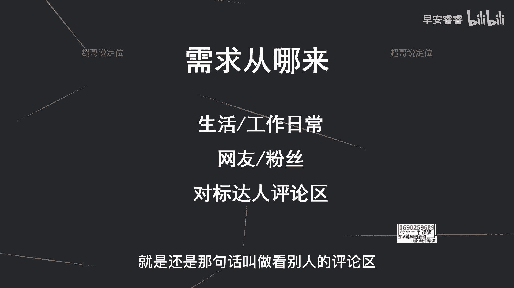

那我先来模拟一下，怎么样去从别人的评论区找选题。

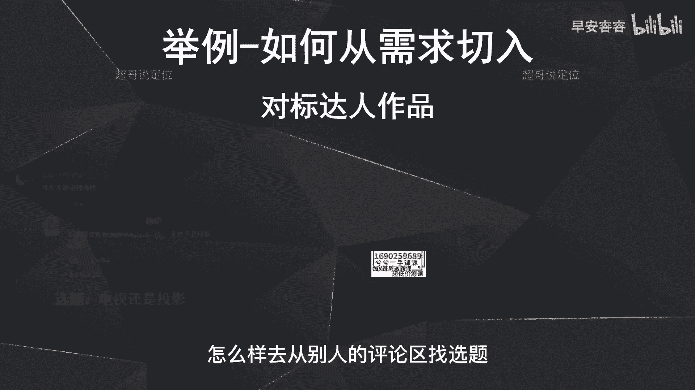

那看这个评论区啊，这个是一个讲家装的一个号家庄林老丝儿，那这个评论区就会有人问他，到底是买投影好还是买电视好，那我就明白了嘛，那这是一个人的需求，但是它也代表的是一群人的需求，我就可以去做这个选题。

叫做电视还是买投影，就新家装修的时候，到底是买一个电视还是买一个投影。

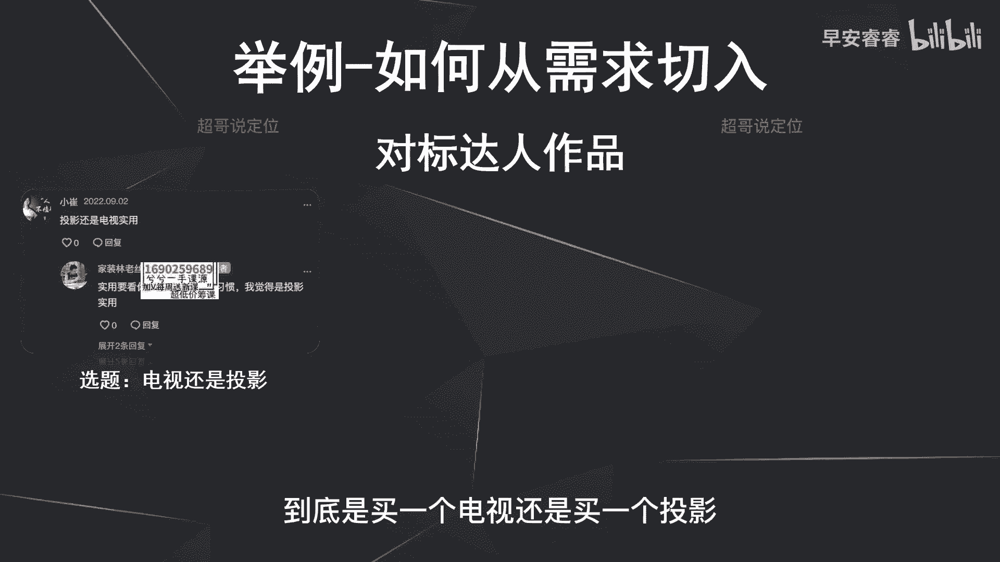

然后把它说清楚对吧，那第二个呢你去看一下，比如说这是一个啊财经的一个博主的评论区，就很多人会去问啊，你可以看到16条回复，就这个问题也很激烈讨论的，就很多人会去问。

就是怎么样去看这个定期的重大的疾病保险，那我也可以去做一个选题，叫做重大的疾病保险怎么样去选，就是评论区去看需求点在哪里，然后这个需求只要有人问啊，而且这个问的问题之下可能会有更多的评论。

或者说更多的互动，那就意味着这个需求点，实际上是很多人的一个痛点，那就去把它解开。

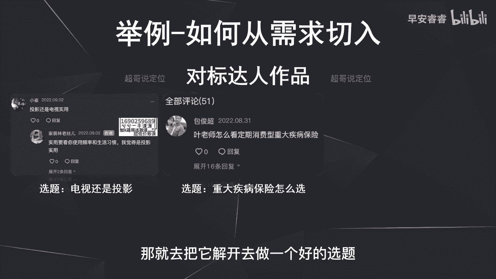

去做一个好的选题，那这个也是一样的，就是美妆博主之下，就有人会去问，这个大喵能不能出平价的粉底液的建议，那就可以去做平价粉底液的这个测评。

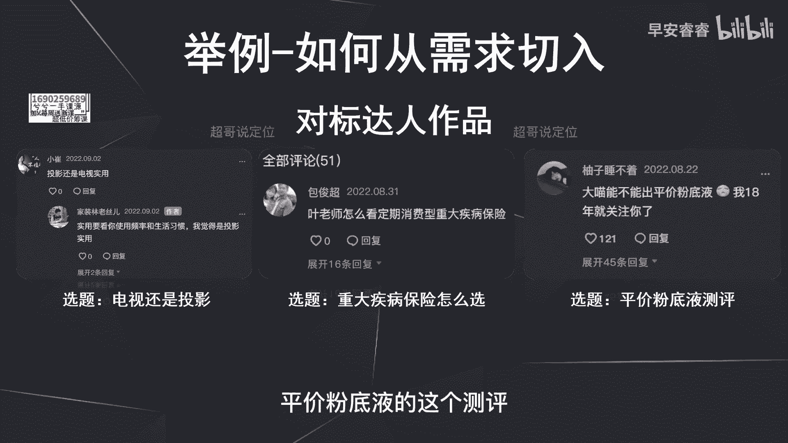

或者种草啊，这个选题，那从评论区去找需求之后，怎么样去设计你的内容呢，因为我们每个人不是全能的，就是我们虽然在我们每一个垂类，相对来说可能会比较的专业，比较的拿手，但是不代表我们所有的问题都能去解答。

所有的问题都能够说的很清楚，很专业，那这个内容就是你把这个选题找到了以后，比如说刚才选电视还是选投影，你找到这个选题以后，怎么样去生成中间的内容呢，啊中间的股价的内容呢。

第一方面就是先去看一看其他的平台，比如说公众号啊，小红书等等啊，包括抖音上面去看一下，收集一下其他博主啊，他们说的都是怎么样说了，以及去看下他们的评论区，就是他们说的到底在不在理，或者说够不够槽点啊。

然后你去把它收集掉，第二去加入一些自己的个人的深度的观点，那第一个方法呢就是先去整合，然后再加工，第二呢就是你加工完以后，一定要去突出一些新颖的观点啊，有深度的观点啊，就比如说刚才说买投影还是买电视好。

就如果你觉得你是买电视好，你一定要有一些新颖的观点啊，有深度的观点去支撑，为什么买电视好，因为这个目的是为了什么，让用户能够听到觉得啊眼前一亮啊，从而就会给你点个关注，他会觉得你很独到啊。

有一些自己的深度的一些见解，那第三呢就是去看完他，那么评论区还是去看他们评论区，或者去看一些其他公众号啊，这些杂七杂八的这些内容的稿件，去看一下他们的评论区里面，到底有没有一些好玩的一些槽点或者话题点。

那你把这些槽点记下来，然后植入到自己的稿件里面，比如说还是刚才那个电视机，还是投影，这个逻辑很多人会去吐槽呃，投影就是白天啊，相对来说看的不是那么清楚，那你就可以把这个点放到你这个选题里面，放大去说啊。

放大去说，甚至会去唱反调去说，就是说啊某些投影它在白天确实效果会比较好，怎么怎么样这样然后争取带来更多的槽点，让你这条稿子的热度能够起来啊，那实际上刚才说了啊，就是我们每一个垂类，我们只能做到部分专业。

或者说部分的深度的见解的支撑，但是我们没办法做到面面俱到，那你做完这些选题之后，你去找到这些需求点，然后自己再去做整合，自己再去做收集，整合再加工，实际上我们在做每一个垂类的时候，自己也是一边起好。

一边学习，一边输出，一边吸粉的这个过程啊，还有一边变现，只有这样我们输出观点的能力才会越来越强啊，我们对于某一个垂类的认知也会越来越深啊，这样的话我们吸粉也会越来越快。

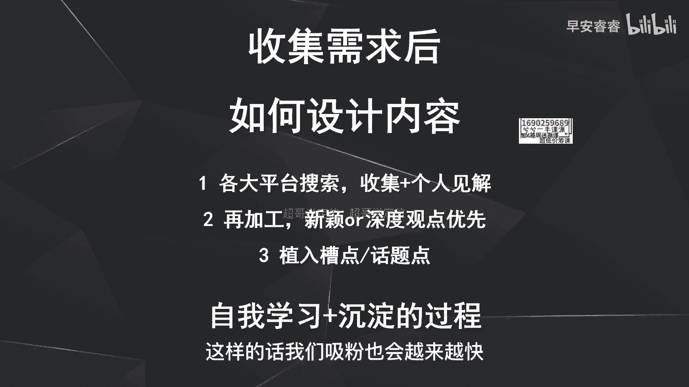

那一样的，从需求点去做切入的话，一定要注意几个方向啊，第一个呢就是还是日常，刚才说了，日常生活中或者工作中去记录，到底哪些是需求点，哪需求点有哪些，然后把它记录下来，那第二呢就是一定要去多看评论区啊。

胜过你去看别人的内容，为什么呢，因为有些内容可能就是自嗨啊，就是他发出来以后，你看赞很多，但是没有评论或者没有收藏，没有分享，那我之前说过嘛，这种内容这种数据实际上都是买出来的，没有多大参考的价值。

所以与其多看内容，你不如多看评论区，因为评论区问到的东西，才是真正每一个人需求的点，那每一个需求点呢都值得被重视，因为一个人的需求，就你在那个评论区看到，只是一个人问了这个问题，但是你多看几个博主以后。

会就会发现，可能他就是一个共性问题，就是每一个博主之下可能都会有人问这个问题，那就是一个共性需求，那你就需要把这个需求去给他解决掉，那而且呢你不要觉得这些需求点啊，就有人已经讲过了，有些人已经讲透了。

讲烂了，那也无所谓，因为还是那个逻辑，就是你覆盖到的是一部分的人啊，你的对标达人覆盖到的是一部分人，你们两个的粉丝重合或者观众的重合，可能只有1%左右，剩下的99%还是不一样的。

那对于剩余的99%的人群来说，那这个问题，可能他们之前就是没有人给他们解决过，那你就把它说出来解决掉，那自然呢你这条视频的播放量啊，这些都还可以，那第五点呢就是帮别人去解决问题啊。

实际上就是积攒自己精准粉丝，最快的方式就是在每一个垂类，都会有一些细分的需求，没有人去关注，或者没有人去解决掉，那你去把它解决掉，用户就会觉得你解决了他的问题，给他带来了实用价值，从而过来给你点个关注。

但是这个问题还是刚才说的选题，你的内容的框架啊，一定要能够站得住脚，而且一定要有一些观点够新颖，够独特，够深度啊，那才会吸引这些粉丝的关注。

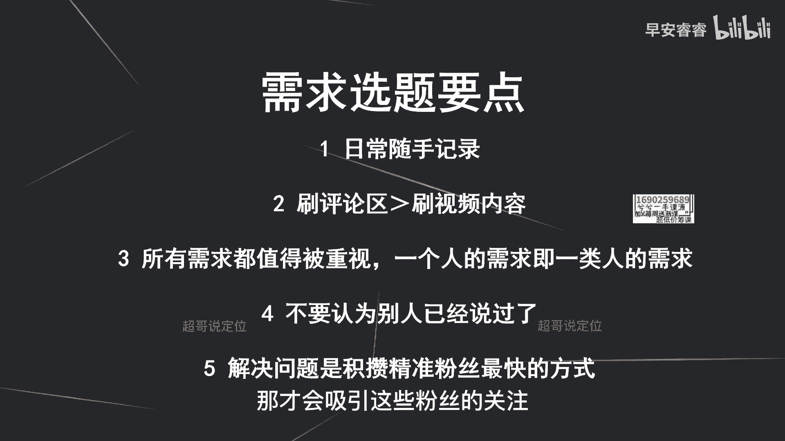

那最后呢选题的三个方向我们已经说完了啊，第一个从热点切入，第二个呢从争议点切入，第三呢从需求点切入，那很多人可能会好奇啊，就是为什么我没有去说从别人的稿件去切入，比如说去做洗稿啊，为什么呢。

因为怎么说呢，因为很多视频确实是专业团队打造出来的啊，就是MCN或者说专业的一些商业机构，他们投了很多的成本，推广成本去把这条视频给推起来的，所以你判断不了到底小白做这样的视频。

会不会有一个很好的播放数据，那与其这样的话，我不如就跟我刚说了，你不要去看别人的作品数据啊，你不要去看别人的作品数据去洗稿，你先看评论区，先看需求在哪里，先看评论区需求在哪里，然后再去找这些稿件。

然后你再去洗稿也是OK的，也是没有问题的，但是一定不要去看，你所谓的就是你觉得这条视频啊赞好多，你就去洗，你洗到最后你就会发现确实会有一个问题，就是很多专业团队做出来的稿件，你洗完以后你的播放量极差。

可能连500都过不了，那你说到底是选题的问题，还是自己能力的问题对吧，所以我们经过一系列的这个经验得出来以后，就是从别人的评论区去找这个选题，实际上是最快最有效的一种方式，那第二个呢就是我刚说过。

就是不要去做一些看似很火的选题，就我刚才那句话，就是你看别人的赞很高，你就去做对吧，刚才已经说过，那这个我们就不再去啊，不再去重复了啊，那最后呢再重复一下哈，就是我们做所有的选题，一定要满足的就是理他。

一定不要自嗨，那做到这一点其实很简单，就是每一个选题，每一个稿件你要多说怎么做啊，你要多站在对方的角度去考虑，怎么样去给对方提供帮助，而少说为什么就是为什么我这么牛逼，为什么我做的这个菜那么好吃。

而要去说的是什么，怎么做这道菜啊，怎么样能够让这道菜的味道好，色香味俱全，怎么样能够理财获得更大的收益，怎么样在情感上面少走很多的弯路啊，少遇到渣男，你要多说这些怎么做，而少说为什么为什么我情场得意。

为什么我能赚那么多钱，为什么我做的菜很好吃，那做到利他实际上就那么简单，就是多说怎么做，那整个选题的三个方向，那我们这节课就已经整体讲完了，下节课开始的话，我们会去讲一下怎么样去优化你的脚本结构。

去提高你的整体的完播率。

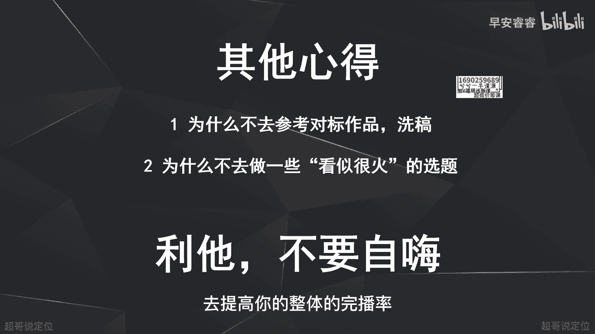

我是你们值得信赖，有问必答。