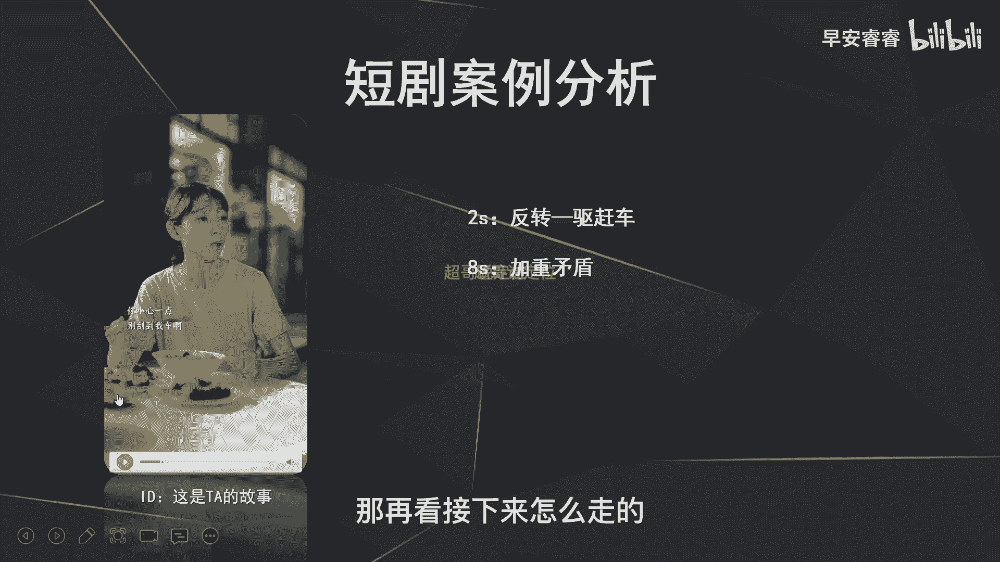
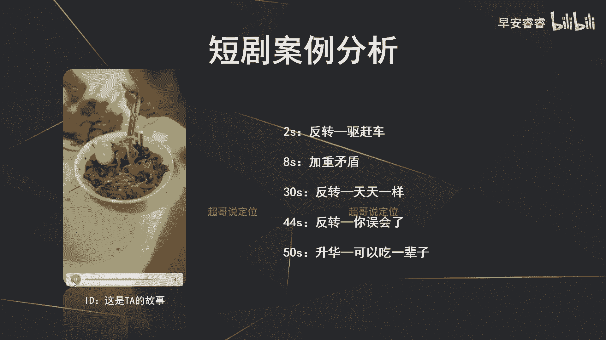
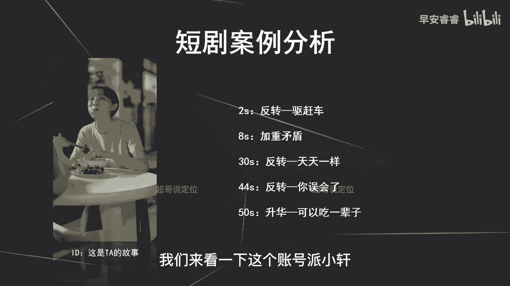
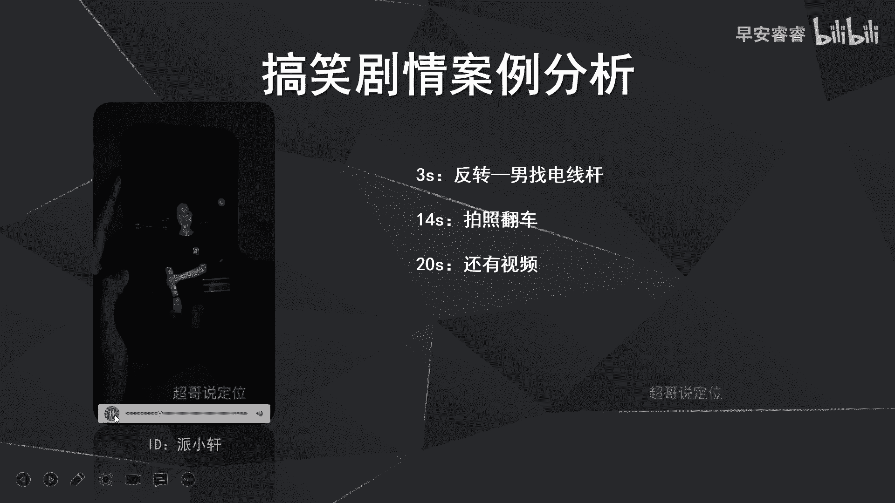
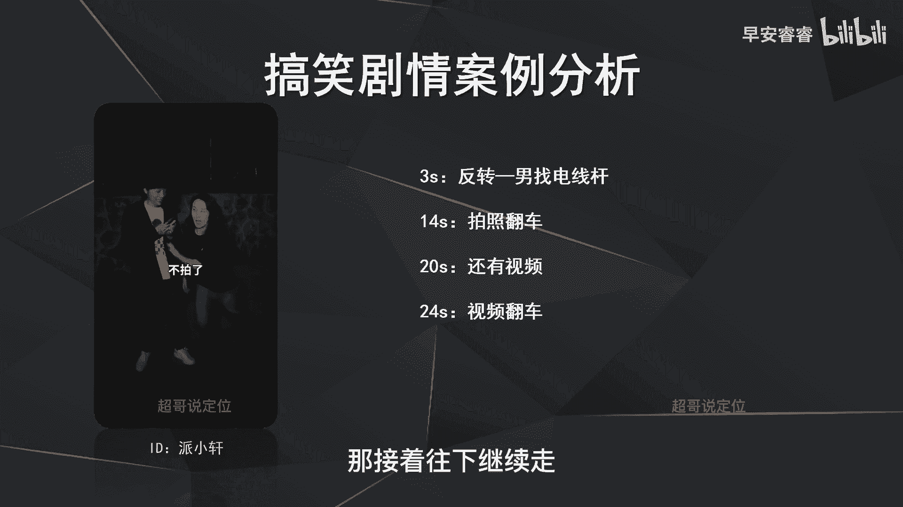
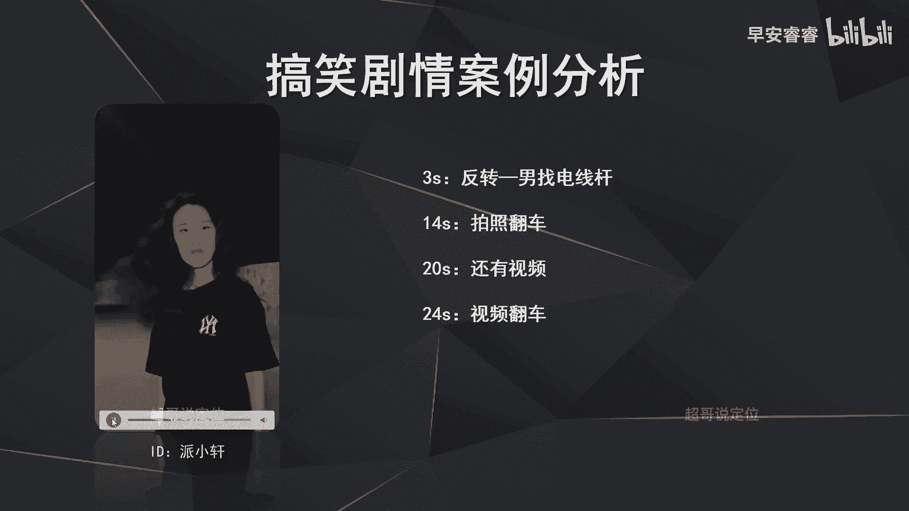
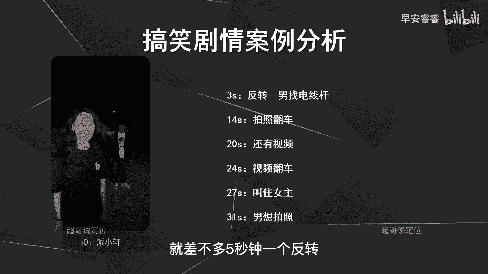

# 085 2023短视频起号·差异化定位课：0~1做懂抖音（定位+内容+投流+运营） - P33：第33节33 剧情脚本怎么写 - 早安睿睿 - BV1Am421T7br

那今天去讲一下怎么样去写脚本，就很多新手起号的时候，其实忽略了脚本这个逻辑呃，因为脚本是一个账号，或者说一条视频能报的一个核心的关键，就是你如果不提前去设计好脚本，那你拍完剪完以后。

你就会总觉得这条视频缺点什么啊，那可能缺的就是槽点，话题点，或者说你的节奏，或者说有些地方的灯光啊，各方面你觉得不是特别的理想，构图不是特别的精美，那实际上这些都是和脚本息息相关的。

就你提前写脚本的目的，就是为了去提前计划好，每一秒到底要说什么样的文案，到底要配什么样的字幕，到底要怎么样去打光，那我构图到底呈现出来应该是怎么样一个画面，那实际上爆款作品应该是脚本前置啊。

脚本一定要先设计好，那今天我们来讲一下脚本怎么样去写，首先先去讲一下啊。

剧情号的脚本怎么样去写啊，那这里就会有一个问题，就像我刚刚说的，为什么新手起号做不到条条的爆款，但是MCN就可以就成熟的一些机构，运营机构就可以啊，原因就是因为我们的脚本模板很多都是成熟的。

呃难听点叫做有套路的，所以我们把这些套路，复制粘贴在每一个视频上面啊，那我们基本上都可以做到条条的爆款，原因就是因为我们把这些视频的啊，基本套路都已经摸出来规律，然后摸出来规律之后再去无限的复制粘贴。

那这样的话我们的视频就可以做到条条的爆款。

那首先我们今天就来讲一下那剧情号啊，怎么样去写脚本，那句型号的脚本核心是什么，句型号的脚本的核心。

其实很多人已经知道就是反转，那首先我们先来看一下啊，这个反转到底是怎么样，能够让观众的情绪做到持续的起伏的，就像底下的这个图一样，就是剧情哈，我们在看的时候都是这样一个啊，波荡起伏的一个状态。

就我的情绪一直是有高有低的，一直被持续带着走的，那这个核心就是因为做到了反转，那反转到底要怎么样去做呢，我们来看案例去说。

那首先来看一个短剧的剧情类的账号，这个账号呢叫做这是他的故事，我们来把这条视频完整的看一遍，老公我今天把房租给交了。

诶，怎么谁都点名车了哦，我的我的不好意思啊，这是车位。

是你该停的地方吗，哎你小心一点，别挂我车啊，骑个电瓶车还乱停乱是不好意思。

老公你还记得咱俩刚处对象的时候。

天天来吃路边摊啊，记得现在咱俩都结婚了。

还是陈然然。

嗨没事。

别人有的，咱以后也会有嗯，你说什么呢。

我是说这菜这么多年了，还是这么好吃啊。

哼好，我们就看到这里啊，就看到这里，所以这条视频你其实把整个视频看完以后啊，我们要去提炼它的脚本逻辑，提炼出来以后，我们才知道怎么样去写脚本，那首先来看他是怎么样去做的，就我刚刚说的剧情的核心是反转。

那我们首先来看一下它是怎么做的，那首先可以看到啊，他第二秒就先出的，第一个反转就是有人赶他的自行车，我们再来回顾一下老公。

我今天把房租给交了诶，那谁的点名哥哦。

我的我的不好意思啊，这是车位，是你该停的地方吗，哎你小心一点，别挂我车啊，然后你看六七秒的时候，又出现了叫做情绪的升级和矛盾的升级，就是6~7秒的时候，别人就来说啊，不要去挂倒他的车，小心点，这是车位。

怎么怎么就来逼叨叨他，实际上这个就是去做这个啊矛盾的升级啊，也是为了去吸引我们更好奇，更猎奇的去看，接下来这个剧情到底要怎么样去走，那再看接下来怎么走的。

骑个电瓶车还乱停乱的，不好意思。

然后她就回来吃饭了，老公你还记得咱俩刚处对象的时候，天天来吃路边摊啊，记得现在咱俩都结婚了，还是陈冉冉。

你看在这里就出现了第三个反转了，就是让用户会觉得他的老婆，是不是在嫌弃他们的日子，然后嫌弃他们这种生活状态啊，就说了一个天天一样，然后接着再往下看。

嗨没事，别人有的。

咱以后也会有，嗯你说什么呢。

我是说这串这么多年了，还是这么好吃啊，嗯那这里又出现了第三个反转，就是啊他的老婆说你误会了啊，不是这个意思，实际上我表达的是这家店依旧还是那么好吃，然后最后呢视频又去做了一个升升华啊。

就是他老婆去说这家店可以吃一辈子。

这世界有那么多人。

所以你就看了，不管是这种温情类的啊，剧情账号还是搞笑类的剧情账号，它的核心都是反转，而且是什么，而且是高频次的反转，就是一个50多秒的一个视频，它至少出现了3~4次的反转，那我们接着来看一下搞笑剧情号。

它又是怎么反转的，那就会更极限了，我们来看一下这个账号派小轩。

那我还是边放视频边来去讲啊，那我们先来看一下这个视频啊。

山里空气真好，谢谢你来带我看日出电线杆，电线杆这里就出现第一个反转。

就是在三秒钟的时候，就是女方说啊看日出很开心，很期待的样子，结果呢男方反而很拉垮去找电线杆啊。

这就出现了第一个反转，那接下来继续看啊，男人和狗有什么区别。

哎我这大模特肯定出皮，等一下撒来。

这专业，我看看，这是贝雷啊，你看吧，这是第二个反转，就是在第14秒左右的时候就拍照翻车，就女方期待的南方拍照拍的有多好啊，结果拍出来啊，全都是糊了的或者怎么样，然后接着再看视频P了。

回光返照，回动手，谁在偷拍，溜了溜了废了娘劲拍成这样。

还有视频呢，哦啊我这啊，你看这又出现第三个反转。

就是男方说还有视频啊，又拉了七代了，对吧啊，还有期待瘦吗。

行这不动图吗，结果又出现反转啊啊这根本不是视频，是一个动图，而且很黑漆麻糊的对吧，24秒又出现反转，那接着往下继续走。

诶好棒，我倒要看看能放出什么屁来放。

我还没拍呢，你看啊这又是一个反转，就是啊他把女方叫住，还以为就是叫她回来重新拍，结果呢实际上是男方想拍照，你就可以看到这短短的啊30秒的时间，六次的反转就差不多五秒钟一个反转。

所以说剧情号啊，剧情号的核心实际上就是高频的反转啊，你刚刚可以看到派小轩这个账号，他这条视频将近2000万的播放量，就是五秒钟左右一个反转，所以你要去做剧情号也一样的，第一个前五秒你要先出反转。

就像刚才那个潘晓萱啊，先出了第一个三秒钟就先出了反转，就是女方很期待男方在找电线线杆，那前面那个温馨的剧情号呢，也是第二秒就出了反转，就是两个人在那开开心心吃东西，然后就有人过来训斥，让他移车。

就第一五秒钟你要先出反转，第二步呢就是剩余的每一个十秒，你都要出一个反转。

这样才能支撑我刚才所说的，就是那个用户的心理的那个曲线。

就一直是满心期待，然后你给他给了一个包袱，然后又丢一个包袱，然后又把它解开，所以剧情号就一定要做到反转，反转的目的就一直在丢包袱，然后在解包袱，就跟我们看那个呃相声一样啊。

就让我们的那个情绪能够一直跌宕起伏。

那这期我们实际上就讲了剧情号，他的脚本的核心，那就是反转。

而且是高频的反转啊，那从下一期的话我们来讲一下VLOG账号，还有包括一些啊测评种草的一个账号脚本，应该怎么样去写，那我是你们值得信赖，有问必答。

