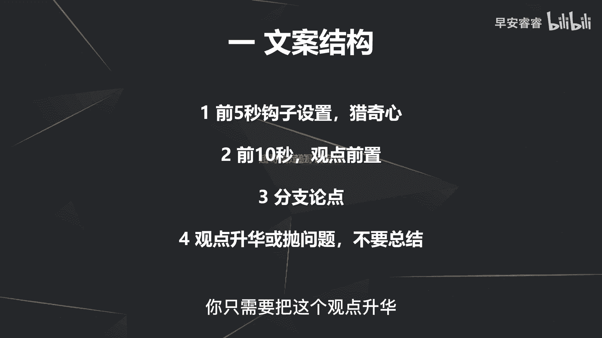
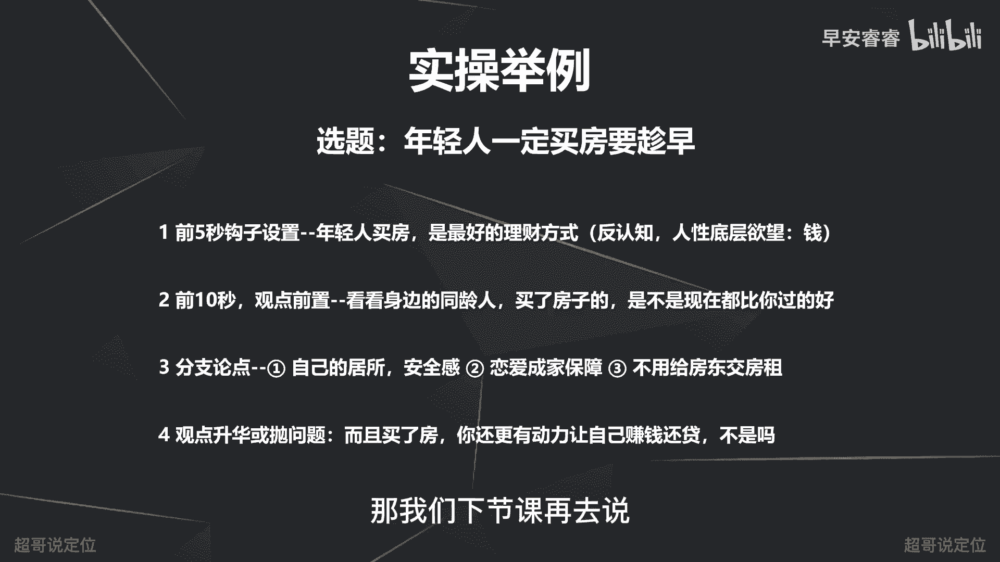

# 085 2023短视频起号·差异化定位课：0~1做懂抖音（定位+内容+投流+运营） - P35：第35节35 口播脚本怎么写（1） - 早安睿睿 - BV1Am421T7br

好从这节课开始的话，我们去讲一下怎么样去写口播类的脚本，那首先我们来明确一下什么叫做口播类的视频。

那口播类的视频呢，主要就是通过一个人在这讲述的方式输出啊，没有那么多的剧情，也没有那么多复杂的画面构图啊，主要就是依靠文案的这种形式，然后让一个人讲述的这种形式把它给输出出来。

那口播类的视频主要都是在哪些赛道，以及有哪些表现形式呢。

我们先分别来看案例来了解一下，那第一个案例呢就是樊登读书。

那个樊登的一条视频，打赢辩论叫做理论事实，这个理论事实，观点这种呢就是直接讲观点的这种输出啊。

口播的这种形式嗯，然后第二个呢像这个家居生活要半杯奶茶的钱，就能拥有像五星酒店一样的格调香，这事儿包括汽车家居，买房啊，各个专业类的这种赛道，他们实际上的表现方式，主要都是用口播的这种形式。

那包括种草的视频也在用口播这种形式啊，只不过不露脸，宅区酷玩的这个案例，优秀的干饭人，一定要熟练掌握，崩锅包加烧麦和波萝包加虾饺的干饭组合，而且凤爪加芝麻卷的位置一定要牢记于心，关键时刻。

这套组合是决定你民很多种草，或者说测评类的账号，他如果不露脸的话，他还是依托于个人在讲的这种形式，把这条视频给支撑完，那也是口播的一种形式，那然后包括美妆的赛道的很多视频，都是口头播类的，真的女孩子们。

你试试这几样生活用品绝对是花最少的钱，包括旅游赛道的很多视频也是口播的这种形式，win啊房琪的治疗师，如果不是，那刚才看完这五个案例以后，我们再来回顾一下啊，一条视频它实际上输出出来给到用户。

它实际上只有两个大的主要内容点啊，什么叫内容点，就是你通过他的视频的哪些部分，去get到他的人设和get到他的内容，那第一个呢就是他的画面，就是他的画面里面有哪些元素，他的画面里有哪些呈现。

我去理解他这条视频在讲什么，那第二呢就是文案啊，当然除此之外还有其他内容点，比如说他的配乐，然后他的一些剪辑手法等等，但最主要的两个其实就是画面和文案。

那口播类的账号呢，实际上它就是依托于文案能力，然后去输出自己的个人观念啊，所以说口播的脚本能力，实际上就是文案的技巧和文案的能力，而这个文案能力啊一定是靠锻炼就能解决的啊，就熟能生巧的。

那我们先来看一下，常见的口播文案结构到底是哪种，那么常见的文案结构的话，实际上第一就是前五秒要先有个钩子，那之前我们黄金360+1节课，都已经把这个已经讲过了，我们这地方不再赘述，那第二部分呢。

就是你的前十秒要先出来一个核心的观点啊，所谓的观点前置，接着呢要有一些分支论点，去支撑到你这个总观点啊，最后呢结尾的时候不要去打总结，我之前的视频也说过，不要去打总结，原因就是因为用户没有耐心。

不愿意听到重复的话术，所以最后一段不需要再去打总结，而你只需要把这个观点升华。

或者抛出来一个新的问题，然后让用户把这条视频能够看完，那我们先来看案例。

好我们先来看一下案例，这样的文案结构到底是怎么呈现的，这是最近一个房产的一个IP号。

房产老路曹德旺劝大家不要买房了，好不容易赚点钱钱给我宝去当房奴，自己住，没有租金收，还要交管理费，有钱人都有几套房了，没钱人也买不起，以后房子就是有钱人卖给有钱人，但是有钱人有房子还买它干嘛呢。

曹老板这几句话听起来是不是非常的有道理，但你想过房子对于有钱人的价值，它到底是什么，而且曹老板有个6000平的房子，你有啥，曹老板靠企业财富自由了，你靠啥，这条视频就看完了啊，他整个都是这种口播的形式。

那我们先来总结一下，你可以看到他第一是先出了一个，前五秒出了一个钩子，设置就是曹老板说啊，劝大家不要买房了，这个本身呢第一是一个热点啊，最近曹德旺在说这件事是一个热点，第二呢是一个反认知。

就是大众认知呢就是一定要买房，他是反过来去说，那第二呢就是前十秒还是去观点前置，就是该不该买房啊，然后把这个观点先抛出来，接着分支论点去阐述啊，到底该不该买房啊，他就说了吧。

第一是有钱人的房子都是卖给有钱人的，第二那有钱人还要房干嘛呢啊，实际上说完这句以后，最后给了一个观点的升华，然后又抛出来一个新的问题，就问啊曹德旺需要房子吗，曹德旺都已经实现财富自由了。

他说这些关你什么事情对吧，他整个的文案结构实际上就是这样的。

那接着我们来一个实操案例，去看一下到底怎么样去写这个文案，那假设我们这条视频的选题啊，是叫做年轻人买房一定要趁早，那首先呢前五秒就一定要先有一个钩子设置，能够抓住到用户的猎奇心，前五秒就可以写成。

年轻人买房是最好的理财方式，而这差不多15个字，差不多三秒钟左右，第一是用的我之前钩子说的一个呃，人性底层欲望前的这个逻辑，那第二个呢是反认知理财方式，怎么可能是买房呢，对吧，他相对来说一个反认知。

比较一个猎奇的点去放到前五秒，然后能够吸引到用户的停留，那接着呢我刚说过，就是前十秒一定要把观点前治掉，所以我可以补充再说一句话，就是看看你身边的这些同龄人，买了房子的，是不是现在都比你过得好。

那就相当于一个补充阐述，能够去压我这个观点，接着我就去分支论点去说，那我分论点的话可以分成三点，第一买一个房子，多了一个自己的居所呃，有一份安全感，第二呢你结婚成家有一个保障啊。

第三呢就是你不需要再给房东去交房租，帮他去还房贷，那这就是三个分支论点，那最后呢就是去观点升华，我不需要再去总结，所以年轻人一定要先买房，不需要再去观点总结，我只需要再去啊，观点升华或者抛出来一个问题。

比如说直接抛出来一个问题，就是而且买了房你还更有动力让自己还贷，不是吗，那整个的口播的脚本结构呢实际上就是这样，第一他要做到总分啊，不要打总啊，就是总分就够了，就是总的观点先前置。

然后中间再用分论点去支撑，只不过总的观点那一块的前置，一定要先用一个钩子把用户的停留给抓住，然后中间的分支论点呢一定要有序的排序，而且要简短啊，言简意赅，能让大家听得懂。

那最后结论的时候再抛出一个新的问题，或者给一个观点升华，那这个文案结构真题就结束了，那下节课的话，我们再去讲一下中间的分支论点怎么样去写啊，首先呢第一要做到简单明了，让大家一看就能懂。

第二呢又能让他觉得这件事很牛逼啊，觉得你的观点很牛逼，过来给你点个关注啊，深度也能够有，那我们下节课再去说啊。

我是你们值得信赖，有问必答。