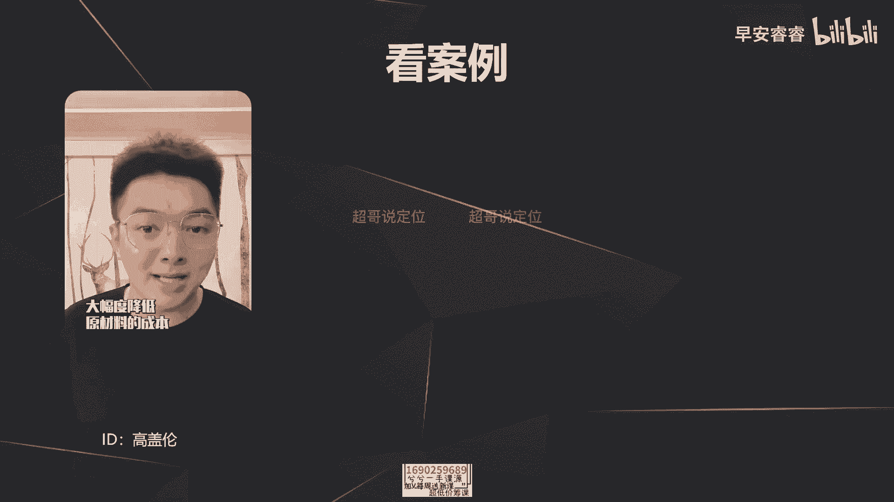

# 085 2023短视频起号·差异化定位课：0~1做懂抖音（定位+内容+投流+运营） - P36：第36节36 口播脚本怎么写（2） - 早安睿睿 - BV1Am421T7br

那今天这节课的话，我们去讲一下口播类的文案，它中间的分支论点到底要怎么样去写，能够满足第一简单明了，让用户能看得懂，听得懂，第二呢他就觉得这个论点是有深度的。

然后又是有说服力的，从而给你转个粉好，那这节课我们来讲一下。

分支论点到底应该怎么样去写，那分支论点怎么写，主要有六个要素，第一个呢就是你每出一个分支观点的时候，必须要去配合一个案例，这样的话更易懂，尤其在我们很专业的一些赛道，比如说律师啊，比如说一些理财类的。

买房类的，然后包括建材家居类的，那在表达这些的观点的时候，比如说你去讲到底应该买一个电视机，还是买一个投影，那你中间的分论点一定会比较专业很锤，大家可能会听不懂，所以一一定是你抛出来一个分支论点之后。

一定要去举一个案例，然后去辅佐，让用户能更好地听懂，这是第一点，那第二点呢就是观点的排序，一定要从猎奇到常规的，那我这举个例子，比如说在生活中，我跟你说，这个人不能处啊，他首先有三点啊，第一嗯不爱干净。

第二很小气啊，第三脾气又不太好，然后你肯定认知到他的是脾气不太好，但是你可能不太了解他另外两个方面，那我如果上来就跟你说，他第一脾气不太好，你会觉得我说的东西已经是你知道的，你可能就没有耐心想听了。

所以就是观点的排序一定要去打破用户的认知，或者说越理越奇的观点放到第一位去讲啊，越常规越大众认知的观点啊，放到最后一位去讲，那第三个呢就是观念的排序，还有一种玩法是什么呢。

就是把用户最好奇的点放到最后面，而我举个例，还是刚才那个例子，我讲这个人他有三点不能处，你会很好奇我是不是跟你一样，认为觉得这个人很小气，那我故意把这个最小气，这个点放到最后一句话去说。

这样的话会让用户有所期待，这个的话会运用在哪啊，一些热点事件你分析的时候，用户会好奇，你分析的时候是不是跟他的看法一样，那大众认知这个点我不是不能说，我可以放到最后一点去说。

然后就是大家似懂非懂的这种点啊，有好奇心的，然后我可以把它放到最后一位去说，然后把它解开，这样的话能够把他的悬念和胃口给拉住，然后支撑我的挽波率，那第四个要点是什么。

第四个要点就是你在这里面举的很多案例啊，第一要不然从自身出发，自身出发的好处是什么，比如说你是一个律师的一个IP，然后你讲了很多案例，去讲自己的一些客户打官司的案例，这样的话更好去建立你这个IP的认知。

就是大家觉得啊你确实有那么多的客户，确实经验够足，这地方的话是给你的IP认知去加分的，那第二呢就是举了很多案例啊，一定要是大众认知的案例，就你要举的例子，一定这是大家都有认知的，而不是你自己知道的。

那这里的案例的话，你可以举一些古今中外的一些历史典故啦，或者生活中的一些品牌故事，人物故事啊，这些去佐证自己的观点，那第五点呢就是做到观点留白，这个什么意思，就是很多新手在起号的时候会觉得。

就是我如果是分析这件事的时候，我有四个方向去切入，那我四个点都要去说，但是会有一个问题，首先这四个点肯定有那么一个点，到两个点是用户已认知的，那你说了以后，实际上就是正确的废话，他肯定没有耐心就会划走。

第二的话就是你留白的目的是为了什么，目的是为了增加一些话题点，就用户可能会问你啊，那我举个例子，如果说我要去佐证那个观点是买房一定要趁早，我刚说了三个分支论点，第一就是自己有个居所。

第二话不用替房东还贷，第三的话就是你结婚的时候，相当于也有一个资本，那如果这是三个观点的话，那我可以选择性的去啊，漏掉一个观点，就是大众认知的是哪个点，就是自己有个居所，那我可以故意不说啊。

我可以故意不说，然后如果跟我产生共鸣的人，他自己评论里面可能会去评论说啊，买个房子自己也有一个小窝，心里面住的也会更平安一点，就是这就是做到观点的留白，就是你没必要去做到面面俱到。

你只需要把用户的认知空白点把它讲透啊，满足他的猎奇心就可以了，反而用户已经有认知的这些点，不需要再去阐述了，这样的话只会显得啰嗦，以及你的IP会显得很幼稚啊，从而带不来转粉，那第六个要点是什么。

刚才其实已经说过，就是不要说大众已有认知的点啊，嗯尤其是很多新手在起跑时候，会经常说一些废话，就是所谓的正确的废话，就是大家都已经知道这个事实了，你没必要再去说，说了以后只会第一显得你啰嗦。

第二显得你很不专业，因为你前面五秒已经把这个练习性给勾起来了，他会好奇你到底要说一个多有深度，或者多独特的一个观点出来，结果你说出来的一些话是他已经有了认知，那这样的话不但是没有转粉，还会划走你的视频。

没有完播率，所以你在做分支论点的时候。

一定要注意这六点，那我们先来看一个案例啊，是不是这样去呈现的，那这是高盖伦近期的一条视频。

我们先来看一下咖啡界的爱马仕瑰夏咖啡，到瑞幸去买，竟然只要20块钱左右。

涅槃重生后的瑞幸，真的是在一步一步成为让国人骄傲的国货品牌，它是怎么化身价格屠夫，帮我们把好咖啡的价格打下来的呢。

这条视频盖伦跟你聊一聊，瑰夏是一种出生于埃塞俄比亚，成名在巴拿马的咖啡豆，曾经拍出过每磅超过1000美元的天价，远高于猫屎咖啡的价格。

所以素来有咖啡爱马仕之称，但就在本周，瑞幸官宣上线SOE瑰夏系列。

一杯瑰夏dirty竟然只要不到20元，其实不只是瑰夏，如果你仔细去看瑞幸的精品线咖啡产品，去年的耶加雪菲，今年年初的花魁，再加上刚刚上新的瑰夏，这些世界级的名贵咖啡豆，到了瑞幸手里就跟不要钱一样。

不仅上新速度快，而且卖的还便宜，瑞星是怎么做到的，总共其实就三点。

第一药量大，也就是规模优势，瑞幸门店已经突破7000家，买的多，价格自然就更好谈，2021年初，瑞幸就在埃塞俄比亚大使馆，签署了战略合作框架协议。

通过大宗采购的方式大幅度降低原材料的成本。

仅仅是在2022年第一季度，瑞幸就在埃塞俄比亚采购了接近2000吨。

精品级液加雪飞和80吨花魁咖啡生豆，但是买的多竟然还惹来了争议，今年年初的时候，某大V就发布视频说，埃塞俄比亚花魁豆总共进口量的一半，都被瑞幸买走了，他质疑瑞幸是在浪费好豆子，更质疑瑞幸隐形垄断。

但事实上瑞幸买的花魁豆是在海外竞价买来的，他不买这批咖啡豆就不会进口到中国，所以其实瑞幸并没有影响任何其他人。

购买咖啡豆，完全不构成垄断条件，第二成本优化，现在瑞幸咖啡门店有91%都是自提店，他把资金都用在了提升咖啡饮品本身。

所以不会花很多钱在店铺装修上，那消费者也就不需要为房租环境买单。

这里其实能帮消费者省下不少钱，第三点也是最重要的一点，咖啡本身就是街头饮品，国内的价格之所以高，是因为某些洋品牌一开始带的节奏。

利润非常丰厚，如今瑞幸作为咱们的国货咖啡品牌，只是把利润压低让利给消费者而已，这就是为什么我们花20几块钱就能买到，瑰夏咖啡的原因。

好咖啡其实并不贵，这是瑞幸曾经打出的口号，瑞幸作为咱们国产的平价咖啡品牌，正在化身价格屠夫，让更多精品好咖啡走进更多人的日常。

好咖啡喝得起，我看瑞幸还真不是说说而已，我是盖伦关注我。

有热点更有观点啊，那这条视频就整体看完了，我们来回顾一下，那首先呢他的分论点是什么，第一就是啊，瑞幸之所以能够做到这个咖啡那么便宜，第一是他这个咖啡豆它的量大啊，它规模的优势，第二呢就是它的成本优势。

刚才他视频里面有说就包括他的装修啊，各方面，消费者不需要为这些多余的成本去产生溢价，那第三呢就是咖啡这个品类啊，一直卖的相对来说比较的虚高啊，就是因为之前洋咖啡的这个起的势，所以这是他的分论点，就三点。

那接着我刚才说过，第一个呢，就是每一个观点最好出一个案例去解释，那刚才第一个案例就说了，是啊规模优势，那这四个字一听有点懵对吧，不太懂，所以他就去举例说明了，瑞幸是怎么样去囤这个咖啡豆的，买了多少。

然后最终啊去说了他这个量很大，它具备这个量的规模，第二点呢是成本优势，他也举例去说了，瑞幸他不太会看重这些装修，一些额外的成本增加，那就不需要消费者产生更多的成本的溢价，那实际上就是他的观点啊。

要有这些案例去辅佐，让用户能更好懂，否则他的分论点一出来说规模优势，说成本优势，用户都听不懂啊，那一定要去举例，把这个观点能够啊延伸的展开去说清楚，那第二点我们再来回顾一下这三个分支论点。

哪一个是用户已有认知的点啊，瑞星卖的便宜是因为它咖啡豆量大吗，大部分人不知道吧，那瑞星卖的便宜是因为它的成本优势吗，控成本控的好吗，我相信大部分的非专业人士也不太清楚，那对于消费者来说。

瑞幸咖啡一直来说卖的比较便宜的原因是什么，原因就是因为他一直喊那个slogan，就是国产好咖啡，那跟洋咖啡传递的概念，品牌理念是完全不一样的，所以在分支论点这一块。

把这个大众认知的点一定是放到最后一位去说，要不然他第一点就去说了，这一点的话，我会觉得你的钩子把我的猎奇心给抓起来了，结果你第一句话说的就是我都知道点，还需要你告诉我吗，我就会把这条视频划走。

所以就是再重复一下，就是最既定认知的点，大众认知的点一定是放到最后一个观点去说，或者不说故意留个白，那第三呢就是刚才说过了，留白就是瑞幸卖的便宜，实际上还有一部分其他的原因，比如说它的定价策略做得好。

以及它的营销策略做得好，那这些也是消费者已经知道的一些观念，但是不在这条视频里面再去赘述了，那这就是我所谓的留白，就是让用户在评论区里面，能够去帮我补充这个观点，去发出来，增加我的一些啊评论的互动。

那接着我们去实操一个案例，去看一下这些分支论点到底应该怎么样去呈现，假设我这个选题是什么，就是为什么我们国家没有这种百年的品牌啊，没有老字号的品牌，那首先来看一下我们的分支论点有哪些啊。

第一个呢就是大环境造成的，因为我们是49年才建立新中国的，然后包括中间又面临到合营改革，那这个意味着到从1949到现在，目前还没有100年，这是大环境造成的，第二呢。

就是中国的企业家相对来说会比较急功近利，只看眼前的利益，不会想的那么长远，那第三呢就是我们这些啊，企业家都有一个传统的继承的机制啊，就是丑家族企业的这种模式跟国外是不太一样，那这是我们的三个分支论点。

我们接下来看一下啊，首先应该怎么样去做案例的配合。

就像第一个分支论点，就是大环境造就了我们国家没有百年的品牌，我说到这一点的时候，很多人没有认知不懂什么意思，所以就要去举例展开去说，49年到现在不到100年啊，期间又面临到合营的改革啊，那不像日本。

欧美这些老牌的资本主义国家，虽然啊他们过程中也有战争，但是没有经历过彻底的社会性质的变革，所以那些企业的品牌能够一直流传下来，那第二呢就是观点的排序，就是刚刚这三个观点就是什么原因。

造成了我们国家没有百年的品牌，实际上大众认知的都是在第二点，我们国家的这些企业家都有点急功近利，所以说都在乎的是眼前的利益，不会想那么长远，那这个既有认知呢我就放到最后一位去说。

我把大家最不认知的这个大环境，造就的这个点放到第一位去说，然后接着去讲继承这个逻辑，最后讲这个企业家的急功近利这个逻辑，目的就是为了拉停留，能够支撑上我的完播率更高，那第三个呢就是刚才说过观点的留白。

造成我们国家没有百年品牌的原因，其实还有很多，但是这里面就不再去赘述了啊，不需要做到面面俱到，留个白，反而我的评论区的互动会更好。

那分论点怎么写，我们这边实操案例和举个高概论，这个例子就已经讲完了。

我们再来回顾一下，实际上就是六点，那这六点的话你们一定要拿笔记下来，或者拿手机记下来，等到自己写文案结构的时候，然后去看一下，一定要匹配这六点。

那接着的话我们再来讲一下最后的啊，结尾那一块怎么样去升华。

以及怎么样去抛出来一个新的问题，能够让我的完播率更高，因为很多新手在写的时候，难免会陷入到一个误区，就是总分总的这种文案结构，那你最后打总结的时候，一定重复之前的观点，你的完播率会极低。

因为每一个用户都是没有耐心，他不愿意在一个一分钟或2分钟的视频里面，重复听到一样的话术。

那还是回到刚才那个案例，就是为什么我们国家没有百年品牌，那我如果做观点升华的话，我会怎么样去写，我就是把某一个观点啊后置到最后来说。

那我刚才是三个观点嘛，对不对啊，大环境企业家的急功近利以及继承的机制。

那我在这里面可以选择性的放弃一个观点，不在前面去说，放到最后去说，那我就去把继承这个逻辑放到最后去说，就是说完大环境，以及说完这个企业家急功近利之后去说，为什么国家没有百年品牌。

而且就是因为我们国家强调男性姓氏的纯正性，那西方家族企业呢，已经很多都不是创始人的姓了，早就加入了女性的继承人以及其他亲属的继承，所以就是我会去再抛一个新的观点，然后把这条视频给结尾掉。

而不是以总结的方式去说一些重复的话术，那结尾的时候我也可以用另外一个方法啊，那就是抛问题，那我就是说完刚才三个分支论点之后，我可以再抛一个问题出来，叫做，那你们目前看好哪一个企业。

可以成为我们的百年品牌呢，这样的话第一是用户会很好奇的，把这条视频看完完，播率会不低，第二呢会带来一些评论区的互动。

那整体的话我们这节课就讲了。

怎么样去写分论点，以及怎么样去收视频的结尾，那下节课的话，我们会去讲文案结构的其他几个方面的要素啊，我是你们值得信赖，有问必答的超哥。

