# 085 2023短视频起号·差异化定位课：0~1做懂抖音（定位+内容+投流+运营） - P37：第37节37 口播脚本怎么写（3） - 早安睿睿 - BV1Am421T7br

好接着讲我们的口播类的文案。

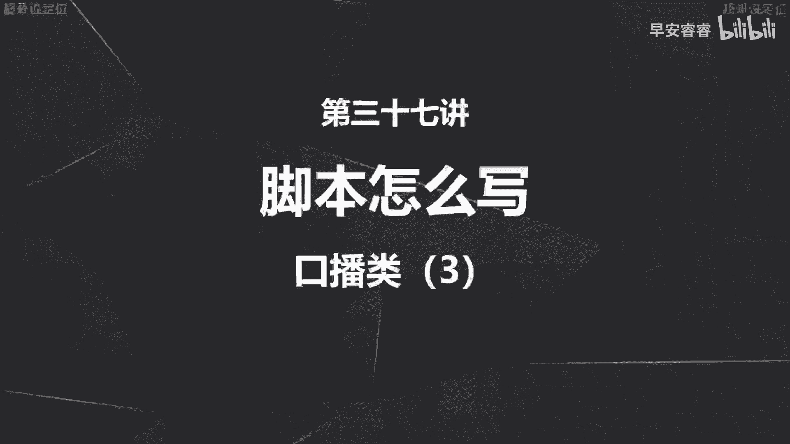

到底应该怎么样去写，那这节课的话会去讲一下其他的几个要素。

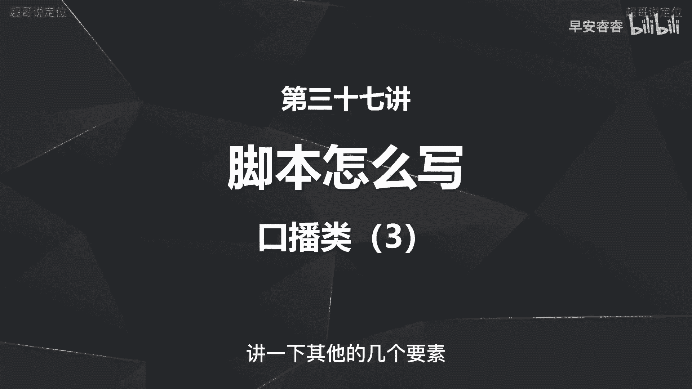

那之前我们已经讲过了整个的文案结构，前十秒以及中间的分支论点怎么样去写。

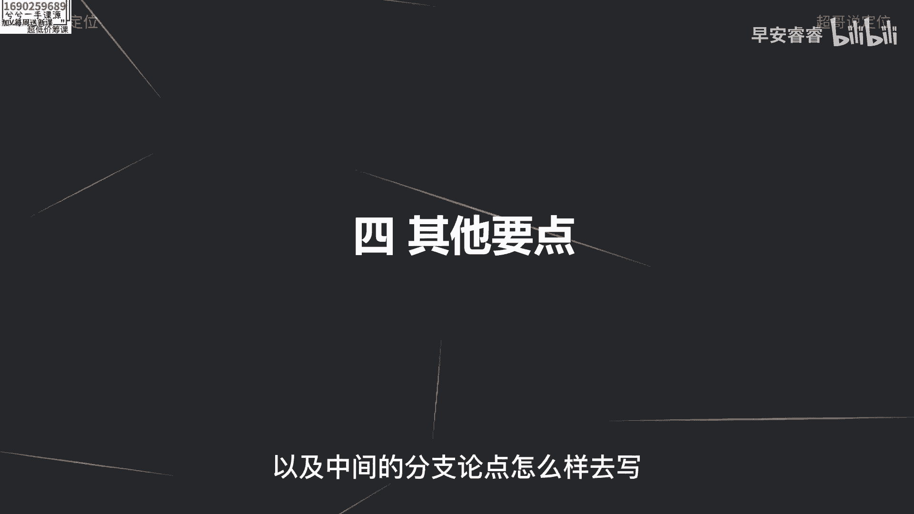

以及最后的收尾怎么样去收，那我们这节课会讲一些其他的要点。

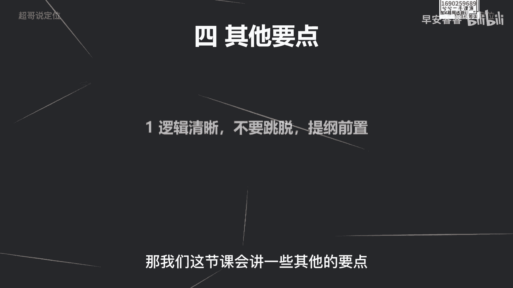

那首先第一就是你的整条视频逻辑要清晰啊，不要跳投，不要东一下西一下，而且呢你的整个的这条视频，一定要先把整个的提纲先理好，而让自己能够更清晰，再去落到文字上面，然后就会争取去脱稿，把这条视频展现出来。

而且你的分论点一定要单独成立啊，不要去混杂的解释，就是你第一点就是第一点，第二点就是第二点，这两个论点一定是脱离，然后也能够单独成立的啊。

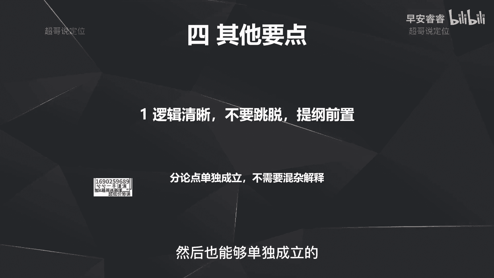

不需要再混到一起去给用户解释，这样的话会让用户越听越晕，那第二点呢就是要多说大白话。

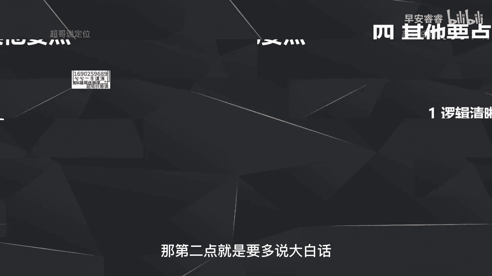

少说一些专业的数据啊，因为很多IP在做的时候，可能是呃他本来就是企业的高管，或者说某一个领域的专家，他难免会陷入到什么，就是陷入到自己的这种认知的说话方式，但是呢抖音是一个8亿的用户的平台。

你没办法满足每一个观看的用户，跟你是一样的认知水平，就你在生活中，可能你的同事他的认知跟你是差不多一个level啊，或者会比你略低一点，但是也能听懂你说什么，但在抖音上面就做不到这一点啊。

所以一定要多说大白话，我这边去举例说一下，那比如说像我这个赛道，那我在起号前期没有多大粉丝量的情况下，我就不会的去说完播率这样的专业术语，而我却要去举例去说啊，多少人把这条视频看完了，那这个叫做完播率。

就我一定要去把这个东西展开去说明白啊，说大白话，那比如说买房呢，我就不会去说容积率这样的专业术语，我会说的是容积率就代表了房子的密度，容积率这个数值越大呢，就代表你这个房子越密啊，小区越密。

所以就是第二点就是一定要少说专业术语，就是说一些大白话贴近用户。

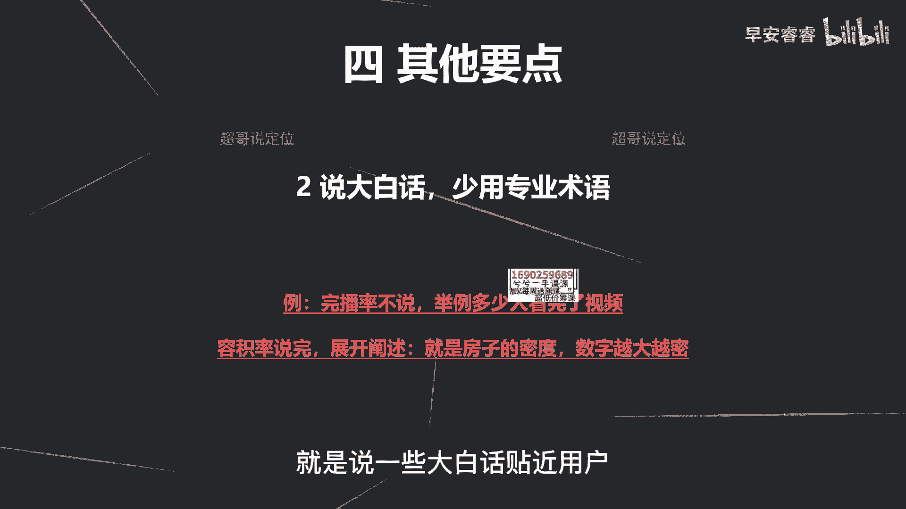

然后让他能够听得懂，那第三点呢就是在你的文案里面，一定要善于举例，而且一定要去呈现一些独特的观点，因为你的独特的观点就会让用户听不懂吗，没听过嘛，就会有猎奇嘛，但是你一定要去举一个生动的例子。

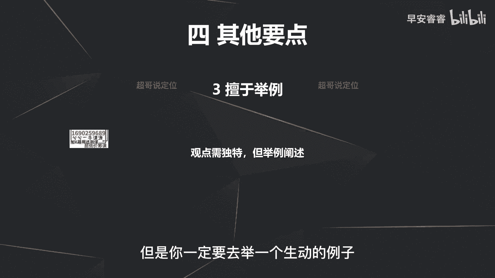

然后能够让他听懂啊，比如说写文案，就像谈恋爱一样，这句话你肯定听不懂啊，就写文案和谈恋爱到底有什么关系，你就会因为这句话的包装，然后就会产生猎奇心，接着我就要去举例把它说清楚。

因为写文案的时候也要照顾到用户的情绪，我写每一句话，都要去考虑到用户到底会有什么反馈，然后给自己一个弥补的机会，然后解释出来让他能够听懂，那就跟耍朋友一样嘛，就是你耍朋友的时候，你谈恋爱的时候。

一定也要照顾到对方的这个情绪啊，你需要去说每一句话，然后让他能get到，如果他get不到，你还要很细心的给他解释清楚，所以就是我的整个的观点就是写文案，像谈恋爱一样，这个就更满足什么了。

这个就满足了我刚说的观点独特，但这句话出来的时候一定听不懂，所以我后面要举个例子。

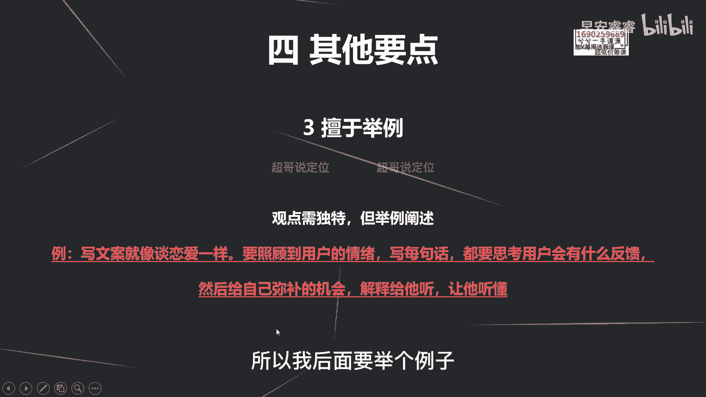

然后能够让他生动地理解，这个观点到底是什么意思，你第四个要点是什么。

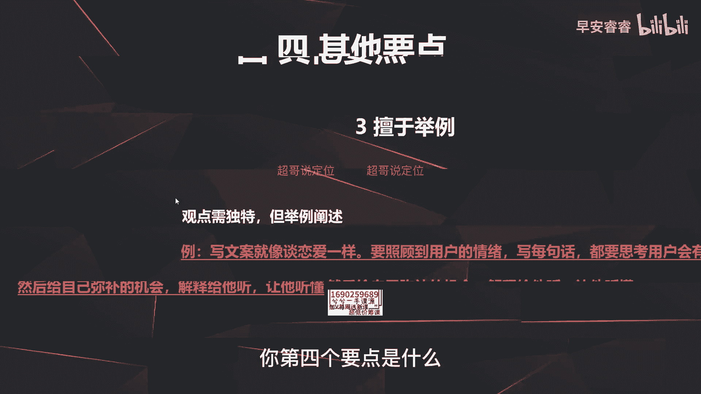

第四个要点之前已经说过，就是你中间的话术一定不要重复啊，少啰嗦啊，一定不要有一些重复的话术，那第五点是什么，第五点就是要善于去学会做营销的包装，就是造一些概念啊，那我举个例子，比如说大家的常识是什么。

就是被蚊子叮完以后涂一下肥皂水啊，就不太痒了，那我可以造一个概念出来叫什么，就是蚊虫的叮咬，一定要用物理止痒，那你一听物理止痒这个四个字没有听过对吧，那我接着给你解释清楚，就像我刚才说的。

用一个案例去给他解释清楚就行，第一他能听得懂，第二他又觉得这个概念没听过，觉得你牛逼啊，这就是我所谓的一定要学会造概念啊，那我再举个例子，比如说牙齿美排就要用这款牙膏，那我可以造个概念叫什么叫做冰川白。

你值得拥有，这个在很多的广告用语上面都会看到，就是啊包括王老吉，包括农夫山泉，他们造了一些概念，包括格力空调每晚只耗一度电啊，包括那个元气森林无糖饮料，这些都是所谓的造概念，造概念就是让你没听过。

觉得眼前一亮又很高深啊，你就会带来什么，你就会在第一想把这件事听完，第二呢就会产生转粉的这个冲动啊，那我再举一个案例，比如说我这个赛道我一直在强调什么，在强调的就是均播市场的占比。

影响了你这条视频的播放量，那我可以换一个新的概念，说什么叫做你这条视频的留存率，决定了你的播放量，那留存率是什么意思，那一样的就是多少人把你这条视频看完了，已经看完了多少的这个占比，但实际上是一样的。

底层的逻辑，只不过包装出来一个新的概念，就会让你眼前一亮啊，从而把这条视频看完，所以第5。1定要学会善于的去包装，那这个的话确实有一定的难度，但实际上你可以在生活中在写文案的时候，慢慢的去训练这个能力。

慢慢的你就找到这个感觉，以后是那么一两期啊，如果成功，你自己也就会越来越有信心。

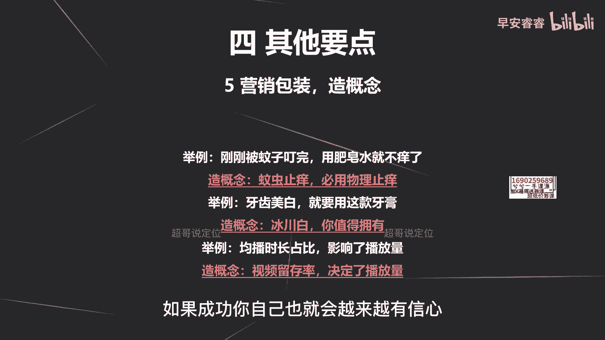

也就找到门路在哪里，那最后一点是什么，最后一点就是你的文案一定要具象，要生动啊，这个什么意思呢，就还是举例来说，那我如果这句话叫做大多数人写不好文案，是因为找不到痛点，我就说这句话，你肯定听不懂。

就写文案和痛点有什么关系，就听了会云里雾里的，听不懂，那我一定要去举例，更生动的让你理解到这句话，那我可以用两种方法去让这条文案变得生动。

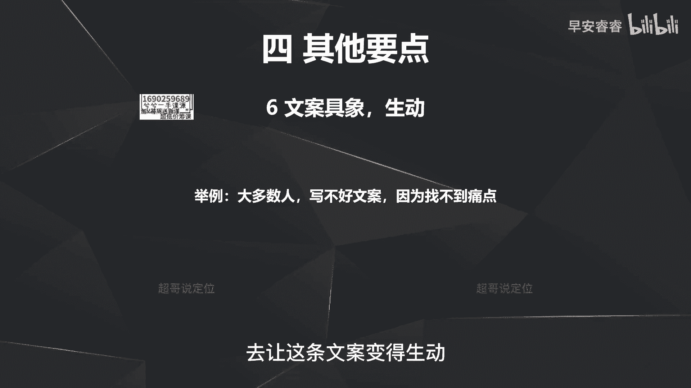

那我第一种方法就是用案例去做形象化啊，我可以举一些案例，比如说王老吉的广告语为什么能成功，因为他知道用户的痛点是怕上火，boss直聘为什么能成功，因为他知道用户的痛点是找工作的，这个面试的成本会很高。

而且决策周期会很长，所以他喊出来叫什么啊，找工作和老板谈，那我举着他们两个案例得出来一个核心结论，就是因为他们的成功，都是因为用户的痛点在哪里，他们很清楚，然后围绕着用户的痛点去把这个文案给输出掉。

所以就是我刚说的那句话，就是大多数人写不好文案，就是因为找不到痛点，我一定要去举例，然后更生动的让你理解到这句话到底什么意思，那第二呢就是我可以用另外一种方法，就是叫做数字的形象化。

就我刚说大多数人大多数人到底是多少人，你心里面一定没有概念，所以我可以举个例子啊，我可以用数字去举例去说，就我身边有十个老板，其中有八个都写不好文案啊，那你就会明白了啊，就80%嘛对吧。

我甚至可以直接说出来，所以为什么很多文案都在说80%，99%的人都不知道，就是你不要去说一些泛的这种话术，就什么大多数人啊啊很多人啊，这种啊大部分人啊就这种很模糊的概念，你一定要用啊数字去把它形象化。

或者去用案例去把它形象化，目的是什么，目的都是为了让用户更好地去理解到，你这条文案到底要说什么，那到这里的话，我们整个的文案脚本应该怎么样去写，我们就用五节课啊，整体讲清楚了啊，那从下节课开始的话。

我们就会去讲，你发作品之前的准备工作到底有哪些，包括怎么样去养号，怎么样去设置你的简介，怎么样去设置你的头图封面等等等等等等，那下节课的话我们会从这些方面去讲，发作品前的准备工作啊。

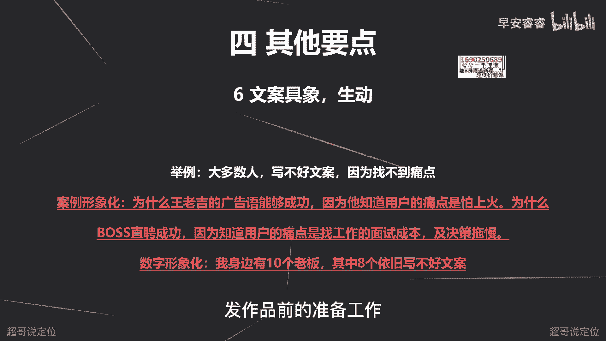

我是你们值得信赖，有问必答的超哥。