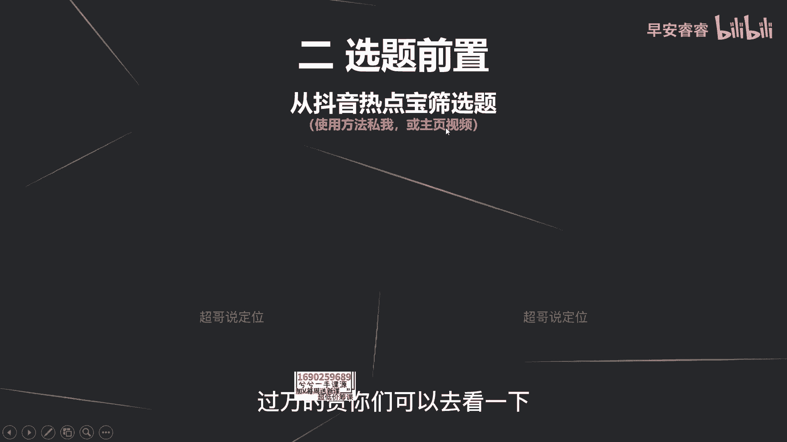
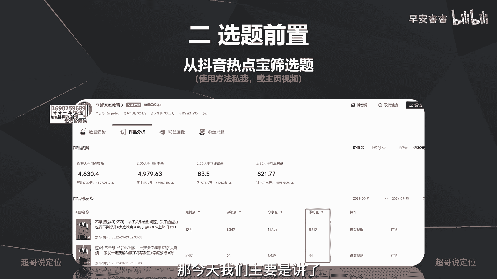
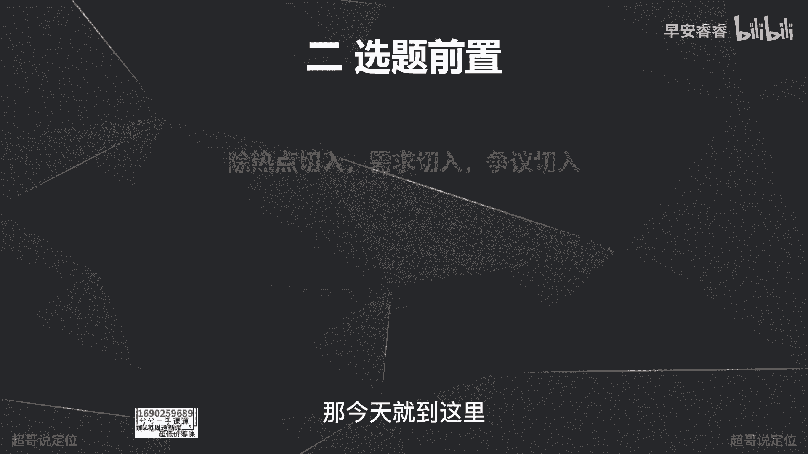

# 085 2023短视频起号·差异化定位课：0~1做懂抖音（定位+内容+投流+运营） - P38：第38节38 发作品前的准备（1） - 早安睿睿 - BV1Am421T7br

啊大家好，我们从这节课开始的话，会去讲你发作品之前要做哪些准备啊，我们分别来说一下，首先的话嗯我们想去类比一个逻辑，就是我们把发作品类比成，你要参加一个新的工作，去一个新的公司，所以说发作品之前的准备。

就相当于你在上班之前，去一家新公司之前的各项准备，那你发的第一条作品呢，实际上就是你第一天上班啊，为什么会去举这个例子呢，因为我一直在强调一个逻辑，就是我们每一个账号被系统打标签的过程。

就像我们去一家公司，然后被周围的同事认知的过程啊，系统认知到我们这个账号啊是什么内容属性，是什么标签，就特别像我去一家新公司上班，然后周边的这些老同事去猜，我到底是什么样的性格，然后我什么样的喜好。

以及我的工作能力如何如何，所以用这个类比，为了是让大家更好地去理解系统，怎么样去给我们推流，然后去做前期的工作准备，首先呢刚刚一切的逻辑啊，就是那句话，就是你的账号和你啊。

对于抖音平台和去一个公司来说都是新的，所以要去前期铺垫好一些工作，然后让平台更快地界定到，我们账号是做什么内容的，以及让这个公司的员工更快的界定到，我们是什么样的性格，我们是什么样的喜好。

那首先第一个准备工作是什么，第一个准备工作就是养号，那养号的目的呢，就是为了提升你这个账号的活跃度，养号什么意思，我概述一下，就是你注册一个新号，在你发第一条作品的前三天啊，至少三天到五天的时间。

然后模仿用户的习惯去刷抖音啊，就是你该正常点赞点赞，该正常评论评论，该正常关注关注，然后每天啊至少半个小时到一个小时以上啊，但是刚才说了，这些都是为了提升你的账号的活跃度。

那第二个它的作用是初见标签的方向，那什么意思呢，就是比如说你是一个准备发美食，赛道的内容的账号，那你在模拟用户行为的过程中，系统给你推一些美食的内容，那你就要把大概率看完，给到高完播，然后给到一些互动。

然后让系统去界定到你喜欢看美食类的内容啊，这是为了就是初期先去见你这个账号的标签，那养号的话实际上就是这两个目的，那养号这个工作呢，特别像我们入职之前提前入群啊，入公司的群。

或者在持续的和hr和上级沟通一些内容，这个目的就是为了让他们提前知道我们的性格，我们的能力如何如何如何，所以养号这件事情必要但不重要啊，就像你去一家公司之前，你和hr的沟通这些它是必要的。

因为要确定你哪天上班啊，哪天入职，但是不重要，所以你拿到一个新号，开始去模拟用户行为，去给账号出借这个标签的工作，它是必要的，但是没有那么重要啊，但是呢养号是一个必定的过程啊，必须要去养号，那怎么做。

我刚才就说了嘛，提前3~5天模拟用户的行为就行啊，去产生一些互动啊，和你喜好的内容，和你即将切入的这个赛道的内容去做，那第二个准备工作是什么，第二个准备工作就是在你发作品之前，提前筛定啊。

7~10条的选题内容，一般我们在做一些IP孵化的话，会提前帮他去梳理，7~14天就是两周左右的一个量，这个就像你提前去一家公司之前，提前做一些准备工作啊，提前去了解这个公司的情况。

以及接下来工作发展的方向，那选题怎么样去准备，之前已经讲过，有三个方向，第一个是用热点切入，第二个从需求点去切入，第三个从争议点去切入，而且一定要多看对标达人他们的内容的评论区，然后去找这三个方面的点。

那今天的话新增一个新的傻瓜方法啊，这个方法会更为简单，原因就是因为这两天抖音的一个小程序，热点宝更新了，然后更新了之后就会有一个新的选题方向，而且会更为的客观有用，这里就来点试一下。

首先打开抖音的热点宝，这个的使用方法可以直接问我，或者在我主页有一条视频啊，过万的赞，你们可以去看一下。

那里面有详细的讲解，然后在热点跑里面，假设我现在是做一个亲子赛道的账号，那我可以直接看到我这个对标账号，他每一条作品的吸粉量是多少啊，之前我一直在说，我们判断一些账号它的内容到底可不可参考，不能只看赞。

还要看他们的分享以及收藏的数据，那在热点榜里面，其实我们可以看到一个更有效的数据就是吸粉，因为我们新手在前期起号的过程，实际上都是为了去积攒第一波的粉丝，而且是精准的粉丝，那在热点宝里面。

其实已经可以看到每一个对标账号，他们每一个作品的吸粉量啊，这本选定30天，就可以看到他30天的每一个作品，按吸粉量的排序，那这里的话你就可以去判断，像这条作品吸了5000多个粉丝。

那你就可以判断他想讲的这个点亲子关系，如果出现问题，孩子能力也得不到提升，那这是一个选题方向，那我就可以去参考，那我如果是做家庭教育的话，我就知道这是一个大众的需求点，或者说争议点啊。

而且它能带来足够的流量，给我带来有效的粉丝，那我就可以看一下，他这条文案结构到底是什么样，第一点讲什么，第二点讲什么，然后去做一个参考啊，做一个选题的一个再加工那个工作，那讲完选题怎么做之后。

那今天我们主要是讲了。

在发作品之前的两个准备，那两个准备我们再来回顾一下，第一个准备呢就是养号，那第二个呢就是提前备好，一到两个星期的选题啊，那今天就到这里。

我是你们值得信赖，有问必答的超哥。