# 085 2023短视频起号·差异化定位课：0~1做懂抖音（定位+内容+投流+运营） - P39：第39节39 发作品前的准备（2） - 早安睿睿 - BV1Am421T7br

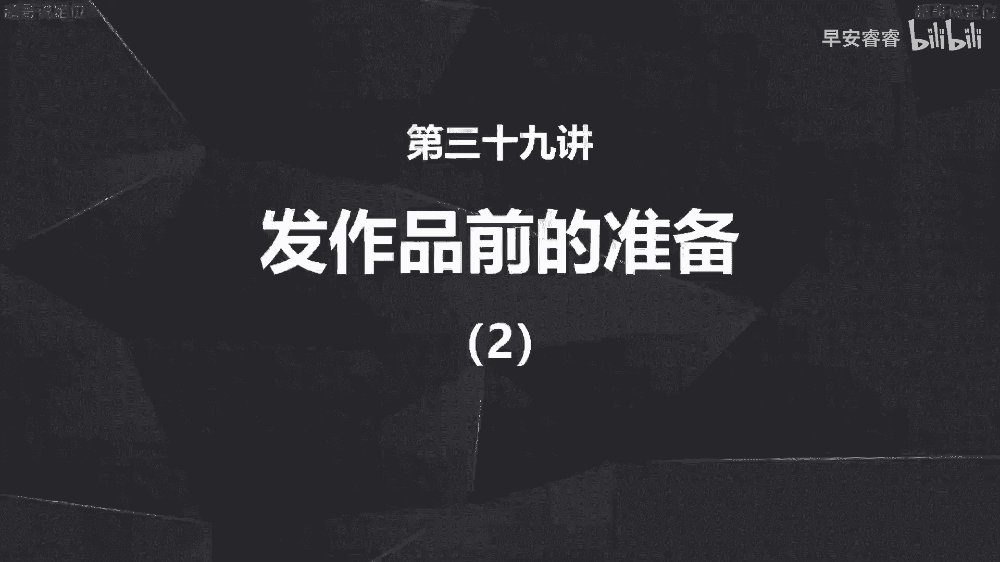

今天这个选题讲，我们发作品之前的第三个准备工作，那之前已经讲过两个准备工作，第一个就是你要先养号，那第二呢就是要先准备一到两个星期的选题，那第三个是做什么，第三个就是给你的账号的门面去做打造。

那门面的打造实际上就是告诉观众，告诉平台的用户，你是谁以及你能干嘛，解决什么问题，那这个就像什么呢，这个就像你入职之前准备自己的入职介绍，那门面打造总共分为四个部分。

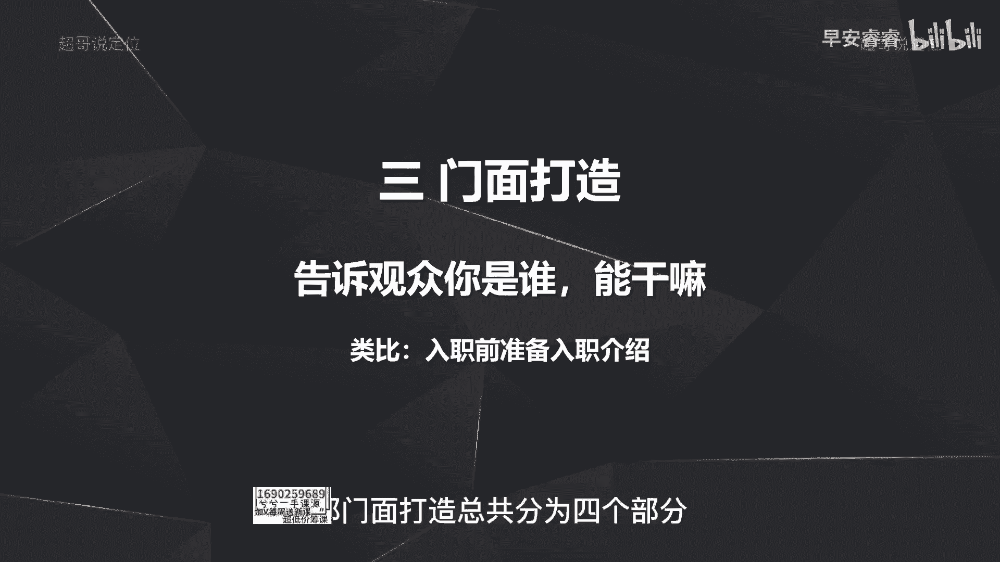

我们先来一个一个说，那第一个叫做你的名称应该怎么样去写，就是你的账号名字到底应该叫什么，那账号的名字怎么去写啊，主要有四个方面，第一个方面呢，就是我要一眼能看出来你到底是哪个赛道了，以及你能做什么事情。

能提供给用户什么帮助，第二呢就是我通过这个名字啊，大概能猜到你这个人的人设形象，你的性格到底是什么样一个情况，那第三点呢就是名字一定不要过长，一般来说5~6个字就差不多了，不要太长。

那第四点呢就是提前要思考你这个名字的简称，比如说你的名字叫做拿库拉玛塔塔，那别人简称你叫什么呢，对吧，就会很绕，所以名字提前想好的时候，也要去想一下自己的简称，到底最后怎么样去叫啊。

为了方便你的粉丝和你直接去沟通，我们分别来举例看一下，假设我现在要起一个号啊，做的是美食赛道烘焙方向，那我的账号的名字啊，就可以写叫小溪的烘焙日记啊，一眼就能看到我这个账号。

提供的是一些烘焙的一些啊食谱，那第二种呢，小西烘焙很用心，它体现了这个人设就是很努力很用心啊，做事很精致的这个人设形象，那再举例，如果我现在要去做啊种草，而且种草的东西是儿童的玩具。

那我可以起个名字叫飞飞玩益智啊，也大概率可以猜到，二是跟益智玩具相关的一个账号，以及啊说玩具的暴躁飞，那也可以看到人设形象，就是这个菲姐可能脾气不太好，比如说我现在起号做一个财经赛道，理财方向的账号。

那我可以叫王大锤学理财，那就可以看老师讲理财对吧，一眼就能看到是讲理财内容的这样一个账号，很锤，那第二呢就是体现人设，OK写理财大锤很努力，就可以看得出来，王大锤是一个很努力的人设形象啊。

那刚才举的这些例子呢，是在名字上面怎么样去写，那第二呢是你的toto banner应该怎么样去做，toto banner呢，就是你们在手机端口，看到每一个账号最上面那个顶图。

实际上它也可以起到很大的作用，那目前头图怎么样去设置，实际上是三个方向，第一个方向就是完全的简洁版啊，就是什么东西都不放，就放一个自己的照片或者一个星空图片啊，比较有意境的就完事儿。

第二种呢是想版会在上面写清楚你是谁，以及你要干嘛，第三种呢就是用头图去做一个补充引导的，这样一个作用，去引导到你的私欲啊，然后以及去引导转化，那这三个方向我分别来举例说一下。

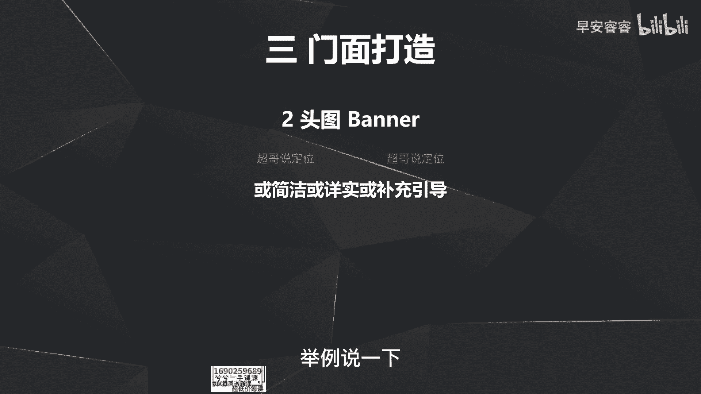

那首先第一个案例可以看到，小军办公室这个头图设置就是一个合影啊，就是一个合影图片啊。

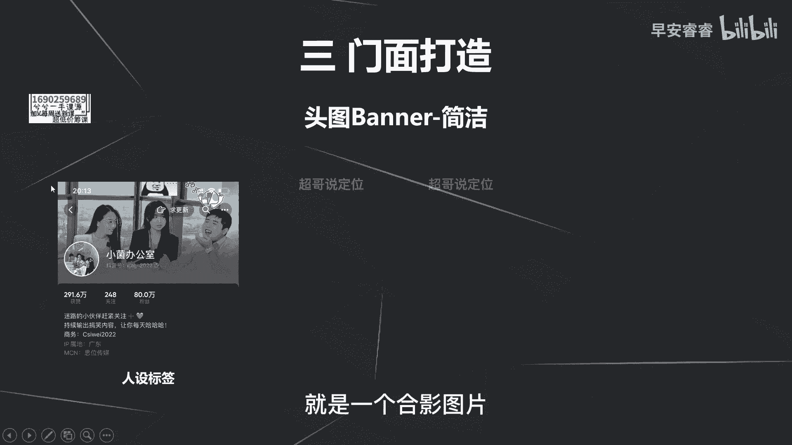

体现了人设形象，那第二呢，野生女孩日记本就是也是放自己的一张照片啊。

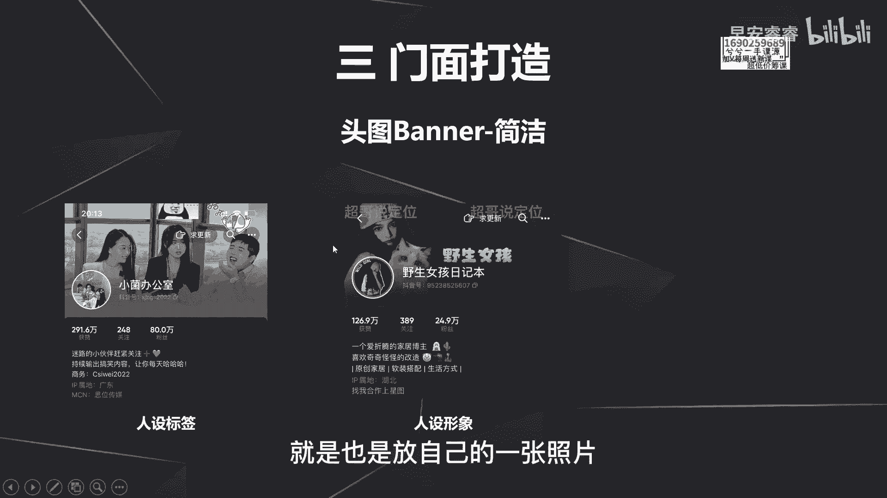

比较有意向的一张照片，第三种呢比如说特特子的家啊，放的是求关注的这种引导，这三个呢都是相对来说比较简洁的方法啊。

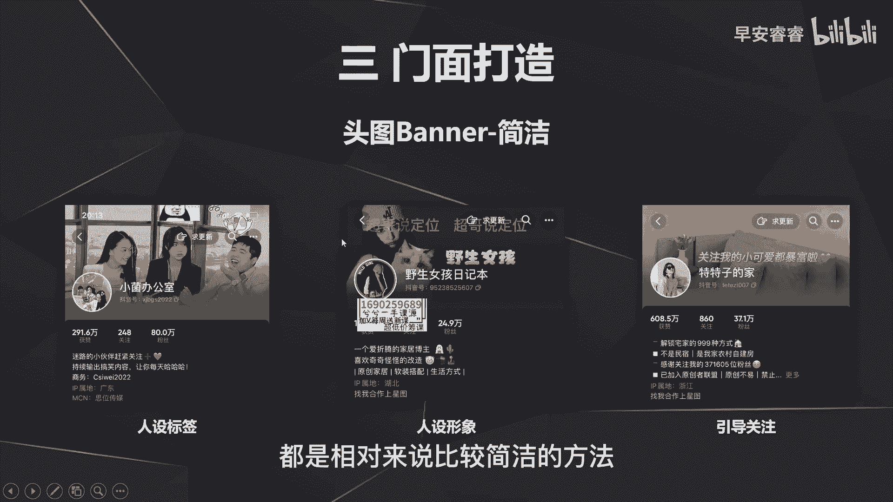

就是在你的头图不会做那么复杂啊，比较简单，那我们再来看一下详细版的会怎么样去做。

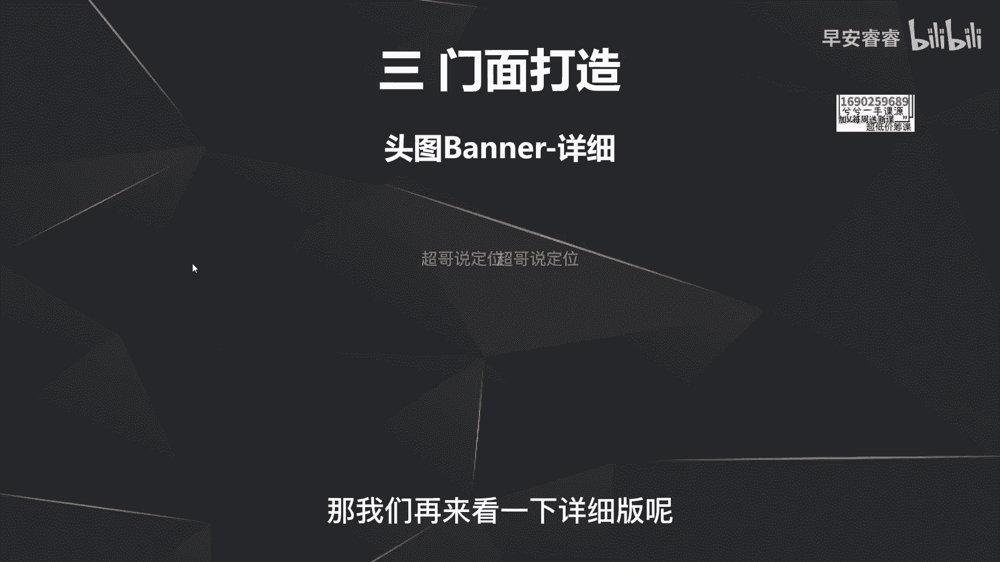

那第一种呢，就是在投毒上面去明确自己能给用户带来什么，这就写得很清楚，自己能给带来啊产品的营销定位啊以及等等。

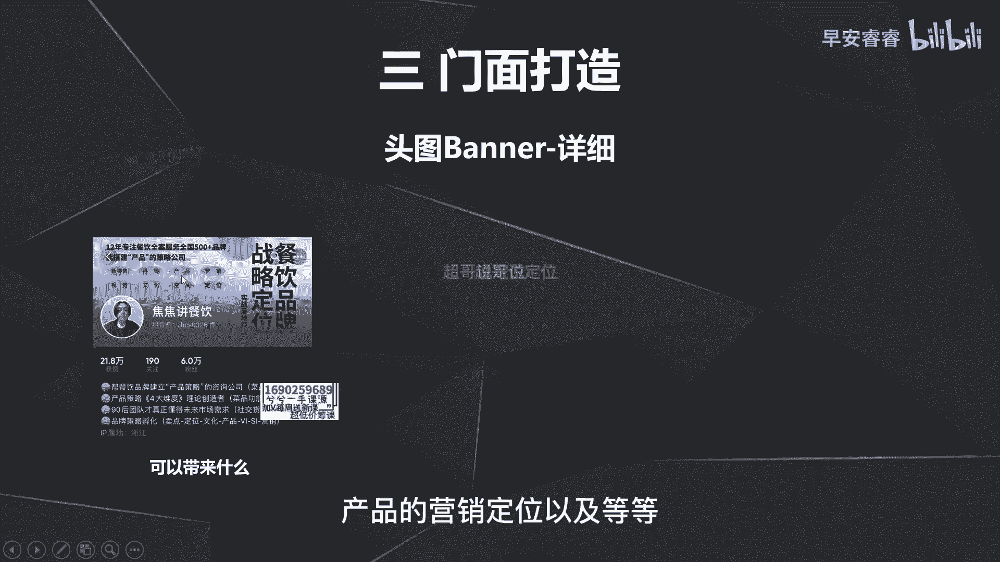

那第二种呢就可以看到是IP的身份，背书的解释啊，生成这个号以及张琪这个号，不管是用一个啊这种演讲，或者和名人合照的这种方式，还是去用文字把自己的履历写出来的方式，实际上都是为了在头图上面告诉别人。

我是谁啊，我这个人设的IP身份到底是怎么样的，实际上是给IP人设做了一个背书。

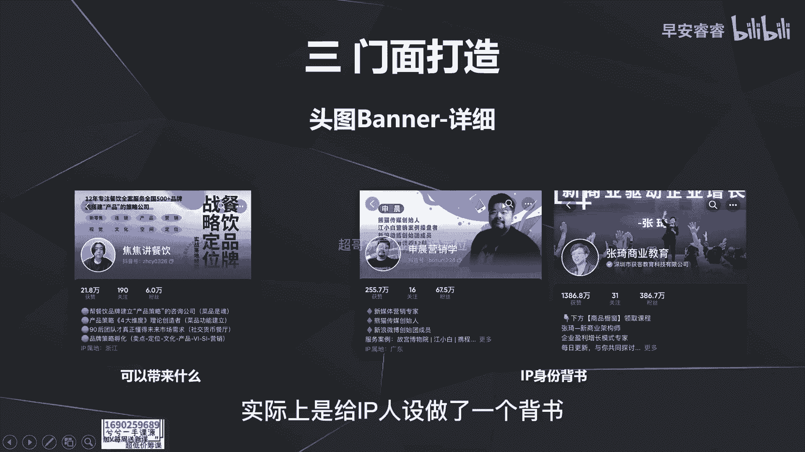

让用户能够更幸福，你是这样一个专业和商业的人设，那第三种呢就是做补充引导。

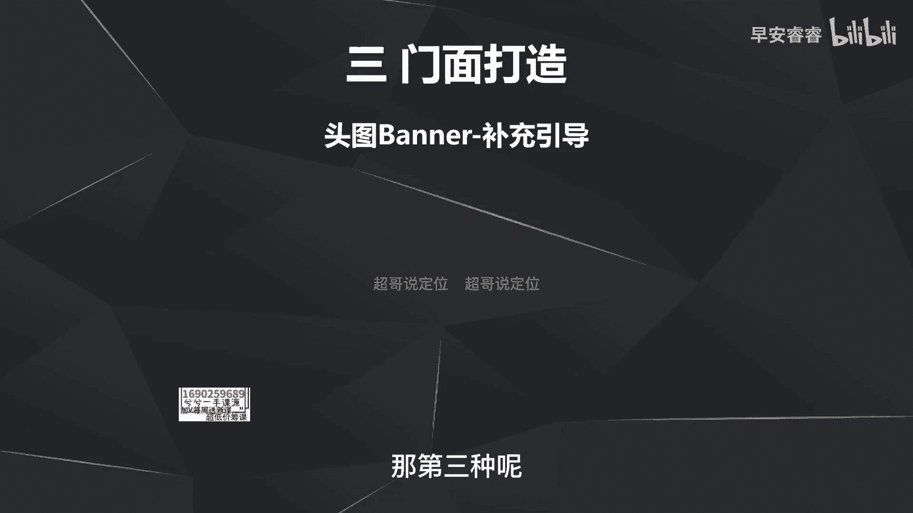

有三种方法，第一种呢就是在图图上面，直接去放你的私域的联系方式。

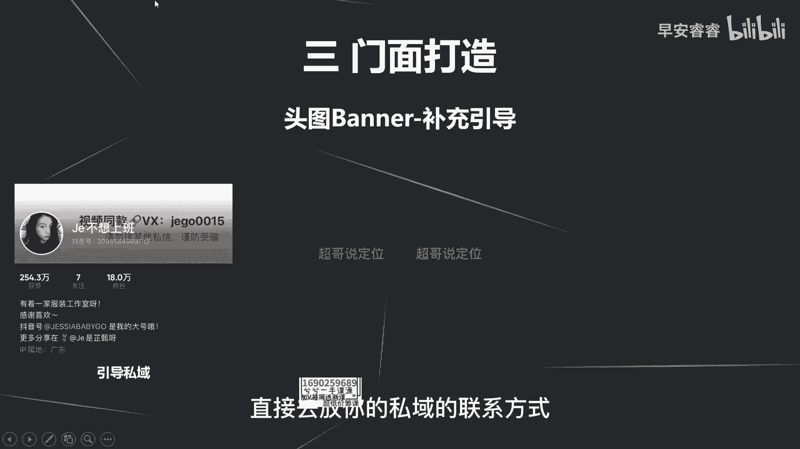

引导到思域，那第二种呢就是去放一些。

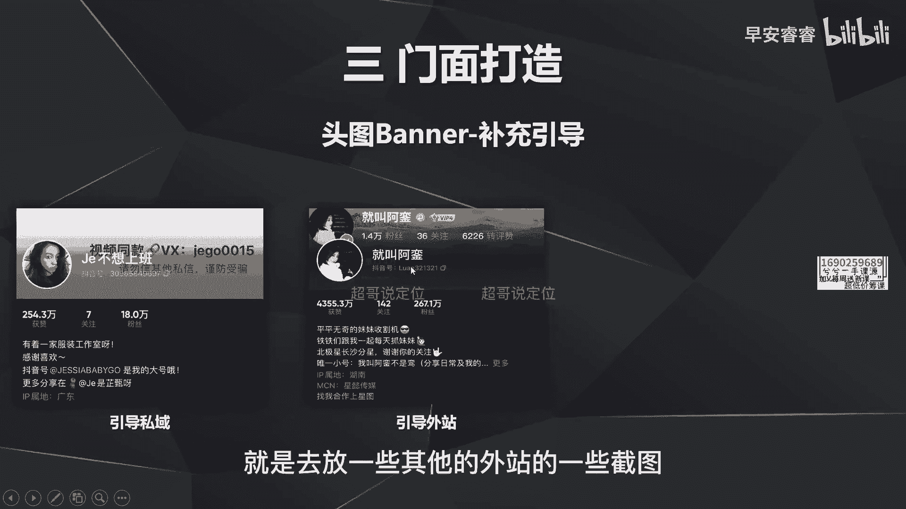

其他的外站的一些截图啊，这个像这个是微博的截图，那第三种呢啊就是像我的这个头图一样，去引导到加粉丝群，而且还设置了一个方法，就是你加粉丝群可以免费获得什么什么事情。

目的就是为了让粉丝群能够快速的积攒用户，那整个头图怎么样去设置啊，这边已经举了三个例子，说了三个方向啊，也就说完了，那接着话我们去讲第三个门面打造的环节。

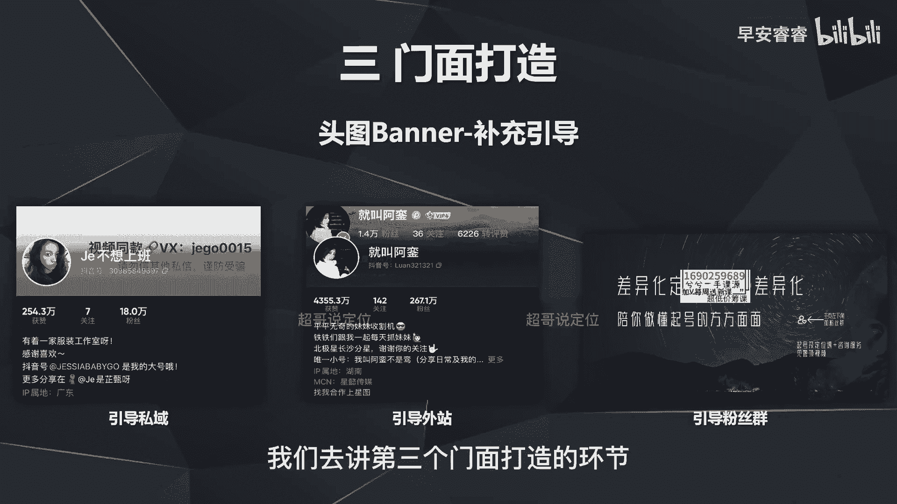

就是你的简介应该怎么样去写，那简介怎么写呢，第一就是要告诉用户你是谁，那第二呢就是要用履历去概述你是谁，以及为什么你是谁，第三呢就是要说清楚你在抖音上面要做什么，以及能给用户带来什么东西。

那第五步呢就是去放一些引导的一些文字，不管是引导到私域还是引导关注，还是引导到粉丝群，那第六步呢就是去备注你要卖什么东西，以及去做一些温馨的提示，那我们去看一个案例，看他的简介就会更好懂。

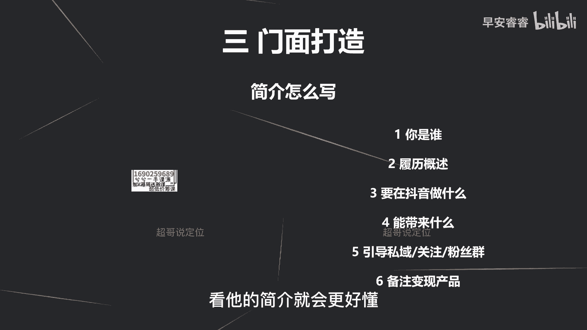

这个简介应该怎么样去呈现，这是一个美食赛道账号，小雨咕咕，我们可以看到他第一句话告诉的就是我是谁啊，第二句话告诉的就是我的履历啊，他相当于讲了一个星座，实际上也是履历的这个逻辑啊，以及他后面的内容。

我就告诉的用户是他在抖音要做什么，以及能带来什么，就是要做很多很多好吃的好就够了，那简介要完成这六步。

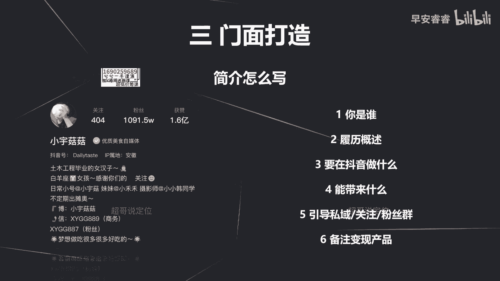

我们来模拟一个案例去看一下怎么样去写啊，假设我现在要起一个号，做的是美食赛道减脂餐的方向，就是我的视频内容主要去输出，告诉别人减脂餐应该怎么样去做，然后每天去做不同的减脂餐，那首先第一步告诉别人我是谁。

我可以写我是小希，或者我是正在减肥的小希，那第二步呢就是告诉别人我的履历，那我可以去写，我靠吃减脂餐，我实现了从150斤到100斤的蜕变，那第三步呢告诉别人我在抖音要做什么。

就是每天去分享一道创意的减脂餐，我能带来什么呢，就是我希望大家都能够健康瘦身，那第五步呢我可以去写啊，剪纸的交流，可以去加粉丝群，或者可以去加我的微信或者等等等等，实际上第五步就是一个引导话术。

第六步呢，就去备注一些变现产品的一些温馨提示，比如说去备注我橱窗内的产品，全部都是亲测有效的啊，有序可以放心下单，那整个的简介就可以看到很详实，而用户知道你是谁，你能带来什么。

以及如果用户有一些问题的话，他也知道去粉丝群去找你啊，以及他也知道你的橱窗里面有这些产品，他可以直接去买啊，所以说完整的简介实际上就是这六个方面，那我们刚才讲过了门面打造的第三个方面。

就是简介怎么样去写，那我们就说第四个方面。

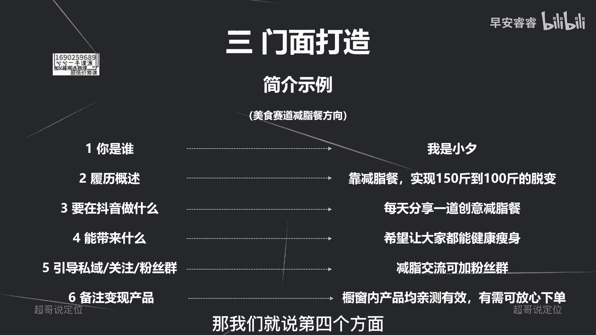

第四方面就是头像，头像其实是最简单的，就是如果你这个人设形象是个逗逼的，你放一个逗比的可爱头像，那你这个人设形象如果是比较酷比较吊的，那你去P1张，或者去加工一张比较酷炫的图片去作为你头像。

头像的设置相对简单，那这里就不再赘述了，那今天我们讲完了，发作品之前的第三个准备工作好。

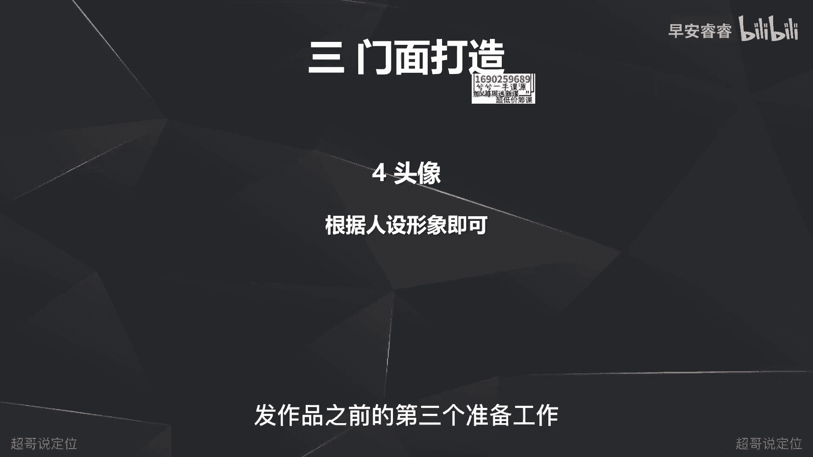

那我们下期继续去讲啊，我是你们值得信赖，有问必答的超哥。