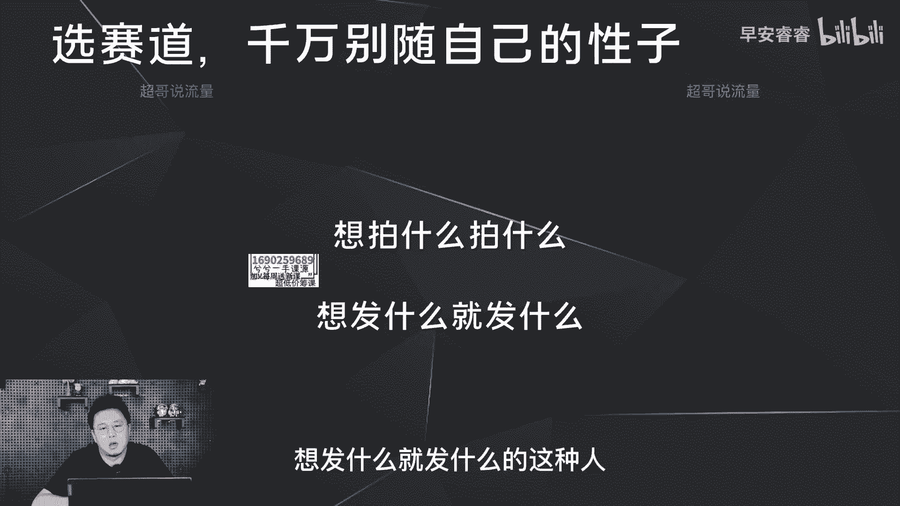
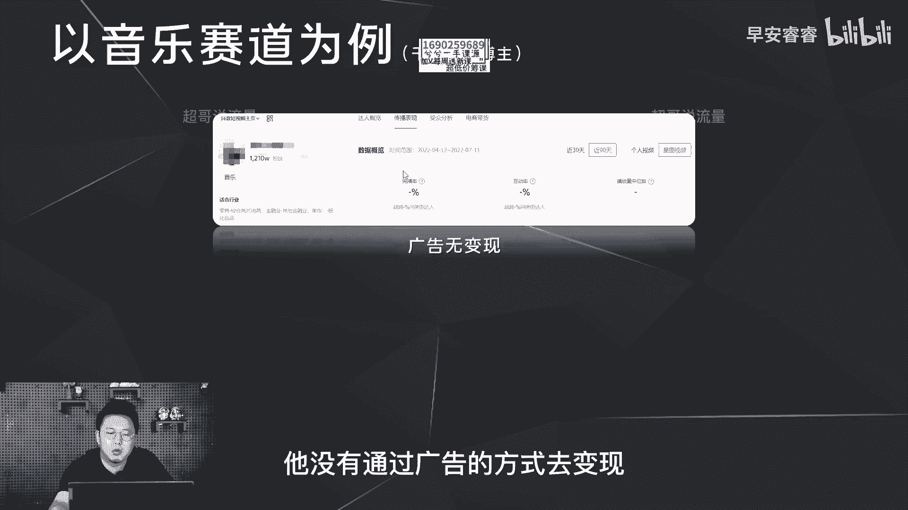
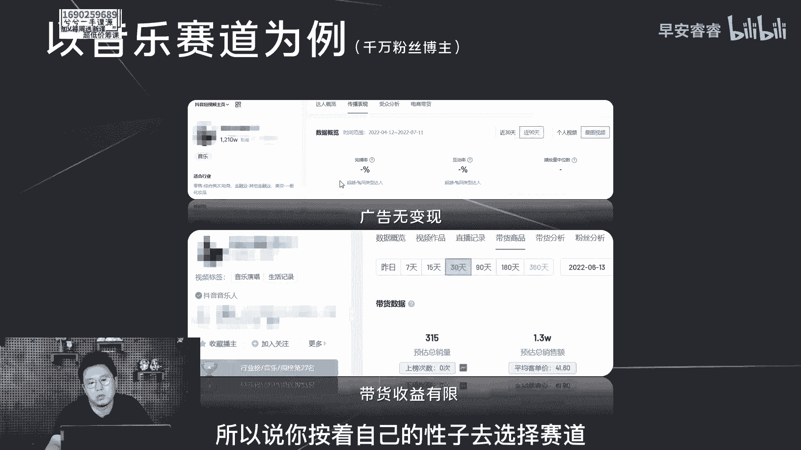
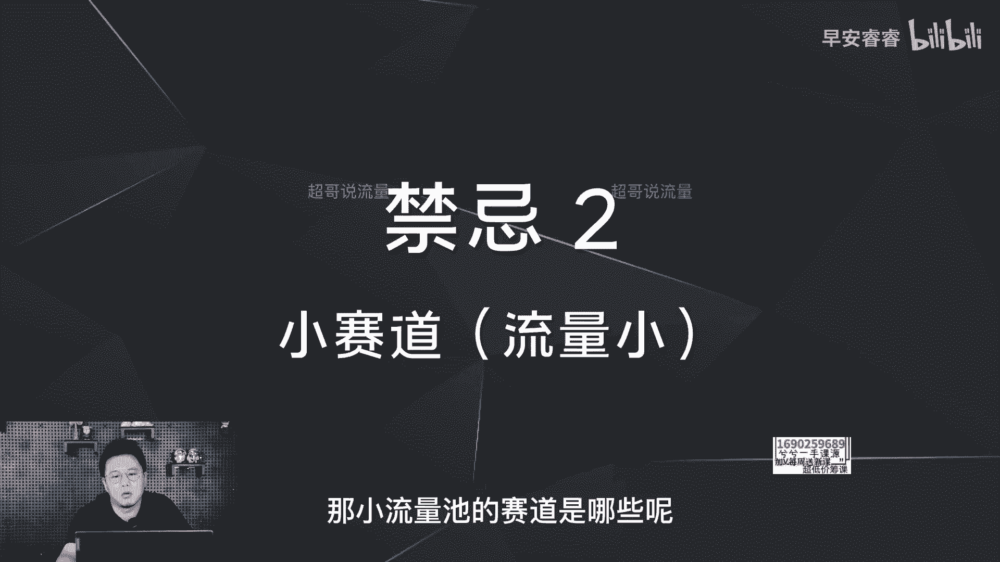
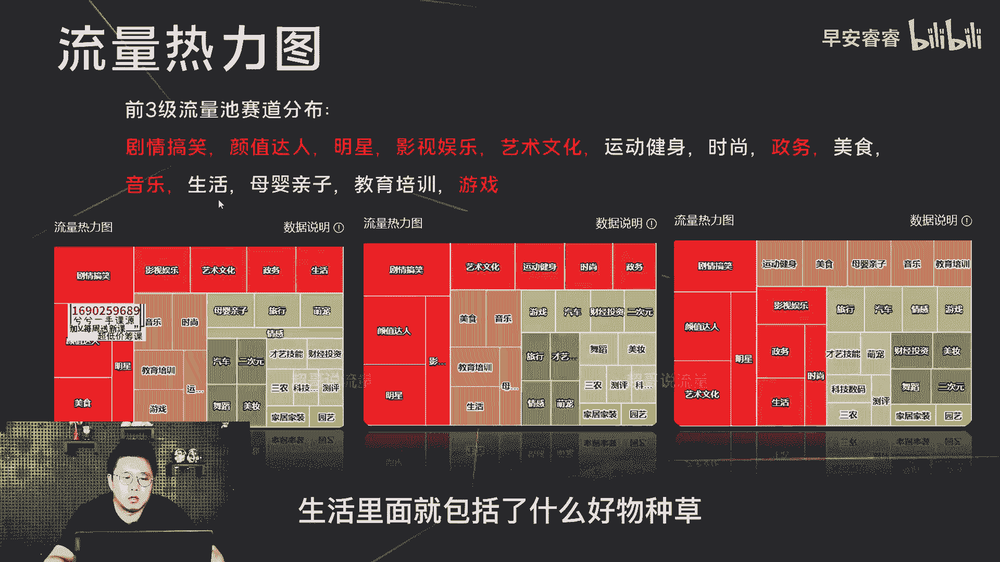
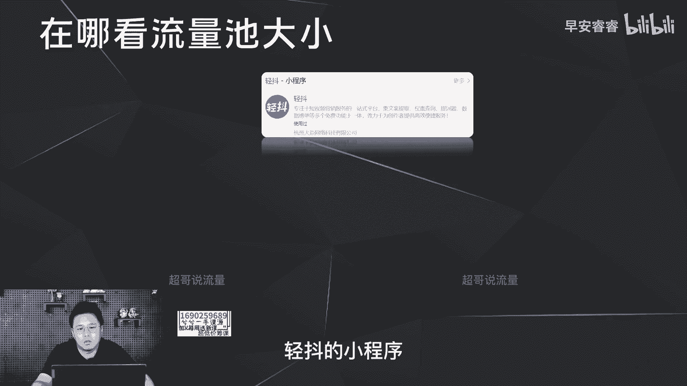
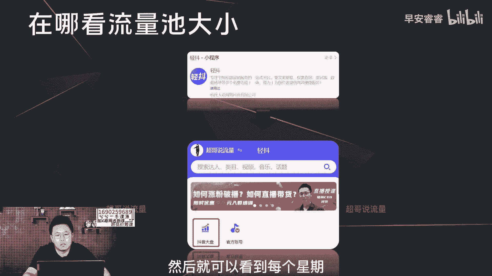
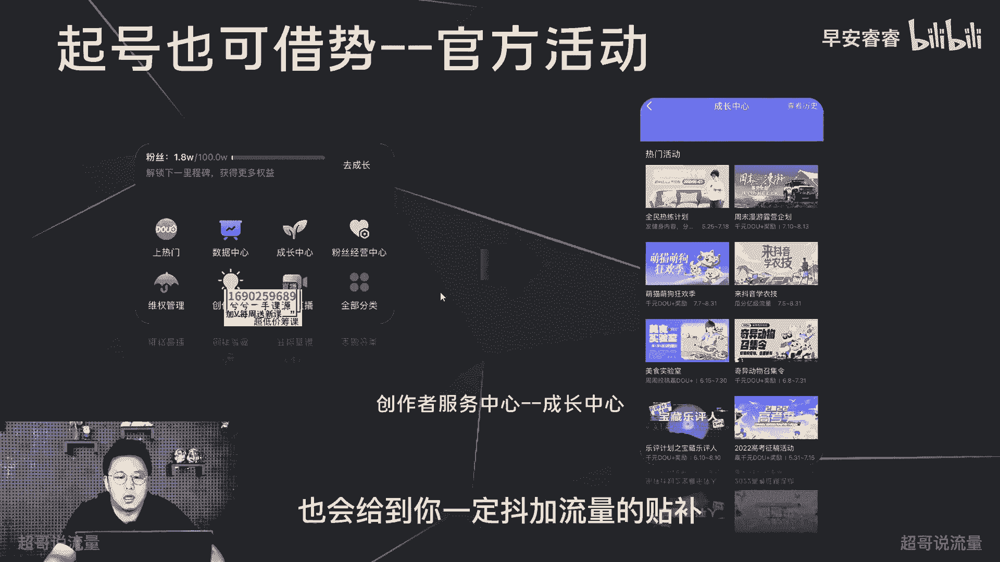

# 085 2023短视频起号·差异化定位课：0~1做懂抖音（定位+内容+投流+运营） - P3：第03节3 选赛道的禁忌 - 早安睿睿 - BV1Am421T7br

好今天我们接着再讲一下选赛道的事情呃，我们首先先讲一下选赛道的几个禁忌，就是新手选赛道的时候，千万不要去踩这些坑啊，第一方面的话就是选赛道一定不要太主观，不要跟着自己的兴趣爱好去走，为什么这样说。

因为你随着自己的性子去选赛道，一定会遇到后期没办法变现的问题，就比如说19年和20年，很多新手在做抖音的时候，喜欢唱歌就去拍音乐的内容，喜欢打游戏就去做游戏解说，但是后期上了100万。

200万粉丝甚至更高的时候，你就会发现没有变现，因为上一期我们说过，在某些赛道，它是没有好的变现模型和变现产品的，所以说你选择赛道如果按照自己的性子去选，那你一定会在后期遇到啊这种变现的问题。

所以说我们不要去做啊，想拍什么就拍什么，想发什么就发什么的这种人啊。

举个简单例子，比如说我们拿音乐赛道去举例，这是一个千万的粉丝账号啊，有1200多万的粉丝，那这边可以看到他三个月，他的薪酬广告是没有任何的一条，也就意味着，这三个月他没有通过广告的方式去变现。

那带货呢这边也可以看到我们在飞瓜的后台，可以看到这30天他只卖了1万3的货啊，那这块去算他的佣金也就是一两千块钱，实际上没有任何的意义啊，因为如果你要是想去通过带货去变现，那你不如去做其他赛道。

你不如直接做一个好物推荐号，因为它的变现逻辑可能会更直接一点，所以说你按照自己的性子去选择赛道。

一定会在后面遇到变现的问题，那第二个禁忌是什么，第二个禁忌就是不要去做一些，小流量池的赛道啊，那小流量池的赛道是哪些呢。

啊这是我随机放了嗯，某三个星期的流量池的分布图，这里可以看到这个类别是属于最大的流量池，基本上在剧情搞笑，颜值达人，明星和影视娱乐为主，那第二类的呢就橙色的，基本上就是艺术文化运动，健身时尚。

还有政务为主，第三类的呢就是这个黄色的，然后是第四类，其实也算比较大了，然后再往后面，你比如说家居家装和园艺这两个赛道，它流量池本身就比较小啊，那建议就不要去做，比如说测评，比如说科技数码啊，可以做。

但是流量池会比较小，除非你能做出足够的差异化，你可以去做，对于普通人新手，尤其你第一次做抖音起的第一个号，你一定不要去做太小的流量池，要不然你会嗯在一个很卷的赛道，然后竞争的很痛苦。

自己可能慢慢就没有信心了，那前三集的流量池就是红色，橙色和黄色，基本上就是这14个赛道为主，里面包括了剧情搞笑，然后包括了颜值达人啊，然后包括了教育培训这些，然后这里面我标红了什么意思，标红的这些赛道。

不是因为变现对于粉丝的门槛与要求，就是这些赛道本身没有太好的变现模型，举个简单的例子，比如说在政务这个赛道你不可能做，而且他也没有特别好的变形的模型，然后游戏也是一样，没有好的变现模型，那剧情搞笑。

对于粉丝量的要求至少是啊百万起步，所以说这一块对于新手来说，包括颜值达人也是一样，那对于新手来说的话都是不太良好，那除此之外，白色的是新手去做的时候，可以去选择的一些赛道，比如说运动健身，时尚美食亲子。

还有生活，还有包括教育培训，生活里面就包括了什么好物。

种草啦，测评啊等等，所以说我们一定要去选择大的流量池，选择大的流量池，意味着我们起号会更加地快，也会更加的稳定，那在哪里去看流量池的大小呢，我们经常用的就是一个呃青岛的小程序。

就是你在某信上面直接去搜青斗，然后通过这个小程序里面的抖音大盘，就可以看到刚才那个色块分布图，然后就可以看到每个星期流量池的变化。

除此之外，其实起号的时候也可以去借势，第一种借势方法呢就是踩准节点，举个简单例子，如果你之前是做呃健身运动，减脂运动为主的这样内容的账号，那你应该就在今年的4月份，去做内容的堆积和输出。

因为在今年4月份的时候啊，全网在推宅家运动啊，以刘耕宏为代表，所以在当时来说的话，你做这样的赛道喜好会相对快一点，第二种借势呢就是去看每个月官方有哪些活动，然后这些活动我怎么样去借力，然后起号。

比如说在这个月的话就会有一些美食活动，然后包括一些啊宠物的活动，那你如果是做宠物赛道或者美食赛道的话，那你这个星期按照这个活动里面的内容要求，去起号，可能会起的更快，那这个在哪里去看呢。

在创作者中心的成长中心里面，就可以看到每个月的活动有哪些，然后参与这些活动以后，不光有流量的扶持，然后最后结束之后也会给到你一定抖。

加流量的贴补好，整体就是这样。