# 085 2023短视频起号·差异化定位课：0~1做懂抖音（定位+内容+投流+运营） - P40：第40节40 发作品前的准备（3） - 早安睿睿 - BV1Am421T7br

今天我们讲发作品前的最后一个准备工作，那我们回顾一下之前讲的三个准备工作，那第一个呢就是要先养号，第二呢就是要先准备选题，第三个呢就是去打造好你的门面，包括了你的名称简介怎么样去写。

以及你的头图和头像怎么样去设置，第四个准备工作，就是为你的账号标签前期去做准备，就是为了让你发出来的作品，能够让系统快速界，听到你是一个做什么内容的账号，就是让系统知道你是谁，那相当于是什么。

相当于你入职之后，同事通过跟你的沟通，了解到你的性格，你的喜好以及你的工作能力到底是怎么样的，那第四步是做账号标签的准备，我们先来了解账号的标签的建立，是怎么样去建立的，它是有两个方面。

第一个方面呢就是不花一分钱，然后让你的内容去引导系统给你推流，就是你是做美食的，通过你优化你作品里面的内容更加的垂直，不会出现一些其他赛道的一些画面元素和文案，让系统去判定到你是一个美食赛道的账号。

那第二种方法呢就是付费策略，就是直接投抖加，让系统推送给我们想要的对标达人的用户画像，去给我们界定账号的标签，那我们先来说不花钱，然后优化我们的内容，让系统怎么样去判断。

我们到底是一个做什么赛道内容的账号呢，那我们一个一个方面去说啊，首先第一步就是你的封面，到底应该怎么样去设置，那封面我们一般会设置三个层级，首先是有主标去说明你这条视频是做什么的，第二呢就是副标。

因为鼠标会相对简短，所以要用副标去做一个补充的阐述，那接着呢去放一排小字，小字的目的是为了去引导系统去界定，我们账号是做什么内容的，那这三个层级呢啊，第一方面就是你的整个的设置，不管是主标副标还是小字。

你的整体的文案要精准，要垂，不要出现一些其他赛道的一些词汇，那第二呢就是不要出现一些无效的文案，就比如说你里面去放一些啊，过多的朋友圈的日记的那种说法，比如说今天天气很美之类的，放到你的封面里面。

这样的话会影响系统去界定你这个内容，那我们来看一个案例，这地方可以看到这是主标啊，这是副标，以及这是小字，那你可以看到他这一系列都围绕的是什么，包括小资的关东煮一系列都可以判断出来。

这是一个讲超市的一个内容，所以说刚才说的就是你的封面，一定要去做一个精准的引导，让系统更能够清晰地判断到，你这条视频到底是讲什么内容的，就不要出现一些无效的文案，那这是第一个就是封面怎么样去做。

那第二个工作呢就是去优化你的标题，就是你的发布文案啊，通过你的发布文案来引导系统去判断，你到底是一个讲什么内容的视频。

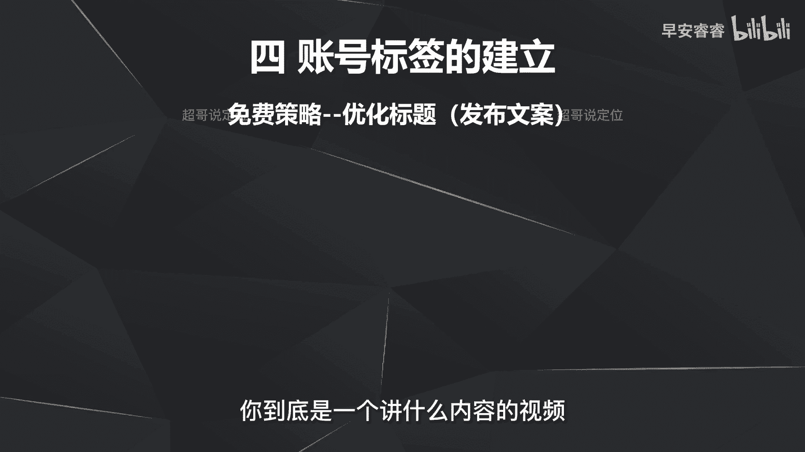

那我们来放个案例看一下，那这个可以看到啊，就是我上传了一条视频以后，系统通过我视频里面的内容，已经判断到我是讲什么啊。

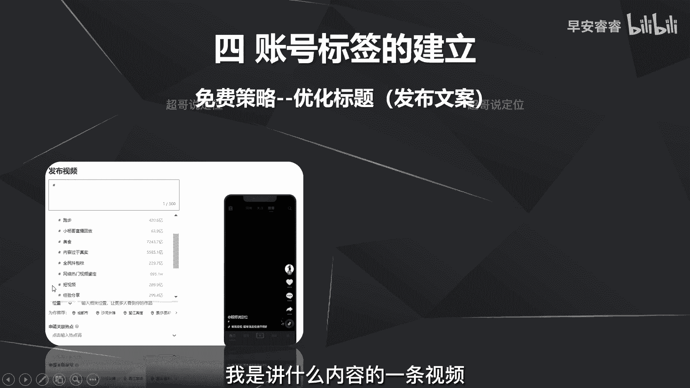

内容的一条视频，那这里就可以看到了，话题就抓取到了跟短视频相关。

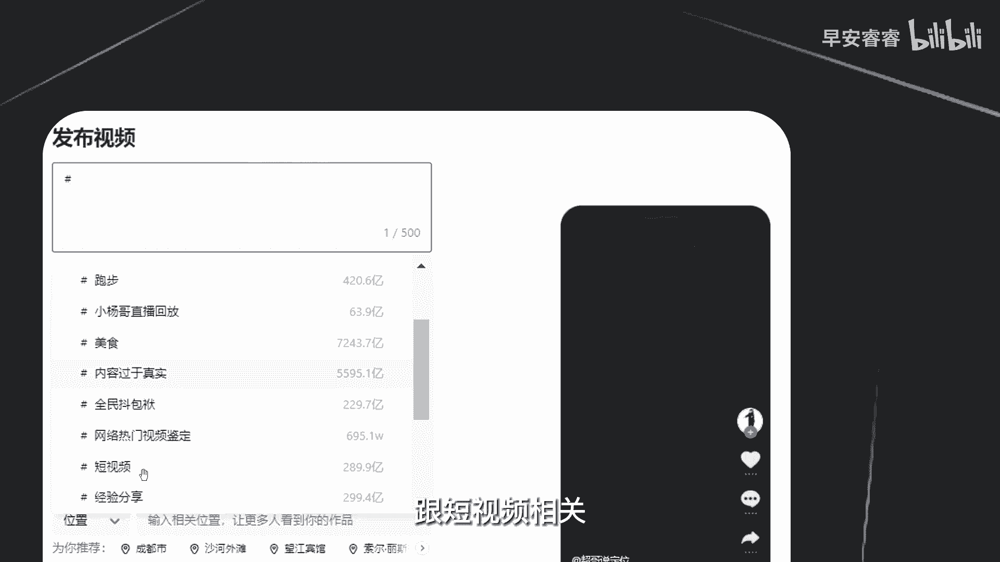

跟啊美食相关，跟跑步相关等等等等，但是我把我的发布文案就是我把我的标题啊。

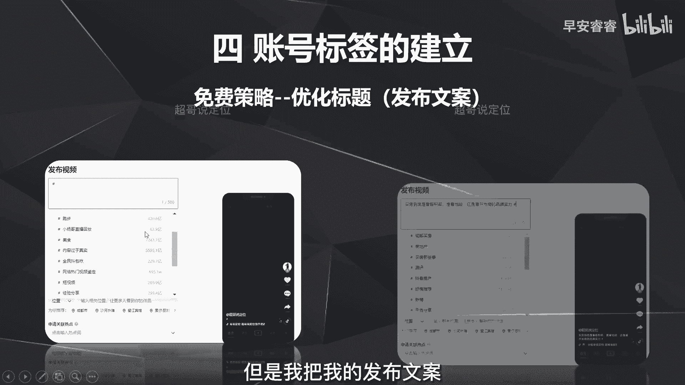

同样还是这一条视频，但是我把我的标题换了。

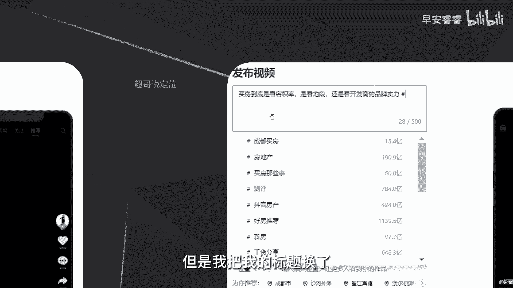

我就去写成买房到底是看容积率，看地段还是看开发商的品牌实力。

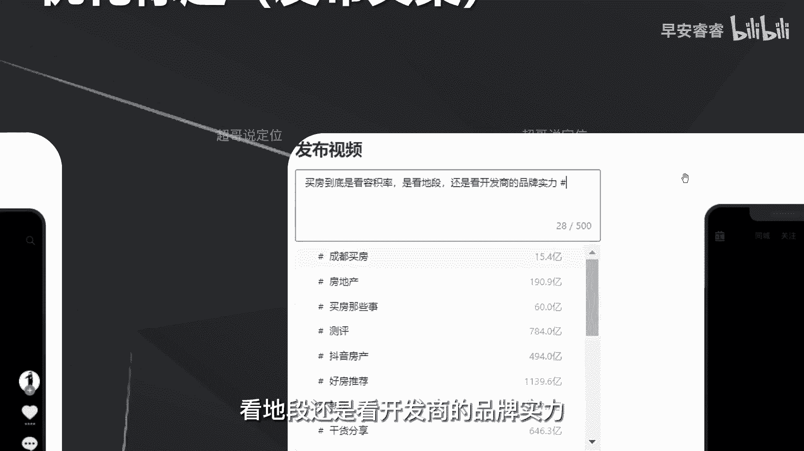

我写完这些以后，我再去输入井号话题，就可以看到系统推送给我的话题，全是跟买房相关的。

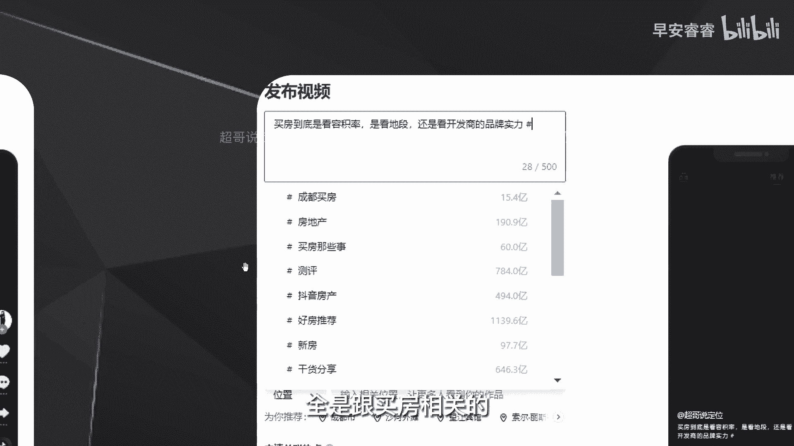

所以标题怎么样去设置，就跟封面的逻辑是一样的，一定要精准，不要出现一些无效的方案，就比如说你去写，我今天买了一套房啊，好开心啊，怎么怎么样，要去出现一些买房相关的精准的这种垂类词汇。

去让系统去判断你到底是讲什么内容的视频啊，那是第二个方向，那第三个工作是什么呢，第三个工作就是优化你的话题，就是刚才这些警号的话题。

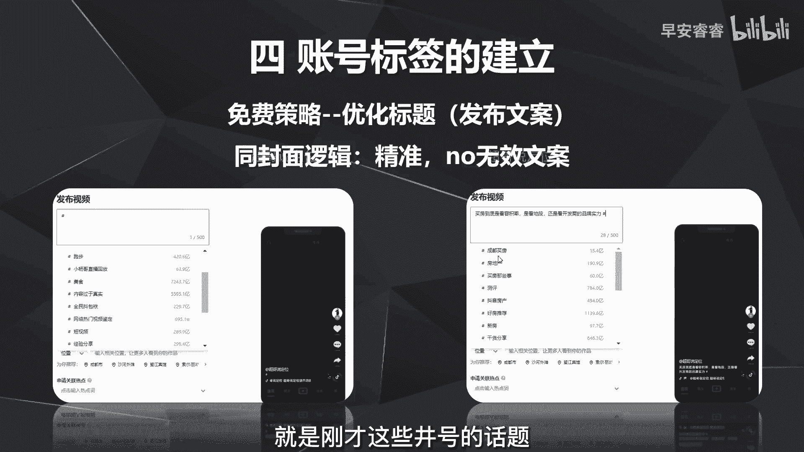

就是你发完作品以后，话题怎么样去设置呢，有五个方向，第一呢就是先去绑定一个赛道的话题，就是你这个赛道是什么，去警号它，那第二呢就是你这个赛道之下，你做这条内容是什么细分的行业啊。

去警号它比如说你是讲二手房的，你就去井号二手房，那第三呢就是去看你这个赛道，最近有没有一些热点，然后去警告它啊，就比如说我是一个做美食的一个账号，哪怕我做的事情跟奶茶一点关系都没有。

但是最近茶颜悦色是一个热点，我就去警号茶颜悦色，为了让系统去推给更多的美食赛道的用户啊，去看我这条视频，第四呢就是去警号一些长尾词，那长尾词什么意思，我来解释一下，那比如说完播率就是一个词组。

完播率多高才算高，完播率多少才能达标，那这分别就是两个长尾词啊，相当于是一个句式，那所以说我们要去设置第四个呢，就是去设置一些关联词的长尾词，那关联词从哪里来，就是我之前的最早的课程里面有去说。

过去看你做的这个视频的主要的核心内容，他的需求关联词有哪些，在巨量算数里面去看，那这个我再举个例子，那比如说我这条视频是讲买房的内容，那买房的相关很多人可能会问买房在哪里啊，那我就警号买房在哪里。

或者买房买什么，开发商才对，我就去仅靠这样的长尾词的话题，那这些需求从哪里看呢，就是之前讲过的，从巨量算数里面去查，那这些需求关联词搜索关联词从哪里去看呢，就是围绕你这条视频的内容的这个关键词汇。

然后在巨量算数里面去搜，在那个搜索关键词里面就可以看到，然后随机去选择跟你内容用相关的这样的词组，然后搜索出来以后作为我们第四个话题设置，就是关联词的长尾，那第五个呢就是自荐话题。

那自荐话题呢就是给自己的作品去引流啊，比如说我就会去井号啊，超哥说定位啊，超哥说流量或者小溪说美食去自建这些话题，目的就是为了后续有更多的搜索流量进来，就别人搜我名字的时候，这些视频可以直接出来啊。

那接着我们来举个案案例，去看一下这个话题怎么样去设置啊，那假设我们先发一条视频啊，是跟美食赛道交减脂餐的，我们来看一下话题怎么样去设置，那第一个话题呢就是美食啊，因为我做的减脂餐，它是美食这个大赛道嘛。

我先去井号美食，那第二个呢去警号这个细分的这个行业，就是减脂餐这个小的细分赛道，那第三呢就是这个赛道，美食这个赛道本身有没有什么热点啊，比如说近期月饼比较火，那我就去井号月饼。

那第四呢去设置需求的关联词，那剪纸很多人的需求在于怎么样才能瘦，所以我的话题就可以设计成怎么吃才能瘦，设置这个关联词的长尾词，那第五呢就是去自建一个话题，就可以写小溪减脂餐啊，那整个的话题的设置。

目的也是为了让系统给你推的流会更加的精准，诠释跟美食赛道相关的需求的用户过来的，看你这条视频，那刚才分别讲过了，封面怎么样去做啊，发布文案怎么样去做，以及话题怎么样去设置，那我们来看第四个。

第四个就是去讲你的画面怎么样去做画面呢，首先来讲一个逻辑啊，就是抖音，怎么样去判断我这条视频是讲什么内容的呢，那他就是随机抽五帧画面啊，抽五个定格的图片，然后去判断这个图片里面它的字幕讲什么。

它里面的画面元素有什么，去判断我这条视频是讲什么的，那既然是这个逻辑，那第一步，我们的文案就要高频次的出现，一些跟我们内容相关的关键词。

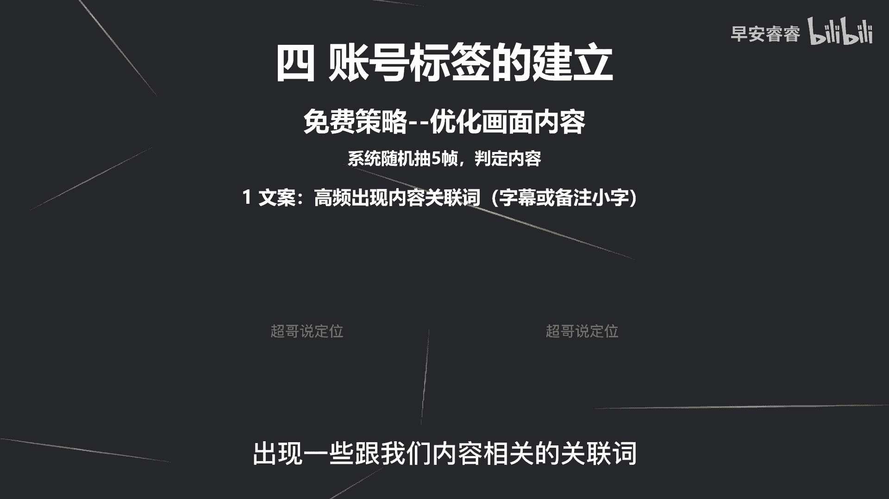

那这个从哪里来呢，就是刚才说过的，从巨量算数，比如说减脂餐这边，可以看到内容的关联词有那么多，包括碳水，包括鸡胸肉等等，那你在你的视频的文案啊，包括你这个视频里面有一些小字等等，去放这些关联词啊。

包括封面也可以用到这些关联词，目的就是为了让它抽帧的时候，大概率会抽到那一帧里面，就会有这些相关的关键词，那他就会关联到减脂餐这样一个啊需求。

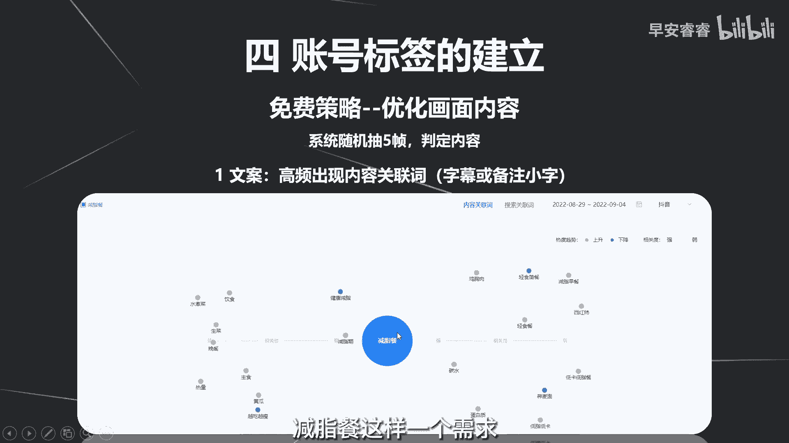

那就把这条视频推给跟减脂餐相关的，这种需求人群，那第二个方法呢，就是在你的视频里面去设置一个标题啊，就像我这种就是在上面永远去放一个标题啊，因为系统是随机抽五帧，但是我这个标题是一直都存在的。

那不管他是抽第二秒还是抽第30秒，还是抽第50秒，这个标题一直都会在，就会引导他的判断，那第三步是什么呢，第三步就是让你的画面不要出现，赛道和行业巨大反差内容，比如说你是一个做茶叶的内容。

那你画面里面就不要出现盲盒啦，游戏这样的画面元素，避免系统判断到你是一个讲盲盒或者讲游戏的，这样的内容，推给的都是18~24岁的男性为主，那跟你这个茶叶的这个用户是完全不匹配的，那第四步呢。

就是你的画面一定要高频出现一些相关内容，比如说你是一个做饭的，那那个画面里面就要持续的出现啊，食材锅碗瓢盆这些跟美食相关的画面元素，刚才就讲了，从两个方面，第一个方面就是你的文案，怎么样去引导系统抽帧。

去判断你内容是讲什么的，第二个就是从画面上面怎么样去设置，让系统去抽帧，判断你的内容是讲什么，那刚才说的这些呢都是不花钱，然后去优化你的内容，去引导系统，判断你到底是哪一个垂类赛道的账号。

那第二种方法呢，第二种方法就是付费策略，就是直接投抖加，然后投抖加的方法呢，就是去筛选20个对标达人，就是把我这条视频指定推给这20个对标达人，比如说我是做美食账号的，我就投抖。

加的时候去选定20个对标的美食账号，然后让系统把我这条视频推给这20个，达人的用户模型，那这20个达人，他的用户本身就是跟美食感兴趣相关的，所以说这样的话会更快的建立我的账号的标签，但是付费策略这一块。

一定要去明确你需求的用户到底是长什么样子，包括他的年龄大概是什么样一个情况，性别地域，以及他们的兴趣标签到底是什么样一个情况，那刚才讲过的免费策略和付费策略的目的，都是为了去前期去铺垫。

怎么样给你的账号快速打上标签，那账号标签到底有没有打上，那我接下来放一张图，就是你从你的第一条作品啊，到第十条作品，然后你去监控一个东西，监控你的作品的受众人群。

就是点开你的作品受众人群去看你的用户的啊，兴趣分布是不是这些分布，那这里就可以看到，如果你是一个美妆的账号，那你的用户的兴趣分布啊，应该就是在时尚美食八卦啊，影视亲子管理以及萌宠上面啊。

不会出现财经居家啊，游戏这些兴趣标签如果出现了，那就意味着你的标签还没有被建立上，那就要去不断的去优化内容，或者直接去做付费策略，就是偷流，那到这里，我们所有发作品之前的准备工作，就已经全部都讲完了。

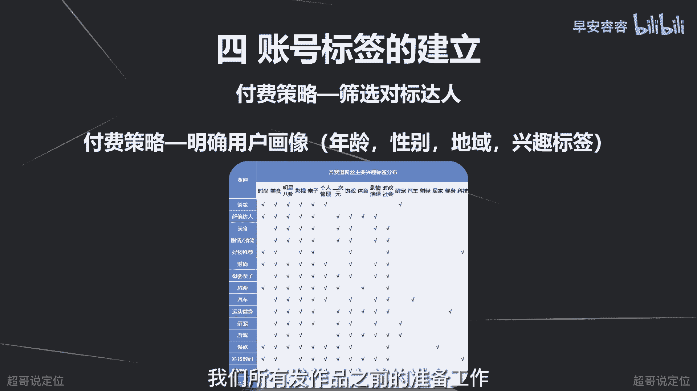

那我是你们值得信赖，有问必答。