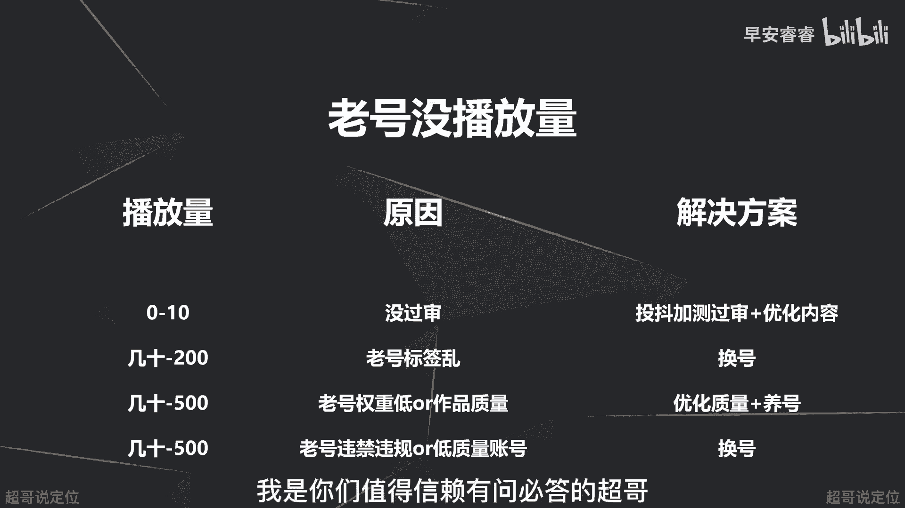

# 085 2023短视频起号·差异化定位课：0~1做懂抖音（定位+内容+投流+运营） - P41：第41节41 没有播放量怎么办 - 早安睿睿 - BV1Am421T7br

那进入到我们的41讲，那今天这节课去讲一下，我们发了作品之后，如果遇到作品没有播放量该怎么办，那首先没有播放量也分两种情况啊。

第一个呢就是你发的作品新号没有播放量，那第二就是你用老号去发作品。

老号没有播放量，我们分别来说，那首先先来说新号没有播放量怎么办啊。

我们先来了解什么叫做星号，星号什么意思啊，顾名思义就是你注册的周期比较短，这个注册周期呢是说你注册抖音的，这个就是你开通这个号的时间啊，就差不多一到两个月之内，那相对来说是一个新鲜的号，所以叫做新号。

那接着我们先来看一下新号没有播放量。

分别都是什么原因造成的，以及怎么样去解决啊，那首先第一种情况呢，就是你发出来的作品只有个位数的播放量啊，那这个大概率是什么原因，大概率原因可能就是，因为你的作品本身是违规了啊，那这个怎么样去解决呢。

你就投个抖加啊，因为斗家是人工审核，我们从下节课会专门去讲斗家这个专题啊，那这里的话我就先大概说一下，斗家是人工审核，斗家他会提前帮你去人工去审核，你这条视频里面到底有没有什么违规的问题。

搬运的问题等等等等，那如果说你投了抖加这个订单审核不通过，那客服会给到你相对比较详细的原因啊，比如说是呃有一些话题有问题，或者说里面的个别的视频的画面的元素有问题，那你根据这些问题分别去调整修改优化。

然后视频调整完之后再进行第二次的上传，那第二种情况就是你新号发了一套作品啊，播放量只有几十啊，就差不多二三十啊，或者能到四五百，那这个原因呢主要有三个方面，第一方面的话就是你这个账号本来权重太低。

因为新号嘛活跃度啊，各方面啊都不太够，所以权重会比较低，那第二呢就是你这个账号的作品质量还比较低，就五秒完播，整体完播比较差，所以就不会获得更大的推流，那第三个呢就是会被界定到营销号，营销号什么意思。

就是如果你养号养的不够的频繁，就你这账号平时使用的活跃度不高，只是发作品的时候采用这个账号，那就会被界定成营销号，就专门拿来发作品的号，就是营销号，那你怎么样去解决呢。

分别第一个呢就是如果是账号权重比较低，那你就持续的去更新作品，然后持续的去刷这个抖音，然后让你这个账号的权重能够慢慢起来，第二呢就是去优化作品的质量，去完善你的五秒完播率和整体的完播率。

获得更大层级的推流，获得更大的播放量，然后去给你的账号啊提高权重，那第三种呢就是如果被界定到营销号的话，那你就去养号，不要说发作品的时候才去使用到这个账号，那星号没有播放量啊，实际上就是这几种情况啊。

这四种情况以及怎么样分别对应去解决。

后面都有写，那我们接着来讲老号没有播放量怎么办。

首先来讲一下什么叫做老号，那第一种呢就是注册了很久没发过作品，那也叫做老号，比如说超哥这个账号之前有一个号呃，注册了差不多有5年没发过作品，突然一下发发第一个作品36个播放，第二个39啊，持续发能激活。

但太慢了，所以我们最后又重新注册了一个号，然后立马发就有播放量，那就是说你注册了半年以上的号啊，你从来没发过作品，然后突然一下开始发作品啊，那他有个冷启动时间就不会有播放量。

那第二种呢就是你这个账号注册了很久，之前发过作品啊，但是很乱，就是当朋友圈一样的，今天发自己旅游的过程，明天发自己吃饭的过程，明天又发和小孩子的日常，他不锤，所以系统判断不了你这个账号到底是讲什么的。

给你到底是找跟旅游相关的用户，去看你的视频呢，还是对美食感兴趣的，还是对亲子教育感兴趣的，系统会很懵逼，你知道吧，所以就是我们之前讲了，账号的内容一定在前期要相对垂直，就是这个原因。

不要影响系统去判断你这个账号的标签，所以老号，第二种呢就是这种就是当朋友圈去发啊，之前没有系统的去规划过，那这样的账号，你再重新去发新的作品的时候，哪怕你新的作品脚本很好，然后也很垂直。

但是系统根据你之前的这些账号的标签，判断不了你到底是什么赛道的，一样不会给到你很大的播放量，那第三种呢，就是你这个账号之前至少发了十条作品以上，然后可能发着发着自己就没有信心了啊，播放量越来越差。

越来越差，甚至过了一个月以上，系统给你界定成了低质量账号。

那这样的话你也是没有播放量的，那分别怎么样去解决呢，我们来看那第一种情况还是一样，老号，如果你发作品啊，不管你是冷启动期，还是你之前发十条作品，突然发第11条作品的时候，播放量个位数。

那大概原因实际上还是因为没过审，那还是一样去偷偷加，然后去改掉你违规的内容就可以了，那第二种情况呢，就是你发出来的作品，如果是几十到200，就是三四十或者200左右。

那这个原因呢就是因为你之前的标签很乱，系统判断不了到底给你推送什么样的人群，那这个的话建议就是直接换号，因为如果说你之前发过很多作品，你的内容一直都很乱，不吹啊，像朋友圈一样。

那你这个账号要想重启的话可以，但是一定会比新号更慢，所以我会建议你直接换一个新号去发，那第三种情况呢就是你这个老号发出来的作品，如果是几10~500的播放量的话，那只有两种可能。

第一种可能就是你这个账号权重太低了，第二种是你这个账号的质量不好啊，那怎么样去解决呢，第一种呢就是去优化你的作品质量啊，第二种呢就是持续的去养号，保持账号的活跃度，然后提升账号的作品质量。

然后去提升你账号的权重，然后还有一种情况，就是你发出来以后也是几10~500的播放量，那这个的原因呢就是你的账号可能本身违规了，或者说被判断成了低质量的账号，举个例子，我们之前有一个账号讲什么呢。

讲给领导送礼的，然后发发发发发200多的播放量，500多的播放量，然后慢慢做每条作品就30多的播放量，天天去讲贿赂啊这些的，所以系统没有明确告诉你违规违禁了，但是你自己可以判断出来。

你这个账号已经被借力到这样一个风险，账号不会给你流量，那第二种呢就是我之前说过，你如果一个月啊都没有出来特别好的作品呃，你持续在做第二个月的时候，系统慢慢的把你的自然流量就会慢慢的收缩。

从500慢慢收缩到300甚至更低，原因就是系统判断你出不了爆款，所以他不会再给你给免费的流量吃了，那这个怎么样去解决呢，一样啊就去换号，如果你的账号都已经被系统打上标签了，打上一个不好的标签了。

你只有换号啊，换一个新号会更快，那这里的话再去赘述一个，就是我们有时候去换新号，前提条件是什么，前提条件就是你有信心做这个新号，把他视频做好，把它的播放量做起来，要不然的话再多的信号到你手里面。

你一直在折腾东，想一个逻辑西想一个逻辑，今天这样发，明天那样发，就是内容一直是不够锤的，一直乱七八糟的，这样的话，系统依旧还是会把你的账号的标签，判断的会很乱，那这样的话五条作品以后。

这个信号也就被折腾废了啊，因为账号标签很乱，也就没有必要了，所以说你在换新号之前，你不如先在老号上面去试，去试什么呢，就是去试你的脚本逻辑，去试你的作品，你发出去以后，不管是两百三百。

你去看一下五秒完播率这些怎么样啊，如果还可以，你再去确定这个方向，坚定的认定这个方向去做，换到一个型号上面去做，这样的话就不会去折腾新号，然后自己的信心啊，各方面也会建立的更快。

那今天这节课我们主要就是讲你的账号，发出来的作品没有播放量怎么办，那当然也会有一些特别奇葩的原因啊，那个案的话，我们到时候你可以直接私聊我，我们再去分析，我是你们值得信赖，有问必答，超哥。

