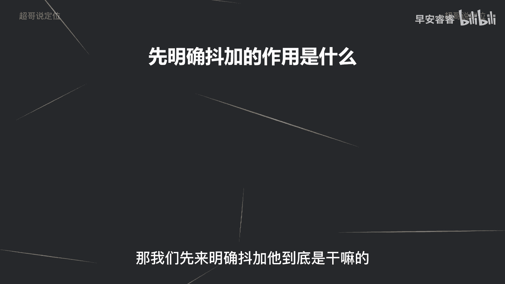

# 085 2023短视频起号·差异化定位课：0~1做懂抖音（定位+内容+投流+运营） - P42：第42节42 投放策略（1） - 早安睿睿 - BV1Am421T7br

好，今天进入到我们整个所有课程的最后一个环节，就是去讲一下怎么样去投流。

怎么样去投抖家，那我们先来明确斗加它到底是干嘛的。

那斗家的作用实际上是四个方面，第一个方面呢就是我之前上节课有讲过，他可以帮你提前去人工审核，去帮你审核这条作品到底有没有违规。

违禁的地方告诉你，然后去调整作品，那第二个作用呢就是去给你的账号去打标签啊。

这个之前讲过很多，就不再去赘述了，那第三个作用呢，去给你的作品的数据做一个推动，这个推动的意义就是，你如果现在这条作品数据还可以能，给你推到更大的流量池，以及给你带来更多的互动数据。

不管是啊赞分享收藏以及粉丝。

那第四个作用是什么，第四个作用就是用斗加去撬动自然流量，那么分别去说，那今天这节课的话。

主要先去讲斗家怎么样去给你的账号，去提前过审核。

那首先了解斗家，它实际上就是人工审核啊，那它人工审核呢就可以提前帮你去规避，你视频里面有没有哪些违禁违规的问题。

那到底在哪些情况下，要用到斗家去给你的作品去过审呢。

有几种情况，那第一种情况呢就是你的新号前几条作品，或者说你一个老号重启的时候，我们上节课有说过啊，大概率不会有很高的播放量啊，就在零到200左右，那你也判断不了到底是你这个账号权重的问题。

还是说你这个作品本身是违规为敬了啊，那你与其怀疑你，不如直接实践去投个抖家，如果说你这个视频能过审，那就很清楚了，不是作品的问题，那就是账号权重的问题，那就去养号，去提升你作品的质量。

然后去提升账号的活跃度，然后从而提升权重，那如果说你投了抖加审核不通过，那你就很清楚你这个播放量低，主要就是因为违规违禁了，那你去调整，那这种情况就可以提前先去投抖家去过审，那第二种呢。

就是我们有时候精心去做了一些爆款啊，这个爆款就是我们发之前，我们觉得这条视频啊，大概率可能至少上万的播放量，甚至上10万的播放量，那你这些作品，我是建议你发了作品就马上投豆家过审核，原因是什么。

原因就是因为当你的视频发出去以后，你的播放的流量池在一层一层的突破，那突破到10万左右的这个流量池的时候，它会介入到人工审核，然后到了10万的播放量，如果人工审核进来啊，包括第一个500的播放量。

突破的时候也会进入到人工审核，如果人工审核审核了你这条视频有违规违禁，那你想好可惜啊，你到了10万的播放量了，然后直接给你来一个不适合推荐，那你这条爆款作品，相对来说你10万以后的播放量就不会再有了。

那你把它重新改一下，再重新发，你怎么判断就能有10万的播放量呢，因为决定播放量还有一个因素就是赛马机制，就之前讲过，那个就是你的跳出曲线和大盘曲线的对比，所以说你判断这条视频可能会爆。

那你发布作品以后马上就投抖家，然后斗家只要审核过了，那你就不会有后顾之忧了，但是如果你不做这个动作，万一走到了10万播放量，人工过审的时候说有问题，那你的流量就是在10万左右就就截止了。

所以说一些我们提前预判的好作品，可以发布之后投个抖家测测神啊，过过审，那第三个呢就是你这个作品本身没有播放量，那你就可以投一下抖家，还是跟第一个逻辑是一样的，去看一下是不是因为审核的问题。

是不是因为违规的问题，然后给你限流了，那既然斗家是用来测审的啊，是为了用来测试审核的，那就意味着你只是为了做一个测试的动作，那你怎么样去避免浪费这个抖加的费用呢，那就是你投放了订单以后，斗家审核通过。

然后你把作品点个权限设置，把作品隐藏，就是仅自己可看，隐藏完了以后马上再选一个所有人可看，就是再公开，这样的话斗家就被停止了，原因就是因为你把作品已经隐藏了，抖家也就给你推送不了流量了。

那这个动作就是为了让你去省钱，不要乱花钱，因为我们刚刚说了那么多啊，斗家他第一个作用就是为了给你过审核，那既然过了审核，你就没必要让他给你推送这个付费流量了啊，那你就把它先停了，停了以后把作品再公开。

然后这个斗家就截止了，那我们从下节课会讲，斗家的第二个作用，我是你们值得信赖，有问必答的超哥。

