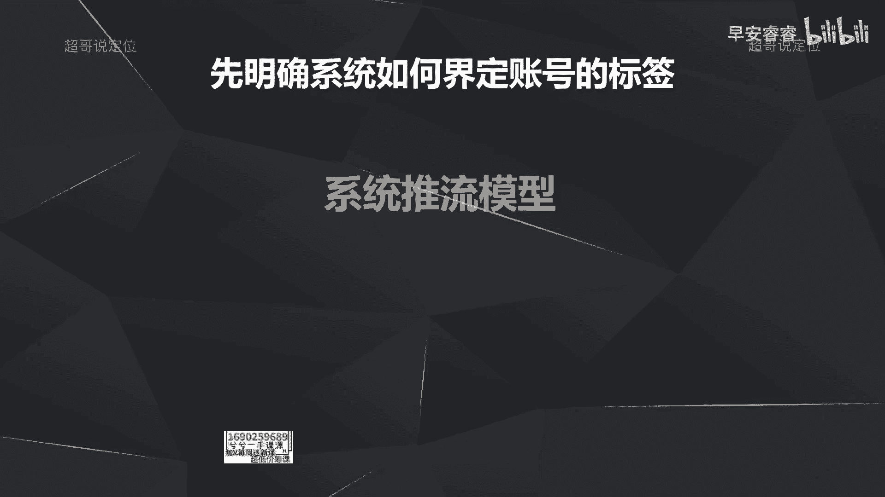

# 085 2023短视频起号·差异化定位课：0~1做懂抖音（定位+内容+投流+运营） - P43：第43节43 投放策略（2） - 早安睿睿 - BV1Am421T7br

这节课我们继续去讲斗家的投放策略。

那上节课我们已经讲到了斗家的四个作用，然后以及讲到了过审这个作用，我们到底应该怎么样去使用斗家。

让我们的作品能够提前的过审，那这节课的话，我们来讲，斗家怎么样去给我们的账号去打上标签。

那这里的话先明确一个东西，就先来明确系统是怎么样去给我们的账号啊，建立这个账号标签的，那系统给账号打标签呢。

它首先是根据我们每一条视频的内容，里面出现的一些字幕，包括出现的一些画面，包括之前讲过的你的话题，封面标题，这些内容的设置，去判断什么样的用户喜欢看你这条作品。

然后就去把这条作品，把这条视频呢推给这些用户啊，就去找到这些用户，然后让他们去看你这条视频，看完这些视频以后呢，这些用户就会跟你的视频产生互动啊，比如说给你点赞，评论分享转发或者跟你产生关注。

那通过这些数据反馈到系统，就反馈到AI那边，然后他就知道哦，原来是这样的，用户喜欢看你的作品，那接着去把这个数据模型放大，去找更多这样类似的用户来看你这条作品。

那慢慢的呢你这个账号就被打上了标签，整个推流的模型就是这样。

所以说我们在做新号起号的时候，一定要去投抖家啊，为什么，因为斗家可以优化你打标签的效率，如果你不投的话，斗家就要去自己去根据你的内容去判断，到底什么样的用户喜欢看你的作品，但如果你投了抖家。

选定了自定义达人，选定了你想推给这些对标达人的粉丝和用户，模型来看你的作品，那你的账号会被打上了标签。

速度会更快，但是呢头斗家不是说啊一劳永逸，而是要有策略，因为有了策略去投抖加的话，你带来的播放量和转化率才会更加的高效啊，更加的具性价比，以及你的打标签，然后才会更有效，举个例子。

如果你每条作品都去投抖家，但你不管作品的好坏，虽然一样会产生互动，但这些互动大概率都是一些无效互动，反而会把你的账号给拉偏。

接下来举个例子就会更明确，投抖家一定要有策略，因为抖家呢它实际上带来的就是播放量啊，比如说你投100块钱，带来的就是1700~5000不等的播放量啊，像1700的话。

就你投自定义投放就1700~3000的播放量，那你投智能播放，就带来的是5000左右的播放量啊，就你花100块钱肯定会有这个播放量，那所以说斗家就是一个收钱办事的工具，那我类比一下，你在实际的生活中啊。

你花钱找人办事，你花了这个钱他一定会给你办，这个没有问题，但是有些人可能就会给你办的很水，那有些人可能就会给你办的很高效啊，很满意，所以就是说斗家也是一样的，就你花了这个钱，他一定会给你找到播放量。

但是他给你找来的播放量到底够不够精准，这就是我所谓的策略，那我们接下来看一下，这个投放策略到底要怎么样去做。

那首先第一在投抖加的时候，可以看到有两个选项，第一个是系统智能推荐，一个是自定义定向推荐，那这两个分别是什么意思呢，那你选择系统智能推荐，那系统就会根据你这条视频的内容去判断，什么样的用户喜欢你。

他自己去找用户，那这个过程一定会很漫长，而且可能会有偏失，那如果我选择自定义投放，那你就可以指定我要男的还是女的，来看这条视频，以及什么样的年龄段，什么样的地域分布，以及他是哪些对标达人的粉丝。

或者说观众，就是我可以指定，让系统把我的播放量推给这一部分的人，所以说在新手起号前期，到底选智能还是选自定义，一定是去选择自定义，因为刚才说过智能的话，如果你的账号的内容做得没有那么的垂直。

也做的作品的质量没有那么好，那斗家花钱办事，他一定会给你带带来播放量，那你选智能，它一定会给你找到。

可能会偏会把你的账号反而给带偏，那什么时候去选择智能投放呢，啊我因为我们刚才一直在说，前期一定要投自定义，那什么时候会选择智能投放呢。

那选择智能投放的时候就只有一个前提，就是你积攒了一定的粉丝之后，比如说上百的粉丝以后，你去看一下你的粉丝画像是不是你想要的用户，我举例啊，我们很多女生在做美食账号的时候，都会陷入到一个误区。

吸引来了很多男粉，那这个粉丝画像一定是偏了的，因为男用户大概率是不会在家里面去做饭的，也不会跟你去学习做饭的，那你积累了，比如说70%到80的男性用户，就算你的粉丝量高达5万10万一样，你也变不了现。

因为你的粉丝画像偏了，他给你带不了转化，比如商家来找你带货，让你卖锅碗瓢盆，你觉得男粉会来买吗对吧，所以在你去看你的粉丝，是你的精准用户的这个目标用户的情况下，你再去选择智能投放，因为你选择了智能投放。

就是斗家的推流，他参考的是你的粉丝画像，就是你付费花出去的钱，抖家去给你找用户，是根据你的粉丝长什么样子去给你找用户的。

所以说在这里的话，什么时候去选择智能投放。

就一定是等到你的粉丝画像，是你想要的这一部分的精准用户的时候，你再去选择智能投放，那这节课我们主要就是讲了，怎么样通过抖家去给你的账号打标签。

那这节课我们已经讲过了，应该选择自定义还是选择智能。

以及什么样的情况下再去选择智能投放，那从下一节课开始的话，我们会去讲自定义投放分别要怎么样去选，比如说性别怎么样去选，年龄怎么样选，以及对标达人怎么样去选。

我是你们值得信赖，有问必答。