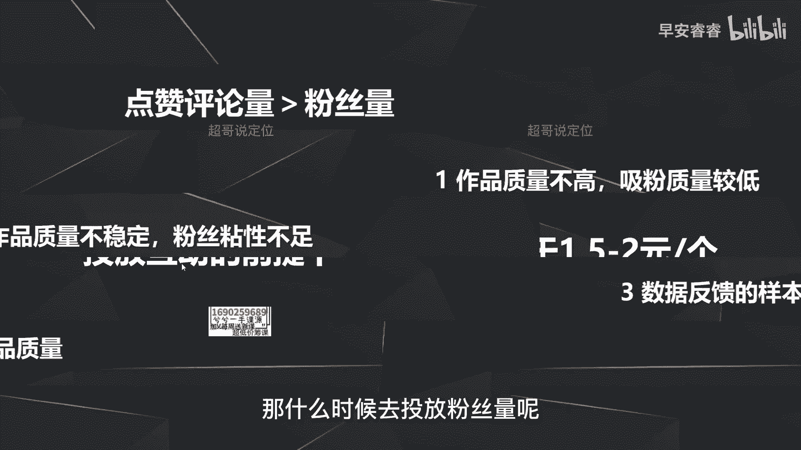

# 085 2023短视频起号·差异化定位课：0~1做懂抖音（定位+内容+投流+运营） - P44：第44节44 投放策略（3） - 早安睿睿 - BV1Am421T7br

好那我们这节课继续去讲斗家的投放策略，那前面我们已经讲过了，选择自定义还是选择智能，已经说过了，一定要选择自定义，那自定义之下会有很多的维度。

那我们就分别来说一下这些维度怎么样去选择，那首先第一个就是在选择的时候。

到底应该先投放啊，互动还是先投放粉丝量，就你投抖加的时候，系统会给到你一个目标，就是你希望这条视频带来的是更多的互动，还是带来的是更多的粉丝，那这里的结论一定要去投的是什么，一定要投的是互动。

就是投点赞，评论量，为什么，因为第一点前期你的作品的质量有限啊，那你投了粉丝吸引过来的，粉丝本身的质量也会比较的低，而是第二点呢就是你前期的质量会不稳定，就是你前期发五条作品。

可能某一条作品五秒完播率比较高，军博市场占比和完播率也比较高，那第二条作品可能又拉垮，第三条作品可能又在一个平均值，第四条作品可能又拉跨，就是你的作品质量持续起伏，那就算你投了粉丝吸引过来。

粉丝也会因为你后面的作品比较的拉垮，比较的差，他可能就直接取关了，所以说在前期你去投粉丝一定性价比会比较低，那就一定要去投的是点赞评论，而且我之前说过，打标签是通过用户的反馈数据。

就是系统怎么样去判断什么样的用户喜欢你呢，就是通过这条视频发出去以后，有多少用户跟你的视频产生数据的反馈，这个数据反馈分为两个方面，第一方面的话就是互动啊，点赞评论分享转发，第二方面呢就是关注啊。

包括进主页，那这两个方面来说的话，哪一个基数会更大，肯定是互动啊，就是你每条视频出去以后，肯定你的赞会远远高于关注你的人，所以说数据反馈的样本就够大，打标签也就会更快。

所以刚第三点就是为什么要去投点赞评论，因为第三点就是互动反馈的数据的样本会更大，会让你的标签建立会更快，那第四点呢就是投互动，是为了去测你的作品的质量啊，举个例子，你花100块钱投了抖家之后。

这条作品可能会带来200个赞或者300个赞，以及可能会有一些分享收藏，包括关注，但是我刚刚还是在说哦，互动的数据一定会大于关注你的数据，所以互动的数据会给到你一个有效的反馈。

就是你看你比如说你投三条视频，你拿三条视频投完以后一块儿去做对比，你通过互动的数据啊，包括了点赞分享转发这些数据看去对比，你才能对比出来哪条作品会比较好，哪条作品会比较坏，就是怎么样去判断作品的好坏。

第一个维度，我们之前说过五秒完播率，整体完播率均波市场产品，那第二个就是这些互动的反馈数据，那你不光要看赞，还要看一些分享收藏的这些数据，那你三条作品分别投放完以后，你去做一个横向对比。

你用这个互动的数据才能够更快地判断出来，哪些作品比较好，哪些作品比较坏，因为我刚一直在说，前期作品质量不好的情况下，不太稳定的情况下，你花100块钱投三个作品，它带来的粉丝量不会有一个根本上的改变。

或者说不会有一个质的差距，就你100块钱投三个作品，那这三个作品，它带来的互动数据一定是有高有低，但是这100块如果你投的是粉丝，那是100块钱带来的粉丝，那极有可能都是五个或者都是七个啊。

没有一个质的改变，所以你要拿互动数据去做参考。

去看你的作品质量到底怎么样，然后接下来怎么样去调整，那什么时候去投放粉丝量呢。

那投粉丝量的话，我们一般会用的一个套路是什么，就是我的作品选择的是互动的这个投放目标啊，我投个100块钱，然后可能会带来啊，二三十个甚至50个左右的粉丝，就我投互动的前提下。

然后反而给我带来了不光有互动的点赞，收藏的数据，还会有粉丝的增加，而且我算出来粉丝的成本可能就在两块钱左右，两块钱上下，那这样去判断的话，那就是很清楚了，我投的互动都能给我带来那么多的粉丝。

那我就果断的把这条视频去追投，那我第二步就不投互动了，直接投粉丝。

直接去投粉丝增粉好，那接着第四步，重中之重，我们来说一下自定义怎么样去投放，这里可以看到啊，自定义在你投放的时候会有几个选项，第一个可以让你选性别，可以让你选年龄啊，年龄段啊，可以让你选地域。

甚至可以这个地域选到附近区域，就是你家附近，比如说3km或者你的商铺啊，或者你的店面附近的6km啊，它可以根据附近去推送，那以及兴趣标签以及达人相似，就我跟你说的，在这地方可以选定20个对标达人。

然后把这条视频推给这20个对标达人的，用户模型来看我的这条作品，那自定义投放的话，他可以选择这些维度。

我们分别来说，首先时间怎么样去选，一定选择24小时，因为你给到系统的时间更长，它给到你的播放量，给到你的找的用户会更加的精准啊，一样的逻辑，就我刚之前说，你花钱找人办事，你给到他时间很短。

他一定会给你办的很很水，那他会把这件事办得更加的高效，那斗家也一样，你一定要给他给足这个时间，那我们一般会选择时间，就会选择24小时，千万不要去选择两小时或者六小时，第二呢就是选择24小时。

你便于去监控监控，什么意思呢，就是你在投流的过程中，极有可能因为你作品的质量好坏，以及你账号前期没有标签系统，给你带来这一部分抖家的付费流量也会偏，也会很低效，所以说你一定要监控。

就是你在投放24小时之后，你下了这个单，那你每个小时都要去看一下，你这个抖家现在目前消耗了多少钱，带来多少播放量啊，比如说带来五秒完播率是怎么样的，带来的转账率是什么样一个情况。

去判断这个抖家到底是停止还是继续去消耗啊，因为如果说它消耗你的这个费用，带来的成本会很高，带来的这些互动数据的成本会很高，那你不如果断就把这个斗家给停了，那原因就两点嘛。

第一就是刚才说过你的账号标签不太准，所以你就重新再投一次，再重新选一部分的对标达人，第二呢就是你的本身的这个作品的质量，实在是太差了，比如说五秒完播10%左右，那你让抖家给你带来的播放量。

怎么可能会带来有效的互动呢，那你就果断把它停了吧，啊这条作品就不要投抖加了，所以选择更长的时间，也是为了去便于去监控你的投放效果，如果你选择两个小时，你可能忘了，然后啪两个小时。

直接把你的100块钱消耗完了，你最后一看数据很差，你最后就追悔莫及，你这个钱就白花了，那第三个呢就是有一个逻辑啊，就是抖加投放的时候不要心急，因为心急吃不了热豆腐嘛，你不能说这条作品啊。

转粉转互动还可以，你想那我就直接投个1000块钱，然后选24小时能不能这样做，可以，但是带来的效率会很低，因为这个低的原因是什么，还是第一个逻辑，就是你增加了他的任务量级。

那你给到他的时间如果还是没有变，还是24小时，那它给你带来的播放量，带来的有效数据，一定会相对来说质量就会比较低啊，效率就会比较低，所以说有一个原则，就是200块钱对应24小时。

也意味着如果你要去选择投放1000块钱，你最好选择4~5天啊，或者说3~5天你一定不要选的时间太短，要不然的话抖家也会病急乱投医，给你带来的播放量带来的互动数据会很低效。

那这里我们把时间的这个逻辑说完了。

我们接着来说人群的画像怎么样去选择啊，包括你投流的时候，自定义里面刚说过，可以选择性别，可以选择年龄以及可以选择地域，那这个怎么去选择呢，其实就一句话，你的目标人群长什么样子，你就去选择什么样的画像。

比如说你是做美食赛道的，那就很清楚，我的目标人群就是24~40岁的女性，那我的年龄24~40岁，然后性别选择女性就可以了，就你一定在几号之前，你要先清楚你做的这个账号，你的目标人群长什么样子。

那你在投流的时候，然后去对应的选择就可以了，那这里不再赘述，那接着我们再说兴趣标签，那刚才这个图里面有看到啊，就是在投流的时候，除了呃性别以及年龄之外。

还可以选择兴趣标签，那这里给到的结论是兴趣标签不要选择。

原因是什么，原，是，因为这个兴趣标签在抖音的这个逻辑来说的话，他也不准，他也在测试，包括去年实际上是发过用户问卷啊，问我们这些达人啊，愿不愿意去取消这个维度，所以说你去选择这个兴趣标签。

一定你投放了以后，就是你的目标可能是跟文教相关的兴趣，或者说跟美食相关的兴趣，但投过来一定还是会不准，因为这个本身抖音，他自己这块儿他还没有测试的特别完善，所以目前来说的话，兴趣标签不要去做选择。

那接着来看对标达人怎么样去选择，那对标达人的话，我们建议是怎么选，一定要去选择多个达人包去分批测试，就是我们以前老的逻辑是什么，一条视频选择20个对标达人，因为他只能选择20个吧，你选择20个对标达人。

选择完了以后直接投出去，但目前我们的做法是分批测试，就是要梳理多个达人包，第一个达人包呢你可以筛选一部分达人，就是作品质量比你好的，就是你判断他的整个的互动啊，完播率啊，这些都比你好。

那你就选择20个对标达人，就是作品质量比你好了，接着第二个达人报道，你可以再去选20个对标达人，就是作品质量你觉得比你做的差了，甚至画面啊各方面都比不上你的，那第三个达人包呢，你可以按时间去选。

就是第三个达人包，你去选择一个月之内起号的这些美食账号，选择20个，然后第四个达人包去选三个月内7号的，第五个大人包，你去选择六个月，7号的，就是选择出来那么多个达人包，的目的是为了什么。

就是为了去说了，就是分批测试，因为你在起号的阶段，你也不太清楚，到底什么样的用户喜欢看你的作品，这个一定是测试出来的，所以选择多个达人包，就是你要去分批测试，那怎么样去测试呢，比如说假设我有五个达人包。

差不多每个达人包有十个达人，我把这条视频发出去以后，我分别去投五个豆荚，就分别五个达人包分别去投放，投放完了以后，然后每个达人包走个十块钱，20块钱我就全部都停止，我就把作品隐藏掉。

我的抖家就全部都停了，你去测试，就我刚说分批次测试，你去测试那么5~10条作品，然后最后把这些作品，所有的五个达人包分别分别拿出来，最后对比梳理出来以后，你才能够更客观更有效的去得出来一个结论。

就是什么样的达人包，你投放是更加高效的，就是你去对比啊，每个达人包之下他们的互动的转化率啊，然后以及五秒完播率这些，你去对比这些指标，去判断什么样的达人包，给你带来的转化是更高的。

那最后去备注一点就是什么呢，就是达人包呀要逐月的更新，因为每个月都会有一些新奇的，你这个赛道的账号，所以要去实时更新，那这个实时更新就是你平时在刷抖音的时候，刷到一些新的账号，你觉得哎还可以。

那你点个收藏或者把他名字记一下，然后攒到10~20个左右的时候，你再去增加新一轮的达人包的测试。

那接着来讲投放金额怎么样去选，那投放金额的话一定是一个原则，就是成本可控嘛，就是一定不要花太多的钱，所以说我们一般前期的十条作品，你就每条作品消耗个10~50块钱就可以了啊。

除非你这条作品能带来特别好的互动数据，这个特别好的互动数据是什么呢，后面有去说啊，就在这里不再赘述了，那第二呢就是根据数据反馈，有一些作品的数据，就我刚刚说的，投出来以后，作品数据啊会比较好。

那你就去追投啊，就是比如说这条作品消耗了50块钱，你觉得唉还可以五秒完播点赞率分享啊，这些都还可以，甚至给你带来了不少的粉丝，那你只要作品就把100块钱薅完，薅完以后，甚至你觉得还可以，那你就继续追投。

但是我建议你们前期的追头全部都在粉丝上面，因为我们前期要积攒第一波的粉丝，就你这套作品，如果说他给你带来互动数据都还可以，你去看一下，那给你带来的粉丝量，就我刚说的能不能控在两块钱左右，如果可以。

那你第二次追投的时候直接投粉丝，如果不可以，那你就没必要再去投了，因为给你带来更多的点赞啊，这些也没太大的意义，你要相信一点，就是如果你这个斗家能给你带来很多的赞，同时也能带来很多的粉。

那就意味着你直接投粉，一定会给你带来更好的转粉效果好，那这节课的话，我们就整个讲了，自定义投放到底要怎么样去选择，我是你们值得信赖，有问必答，超哥。

