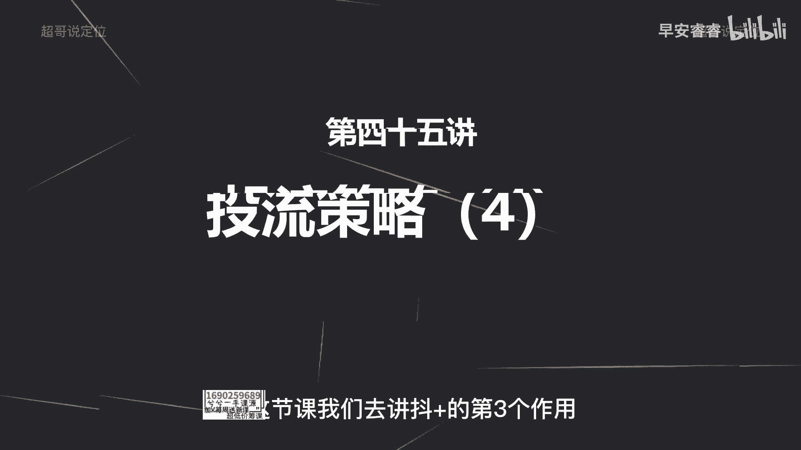
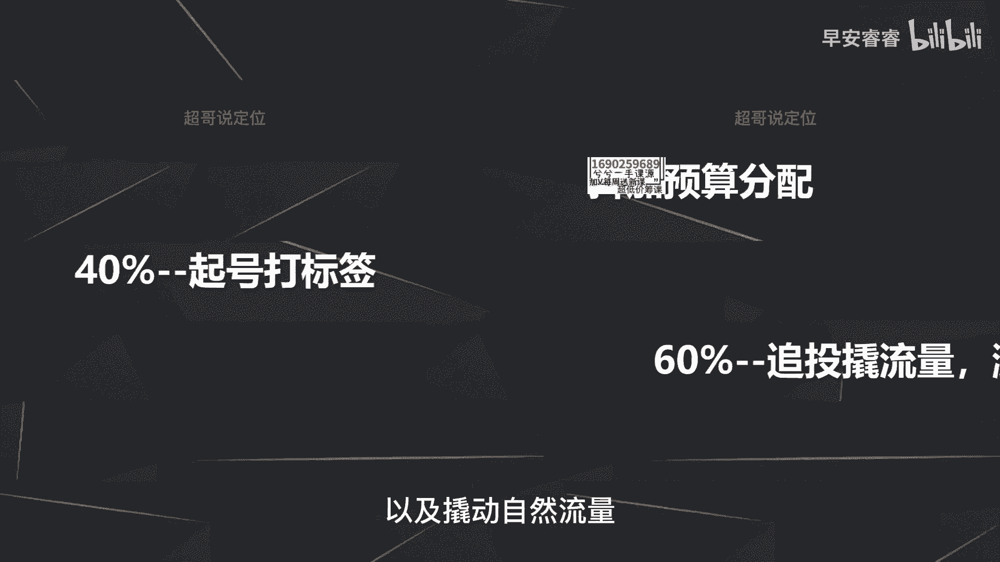

# 085 2023短视频起号·差异化定位课：0~1做懂抖音（定位+内容+投流+运营） - P45：第45节45 投放策略（4） - 早安睿睿 - BV1Am421T7br

好这节课继续讲投放策略。

那前面我们已经讲过了，抖加了两个作用，第一个他为了是让你的作品去提前过审核哦，去判断你的作品有没有问题，然后提前去过审核，有问题的话，提前去修改，那第二个呢就是我们之前两节课已经讲过了，斗家。

实际上第二个作用是为了给你的账号打标签，那打标签怎么样去打，就是投资定义自定义怎么样去投放。

上节课已经完整的详细的讲过了，那这节课我们去讲斗加的第三个作用。

第三个作用是什么，就是去做你的数据推动啊，记得我这里说的一个词是推动，而不是说带来数据啊，带来数据什么意思，就是你花100块钱直接给你带来互动，那我说的数据推动就是追投的逻辑，就是我之前说追投的逻辑。

就是你这条作品投出去以后，给你带来的互动数据以及转粉比较好的情况下，你去追投，那用什么样的作品去追投，就一直在说的用好的作品，就是你投放出去以后带来的互动数据。

比较的高效，那这就是好的作品，那这里来说一下前期斗加预算怎么样去分配，假设我们一个月比如说有1000块钱的斗加预算，那我们一般会怎么做，我们一般会用40%拿来做账号的，前期打标签啊。

就是我们发出来的新作品，然后他的五秒完播高于30%，35%，我就直接投个自定义的斗家，然后去给我的账号快速的建立标签，那剩余的60%的嘛，剩余的60%就是拿来做追投，那追投呢就是根据你之前的这些作品。

就是你打标签的这一部分的作品，然后投放出来的数据，你再去看哪些作品的互动数据比较高效，那你就用这一部分的钱去追投这一部分的作品。

然后去给你带来更多的粉丝以及撬动自然流量。

那什么样的作品数据是好数据，可以去做追投呢，那第一个维度我们会看什么，第一个维度还是去看五秒完播率，就是你把这条作品滚到两千三千，就是自然加上抖家的流量，有个两三千的播放量。

甚至更高的播放量之后你去看五秒完播。

如果能够高于45%好，那你接着就去追投啊，那为什么呢。

因为啊举个简单的例子，就是我们之前已经米国这个逻辑，就是斗家是给你带来播放量的，就是你花100块钱自定义的投放，就会带来3000左右的播放量，对不对，那我这地方来对比两个数据啊。

看完以后你们就会很明确的知道五秒完播率高，你的头流就会更有价值，举个例子，如果我的这条作品五秒完播率只有30%，也就意味着100个人里面有30个人，看完我的视频的前五秒，对不对，那我把这条作品投了抖加。

那意味着什么，意味着只有900个人看完了视频的前五秒啊，这什么意思，怎么算呢，刚已经说过100块钱带来的是3000个流量，那这里可以看到100个人里面有30个人，看完前五秒。

那3000个播放量那就是30倍吗，那这也是30倍，就是900个人看完了前五秒，那我所谓的有效播放量，就是至少把你视频的前五秒看完，那就是900个人，900个播放量就是这样算的，这个逻辑清楚了吗。

那如果说五秒完播率在45%呢，你再去等比例的去算一下，那就会有1350个人看完你的前五秒，那可能你这两个单子投出去以后，都能带来200个赞，那请问一点，很多的人连你的视频前五秒都没看完。

他给你带来的赞有意义吗，那就是点赞狂魔吗，那给你的账号打标签没有任何的意义，那系统会给你找更多的点赞狂魔，从而把你的账号标签直接拉偏，所以说五秒完播率高，我们再去追投，包括我之前说过。

用什么样的作品去给账号打标签啊，去投自定义也是去看五秒完播，就10%左右的，你就不要去投头条了啊，因为你投了以后，很多的人可能你投出去这个订单，80%的人连你前五秒都没看完。

那你这一部分的互动数据啊，只会把你账号标签拉偏，所以说五秒完播率更高，你的头流才更有价值，因为它带来的互动数据才能更有效啊，就大部分人把你视频看完了，从而给你带来的互动，带来的点赞。

收藏分享才会更加的有效，那你的标签才能够更加的精准。

除了五秒完播率之外，还有其他哪些数据去做参考，那第一个呢就是在就是你投出来以后啊，低于三毛钱的成本的这样一个赞，就比如说啊你消耗了十块钱的抖家，那带来了有30个赞，那你就算一下就差三毛钱左右一个赞。

那这个抖家你就可以继续消耗，如果说啊高达五毛钱，六毛钱甚至一块多一个赞，那你果断的就把这条抖架给停了，那就两个原因，第一个原因就是你做标作品本身很差，那第二个原因就是你的账号标签的问题。

那你就重新选择对标达人，再重新再投一次，那第一个参考的指标的话就是这个赞的成本，那第二个呢就是五秒完播，刚才已经说过，那第三个呢就是看点赞率，那比如说啊你消耗了十块钱带，然后走2000左右的播放量。

带来了只有20个赞，那这个转化率那就1%，那这个就极低，那你果断的就把这个抖加给停了啊，但是刚才说过这三个维度，就是如果说你投出来的抖家订单，能够满足这三个指标，其一或者其二，而不需要三个同时满足。

那你这条作品可以去追投，但是我刚才一直在说，追投的目的最好选择粉丝，因为我们前期要先积攒第一波的粉丝量，但是如果有一些商家合作的一些视频，你为了给一些商家给到一些数据的反馈。

那你去追投去投互动也是没有问题的。

那什么时候去停止投放抖加呢，那刚才说过，就是你参考这三个指标。

那你的成本比较高，那你就果断把它停了，那第二个就是投放不精准，投放不精准怎么样去看呢，就举个简单的例子，就比如说你选择投自定义的时候，你年龄段选择的是18~40，但这18~40里面，我们的目标占比。

可能集中在24~30岁的人群，就24~30岁的人群，但是抖家订单投出来的人群，在18~23的人群，就是年龄不是我们想要的这个主要的年龄段，这个就是我所谓的投放不精准，那你也可以把豆浆直接给停了。

那第三种情况是哪种，就是你投抖家的时候，这个在新号前期会经常遇到，就是你投了抖加以后，你会发现两三个小时甚至五六个小时以后，系统不给你推流，要不然就是你的权重太低。

要不然就是你的这条作品的内容不够的垂直，他不知道应该怎么样去给你找用户，那这种情况下，你也及时把它给停了啊，不要去等这个时间。

你就直接把它给停了啊，直接把它给停了，然后去重新再下一次单，那最后一个再来看一下，就是抖家有一个功能啊，就是可以把我的这条视频推给我的粉丝，就很多人可能会纳闷，都已经是我粉丝了，我干嘛还要花钱去投抖家。

然后把这个作品让我粉丝看呢，啊实际上有一个逻辑没有get到，就是每一个粉丝都是有保质期的啊，比如说我关注了一个博主，我关注完以后，这个博主后面更新了五六条最新的作品，系统都会推送给我。

但是如果他推送给我的这部呢新的作品，我不去看完，不给他贡献完播，我也不跟他产生互动系统就知道了，我没有那么喜欢看这条博主的作品，那我就变成了他的静默粉丝，就是他之后更新的作品，我大概率不会再刷到了。

那这一部分的静默粉丝我怎么样去激活呢，就是用抖家去激活，就是投给自己的粉丝，那这个功能什么时候去用呢，主要是两个方面，第一方面就是增加自己的铁粉，增加自己铁粉，就是等到你有1万粉丝的时候。

你就可以看到一个铁粉数据，那为了让铁粉数据更高，你就可以去选择一些好的作品，去投给你的粉丝啊，这里我说的是好的作品就五秒完播啊，这些互动都还比较好，为什么好的作品是，因为他都已经变成你的静默粉丝。

他对你的作品本来就没有那么感兴趣，你再把一条差的作品去推到他的面前，那他可能直接就取关了，你懂我意思吧，所以一定要选择好的作品，第二个作用是什么，就是去转化，就是当你的变现产品出来以后。

比如说你接了商单啊，然后或者说你直播开始带货了，或者说你开始卖自己的课程了，那你就可以把你的作品推给你之前的啊，静默粉丝，然后看一下他们愿不愿意买你的作品，那他如果他不买了，你也就放弃了。

你也就不用纠结了，那这节课我们就讲完了。

怎么样去使用斗家的，第三个作用就是给你的作品的数据带来推动，这个推动的话不光是给你带来更多的互动数据，更加关键的是给你带来更多的精准的粉丝啊。

我是你们值得信赖，有问必答，超哥。

