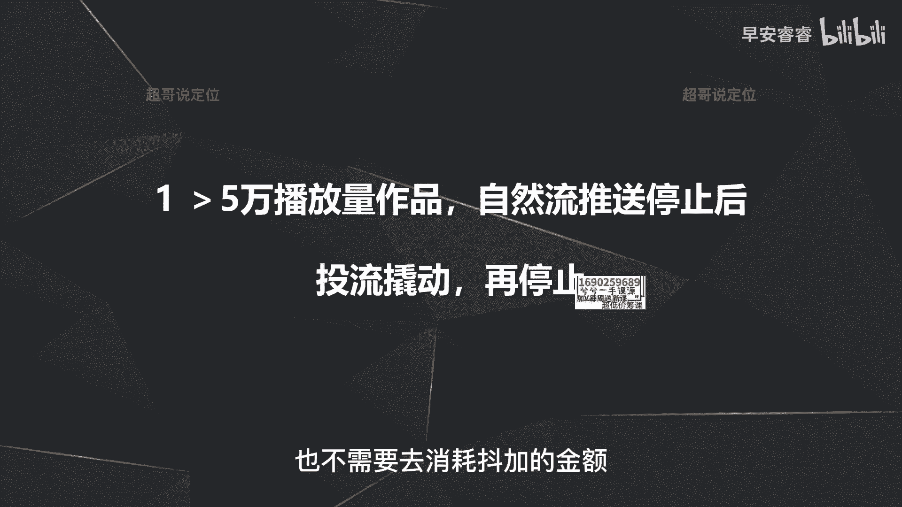
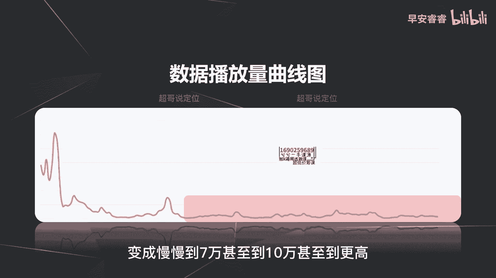
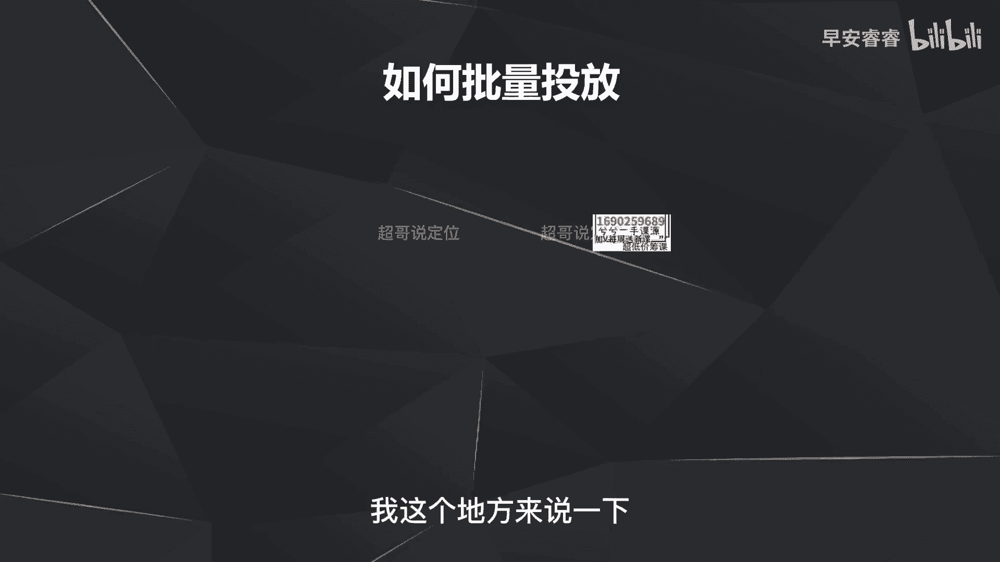
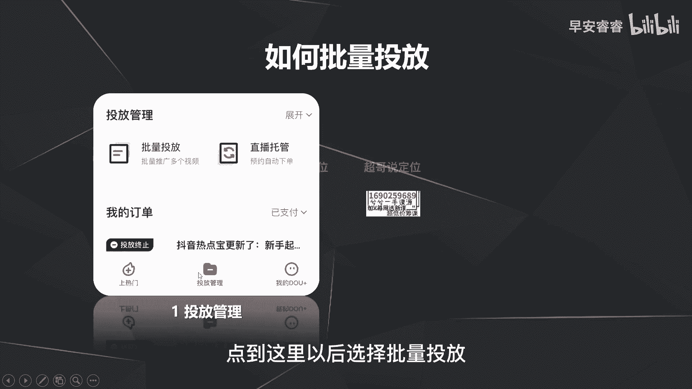
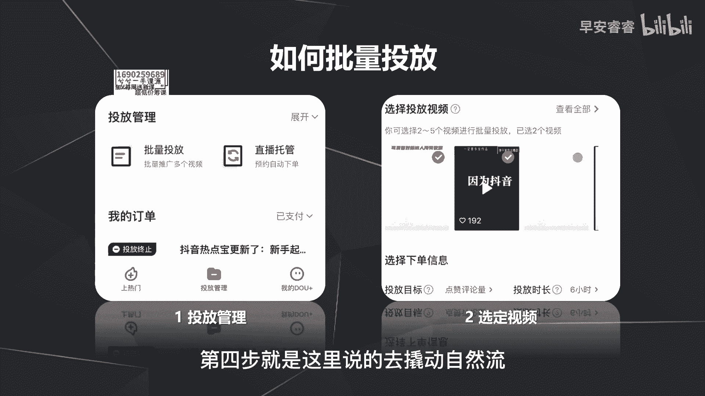
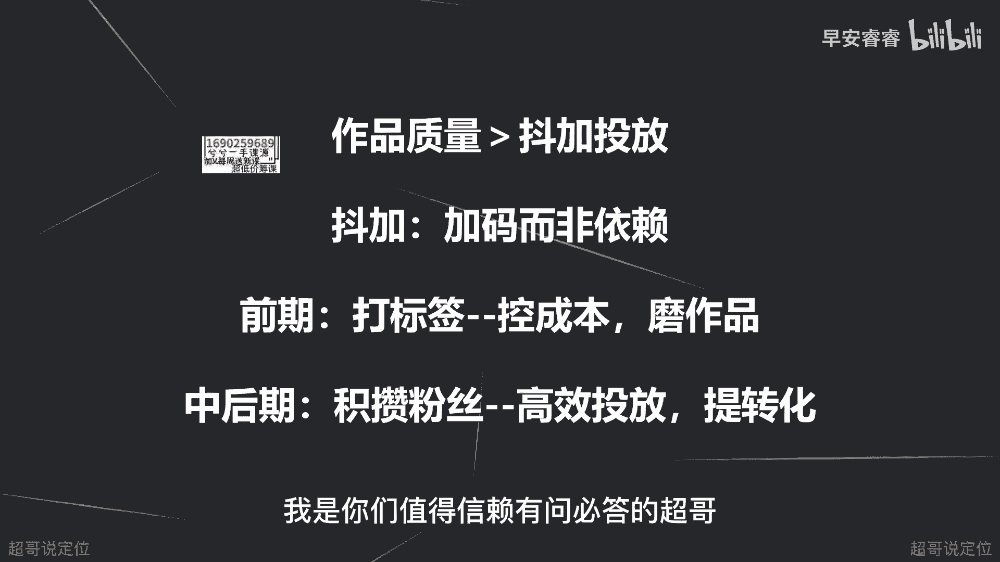

# 085 2023短视频起号·差异化定位课：0~1做懂抖音（定位+内容+投流+运营） - P46：第46节46 投放策略（5） - 早安睿睿 - BV1Am421T7br

好，这节课进入到我们斗家策略的最后一个部分啊，第四个功能就是斗家，第四个功能就是去撬动自然流，撬动自然流是什么意思，就是你一条视频发出去以后，首先先是自然流量给你推送嘛，推送500个播放量。

推送2000个播放量，截止到下一个流量池1万2万，甚至到5万10万，就是这个好的作品，他的播放量会一直走，就是走这个自然播放量，但是有一种情况就是你这条作品数据还比较好，播放量一直在走啊。

到底是走到10万就停了呢，还是走到20万的播放量就停了，还是走到100万的播放量就停了，我们实际上也没办法去判断，但是我们可以去做的一个事情是什么，就是在它停止的时候去投一个抖加，把它重新激活。

那这里分两种情况啊，我们总结出来分两种情况，第一种就是如果你有一些作品，它自然的播放量能大于5万，那你在它自然流推送之后，立马再去投一个斗家，去激活一下自然流，那这个斗家撬动呀。

也不需要去消耗斗家的金额。

你就把他投了以后过审，然后走个五六块钱，你把它停了就可以啊，就比如说你这条作品，你可以去看它的播放的新增的曲线图，就每一个小时大概有多少播放量，那这里就可以看到，在你刚发完作品之后。

你这条视频会有一波猛的极速流量进来，然后极速流量进来以后，把你推到两三万的播放量，甚至啊34万的播放量之后，后面就开始往下啊，逐渐的下滑，就是每个小时，不会再给你推那么多的播放量进来了。

逐渐的你这个推流就趋于平滑，趋于平滑，怎么办，去去投一个斗架去激活一下，比如说在这个点位，你看已经开始平滑，投一个抖加，然后走个五块钱，十块钱，你把抖家停了，自然流就会再走一段时间，走一段时间。

停下来以后，你就再去投一下，所以说5万以上的播放量作品就可以这样去做，目的是为了什么，目的是为了不断的去激活自然流，让你这条作品能够从5万的自然流停止之后，变成慢慢到7万甚至到10万甚至到更高。

那第二种情况就是什么，第二种情况就是，如果说你发出去的作品，在1万到5万的这样的一个播放量的区间，那你怎么样去做，我们一般会做的做法是批量头发，就是赛马机制，然后去撬动自然流，那怎么样去做批量投放。

怎么样去做这个批量投放的赛马机制呢，我这里晚上来说一下哈。

首先在你投抖家的时候，最下面这个菜单可以看到有个投放管理点。

到这里以后选择批量投放，选择批量投放以后，这地方可以选择2~5个视频，比如说你选择五个啊，1万左右播放量的视频，选择完以后干嘛同时消耗100块钱，那同时消耗100块钱的时候。

肯定有一些作品就会带来的播放量就会更高，有些作品可能就走个两块钱，有一些作品可能会走个六七十块钱，那怎么样去看哪些作品能消耗更多的金额，哪些作品会消耗更低的金额呢，就是赛马机制，就是你投了100块钱。

选择五个作品之后，系统同批次的一块去投放啊，一块去找播放量，那带过来的一些互动数据系统的AI，他自己会去算哪些作品的转化率会更高，他就会把金额往哪些作品去倾斜，那它倾斜了之后。

这个作品它的自然流也会被激活，也就是我刚说的批量投放，你可以选择多个作品的目的，就是为了第一先赛马，让系统去看你哪些作品是比较好的，然后他知道你是个是好的作品，他就会给你再带来一波啊，自然流。

斗家怎么样去撬动自然流量，那个两个方法我们这边已经说过了，那最后我们再来复盘一下，抖加四个作用，第一个让你的作品提前过审核，第二个给你的账号去打标签，第三个给你的好的视频作品去做数据的追投。

第四步就是这里说的去撬动自然流。

但是我们最后来总结一下斗家，它实际上只是一个带来播放量的一个工具，所以说不要过度的去依赖抖家，因为你与其花重金去投抖家，还不如花重金去磨一下自己的作品质量，比如说去完善你的剪辑，去提高你的脚本质量。

去提高你整个人的表现能力等等，因为好的作品质量带来的转化才会更高，因为斗家它只是一个加码的工具，就我之前一直在说锥头锥头，锥头就是它只是一个加码的工具，而不是一个你完全依赖给他啊，就你花这100块钱。

他就一定能带来播放量，是能带来播放量，但我之前已经说过，带来这个播放量有好和坏之分，那好和坏还是取决于你的作品质量，所以说不要过多的去依赖作家，还是要去提升自己本身的作品质量。

那起号前期呢投抖加有两个原则，那第一就是前期你投的打标签的这一部分，我就说了，你就是为了去控成本，去磨作品，控成本怎么理解，就刚说了嘛，40%的预算拿来打标签就够了，因为你投抖加播放量就会更多。

那反馈的数据样本也就会更大，你就可以去做参考，到底哪些作品五秒完播比较高，哪些作品五秒完播比较低，然后去优化，就是我所谓的模作品，那中后期是什么，中后期偷斗侠的目的就只有一个，就是去追投，然后带来粉丝。

然后去踢你的转化，给你带来变现，那整个斗家的投放策略就全部都讲完了，包括整个抖音的旗号的逻辑，定位的逻辑，脚本的逻辑，然后投流的逻辑内容，选题的逻辑，我们这里就全部都已经讲完了。

最后我们还有两节课去复盘这些流程，以及有一个作业啊，我是你们值得信赖，有问必答的超哥。

