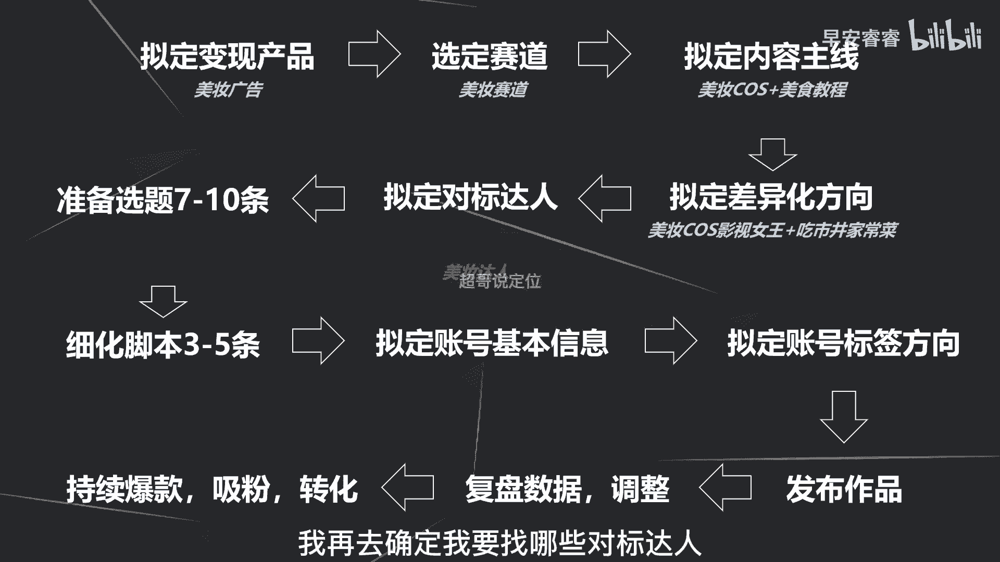

# 085 2023短视频起号·差异化定位课：0~1做懂抖音（定位+内容+投流+运营） - P47：第47节47 起号全流程回顾 - 早安睿睿 - BV1Am421T7br

哦大家好，我们之前整个的斗家的旗号啊，所有的课程啊全部都已经更新完了，那这节课呢啊，我们去更清晰的复盘一下，这个账号到底起号的流程应该是怎么样的。

我这里要回顾一下啊，就是先来确定我们这个账号，到底要通过什么东西去变现，到底是卖我自己的产品呢，还是卖我的课程呢，还是去通过广告变现，还是去通过啊挂小黄车，挂橱窗去卖别人的东西。

首先要确定你到底通过什么东西去变现，第二步呢你有了变现的这个逻辑之后，再去确定你到底要做哪一个赛道啊，你到底做美妆呢还是做美食呢，还是做什么，第三步，你选定了这个赛道之后。

再去看你应该做什么样的内容主线啊，比如说你是做美妆，你是做美妆测评还是做美妆种草，还是做美妆的cos等等等等，先确定这个内容主线，接着确定内容主线之后。

再去参考我们的五维差异法，去找我们的差异化的方向，到底要怎么样去做，就五个差异化的方向，我们只要选定一个方向，去把这个差异化做出来就可以了，那有了这个差异化之后怎么办，然后去选定我这个赛道。

我这个内容主线之下的对标达人选择最少啊，两到五个达人包去选择这一部分达人包。

选择完达人包以后去干嘛去准备选题，提前准备好啊，7~10条就两个星期左右的量啊，提前准备好这些选题，准备好选题以后怎么办呢，接下来接着去把3~5条的选题脚本，去把它细化出来，就用我们之前给到的文案结构。

脚本结构以及黄金三秒怎么样去写，去参考那些课程，然后去把这个脚本写出来，去把这些文案写出来。

然后接着去准备好账号的基本信息，你的简介怎么样去写，你应该叫什么名字，你的封面怎么样去准备，你的头秃应该怎么样去设置，去把这些提前前置准备好。

接着呢，提前先确定好你这个账号的标签，应该长什么样子，其实在你选择完赛道和选择完对标达人之后，你就很清楚你这个账号的标签。

应该是什么方向啊，应该是什么方向啊，那接着呢去发布作品，不断的更新。

那有了这些作品之后，就有了数据，根据作品的数据反馈，比如说五秒完播哪些高哪些低，整体完播哪些高，哪些低，以及互动哪些好啊，分享哪些好，收藏哪些好，你根据这些数据反馈去看，哪些作品的数据比较好。

是因为什么，哪些作品的数据比较差，是因为什么，然后去复盘。

接着去调整你的脚本，去优化你的脚本，做出来更多的爆款，那最后呢就是去持续的输出爆款，然后去吸引精准的粉丝，然后再通过这一部的粉丝去做转化啊，去做转化，所以整个的旗号到定位到选题，到做内容，到发布作品。

到发布作品之后的复盘，整个的流程就是这个样子，那我接下来举两个案例来模拟一下这个全流程，你们就会更清晰这个旗号应该怎么样去做，那首先我比如说我要去做一个，通过美妆广告变现的这样一个账号。

那既然是通过美妆的广告变现，那肯定就是美妆赛道，那我确定我是美妆赛道之后，我再去确定我这个美妆赛道之下，我的内容到底要怎么样去做，比如说我拟定的就是做美妆的cos，以及加美食教程啊，以及加美食教程。

那我的差异化怎么样去做呢，我去cos影视的女王，然后去吃市井的家常菜，这个什么意思呢，比如说我每一期都cos的是一个影视剧里面，一个啊女王皇后公主的这种比较有逼格的角色。

但是我的美食呢都是一些比较接地气的美食，或者小吃，原因就是为了去做这个差异化，去引起这个反差啊，去引起这个反差，那我确定了这个差异化的内容之后，我再去确定我要找哪些对标达人。

因为我刚已经说过，我是通过美妆广告去变现，那我对标达人一定是美妆的达人，而不是美食的达人，因为美食的这个内容，只是为了做我的一个差异化的呈现，我整个的内容落脚还是在美妆上面。

所以我要找的对标达人一定是美妆达人，那接着我确定了这个差异化的方向之后，我去准备十个左右的选题，那比如说我第一条选题，我就可以去cos白雪公主的妆容，然后去吃回锅肉，那这个就会急剧反差和话题。

就会让我的视频更容易爆，那我第二期可以做什么呢，比如说我可以去cos什么，我可以去cos贵妃娘娘，然后再去吃啊，比如说螺蛳粉啊，就用这个反差去把我的整个的选题啊，全部梳理出来，后面就不再去模拟了。

再去细化脚本啦等等等等，这些就不再说了，那说到这一点啊，就是拟定账号标签的方向，就是我刚已经说过，就是我们已经倾注，我们是一个美妆的账号，那美妆的达人他们的粉丝的兴趣集中在哪些啊，明星时尚影视美食。

二次元为主，那就很清楚了，我们在发出去作品以后，每一条作品都要去看受众人群，是不是我刚刚说的那五个标签，如果是，那就代表这个账号的标签慢慢被建立了，如果不是，那就要去投抖加选择自定义。

慢慢把我们的账号的标签给修正过来啊，那第一个模拟我们已经模拟完了。

我们再说第二个模拟，比如说我现在要去起一个号做知识付费，就是要做一个IP去做知识付费。

卖自己的课程，那我选定的卖的课程是卖什么，卖我的家庭教育的课程，那就很确定，既然是卖家庭教育的课程，那我这个赛道一定是在亲子这个赛道，但是又因为我是做文化教育，就是我做课程相关的。

所以说我这个赛道实际上是两个，一个是亲子赛道，一个是文教赛道，那确定了我的赛道和我的变现产品之后。

再去确定我的内容主线，我内容主线的话就可以是我的IP心得，就是我这个人带小孩的一些心得，然后去输出出来，比如说怎么样去培养小孩的自律，培养小孩的兴趣，培养小孩的主观能力，这些都是我的心得。

都是我育儿的一些经验，我去输出出来，以及去做一部分的美食分享，为什么要去做美食的这个差异化呢。

一原因就是因为美食覆盖的人群都是宝妈为主，那宝妈又有育儿的这个需求，所以她是对标的，相对来说是精准对标的，所以我可以去做这个内容的加法的这个组合，那我的差异化在哪里，第一个差异化是用了美食。

加了育儿这两个内容标签的组合去做差异化，第二差异化是做了一个形象的差异，就是我打造出来这样一个又懂育儿，又会做饭的这样一个奶爸的这样一个形象啊。

形象的差异，那接着我再去梳理我的啊，这个对标达人，那对标达人我可以梳理两个方向，第一个就是育儿的一些对标达人，就是讲育儿经验的这一部分的啊达人，第二呢就是一些家常菜达人，为什么这里可以梳理两个呢。

因为家常菜的用户刚才说过也是宝妈，宝妈也是有育儿这个需求的，所以是对标的，那我可以虚树立两个对标达人啊，属于两个范围的对标达人，那接着我去准备选题，比如说我第一条选题可以去怎么样培养自律，然后去边做菜。

就是我的视频可能就是边做菜边去口播，去讲怎么样去提升小孩的自律性，然后边做菜边去说，那我第二条可能是边做菜，又去说怎么样去培养小孩的主观能动性，那这个差异化整个就构建出来啊，那后面就不再去细化了。

所以你们现在也是一样的，你们看完了整个的46节的课程之后，然后自己去复盘一下整个的这个逻辑，然后挨着挨着去梳理，去把整个的账号的定位梳理出来，接着把后面的脚本慢慢的也梳理出来。

然后就开始发作品去复盘去调整，让账号能够快速的起步好。

那我是你们值得信赖，有问必答，超哥。

